# AWS SDE2 — Java Backend Developer Complete Guide

> A production-oriented AWS reference for a Software Engineer II / SDE2 working on Java / Spring Boot backend systems.
> It starts from fundamentals and builds to the depth expected of an engineer who designs, ships, operates, and debugs real services on AWS.

---

## How to Use This Guide

- **Learning path:** Read sections 1 → 10 first (fundamentals + core compute/networking/data). These are prerequisites for everything else.
- **Interview revision:** Jump to the end-of-section *SDE2 Interview Questions*, plus the final *Interview Question Bank* (§62) and *Cheat Sheet* (§57).
- **On-call / production:** Use *Production Troubleshooting Guide* (§59), *Production Scenarios* (§56), and the troubleshooting subsections inside each service.
- **Design decisions:** Use *Decision Making* (§55) and *Service Selection Guide* (§58).

Every major section ends with four blocks: **Key Takeaways**, **Common Mistakes**, **SDE2 Interview Questions**, and a **Practical Exercise**.

Callouts used throughout:

> **Important:** core correctness point you must not get wrong.
> **Warning:** something that causes outages, data loss, or security incidents.
> **Interview Tip:** how to frame an answer at SDE2 level.
> **Best Practice:** the production-recommended default.

---

## Table of Contents

1. AWS Fundamentals
2. IAM — Identity & Access Management
3. EC2
4. VPC
5. Elastic Load Balancing
6. Auto Scaling
7. S3
8. RDS
9. Aurora
10. DynamoDB
11. ElastiCache
12. SQS
13. SNS
14. EventBridge
15. Kafka / Amazon MSK
16. Lambda
17. API Gateway
18. ECS
19. ECR
20. Kubernetes / EKS
21. Route 53
22. CloudFront
23. AWS WAF
24. Secrets Manager
25. Systems Manager
26. KMS
27. CloudWatch
28. AWS X-Ray / Distributed Tracing
29. CloudTrail
30. AWS Config
31. GuardDuty
32. Security Hub
33. Inspector
34. AWS Certificate Manager
35. CI/CD
36. Infrastructure as Code
37. Containers
38. AWS Architecture Patterns
39. Disaster Recovery
40. AWS Backup
41. Serverless Architecture
42. Event-Driven Architecture
43. Kinesis
44. Step Functions
45. AWS Storage
46. Networking for Backend Engineers
47. AWS + Spring Boot
48. Java Backend + AWS Performance
49. AWS Observability
50. Production Troubleshooting
51. AWS Cost Optimization
52. AWS Security Architecture
53. AWS Well-Architected Framework
54. AWS Architecture Design Patterns
55. AWS SDE2 Decision Making
56. SDE2 Production Scenarios
57. Final AWS SDE2 Cheat Sheet
58. AWS Service Selection Guide
59. Production Troubleshooting Guide
60. Security Checklist
61. Cost Optimization Checklist
62. SDE2 Interview Question Bank
63. Hands-On Project Roadmap

---

# 1. AWS Fundamentals

## 1.1 Cloud Computing

### What is Cloud Computing?

Cloud computing is the on-demand delivery of IT resources (compute, storage, networking, databases, and higher-level services) over the internet with pay-as-you-go pricing. Instead of buying, racking, powering, and maintaining physical servers in your own data center, you rent capacity from a provider (AWS) and release it when you no longer need it.

The core problem it solves: traditional infrastructure forced you to **provision for peak load up front**, pay for it 24/7, and wait weeks for hardware. Cloud converts that **capital expenditure (CapEx)** into **operational expenditure (OpEx)** and lets capacity track demand in minutes.

For a Java backend engineer this matters because:
- You can spin up a PostgreSQL RDS instance, a Redis cache, and three Spring Boot containers in minutes rather than filing a hardware ticket.
- You pay for a load test environment for two hours and tear it down.
- You get building blocks (queues, object storage, managed Kafka) you would otherwise have to operate yourself.

### IaaS vs PaaS vs SaaS

These describe **how much of the stack the provider manages** versus you.

| Layer | IaaS (Infrastructure) | PaaS (Platform) | SaaS (Software) |
|---|---|---|---|
| What you get | Virtual machines, networking, storage | A managed runtime/platform to deploy code | A finished application |
| You manage | OS, runtime, app, data, scaling | App + data only | Nothing but configuration/data |
| Provider manages | Virtualization, hardware, networking | OS, runtime, patching, scaling | Everything |
| AWS examples | EC2, EBS, VPC | Elastic Beanstalk, App Runner, Lambda, RDS, Fargate | WorkMail, Chime, QuickSight |
| Analogy | Rent an empty apartment | Rent a furnished serviced apartment | Stay in a hotel |
| Control vs effort | Max control, max effort | Balanced | Min effort, min control |

> **Interview Tip:** The boundary isn't rigid. Lambda and Fargate are often called "serverless" but conceptually sit in PaaS: you bring code, AWS runs it. The useful framing is "what is the lowest layer I still have to operate?"

### Public vs Private vs Hybrid Cloud

| Model | Definition | Pros | Cons | When used |
|---|---|---|---|---|
| Public | Shared provider infrastructure (AWS, GCP, Azure) | Elastic, no CapEx, global reach | Less physical control, data residency concerns | Most startups and modern enterprises |
| Private | Dedicated infra for one org (on-prem or hosted) | Full control, compliance, isolation | High CapEx, you operate everything | Banks, defense, strict regulatory |
| Hybrid | Mix of public + private, connected | Keep sensitive workloads private, burst to public | Networking + identity complexity | Enterprises mid-migration, regulated data |

AWS supports hybrid through **Direct Connect** (dedicated private link), **Site-to-Site VPN**, **Outposts** (AWS hardware in your data center), and **Storage Gateway**.

## 1.2 AWS Global Infrastructure

### Regions

A **Region** is a physical geographic area (e.g., `us-east-1` N. Virginia, `eu-west-1` Ireland, `ap-south-1` Mumbai) containing multiple isolated data centers. Regions are **fully isolated** from each other for fault containment and data sovereignty — data does not leave a Region unless you explicitly replicate it.

Choosing a Region depends on:
- **Latency** to your users.
- **Compliance / data residency** (GDPR, data localization laws).
- **Service availability** — not every service/feature launches in every Region.
- **Cost** — pricing varies per Region (`us-east-1` is usually cheapest).

### Availability Zones

An **Availability Zone (AZ)** is one or more discrete data centers within a Region, with independent power, cooling, and networking, connected to other AZs by low-latency (<2 ms typically) private links. A Region typically has 3–6 AZs (e.g., `us-east-1a`, `us-east-1b`...).

> **Important:** The single most important availability design rule on AWS is **deploy across at least two AZs**. An AZ is the blast radius for most physical failures. One AZ failing should never take down your service.

### Edge Locations

**Edge Locations** are a much larger set of sites (hundreds, far more than Regions) used by **CloudFront** (CDN), **Route 53** (DNS), **AWS Global Accelerator**, and **AWS WAF/Shield**. They cache content and terminate connections close to users to reduce latency. They are not where you run your application servers; they front them.

### AWS Global Infrastructure (summary)

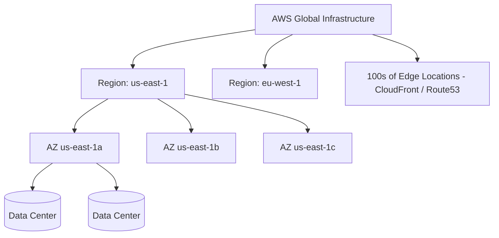

## 1.3 Resilience Vocabulary (the words interviewers probe)

### Scalability

The ability to handle increased load by adding resources.
- **Vertical scaling (scale up):** bigger instance (more vCPU/RAM). Simple, but has a ceiling and usually requires downtime/restart.
- **Horizontal scaling (scale out):** more instances behind a load balancer. Near-unlimited, needs **stateless** services. This is the default pattern for backend web services.

### Elasticity

Scalability that happens **automatically and bidirectionally** in response to demand — scale out under load, scale in when idle. Auto Scaling Groups and Lambda concurrency provide elasticity. Elasticity is what turns "we provisioned for peak" into "we pay for what we use."

### High Availability (HA)

The system remains operational despite component failures, usually via **redundancy** (multiple AZs, multiple instances, failover replicas). HA targets *uptime* and is measured in nines (99.9% = ~8.7h downtime/year; 99.99% = ~52min/year).

### Fault Tolerance

Stronger than HA: the system continues operating **with no interruption** when a component fails. True fault tolerance usually means N+1 or active-active redundancy with no visible failover gap. Expensive — most services target HA with fast failover rather than full fault tolerance.

### Disaster Recovery (DR)

Recovering from large-scale failures (whole Region loss, data corruption). Measured by:
- **RTO (Recovery Time Objective):** how long until you're back up.
- **RPO (Recovery Point Objective):** how much data loss is acceptable.

(Full DR strategies are covered in §39.)

### Shared Responsibility Model

Security and operations are split between AWS and you.

| | AWS responsibility ("security *of* the cloud") | Your responsibility ("security *in* the cloud") |
|---|---|---|
| Scope | Hardware, data centers, hypervisor, managed-service internals, global network | Your data, IAM config, OS patching (on EC2), network config, app security, encryption settings |
| EC2 example | Physical host, hypervisor | OS patches, security groups, your app, your keys |
| RDS example | OS + DB engine patching, host | Schema, queries, access control, encryption choice |
| S3 example | Durability, infrastructure | Bucket policy, Block Public Access, encryption, object ACLs |
| Lambda example | Runtime, scaling, host | Function code, IAM role, dependencies |

> **Warning:** Most AWS breaches are *customer-side* misconfigurations — public S3 buckets, over-broad IAM, leaked access keys — not AWS failures. The managed service shrinks your responsibility but never removes it.

## 1.4 AWS Account & Organization

### AWS Account

An **AWS Account** is the fundamental container for resources and the primary **billing and isolation boundary**. Everything (EC2, S3, IAM) lives inside an account. Large companies use **many** accounts (e.g., per team, per environment) rather than one giant account, to isolate blast radius and simplify billing.

### Root User

The identity created when the account is opened, tied to the account's email. It has **unrestricted power** and cannot be limited by IAM policies.

> **Best Practice:** After setup, lock the root user away: enable MFA, delete its access keys, and never use it for daily work. Use IAM / IAM Identity Center identities instead. Root is only for a handful of tasks (closing the account, changing support plan, some billing actions).

### IAM Users, Roles, Policies (brief — full detail in §2)

- **IAM User:** a long-lived identity for a person or legacy app, with credentials.
- **IAM Role:** an identity with permissions but **no long-lived credentials** — assumed temporarily (by an EC2 instance, Lambda, or another account). The preferred mechanism.
- **IAM Policy:** a JSON document granting/denying permissions, attached to users, groups, or roles.

### AWS Organizations

A service to centrally manage **multiple AWS accounts** under one management (payer) account. Provides consolidated billing, volume discounts, and centralized governance.

### Organizational Units (OUs)

Hierarchical groupings of accounts inside an Organization (e.g., `Prod`, `Non-Prod`, `Security`, `Sandbox`). Policies attached to an OU apply to all accounts beneath it.

### Service Control Policies (SCPs)

Organization-level **guardrails** that define the *maximum* permissions accounts can have. An SCP does **not grant** anything — it sets a ceiling. Even an account admin cannot exceed the SCP.

```json
{
  "Version": "2012-10-17",
  "Statement": [{
    "Sid": "DenyOutsideApprovedRegions",
    "Effect": "Deny",
    "Action": "*",
    "Resource": "*",
    "Condition": {
      "StringNotEquals": { "aws:RequestedRegion": ["us-east-1", "eu-west-1"] }
    }
  }]
}
```

> **Important:** Effective permission = (what the SCP allows) ∩ (what IAM policies grant). An action blocked by an SCP is blocked no matter what IAM says.

### AWS Control Tower

A managed service that sets up and governs a secure, multi-account **landing zone** using Organizations, SCPs, centralized logging, and pre-built "guardrails" — essentially best-practice multi-account scaffolding out of the box.

### AWS Resource Groups

Lets you group resources (by tag or type) and manage/view them together — e.g., all resources tagged `project=orders-service`.

### AWS Resource Explorer

A search service to find resources across Regions and accounts (e.g., "where is the EC2 instance named `payments-worker`?"), which is otherwise painful because the console is Region-scoped.

## 1.5 AWS Pricing

### On-Demand Pricing

Pay per second/hour with no commitment. Most flexible, most expensive per unit. Use for spiky, unpredictable, or short-lived workloads and for development.

### Reserved Instances (RIs)

Commit to a specific instance type in a Region for **1 or 3 years** for up to ~72% discount. Less flexible (tied to instance family/Region). Largely superseded by Savings Plans for compute.

### Savings Plans

Commit to a **dollars-per-hour** compute spend for 1 or 3 years for a large discount, with more flexibility than RIs (applies across instance families, and Compute Savings Plans even across EC2/Fargate/Lambda).

| Option | Commitment | Flexibility | Discount | Best for |
|---|---|---|---|---|
| On-Demand | None | Max | 0% (baseline) | Dev, spiky, unknown |
| Spot | None (interruptible) | N/A | up to ~90% | Fault-tolerant batch, workers |
| Reserved Instances | 1/3 yr, instance type | Low | up to ~72% | Stable, specific instance |
| Savings Plans | 1/3 yr, $/hr | Medium–High | up to ~72% | Steady-state compute |

### Spot Instances

Spare EC2 capacity at up to ~90% off, but AWS can **reclaim them with a 2-minute warning**. Perfect for stateless, fault-tolerant, interruptible work (batch processing, CI runners, Kafka/queue consumers that checkpoint). Never for a stateful primary database.

### Free Tier

Three types: **Always free** (e.g., 1M Lambda requests/month), **12-month free** (e.g., 750 hrs/month `t2.micro`/`t3.micro`), and **trials**. Great for learning; watch for silent charges when you exceed limits.

### Cost Allocation Tags

Key-value tags (e.g., `team=payments`, `env=prod`) on resources that flow into billing reports so you can attribute cost. You must **activate** tags in the billing console before they appear in reports.

### AWS Cost Explorer

Visual tool to analyze and forecast spend, filter/group by service, tag, account, and spot trends.

### AWS Budgets

Set spend/usage thresholds and get alerts (or automated actions) when you approach/exceed them. The first thing you should set up in a new account.

### AWS Cost and Usage Reports (CUR)

The most granular billing data (line-item, hourly/daily), delivered to S3, queryable via Athena/QuickSight. Used for detailed chargeback and large-org cost analysis.

```bash
# See which services cost the most this month
aws ce get-cost-and-usage \
  --time-period Start=2026-10-01,End=2026-10-31 \
  --granularity MONTHLY \
  --metrics "UnblendedCost" \
  --group-by Type=DIMENSION,Key=SERVICE
```

---

### Key Takeaways — AWS Fundamentals
- Cloud trades CapEx for elastic, pay-as-you-go OpEx; AWS gives you managed building blocks so you don't operate them yourself.
- **Region → AZ → Data Center**; always span **≥2 AZs** for availability. Edge Locations are for CDN/DNS, not app servers.
- Know the resilience vocabulary precisely: scalability (add resources), elasticity (automatic/bidirectional), HA (redundancy), fault tolerance (no interruption), DR (RTO/RPO).
- The Shared Responsibility Model: AWS secures the cloud, you secure what's *in* it — most breaches are customer misconfigurations.
- Use multiple accounts + Organizations + SCP guardrails; lock down the root user.
- Match pricing model to workload: On-Demand (spiky), Savings Plans/RIs (steady), Spot (interruptible). Set a Budget on day one.

### Common Mistakes
- Running production in a single AZ.
- Using the root user for daily operations.
- Not enabling MFA on root.
- No budget/alert, discovering cost overruns on the invoice.
- Assuming AWS "handles security" entirely.
- Picking a Region without checking service availability or data-residency rules.

### SDE2 Interview Questions
1. **Difference between elasticity and scalability?** Scalability is the capacity to grow by adding resources; elasticity is doing that automatically and reversibly in response to demand.
2. **How many AZs should a production service use and why?** At least two (ideally three) so a single AZ failure doesn't cause an outage; the AZ is the primary fault-isolation boundary.
3. **Explain the Shared Responsibility Model with S3.** AWS guarantees durability/infrastructure; you own bucket policy, Block Public Access, encryption, and object permissions.
4. **On-Demand vs Spot vs Savings Plans — when each?** On-Demand for unpredictable/short; Spot for interruptible fault-tolerant work; Savings Plans for steady-state baseline compute.
5. **What is an SCP and how does it interact with IAM?** An org guardrail setting the permission ceiling; effective perms = SCP ∩ IAM grants.

### Practical Exercise
Create a new AWS account (or sandbox). Enable MFA on root, remove root access keys, create an IAM admin user (or IAM Identity Center user), set an **AWS Budget** at $5 with an email alert, and apply a cost allocation tag `env=learning`. Then use Cost Explorer to confirm the tag appears. This mirrors the day-0 setup every team does.

---

# 2. IAM — Identity & Access Management

IAM is the control plane for **who can do what** on which resources. It is global (not Region-scoped), free, and sits in front of every API call. Getting IAM right is the single highest-leverage security skill on AWS.

## 2.1 IAM Basics

### Users
A long-lived identity representing a person or an external/legacy application. Has credentials: a console password and/or **access keys** (for programmatic/CLI/SDK use). Minimize these — prefer roles.

### Groups
A collection of users for attaching policies in bulk (e.g., `Developers`, `Admins`, `ReadOnly`). Groups cannot be nested and cannot be a principal (you can't give a group a role). They are purely an organizational convenience for permissions.

### Roles
An identity with permissions but **no permanent credentials**. A principal (EC2 instance, Lambda, ECS task, user, or another account) **assumes** the role and receives **temporary** credentials via STS. This is the backbone of secure AWS access.

### Policies
JSON documents describing permissions. Attached to users/groups/roles (identity-based) or to resources (resource-based).

### Permissions
The actual allowed/denied actions, derived by evaluating all applicable policies.

### Access Keys
An **Access Key ID** + **Secret Access Key** pair used to sign API requests. Long-lived and dangerous if leaked.

> **Warning:** Never commit access keys to Git, bake them into Docker images, or paste them in code. Leaked keys are the #1 cause of AWS account compromise and surprise crypto-mining bills. Use roles instead.

### MFA (Multi-Factor Authentication)
A second factor (TOTP app, hardware key, passkey) on top of a password. Mandatory for root and strongly recommended for all human users and privileged actions.

### Password Policies
Account-wide rules: minimum length, complexity, rotation, reuse prevention. Set via IAM account settings.

## 2.2 IAM Policies

### Anatomy of a policy
```json
{
  "Version": "2012-10-17",
  "Statement": [
    {
      "Sid": "AllowReadOrdersBucket",
      "Effect": "Allow",
      "Action": ["s3:GetObject", "s3:ListBucket"],
      "Resource": [
        "arn:aws:s3:::orders-prod",
        "arn:aws:s3:::orders-prod/*"
      ],
      "Condition": {
        "IpAddress": { "aws:SourceIp": "10.0.0.0/16" }
      }
    }
  ]
}
```
- **Effect:** Allow or Deny.
- **Action:** API operations (`s3:GetObject`, `dynamodb:PutItem`). Supports wildcards.
- **Resource:** ARNs the statement applies to.
- **Condition:** optional constraints (source IP, MFA present, tag match, time).

### Identity-based Policies
Attached to a user, group, or role; say "this identity may do X on Y." Can be **AWS managed** (maintained by AWS), **customer managed** (your reusable policies), or **inline** (embedded in one identity).

### Resource-based Policies
Attached to the **resource** (S3 bucket policy, SQS queue policy, KMS key policy, Lambda resource policy). They specify a **Principal** (who). Required for **cross-account** access and for some service integrations.

> **Important:** For same-account access you often need only one side. For **cross-account** access you typically need **both**: the resource policy allows the external principal AND that principal's IAM policy allows the action.

### Permission Boundaries
An advanced guardrail attached to a user/role that caps the maximum permissions that identity can have — even if its attached policies grant more. Effective perms = boundary ∩ attached policies. Used so teams can create roles without being able to escalate privileges.

### Explicit Allow / Explicit Deny
- Default is **implicit deny** (nothing is allowed unless granted).
- An **explicit Allow** grants access.
- An **explicit Deny** always wins and overrides any Allow.

### Policy Evaluation Logic
Order of precedence when a request is evaluated:
1. **Explicit Deny** anywhere → **DENIED**.
2. Else if an **SCP** (org) doesn't allow it → DENIED.
3. Else if a **permission boundary** doesn't allow it → DENIED.
4. Else if an **explicit Allow** exists (identity or resource policy) → ALLOWED.
5. Else → implicit DENY.

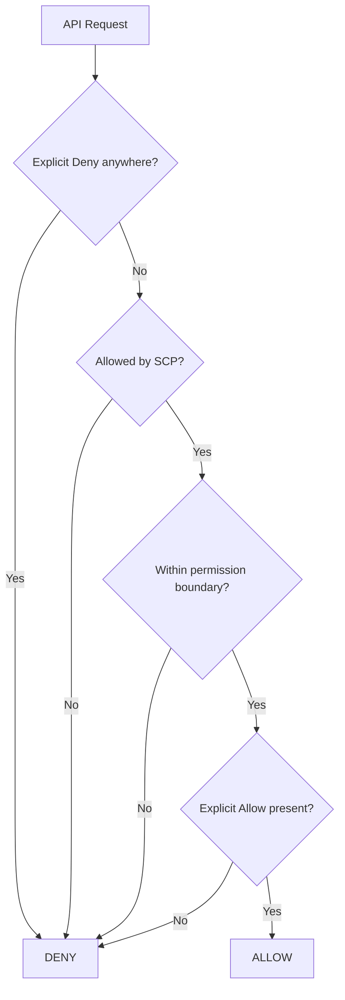

### Policy Conditions
Constraints via condition keys: `aws:SourceIp`, `aws:MultiFactorAuthPresent`, `aws:PrincipalTag/...`, `s3:prefix`, `aws:RequestedRegion`, `aws:SecureTransport`. Enable fine-grained, context-aware control.

### Policy Variables
Dynamic placeholders like `${aws:username}` to write reusable policies, e.g., let each user access only their own prefix:
```json
{
  "Effect": "Allow",
  "Action": "s3:GetObject",
  "Resource": "arn:aws:s3:::user-data/${aws:userid}/*"
}
```

### Least Privilege
Grant only the permissions actually needed, nothing more. Start from zero and add; don't start from `*` and trim. Use **IAM Access Analyzer** to generate least-privilege policies from CloudTrail usage.

## 2.3 IAM Roles

### EC2 IAM Role (Instance Profile)
Attach a role to an EC2 instance; the SDK/CLI running on it automatically fetches temporary credentials from the **Instance Metadata Service (IMDS)**. No keys on disk.

### Lambda Execution Role
Every Lambda has an execution role defining what the function may do (write logs, read a DynamoDB table, publish to SNS).

### ECS Task Role
Permissions for the **application** inside the container (distinct from the **task execution role**, which lets ECS pull the image and write logs). Keep these separate — least privilege.

### Cross-account IAM Roles
A role in Account B whose trust policy allows a principal in Account A to assume it — the standard, auditable way to share access across accounts without sharing credentials.

### Service Roles
Roles AWS services assume to act on your behalf (e.g., CodeDeploy, Auto Scaling, Config).

### AssumeRole
The STS API that exchanges your identity for a role's temporary credentials (access key, secret, session token, expiry). The mechanism behind all role usage.

### STS (Security Token Service)
Issues short-lived temporary credentials. Powers `AssumeRole`, `AssumeRoleWithWebIdentity` (OIDC/federation), and `GetSessionToken` (MFA sessions).

## 2.4 Security Identity Services

### AWS STS
See above — the temporary-credential issuer underpinning roles and federation.

### IAM Identity Center (formerly AWS SSO)
Centralized workforce sign-in across multiple AWS accounts and SaaS apps, integrating with your corporate IdP (Okta, Azure AD). The modern replacement for creating IAM users per person.

### Cognito
Customer identity (CIAM) for **your application's end users** (not AWS operators). Two parts:
- **User Pools:** user directory, sign-up/sign-in, issues JWT (OIDC) tokens, supports social/SAML federation and MFA.
- **Identity Pools:** exchange a token for temporary AWS credentials so an app/user can call AWS services directly.

### SAML
XML-based federation standard, common in enterprises, to let corporate users log into AWS using the company IdP.

### OAuth 2.0
Authorization framework for delegated access via access tokens (e.g., "let this app call the orders API on the user's behalf"). About **authorization**.

### OpenID Connect (OIDC)
An identity layer **on top of OAuth 2.0** that adds authentication and an ID token (JWT) describing the user. Cognito User Pools and Google/GitHub login use OIDC.

### Federation
Trusting an external IdP so users authenticate there and gain AWS access without AWS-native credentials. Workforce federation (SAML/OIDC via Identity Center) and web/mobile federation (via Cognito).

### Temporary Credentials
Short-lived STS credentials (minutes–hours) with a session token. Preferred everywhere because leakage impact is time-bounded and there's nothing long-lived to rotate.

## 2.5 SDE2-Level IAM

### Cross-account access
Design pattern: central tooling/CI account assumes deployment roles in `dev`/`staging`/`prod` accounts. Trust policies pin exact principals; use `ExternalId` for third parties to prevent the confused-deputy problem.

### Role chaining
Assuming a role from within an already-assumed role (A → B → C). Note: chained sessions are capped at **1 hour** max duration, and it complicates auditing — use sparingly.

### Workload identity
Give the *workload* an identity instead of embedding keys: EC2 instance profiles, ECS task roles, Lambda execution roles, EKS **IRSA** (IAM Roles for Service Accounts). This is how modern apps authenticate to AWS.

### Secret access without hardcoding credentials
Combine workload identity (role) + Secrets Manager/Parameter Store. The app assumes a role, the role can read a specific secret, the SDK fetches it at runtime. Zero static secrets in code or images. (See §24, §47.)

### IAM policy debugging
Tools: **IAM Policy Simulator**, CloudTrail (the `errorCode` and `errorMessage` on a denied call tell you the exact action/resource), and the `decode-authorization-message` for encoded messages.

### Least-privilege design
Workflow: run with broader perms in dev → capture actual API usage in CloudTrail → use Access Analyzer to generate a scoped policy → tighten → add conditions (MFA, source VPC) for sensitive actions.

## 2.6 Worked Examples

### Example: IAM policy (least-privilege for a Spring Boot service using S3 + a DynamoDB table)
```json
{
  "Version": "2012-10-17",
  "Statement": [
    {
      "Sid": "OrdersBucketRW",
      "Effect": "Allow",
      "Action": ["s3:GetObject", "s3:PutObject"],
      "Resource": "arn:aws:s3:::orders-attachments-prod/*"
    },
    {
      "Sid": "OrdersTableRW",
      "Effect": "Allow",
      "Action": ["dynamodb:GetItem","dynamodb:PutItem","dynamodb:Query"],
      "Resource": "arn:aws:dynamodb:us-east-1:111122223333:table/Orders"
    }
  ]
}
```

### Example: IAM role assumption (CLI)
```bash
# Assume a deployment role in the prod account
aws sts assume-role \
  --role-arn arn:aws:iam::999988887777:role/DeployRole \
  --role-session-name ci-deploy-build-42

# Response includes AccessKeyId, SecretAccessKey, SessionToken (temporary, ~1h)
```

### Example: EC2 accessing S3 through an IAM role (no keys anywhere)
```bash
# 1) Trust policy: allow EC2 service to assume the role
cat > trust.json <<'EOF'
{ "Version":"2012-10-17",
  "Statement":[{"Effect":"Allow","Principal":{"Service":"ec2.amazonaws.com"},"Action":"sts:AssumeRole"}]}
EOF
aws iam create-role --role-name app-ec2-role --assume-role-policy-document file://trust.json

# 2) Permission policy: read one bucket
aws iam put-role-policy --role-name app-ec2-role --policy-name s3-read \
  --policy-document '{"Version":"2012-10-17","Statement":[{"Effect":"Allow","Action":["s3:GetObject"],"Resource":"arn:aws:s3:::orders-prod/*"}]}'

# 3) Instance profile and attach to instance
aws iam create-instance-profile --instance-profile-name app-ec2-profile
aws iam add-role-to-instance-profile --instance-profile-name app-ec2-profile --role-name app-ec2-role
aws ec2 associate-iam-instance-profile --instance-id i-0abc --iam-instance-profile Name=app-ec2-profile
```
In the Spring Boot app you then use the **default credentials provider chain** — it transparently uses the instance role:
```java
// AWS SDK v2 — no credentials in code; picks up the EC2/ECS/Lambda role automatically
S3Client s3 = S3Client.builder()
        .region(Region.US_EAST_1)
        .credentialsProvider(DefaultCredentialsProvider.create())
        .build();
```

### Example: Cross-account access (resource policy + assume role)
Account A (111122223333) role must be allowed to assume Account B (999988887777) role:
```json
// Trust policy on the role in Account B
{
  "Version": "2012-10-17",
  "Statement": [{
    "Effect": "Allow",
    "Principal": { "AWS": "arn:aws:iam::111122223333:role/CiRole" },
    "Action": "sts:AssumeRole",
    "Condition": { "StringEquals": { "sts:ExternalId": "orders-ci-2026" } }
  }]
}
```

### Example: Debugging AccessDenied
A typical error:
```
User: arn:aws:sts::1111:assumed-role/app-ec2-role/i-0abc is not authorized to
perform: s3:PutObject on resource: arn:aws:s3:::orders-prod/report.csv
because no identity-based policy allows the s3:PutObject action
```
Methodical steps:
1. **Read the message** — it states the *principal*, *action*, *resource*, and *why*.
2. Identify which identity made the call (here the EC2 role).
3. Check that identity's policies for the exact `Action` + `Resource`.
4. Check for an **explicit Deny** (SCP, boundary, resource policy) — these override allows.
5. For cross-account, verify **both** the resource policy and the caller's policy.
6. Confirm conditions (MFA, SourceIp, encryption header) aren't failing.
7. Use the **IAM Policy Simulator** or CloudTrail to confirm.

### Example: Secure vs insecure credential handling
```java
// ❌ INSECURE — hardcoded long-lived keys (never do this)
AwsBasicCredentials bad = AwsBasicCredentials.create("AKIA...", "wJalr...");
S3Client s3bad = S3Client.builder()
        .credentialsProvider(StaticCredentialsProvider.create(bad)).build();

// ✅ SECURE — role-based temporary credentials via the default chain
S3Client s3good = S3Client.builder()
        .credentialsProvider(DefaultCredentialsProvider.create()).build();
```

---

### Key Takeaways — IAM
- Prefer **roles + temporary credentials** over users + access keys everywhere; give **workloads** identities (instance profiles, task roles, Lambda roles, IRSA).
- **Explicit Deny always wins**; default is implicit deny; evaluation order is SCP → boundary → identity/resource allow.
- Cross-account usually needs **both** a resource policy (allowing the principal) and the caller's identity policy.
- Design for **least privilege**; use conditions (MFA, SourceIp) for sensitive actions; use Access Analyzer to generate scoped policies.
- Read `AccessDenied` messages literally — they name the principal, action, resource, and reason.

### Common Mistakes
- Hardcoding access keys in code/images/CI logs.
- Using `"Action":"*","Resource":"*"` "to make it work."
- Forgetting the resource-policy side in cross-account setups.
- Confusing ECS **task role** (app perms) with **task execution role** (pull image/logs).
- Not enabling MFA; using the root user programmatically.
- Over-broad trust policies (`Principal: *`) on assumable roles.

### SDE2 Interview Questions
1. **IAM user vs role?** User = long-lived identity with permanent credentials; role = no permanent creds, assumed for temporary STS credentials; roles are preferred.
2. **How does EC2 access S3 without keys?** Instance profile → role → IMDS supplies temporary creds → default credential chain in the SDK uses them.
3. **Explain policy evaluation order.** Explicit Deny > SCP > permission boundary > explicit Allow > implicit deny.
4. **How do you do cross-account access securely?** AssumeRole with a scoped trust policy and `ExternalId`; grant least privilege; audit via CloudTrail.
5. **You get AccessDenied in production — how do you debug?** Parse the message, identify principal/action/resource, check identity + resource policies + SCP/boundary + conditions, verify with Policy Simulator/CloudTrail.
6. **Identity-based vs resource-based policy?** Attached to the identity vs to the resource (with a Principal); cross-account needs the resource-based side.

### Practical Exercise
Launch a `t3.micro`, attach an instance profile whose role allows only `s3:GetObject` on one bucket. SSH/SSM in and confirm the AWS CLI can read that bucket but **cannot** write (`PutObject` → AccessDenied) and cannot read a different bucket. Then add a `Deny` with an `aws:SourceIp` condition and observe how explicit deny overrides the allow. Inspect the denied call in CloudTrail.

---

# 3. EC2

**EC2 (Elastic Compute Cloud)** is resizable virtual servers in the cloud. It's the foundational IaaS compute primitive — you get an OS you fully control. For a Java backend engineer, EC2 is where a Spring Boot JAR can run directly, and it underpins higher-level services (ECS on EC2, EKS node groups). You use EC2 directly when you need full OS control; you move to ECS/Fargate/Lambda to shed operational burden.

## 3.1 EC2 Fundamentals

### Instance
A running virtual machine with a chosen instance type (size), AMI (OS image), storage, and networking.

### AMI (Amazon Machine Image)
A template for the root volume: OS + pre-installed software + config. You launch instances from an AMI. **Golden AMIs** bake in your runtime (JDK, agent, app) for fast, immutable launches.

### Instance Types
Named `family + generation + size`, e.g., `m6i.large`. Family = workload class, size = capacity. Choice drives cost and performance.

### vCPU
A virtual CPU, usually a hyperthread of a physical core. Instance size determines count. CPU-bound Java work scales with vCPUs and your thread pool sizing.

### Memory
RAM available to the OS + JVM. Must comfortably hold your heap + off-heap + OS. Under-sizing memory causes GC thrash and OOM kills.

### Network Performance
Each instance size has a bandwidth tier ("Up to 10 Gbps", "25 Gbps"). Smaller instances get *burstable* network. Matters for high-throughput services and chatty microservices.

### EBS (Elastic Block Store)
Network-attached, persistent block storage that survives instance stop/start and can be detached/reattached. Default root volume type for most instances.

### Instance Store
**Ephemeral** physical disk on the host. Extremely fast, but **data is lost on stop/terminate/host failure**. Use only for scratch/cache, never for durable data.

### User Data
A script that runs at first boot (bootstrapping) — install packages, pull config, start your app.
```bash
#!/bin/bash
yum install -y java-21-amazon-corretto
aws s3 cp s3://artifacts-prod/orders-service.jar /opt/app/app.jar
systemctl enable --now orders
```

### Instance Metadata (IMDS)
A link-local endpoint (`169.254.169.254`) giving an instance info about itself and its role credentials.
```bash
# IMDSv2 (token-based — the secure default; always prefer this)
TOKEN=$(curl -sX PUT "http://169.254.169.254/latest/api/token" \
  -H "X-aws-ec2-metadata-token-ttl-seconds: 300")
curl -s -H "X-aws-ec2-metadata-token: $TOKEN" \
  http://169.254.169.254/latest/meta-data/iam/security-credentials/
```
> **Warning:** Enforce **IMDSv2** (session-token required). IMDSv1 was exploitable via SSRF (the Capital One breach) to steal role credentials.

### Instance Lifecycle
`pending → running → (stopping → stopped) → terminated`. Stop/start moves the instance to a new host (public IP changes unless Elastic IP; instance-store data lost). Terminate is permanent.

## 3.2 Instance Types

| Family class | Prefix examples | Optimized for | Backend use case |
|---|---|---|---|
| General Purpose | `t3/t4g`, `m6i/m7g` | Balanced CPU:RAM | Typical Spring Boot APIs |
| Compute Optimized | `c6i/c7g` | High CPU per $ | CPU-heavy processing, encoding, low-latency APIs |
| Memory Optimized | `r6i/r7g`, `x2` | Large RAM | In-memory caches, large-heap JVMs, big datasets |
| Storage Optimized | `i4i`, `d3` | High local IOPS/throughput | Databases, search, log processing |
| Accelerated Computing | `p5`, `g5`, `inf2` | GPU/ML accelerators | ML inference/training (rarely for CRUD backends) |

> **Interview Tip:** `t`-family are **burstable** — they earn CPU credits when idle and spend them under load. Great for low/spiky traffic, dangerous for sustained load (you exhaust credits and throttle, or pay for "unlimited" bursting). For steady production APIs prefer `m`/`c`. `g`-suffix (e.g., `m7g`) = Graviton (ARM) — cheaper and efficient; verify your JVM/native deps support ARM.

## 3.3 EC2 Storage

### EBS
Persistent network block storage; one volume attaches to one instance (except `io2` Multi-Attach). Snapshots back it up to S3.

### EBS Volumes & Volume Types
| Type | Class | Max IOPS | Use case |
|---|---|---|---|
| gp3 | SSD (general) | 16,000 (independent of size) | Default for most workloads, incl. app + many DBs |
| gp2 | SSD (legacy) | scales with size | Older default; prefer gp3 |
| io2 Block Express | SSD (provisioned) | 256,000 | Mission-critical, high-IOPS databases |
| st1 | HDD (throughput) | — | Big sequential (logs, data warehouse) |
| sc1 | HDD (cold) | — | Infrequent, cheapest |

> **Best Practice:** Default to **gp3** — you set IOPS/throughput independently of size, cheaper than gp2.

### EBS Snapshots
Incremental, point-in-time backups stored in S3. Used for backup, cloning, AMI creation, cross-Region/account copy (for DR). Only changed blocks are stored after the first snapshot.

### EBS Encryption
AES-256 at rest via KMS, transparent to the OS. Enable **account-level default encryption**. Encrypting an existing unencrypted volume requires a snapshot → copy-with-encryption → restore.

### IOPS & Throughput
- **IOPS** = I/O operations per second (matters for random access, e.g., DB).
- **Throughput** = MB/s (matters for sequential, e.g., logs). gp3 lets you provision both separately.

## 3.4 EC2 Networking

### Private IP
RFC1918 address from the subnet; stable for the instance's life; used for in-VPC traffic.

### Public IP
Internet-routable address, **auto-assigned in public subnets**, **changes on stop/start**, released on termination.

### Elastic IP (EIP)
A static public IPv4 you own and can remap between instances. Use when you need a fixed public IP. (You're charged for idle/unassociated EIPs.)

### ENI (Elastic Network Interface)
A virtual NIC with its own private IP(s), MAC, and security groups. Can be detached/attached to another instance for failover.

### Security Groups
**Stateful** virtual firewalls at the instance/ENI level. Rules are **allow-only**; return traffic is automatically permitted. Reference other SGs as sources (e.g., "allow 8080 only from the ALB's SG").

### Subnets, Route Tables, NAT Gateway
Covered in depth in §4 (VPC). In brief: subnets partition the VPC per AZ; route tables decide where traffic goes; a NAT Gateway lets private-subnet instances reach the internet outbound without being reachable inbound.

## 3.5 EC2 Operations

### SSH
Key-pair based shell access on port 22. Needs: a public IP/route, an SG allowing 22 from your IP, the private key, and the correct user (`ec2-user`, `ubuntu`...).

### Systems Manager Session Manager
Browser/CLI shell **without opening port 22, without a public IP, and without SSH keys** — the modern, auditable (CloudTrail-logged) way to access instances. Requires the SSM agent + instance role with SSM permissions. (See §25.)
```bash
aws ssm start-session --target i-0abc123
```

### AMI creation
Bake a golden AMI from a configured instance (`aws ec2 create-image`) for fast, consistent, immutable launches.

### Instance recovery / Auto Recovery
CloudWatch alarm action (or built-in) that recovers an instance (same ID, EBS, private IP, EIP) onto new hardware when the underlying host fails.

### Shutdown behavior
Controls whether OS shutdown stops or terminates the instance (`stop` default; set `terminate` for throwaway nodes).

### Placement Groups
Control instance placement:
- **Cluster:** pack in one AZ for lowest latency / highest throughput (HPC).
- **Spread:** separate hardware for max fault isolation (small # of critical instances).
- **Partition:** group into isolated partitions (big distributed systems like Kafka/HDFS).

## 3.6 Production Concepts

### Immutable infrastructure
Never patch running servers. Build a new AMI/image, launch new instances, shift traffic, terminate old. Eliminates config drift and makes rollbacks trivial.

### Golden AMIs
Pre-baked images (JDK, agents, app, hardening) via Packer/EC2 Image Builder. Fast boots, consistent fleets.

### Auto Scaling, Instance replacement, Health checks
Covered fully in §6. Core idea: an ASG keeps N healthy instances, replaces unhealthy ones automatically, and scales with demand.

### Rolling deployments
Replace instances in batches so capacity stays up; slower but no extra fleet cost.

### Blue/Green deployment
Stand up a parallel "green" fleet, test it, flip the load balancer/DNS, keep "blue" for instant rollback. Safer, costs double briefly.

## 3.7 Running a Spring Boot App on EC2 (end-to-end)

### Architecture: Nginx → Spring Boot
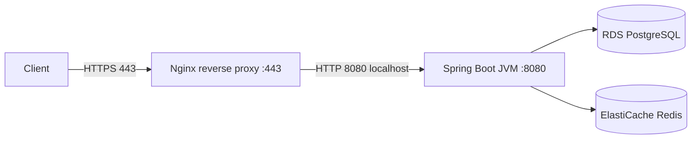
Why Nginx in front: TLS termination, gzip, static assets, request buffering, rate limiting, and clean restarts of the app behind a stable port. (In AWS you often terminate TLS at the ALB instead — see §5.)

### Java process management with systemd
Create `/etc/systemd/system/orders.service`:
```ini
[Unit]
Description=Orders Spring Boot Service
After=network.target

[Service]
User=appuser
WorkingDirectory=/opt/app
# Externalize config; never bake secrets into the unit file
Environment=SPRING_PROFILES_ACTIVE=prod
Environment=JAVA_OPTS=-Xms1g -Xmx1g -XX:+UseG1GC -XX:MaxRAMPercentage=75
ExecStart=/usr/bin/java $JAVA_OPTS -jar /opt/app/app.jar
SuccessExitStatus=143
Restart=always
RestartSec=5
# Hardening
NoNewPrivileges=true
ProtectSystem=full

[Install]
WantedBy=multi-user.target
```
```bash
sudo systemctl daemon-reload
sudo systemctl enable --now orders
sudo systemctl status orders
sudo journalctl -u orders -f   # live logs
```
> **Best Practice:** `Restart=always` so the JVM is restarted on crash; run as a non-root `appuser`; set heap with `MaxRAMPercentage` so the JVM respects the instance/container memory.

### Nginx config (reverse proxy to Spring Boot)
```nginx
server {
    listen 443 ssl;
    server_name api.example.com;
    ssl_certificate     /etc/ssl/certs/api.crt;
    ssl_certificate_key /etc/ssl/private/api.key;

    location / {
        proxy_pass http://127.0.0.1:8080;
        proxy_set_header Host $host;
        proxy_set_header X-Real-IP $remote_addr;
        proxy_set_header X-Forwarded-For $proxy_add_x_forwarded_for;
        proxy_set_header X-Forwarded-Proto $scheme;
        proxy_read_timeout 60s;
    }
}
```

### Security Group configuration
| Rule | Direction | Port | Source | Why |
|---|---|---|---|---|
| HTTPS | Inbound | 443 | 0.0.0.0/0 (or ALB SG) | Public API traffic |
| App | Inbound | 8080 | 127.0.0.1 only (not SG) | Only Nginx reaches it locally |
| SSH | Inbound | 22 | *none* (use SSM) | Avoid exposing SSH |
| All | Outbound | all | 0.0.0.0/0 | Reach RDS/Redis/AWS APIs |

> **Best Practice:** Don't expose 8080 to the world; only Nginx (localhost) or the ALB SG should reach it. Prefer SSM over opening 22.

## 3.8 Troubleshooting

### SSH troubleshooting (methodical)
```
Can't SSH? Check in this order:
1. Networking path: is there a public IP + an Internet Gateway route (public subnet)?
2. Security Group: inbound 22 from YOUR IP?  (curl ifconfig.me to get it)
3. NACL: subnet NACL allows 22 inbound AND ephemeral ports (1024-65535) outbound?
4. Key/user: correct .pem (chmod 400) and user (ec2-user/ubuntu)?
5. Instance health: status checks passing? sshd running? disk full?
```
```bash
ssh -i key.pem -v ec2-user@<ip>        # -v shows where it fails
# Prefer avoiding all of the above:
aws ssm start-session --target i-0abc  # no port 22 needed
```

### CPU troubleshooting
```bash
top -H              # per-thread CPU; find the hot thread
# Map hot native thread id (decimal) to Java thread:
printf '%x\n' <TID>                     # convert to hex
jstack <pid> | grep -A20 nid=0x<hex>    # see what that thread is doing
# Burstable (t-class) throttling: check CloudWatch CPUCreditBalance -> 0 means throttled
```
Common causes: a hot loop, GC storm (check GC logs), under-provisioned t-instance credits.

### Memory troubleshooting
```bash
free -m                                 # system memory
jcmd <pid> GC.heap_info                 # JVM heap
jstat -gcutil <pid> 1000                # GC activity each second
# OOM killed? dmesg shows it:
dmesg | grep -i -E "killed process|out of memory"
```
If the Linux **OOM killer** kills the JVM, the instance RAM is too small for your `-Xmx` + overhead, or there's a leak (take a heap dump: `jmap -dump:live,format=b,file=heap.hprof <pid>`).

### Disk troubleshooting
```bash
df -h               # which filesystem is full
du -sh /var/log/* | sort -h | tail      # biggest offenders (often logs)
# Full disk often = unrotated app logs. Fix: logrotate + ship logs to CloudWatch.
```

---

### Key Takeaways — EC2
- EC2 = full-control IaaS VMs; pick the **instance family** by workload (m/c/r/i), beware burstable `t` under sustained load, consider Graviton (`g`) for cost.
- Use **EBS gp3** by default (persistent, snapshot-able, encrypt by default); **instance store is ephemeral**.
- **Security Groups are stateful allow-only**; reference the ALB's SG instead of 0.0.0.0/0 for the app port.
- Prefer **SSM Session Manager** over SSH; enforce **IMDSv2**.
- Run Spring Boot under **systemd** (`Restart=always`, non-root, memory-aware heap); front with Nginx or (better) an ALB for TLS.
- Treat servers as **immutable**: golden AMIs + replace, don't patch in place.

### Common Mistakes
- Storing data on instance store and losing it on stop.
- Leaving IMDSv1 enabled (SSRF credential theft).
- Opening 22/8080 to 0.0.0.0/0.
- Sizing a `t3` for steady load and getting throttled when credits run out.
- Setting `-Xmx` larger than instance RAM → OOM killer.
- Patching live servers (config drift) instead of rebuilding images.

### SDE2 Interview Questions
1. **EBS vs instance store?** EBS is persistent network storage (survives stop); instance store is ephemeral local disk (lost on stop/terminate).
2. **Why is my `t3` suddenly slow?** CPU credit exhaustion under sustained load; move to `m`/`c` or enable unlimited mode knowingly.
3. **How does EC2 get S3 access without keys?** Instance profile → role → IMDSv2 → default credential chain.
4. **IMDSv1 vs v2 and why it matters?** v2 requires a session token, mitigating SSRF credential theft (Capital One breach).
5. **How do you deploy a new version with zero downtime on EC2?** Immutable AMI + rolling or blue/green via ASG + load balancer.
6. **JVM gets OOM-killed on EC2 — how do you investigate?** Check `dmesg`, `-Xmx` vs instance RAM, GC logs, heap dump for leaks.

### Practical Exercise
Launch an `m7g.large` (or `t3.small` for free tier), install Corretto 21 via user data, deploy a Spring Boot JAR, run it under systemd with `Restart=always`, put Nginx in front terminating TLS, and lock the SG so only 443 is public and 8080 is localhost-only. Access the box via SSM (no SSH key). Then simulate load, watch `top -H` + CloudWatch CPU, and take a heap dump.

---

# 4. VPC — Very Important

A **VPC (Virtual Private Cloud)** is your own logically isolated network inside AWS where you launch resources. It's the foundation of every real architecture: it controls IP addressing, subnetting, routing, and what can talk to what. Interviewers probe VPC hard because misconfigured networking is the most common "my service can't reach the database / can't be reached" incident.

## 4.1 VPC Basics

### VPC
A private virtual network scoped to one Region, spanning all its AZs. You define its IP range (CIDR). Nothing inside is internet-reachable unless you deliberately wire it up.

### CIDR
Classless Inter-Domain Routing notation defines the IP range, e.g., `10.0.0.0/16` = 65,536 addresses (`10.0.0.0`–`10.0.255.255`). The `/16` is the network prefix length; smaller number = bigger range.

### Subnet
A slice of the VPC CIDR bound to **one AZ**, e.g., `10.0.1.0/24` (256 addresses, 251 usable — AWS reserves 5 per subnet). Resources launch into subnets. Subnets are **public** or **private** depending on their route table.

### Availability Zone
Each subnet lives in exactly one AZ. To be multi-AZ you create one subnet per AZ per tier.

### Route Table
A set of rules mapping destination CIDRs to targets (local, IGW, NAT, peering, endpoint). Each subnet is associated with exactly one route table; the table's routes decide reachability.

### Internet Gateway (IGW)
A horizontally-scaled, highly-available component attached to the VPC that enables **bidirectional** internet access. A subnet is "public" only if its route table sends `0.0.0.0/0` to the IGW **and** the instance has a public IP.

### NAT Gateway
Managed component in a **public** subnet that lets **private** subnet instances make **outbound** internet connections (download packages, call external APIs) while remaining **unreachable from the internet**. One-way (egress) only.

### Elastic Network Interface (ENI)
The virtual NIC attached to resources inside subnets (see §3.4).

## 4.2 Subnets

### Public Subnet
Route table has a default route to the **IGW**; hosts things that must be internet-facing: ALB, NAT Gateway, bastion.

### Private Subnet
No direct IGW route; outbound internet (if any) goes via a NAT Gateway. Hosts application servers (Spring Boot), ECS tasks.

### Isolated Subnet
No internet route at all (not even NAT). Hosts the most sensitive tier: databases (RDS/Aurora). Reaches AWS services via **VPC endpoints**.

### CIDR planning
Plan ranges up front to avoid overlaps (critical for future VPC peering/Transit Gateway). Leave room to grow. Example `/16` carved into `/24`s per tier per AZ.

| Tier | AZ-a | AZ-b | AZ-c |
|---|---|---|---|
| Public (ALB/NAT) | 10.0.0.0/24 | 10.0.1.0/24 | 10.0.2.0/24 |
| Private (app) | 10.0.10.0/24 | 10.0.11.0/24 | 10.0.12.0/24 |
| Isolated (DB) | 10.0.20.0/24 | 10.0.21.0/24 | 10.0.22.0/24 |

> **Warning:** Never use overlapping CIDRs across VPCs you may connect later — peering/TGW cannot route between overlapping ranges, and re-IPing a live VPC is extremely painful.

### Multi-AZ subnet architecture
Replicate every tier across ≥2 AZs so losing one AZ loses at most part of your capacity, not the service.

## 4.3 Routing

### Route Tables
Longest-prefix match wins. A route = destination CIDR → target.

### Local Routes
Automatically present; cover the VPC CIDR so all subnets can talk to each other. Cannot be removed.

### Default Routes
`0.0.0.0/0` — the catch-all for anything not matched by a more specific route. Points to IGW (public) or NAT (private).

### Internet Gateway Routes / NAT Routes
Public subnet: `0.0.0.0/0 → igw-xxxx`. Private subnet: `0.0.0.0/0 → nat-xxxx`.

### VPC Peering Routes / Transit Gateway Routes
To reach a peered VPC: route its CIDR → the peering connection (`pcx-...`). With a Transit Gateway, route to the `tgw-...` attachment. Both sides need routes.

## 4.4 Security

### Security Groups (SG)
**Stateful**, instance/ENI-level, **allow-only**. If you allow inbound, the response is automatically allowed out. Can reference other SGs.

### Network ACLs (NACL)
**Stateless**, subnet-level, allow **and** deny rules, evaluated by rule number. Because they're stateless you must allow **both** the inbound traffic and the **ephemeral-port** return traffic explicitly.

### Stateful vs Stateless filtering
| | Security Group | NACL |
|---|---|---|
| Level | ENI/instance | Subnet |
| State | Stateful (return auto-allowed) | Stateless (must allow both directions) |
| Rules | Allow only | Allow + Deny |
| Evaluation | All rules, OR | Numbered order, first match |
| Default | Deny inbound, allow outbound | Default NACL allows all |
| Typical use | Primary control (90% of the time) | Coarse subnet guardrails, explicit IP blocks |

> **Important:** If a connection works one way but return traffic fails, suspect a **NACL** (stateless) missing the ephemeral-port rule (1024–65535). SGs don't have this issue.

### Inbound / Outbound Rules
Define allowed sources/destinations, ports, protocols. For an app server, inbound 8080 **from the ALB SG only**, outbound to DB SG on 5432.

## 4.5 VPC Connectivity

| Option | Connects | Use case | Notes |
|---|---|---|---|
| **VPC Peering** | 2 VPCs (1:1) | Simple cross-VPC | Non-transitive; mesh grows O(n²) |
| **Transit Gateway** | Many VPCs/on-prem (hub) | Hub-and-spoke at scale | Transitive, scalable, central routing |
| **VPN (Site-to-Site)** | VPC ↔ on-prem | Encrypted over internet | Cheaper, variable latency |
| **Direct Connect** | VPC ↔ on-prem | Dedicated private line | Consistent latency/throughput, costly, slow to provision |
| **PrivateLink** | Consumer VPC ↔ a service | Expose/consume a service privately | Via interface endpoints; no CIDR routing needed |
| **VPC Endpoints** | VPC ↔ AWS services | Reach S3/DynamoDB/etc. privately | Avoids NAT/internet |

### VPC Peering
Direct, private 1:1 link between two VPCs. **Not transitive** (A–B and B–C does not give A–C). Fine for a few VPCs; becomes a management mess at scale.

### Transit Gateway (TGW)
A regional router that connects many VPCs and on-prem via a hub. Transitive routing, central route tables — the standard for enterprise multi-VPC.

### VPN / Direct Connect
Hybrid connectivity to on-prem — VPN over the public internet (encrypted, quick), Direct Connect as a dedicated physical link (predictable, expensive). Often DX with a VPN backup.

### PrivateLink
Exposes a specific service across VPCs/accounts through an **interface endpoint**, without exposing whole networks or needing non-overlapping CIDRs. How SaaS vendors and internal platform teams offer private APIs.

## 4.6 VPC Endpoints

Let resources reach AWS services **without traversing the internet/NAT**, improving security and cutting NAT/data costs.

### Gateway Endpoint
For **S3 and DynamoDB only**. A route-table entry; **free**. Add to private/isolated subnets so they read S3 without a NAT Gateway.

### Interface Endpoint (PrivateLink)
An ENI with a private IP in your subnet for most other services (SQS, SNS, Secrets Manager, KMS, ECR, STS...). Hourly + data charges, but keeps traffic private and can remove NAT dependency.

### Private access to AWS services
> **Best Practice:** For a private/isolated app tier, add a **Gateway endpoint for S3/DynamoDB** (free) and **Interface endpoints** for the AWS APIs you call (Secrets Manager, KMS, ECR, SQS). This lets you drop or shrink the NAT Gateway, reducing cost and attack surface.

## 4.7 DNS

### Route 53 Resolver
The DNS resolver AWS provides inside every VPC at the base of the VPC CIDR + 2 (e.g., `10.0.0.2`), also reachable at `169.254.169.253`. Resolves public DNS and private hosted zones. Enable `enableDnsSupport` + `enableDnsHostnames` on the VPC.

### Private Hosted Zones
A Route 53 zone resolvable **only inside associated VPCs** — e.g., `orders.internal` → the ALB's private IP. Used for internal service discovery.

### Public Hosted Zones
Internet-resolvable zones for your real domain (`api.example.com`).

### DNS Resolution / Split-horizon DNS
**Split-horizon**: the same name resolves differently inside vs outside the VPC — e.g., `api.example.com` resolves to a private ALB internally and a public ALB externally. Achieved by having a public and a private hosted zone for the same domain.

## 4.8 Reference Architecture & Traffic Flow

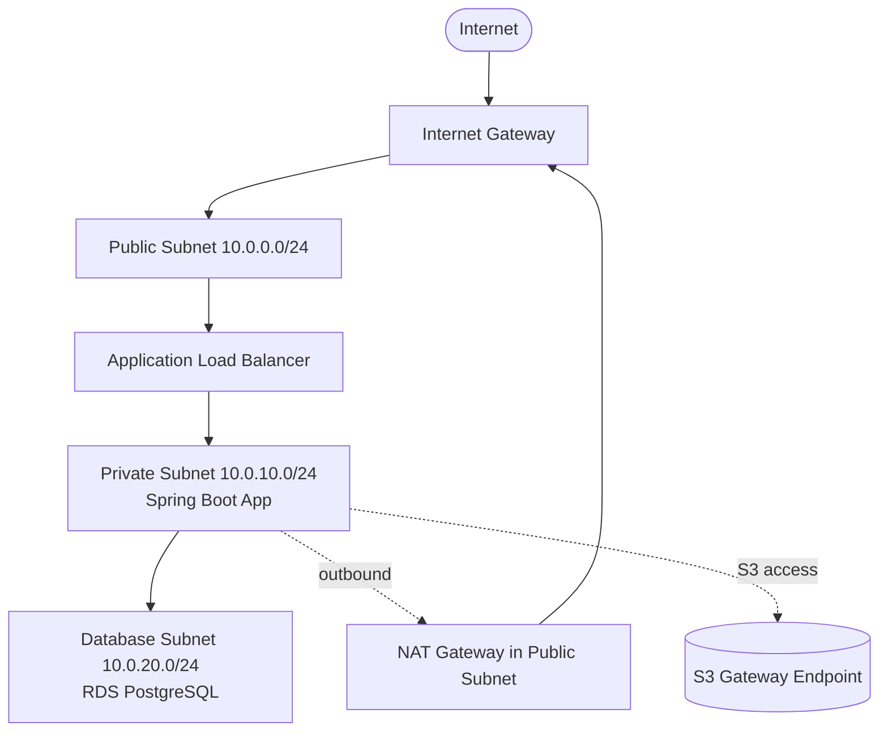

### How traffic flows (inbound request)
1. Client resolves `api.example.com` via Route 53 → public ALB IP.
2. Request hits the **IGW**, routed to the **ALB** in the public subnet (ALB SG allows 443 from internet).
3. ALB terminates TLS, picks a healthy target, forwards to a **Spring Boot** instance in the private subnet (app SG allows 8080 **from the ALB SG only**).
4. App queries **RDS** in the isolated subnet (DB SG allows 5432 **from the app SG only**).
5. Response returns along the same path (SGs stateful, so returns are automatic).

### Outbound (app calls an external payment API)
App (private) → default route `0.0.0.0/0` → **NAT Gateway** (public subnet) → IGW → internet. The external service sees the NAT's EIP, never the instance.

### Reaching S3 from the private tier
App → **S3 Gateway Endpoint** (route-table target) → S3, never touching NAT/internet (cheaper + private).

## 4.9 Connectivity Troubleshooting

> **"My app can't reach the database."** Walk the path, don't guess:

```
1. Same VPC? local route covers VPC CIDR automatically → should route.
2. DB Security Group: inbound 5432 from the APP's SG (not an IP)?
3. App Security Group: outbound allowed (default allows all out)?
4. NACLs on both subnets: allow 5432 inbound (DB side) + ephemeral 1024-65535 return?
5. Right subnet/route table? DB in isolated subnet is fine (same-VPC uses local route).
6. DNS: resolving the RDS endpoint? (dig the endpoint; VPC DNS enabled?)
7. Is the DB actually listening/healthy? (connection count, failover in progress?)
```

> **"My app can't reach the internet (outbound) from a private subnet."**
```
1. Route table for the private subnet: 0.0.0.0/0 -> nat-xxxx present?
2. NAT Gateway in a PUBLIC subnet with a route to the IGW?
3. SG outbound allows the destination port (443)?
4. NACL allows outbound 443 + inbound ephemeral return?
5. NAT in the SAME AZ ideally (cross-AZ costs + SPOF if single NAT).
```

```bash
# Useful checks from the instance (via SSM)
dig +short <db>.xxxx.us-east-1.rds.amazonaws.com   # DNS resolves?
nc -zv <db-endpoint> 5432                           # TCP reachable?
curl -sv https://checkip.amazonaws.com              # outbound internet works?
# From AWS side:
aws ec2 describe-security-groups --group-ids sg-123
aws ec2 describe-route-tables --filters Name=association.subnet-id,Values=subnet-123
```

> **Best Practice (cost + HA):** Deploy a **NAT Gateway per AZ** (private subnets route to the NAT in their own AZ) to avoid cross-AZ data charges and a single-AZ NAT SPOF.

---

### Key Takeaways — VPC
- A production VPC is **multi-AZ with 3 tiers**: public (ALB/NAT), private (app), isolated (DB). Plan non-overlapping CIDRs.
- Route tables + IGW/NAT determine reachability. Public subnet = route to IGW + public IP; private = NAT for egress; isolated = no internet.
- **SGs are stateful allow-only** (your primary control, reference other SGs); **NACLs are stateless** (allow + deny, must handle ephemeral return ports).
- Use **VPC endpoints** (free Gateway for S3/DynamoDB, Interface for others) to reach AWS privately and reduce NAT cost.
- Troubleshoot connectivity by **walking the path**: SG → NACL → route table → DNS → target health.
- One **NAT Gateway per AZ** for HA and to avoid cross-AZ charges.

### Common Mistakes
- Overlapping CIDRs blocking future peering/TGW.
- Allowing DB inbound from `0.0.0.0/0` or from an IP instead of the app SG.
- Forgetting NACL **ephemeral return ports** → one-way connectivity.
- Single NAT Gateway (SPOF + cross-AZ cost).
- Putting app servers in a public subnet with public IPs.
- No S3 gateway endpoint → paying NAT charges for S3 traffic.

### SDE2 Interview Questions
1. **Security Group vs NACL?** SG = stateful, instance-level, allow-only; NACL = stateless, subnet-level, allow+deny, must allow return traffic.
2. **Public vs private subnet — what actually makes it public?** A route to the IGW plus a public IP; privacy is a routing property, not a flag.
3. **How does a private instance reach the internet?** Via a NAT Gateway in a public subnet routing to the IGW; inbound stays blocked.
4. **What's a VPC endpoint and why use it?** Private connectivity to AWS services without NAT/internet; Gateway (S3/DynamoDB, free) vs Interface (ENI, PrivateLink).
5. **App can't reach RDS — how do you debug?** Walk SG (DB allows 5432 from app SG) → NACL → route table → DNS → DB health.
6. **Peering vs Transit Gateway?** Peering is 1:1 non-transitive; TGW is a transitive hub for many VPCs at scale.

### Practical Exercise
Build (via console or Terraform) a VPC `10.0.0.0/16` with public, private, and isolated subnets across 2 AZs, an IGW, a NAT Gateway per AZ, and an S3 gateway endpoint. Launch an ALB (public) → Spring Boot instance (private) → RDS (isolated), wiring SGs by reference (app SG → DB SG). Verify the app serves traffic, can `curl` the internet via NAT, reads S3 via the endpoint (disable NAT temporarily to prove it), and that the DB rejects connections from anywhere but the app SG.

---

# 5. Elastic Load Balancing

**Elastic Load Balancing (ELB)** distributes incoming traffic across multiple targets (instances, containers, IPs, Lambdas) in multiple AZs. It solves three problems at once: **scale** (spread load), **availability** (route around unhealthy targets/AZs), and **a stable entry point** (one DNS name in front of an elastic fleet). For a backend engineer it's the component between the internet and your Spring Boot instances/containers.

## 5.1 Load Balancer Types

| | ALB (Application) | NLB (Network) | GWLB (Gateway) |
|---|---|---|---|
| OSI layer | 7 (HTTP/HTTPS) | 4 (TCP/UDP/TLS) | 3 (IP) |
| Routing on | Path, host, headers, method, query | IP + port | Transparent pass-through |
| Latency | Low | Ultra-low | n/a |
| Throughput | High | Extreme (millions req/s) | High |
| Static IP | No (DNS name; use EIP via NLB) | Yes (one EIP per AZ) | n/a |
| TLS termination | Yes | Yes (passthrough or terminate) | No |
| Target types | Instance, IP, Lambda | Instance, IP, ALB | Appliances |
| Typical use | HTTP APIs, microservices, web | Low-latency TCP, gRPC, static IP, extreme scale | Insert firewalls/IDS/IPS |

### ALB
Layer-7 load balancer that understands HTTP. The default choice for Spring Boot REST APIs and microservices. Routes by URL path, host, headers; integrates with WAF, Cognito auth, and sticky sessions.

### NLB
Layer-4, operates on TCP/UDP/TLS. Chooses targets by a flow hash. Preferred when you need **static IPs**, **extreme throughput/low latency**, non-HTTP protocols, or to preserve the client source IP by default.

### Gateway Load Balancer
Transparently routes traffic through third-party virtual appliances (firewalls, deep packet inspection) using the GENEVE protocol. Niche — security teams, not typical app routing.

## 5.2 ALB Concepts

### Listeners
A process that checks for connection requests on a protocol+port (e.g., HTTPS:443). Each listener has rules.

### Listener Rules
Ordered conditions → actions. Conditions: path, host, header, method, query, source IP. Actions: forward (to target group), redirect, fixed-response, authenticate.

### Target Groups
A group of targets (instances/IPs/Lambda) that the ALB routes to, with their own health check and protocol. You route different rules to different target groups (e.g., `/orders/*` → orders TG, `/users/*` → users TG). The unit for blue/green and weighted shifts.

### Health Checks
The ALB periodically probes each target (e.g., `GET /actuator/health`); only **healthy** targets receive traffic. Tunables: path, interval, timeout, healthy/unhealthy thresholds, matcher (expected codes).

### Path-based Routing
`/orders/*` → orders service, `/payments/*` → payments service. Core of API gateway-style routing / microservice fan-out.

### Host-based Routing
`orders.example.com` vs `users.example.com` on the same ALB.

### Header-based Routing
Route by HTTP header (e.g., `X-Api-Version: v2` → v2 target group) — useful for canary/versioning.

### Weighted Routing
Split traffic across target groups by weight (e.g., 95% v1 / 5% v2) — canary and blue/green deployments.

### Sticky Sessions
Bind a client to one target via a cookie (`AWSALB` duration-based, or app cookie). Needed only for stateful apps; **avoid by making services stateless** (externalize session to Redis).

## 5.3 NLB Concepts

### TCP / TLS / UDP
NLB handles raw TCP, UDP, and can terminate TLS. Good for databases proxies, gRPC, game servers, syslog, custom protocols.

### Static IP
One static (Elastic) IP per AZ — essential when clients/firewalls must allowlist fixed IPs.

### High throughput / Connection-level load balancing
Scales to millions of connections with ultra-low latency; balances per-flow (not per-request), so a single long-lived connection stays pinned to one target.

## 5.4 Production Concepts

### Connection draining / Deregistration delay
When a target is removed (deploy/scale-in), the LB **stops sending new** requests but lets in-flight ones finish for up to the deregistration delay (default 300s). Set it a bit above your longest request to avoid cutting off requests mid-flight.

### Health checks
Point at a real readiness endpoint (`/actuator/health/readiness`), not `/`. A too-aggressive check flaps targets; a too-lax one keeps sending traffic to broken instances.

### Cross-zone load balancing
Distributes evenly across targets in **all** AZs rather than only within the target's AZ. **ALB: on and free.** **NLB: off by default and incurs cross-AZ data charges when on.** Turn it on when target counts are unbalanced across AZs.

### TLS termination
Terminate HTTPS at the ALB using an **ACM** certificate (free, auto-renewing). Offloads crypto from the JVM and centralizes cert management. Use HTTPS listener + redirect HTTP→HTTPS.

## 5.5 Spring Boot Integration

Expose a proper health endpoint and trust the ALB's forwarded headers:
```yaml
# application.yml
management:
  endpoint:
    health:
      probes:
        enabled: true          # exposes /actuator/health/readiness & /liveness
  endpoints:
    web:
      exposure:
        include: health,info
server:
  forward-headers-strategy: framework   # honor X-Forwarded-For / -Proto from ALB
  shutdown: graceful                     # finish in-flight requests on SIGTERM
spring:
  lifecycle:
    timeout-per-shutdown-phase: 30s
```
> **Best Practice:** Enable **graceful shutdown** in Spring Boot and set the ALB **deregistration delay** ≥ your longest request + shutdown timeout, so rolling deploys never drop requests.

Target group health check settings for this app:
```bash
aws elbv2 create-target-group \
  --name orders-tg --protocol HTTP --port 8080 --vpc-id vpc-123 \
  --target-type instance \
  --health-check-path /actuator/health/readiness \
  --health-check-interval-seconds 15 --healthy-threshold-count 2 \
  --unhealthy-threshold-count 3 --matcher HttpCode=200
```

Weighted canary (95/5) via two target groups on one listener rule:
```bash
aws elbv2 modify-listener --listener-arn <arn> \
  --default-actions '[{"Type":"forward","ForwardConfig":{"TargetGroups":[
    {"TargetGroupArn":"<v1-arn>","Weight":95},
    {"TargetGroupArn":"<v2-arn>","Weight":5}]}}]'
```

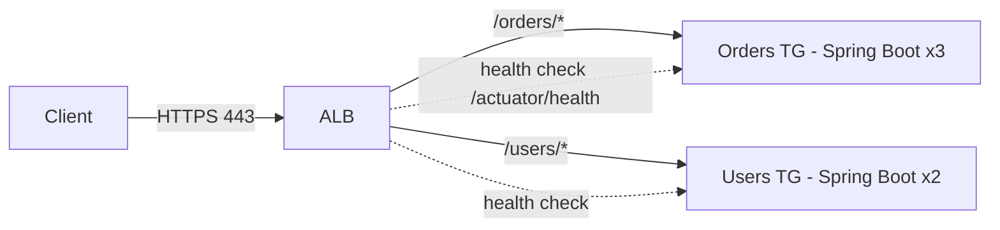

---

### Key Takeaways — ELB
- **ALB (L7)** for HTTP/microservices with path/host/header routing, WAF, and weighted canaries; **NLB (L4)** for static IPs, extreme scale, low latency, non-HTTP.
- **Target groups** are the routing + health-check + blue/green unit.
- Health-check a real **readiness** endpoint; tune **deregistration delay** + Spring **graceful shutdown** for zero-drop deploys.
- Terminate **TLS at the ALB** with ACM; redirect HTTP→HTTPS.
- Prefer **stateless** services over sticky sessions (session in Redis).
- Cross-zone LB is free/on for ALB, off/charged for NLB.

### Common Mistakes
- Health check on `/` (returns 200 while the app is actually broken) instead of a readiness probe.
- Deregistration delay shorter than request time → dropped requests during deploys.
- Relying on sticky sessions instead of externalizing state.
- Using an NLB when you need HTTP-aware routing (or an ALB when you need static IPs).
- Not honoring `X-Forwarded-For`, so logs/security see the ALB IP instead of the client.

### SDE2 Interview Questions
1. **ALB vs NLB — when each?** ALB for L7 HTTP routing/features; NLB for L4, static IPs, ultra-low latency, extreme throughput, non-HTTP.
2. **How do you deploy with zero downtime behind an ALB?** Graceful shutdown + adequate deregistration delay + rolling/blue-green via target groups; health checks gate traffic.
3. **What does a target group do?** Groups targets with a health check + protocol; routing destination and the unit for weighted/blue-green shifts.
4. **How do you canary with an ALB?** Weighted forwarding across two target groups (e.g., 95/5) or header-based routing.
5. **Why avoid sticky sessions?** They break horizontal scalability and even load; externalize session state to Redis for stateless targets.

### Practical Exercise
Front two Spring Boot target groups (v1 x2, v2 x1) with one ALB. Configure HTTPS via ACM with HTTP→HTTPS redirect, health checks on `/actuator/health/readiness`, and a weighted 90/10 split to v2. Deploy a new v2 build, watch targets drain gracefully (enable graceful shutdown, deregistration delay 30s) with zero 5xx during the swap, then shift to 100% v2.

---

# 6. Auto Scaling

Auto Scaling makes capacity track demand automatically: add instances under load (maintain performance), remove them when idle (save money), and replace unhealthy ones (maintain availability). It's what turns a static fleet into an **elastic, self-healing** one. This section covers **EC2 Auto Scaling**; service-level autoscaling (ECS, Lambda, DynamoDB) appears in their sections but the concepts carry over.

## 6.1 EC2 Auto Scaling

### Auto Scaling Groups (ASG)
A logical group of EC2 instances managed as one unit across multiple AZs. The ASG continuously works to keep **desired capacity** of **healthy** instances running, replacing failures and balancing across AZs. Attach it to one or more target groups so new instances auto-register with the ALB.

### Launch Templates
Versioned blueprint for instances the ASG launches: AMI, instance type(s), key, SGs, IAM instance profile, user data, IMDSv2 settings. (Launch Configurations are the deprecated predecessor — use Launch Templates.)

### Desired / Minimum / Maximum Capacity
- **Min:** the floor — never scale below (baseline availability).
- **Max:** the ceiling — cost/safety guardrail.
- **Desired:** current target count; scaling policies adjust this between min and max.

### Scaling Policies
Rules that change desired capacity in response to metrics or schedules (below).

## 6.2 Scaling Types

| Policy | How it decides | Best for |
|---|---|---|
| **Target Tracking** | Keep a metric at a target (e.g., avg CPU = 50%) | Default choice — simplest, self-adjusting |
| **Step Scaling** | Add/remove N based on alarm breach magnitude | Fine-grained response to spikes |
| **Simple Scaling** | One adjustment per alarm, then cooldown | Legacy; prefer step/target |
| **Scheduled Scaling** | Scale at known times | Predictable patterns (business hours, nightly batch) |
| **Predictive Scaling** | ML forecasts load, pre-scales | Recurring daily/weekly cycles with ramp-up lag |

### Target Tracking
You pick a metric and target value; AWS manages the alarms and math to hold it. E.g., `ASGAverageCPUUtilization = 50` or `ALBRequestCountPerTarget = 1000`.
```bash
aws autoscaling put-scaling-policy --auto-scaling-group-name orders-asg \
  --policy-name cpu50 --policy-type TargetTrackingScaling \
  --target-tracking-configuration '{
    "PredefinedMetricSpecification":{"PredefinedMetricType":"ASGAverageCPUUtilization"},
    "TargetValue":50.0}'
```
> **Interview Tip:** For request-driven web services, **`ALBRequestCountPerTarget`** is often a better scaling signal than CPU because it reacts to load directly and before CPU saturates.

### Step / Simple Scaling
Step scaling adds different amounts depending on how far past the threshold you are (e.g., +1 at 60% CPU, +3 at 85%). Simple scaling makes one change then waits out a cooldown — superseded by step/target tracking.

### Scheduled Scaling
Set min/desired at specific times (e.g., scale to 10 at 08:00, back to 2 at 20:00). Combine with target tracking for a known baseline + reactive headroom.

### Predictive Scaling
Uses historical CloudWatch data to forecast and pre-provision ahead of recurring spikes — compensates for the minutes it takes an instance (and a cold JVM) to warm up.

## 6.3 Health Checks

### EC2 Health Checks
ASG replaces an instance if its EC2 **status checks** fail (host/OS level).

### ELB Health Checks
If attached to a load balancer, the ASG can also use the **target group** health check (app-level). An instance that's "running" but failing `/actuator/health` gets replaced.

> **Best Practice:** Enable **ELB health checks** on the ASG (not just EC2 checks) so application-level failures (deadlocked JVM, failed DB pool) trigger replacement, not just host failures. Set a **health check grace period** long enough for the JVM + Spring context to start (e.g., 120–300s) so new instances aren't killed before they're ready.

### Instance replacement
Unhealthy → terminate → launch replacement → register with target group → serve traffic. Self-healing with no human action.

## 6.4 Deployment

### Rolling deployment
**Instance Refresh** replaces instances in batches with a new launch template/AMI, honoring a minimum healthy percentage. No extra fleet, slower, brief mixed versions.
```bash
aws autoscaling start-instance-refresh --auto-scaling-group-name orders-asg \
  --preferences '{"MinHealthyPercentage":90,"InstanceWarmup":180}'
```

### Blue/Green deployment
Launch a new ASG (green) behind a new target group, shift the ALB (weighted) from blue → green, keep blue for instant rollback. Costs double briefly; safest.

### Canary deployment
Send a small % to the new version (weighted target groups or a small green ASG), watch metrics, then ramp up or roll back.

## 6.5 Choosing a Scaling Policy

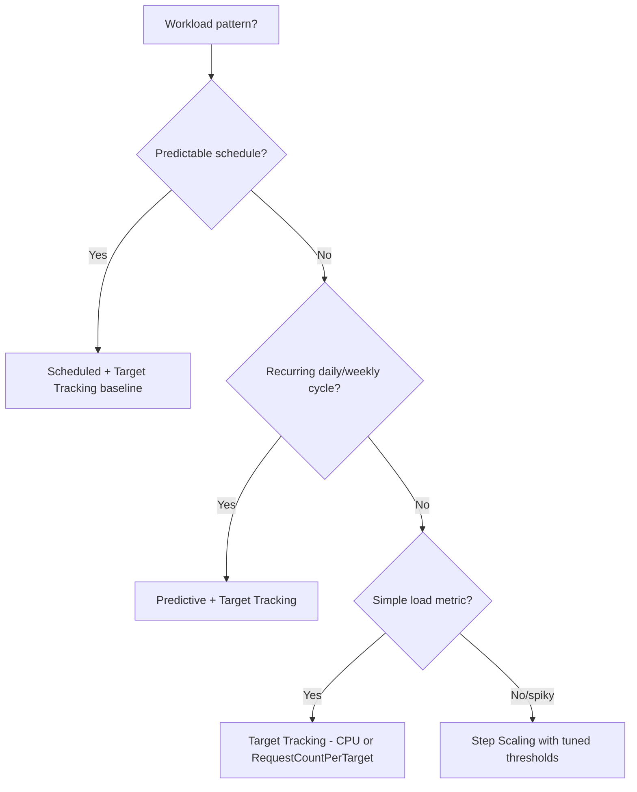

- **Steady web API:** target tracking on `RequestCountPerTarget` (plus a min for baseline HA).
- **Business-hours app:** scheduled scale-up + target tracking for surprises.
- **Daily traffic wave with slow JVM start:** predictive scaling to pre-warm.
- **Bursty, uneven spikes:** step scaling with aggressive upper steps + conservative scale-in.

> **Warning:** Scale **out fast, in slow**. Aggressive scale-in causes flapping and cold-start storms. Use longer scale-in cooldowns and instance warmup so a just-launched JVM isn't counted (or killed) before it's warm.

---

### Key Takeaways — Auto Scaling
- An **ASG** maintains desired healthy capacity across AZs, self-heals, and registers instances with the ALB target group.
- Use **Launch Templates** (not Launch Configurations) with IMDSv2 and an instance profile.
- **Target tracking** is the default; `RequestCountPerTarget` often beats CPU for web APIs; add **scheduled/predictive** for known patterns.
- Enable **ELB (app-level) health checks** + a sensible **grace period** so broken-but-running JVMs get replaced.
- Deploy via **Instance Refresh** (rolling) or **blue/green**; scale out fast, in slow to avoid flapping/cold-start storms.

### Common Mistakes
- Only EC2 (host) health checks → deadlocked app keeps receiving traffic.
- Grace period too short → new instances killed before the JVM warms up.
- Max capacity too low → can't absorb a real spike (throttled growth).
- Aggressive scale-in → thrash and cold starts.
- Scaling on CPU when load is I/O-bound (CPU stays low while latency climbs).

### SDE2 Interview Questions
1. **What metric would you autoscale a Spring Boot API on and why?** Often `ALBRequestCountPerTarget` (direct load signal, reacts before CPU saturates); CPU if CPU-bound.
2. **EC2 vs ELB health checks in an ASG?** EC2 = host status; ELB = app readiness; enable ELB checks so application failures trigger replacement.
3. **How do you do a zero-downtime deploy with an ASG?** Instance Refresh with min healthy %, or blue/green with weighted target groups and health gating.
4. **Why scale out fast and in slow?** To absorb spikes immediately but avoid flapping and repeated cold starts when load fluctuates.
5. **Target tracking vs step scaling?** Target tracking holds a metric at a value automatically (simple); step scaling gives graded responses to breach magnitude (fine control).

### Practical Exercise
Create an ASG (min 2, max 6, desired 2) across 2 AZs from a Launch Template running your Spring Boot JAR, attached to an ALB target group with ELB health checks and a 180s grace period. Add target tracking at `RequestCountPerTarget=500`. Load-test to trigger scale-out, kill a JVM to watch self-healing replacement, then run an Instance Refresh to roll a new AMI with zero 5xx.

---

# 7. S3

**S3 (Simple Storage Service)** is object storage: you store files ("objects") in flat containers ("buckets") and access them over HTTP APIs. It's the most-used AWS service and the backbone of file uploads, backups, logs, static assets, and data lakes. It offers **11 nines (99.999999999%) of durability** by replicating objects across devices and AZs. It is **not** a filesystem (no in-place edits, no real directories) and **not** a database — understanding that boundary avoids most misuse.

## 7.1 S3 Fundamentals

### Bucket
A globally-unique-named container in one Region. Bucket names form part of the URL and share a global namespace across all AWS accounts.

### Object
The stored entity: data (up to 5 TB) + metadata. Immutable — you overwrite by uploading a new version, you don't edit in place.

### Key
The object's full name within the bucket (e.g., `invoices/2026/10/inv-123.pdf`). The key *is* the identifier; S3 has no real folders.

### Prefix
A leading portion of the key (`invoices/2026/`). The console shows prefixes as "folders," and you list by prefix. Modern S3 scales throughput automatically per prefix.

### Metadata
System metadata (size, content-type, encryption) and optional user metadata (`x-amz-meta-*`). Set `Content-Type` correctly so browsers handle downloads properly.

### Versioning
Keeps every version of an object (including delete markers), protecting against accidental overwrite/delete. Once enabled it can only be suspended, not fully disabled. Combine with lifecycle rules to expire old versions.

## 7.2 Storage Classes

| Class | Durability | Availability | Min duration | Retrieval | Use case |
|---|---|---|---|---|---|
| Standard | 11 nines | 99.99% | none | instant | Hot data, frequently accessed |
| Intelligent-Tiering | 11 nines | 99.9% | none | instant | Unknown/changing access patterns |
| Standard-IA | 11 nines | 99.9% | 30 days | instant | Infrequent but needs fast access |
| One Zone-IA | 11 nines (1 AZ) | 99.5% | 30 days | instant | Re-creatable infrequent data |
| Glacier Instant Retrieval | 11 nines | 99.9% | 90 days | ms | Archive needing instant access |
| Glacier Flexible Retrieval | 11 nines | — | 90 days | minutes–hours | Archive, occasional restore |
| Glacier Deep Archive | 11 nines | — | 180 days | hours | Compliance, rarely accessed |

> **Best Practice:** If access patterns are unknown or variable, use **Intelligent-Tiering** — it auto-moves objects between tiers and avoids retrieval-fee surprises. For predictable lifecycles (logs: hot 30 days → IA → Glacier → delete) use **lifecycle rules**.

> **Warning:** IA/One-Zone/Glacier have **minimum storage durations** and **per-GB retrieval fees**. Storing many tiny, short-lived objects in IA can cost *more* than Standard.

## 7.3 Security

### Block Public Access (BPA)
Account- and bucket-level master switch that blocks public ACLs/policies. **Keep it ON** unless you deliberately host a public website. It's the main guard against the classic "public S3 bucket" leak.

### Bucket Policies
Resource-based JSON policy on the bucket; the primary access-control mechanism (supports cross-account, conditions like TLS-only).
```json
{
  "Version": "2012-10-17",
  "Statement": [{
    "Sid": "DenyInsecureTransport",
    "Effect": "Deny",
    "Principal": "*",
    "Action": "s3:*",
    "Resource": ["arn:aws:s3:::orders-prod", "arn:aws:s3:::orders-prod/*"],
    "Condition": { "Bool": { "aws:SecureTransport": "false" } }
  }]
}
```

### IAM Policies
Identity-based grants for your principals (users/roles). For same-account app access, prefer IAM policies on the app's role over bucket policies.

### ACLs & Object Ownership
Legacy per-object/bucket ACLs. **Disable ACLs** by setting **Bucket Owner Enforced** object ownership so the bucket owner owns all objects and only policies govern access — AWS's current recommendation.

### Encryption
See below. S3 encrypts all new objects by default (SSE-S3 at minimum since 2023).

## 7.4 Encryption

| Mode | Key management | When |
|---|---|---|
| **SSE-S3** | AWS-managed keys, transparent | Default, simplest |
| **SSE-KMS** | Your KMS CMK, audited, access-controlled | Compliance, per-key access control & CloudTrail audit |
| **SSE-C** | You supply the key per request | You must manage keys yourself (rare) |
| **Client-side** | You encrypt before upload | Zero-trust of provider; end-to-end |

> **Best Practice:** Use **SSE-KMS** for sensitive data (auditable, revocable, separate key permissions). Beware KMS request costs/throttling on very high-volume small objects — use **S3 Bucket Keys** to reduce KMS calls.

## 7.5 S3 Features

### Multipart Upload
Split large objects into parts, upload in parallel, resume failed parts. **Required** for objects > 5 GB; recommended > 100 MB. The SDK's Transfer Manager does this automatically.

### Presigned URLs
A time-limited URL granting temporary GET/PUT to a specific object, signed with your credentials. Lets clients upload/download **directly to/from S3** without routing bytes through your app or exposing credentials. The standard pattern for user file uploads.

### Lifecycle Policies
Automate transitions (Standard → IA → Glacier) and expiration (delete after N days), including old versions and incomplete multipart uploads.
```json
{
  "Rules": [{
    "ID": "logs-tiering",
    "Filter": { "Prefix": "logs/" },
    "Status": "Enabled",
    "Transitions": [
      { "Days": 30, "StorageClass": "STANDARD_IA" },
      { "Days": 90, "StorageClass": "GLACIER" }
    ],
    "Expiration": { "Days": 365 },
    "AbortIncompleteMultipartUpload": { "DaysAfterInitiation": 7 }
  }]
}
```

### Object Lock
WORM (write-once-read-many) retention for compliance — prevents deletion/overwrite for a retention period or legal hold. Requires versioning.

### Replication
- **CRR (Cross-Region):** DR, lower-latency global reads, compliance.
- **SRR (Same-Region):** aggregate logs across accounts, prod→test copies.
Asynchronous; needs versioning.

### Event Notifications
S3 emits events (`s3:ObjectCreated:*`, etc.) to **SNS, SQS, Lambda, or EventBridge** — the trigger for event-driven file processing.

### Static Website Hosting
Serve a static site directly from a bucket (usually fronted by CloudFront for HTTPS, caching, and to keep the bucket private via OAC).

## 7.6 SDE2 Use Cases
- **File uploads:** presigned PUT, client uploads directly to S3.
- **Image/user-generated content:** store originals; process async on upload event.
- **Logs:** ship app/access logs, tier with lifecycle, query with Athena.
- **Backups:** DB dumps, snapshots; Object Lock + versioning for ransomware protection.
- **Data lakes:** raw/processed zones queried by Athena/Glue/EMR.

## 7.7 Java / Spring Boot Examples (AWS SDK v2)

Dependency and client:
```xml
<dependency>
  <groupId>software.amazon.awssdk</groupId>
  <artifactId>s3</artifactId>
</dependency>
```
```java
@Configuration
public class S3Config {
    @Bean
    public S3Client s3Client() {
        return S3Client.builder()
                .region(Region.US_EAST_1)
                .credentialsProvider(DefaultCredentialsProvider.create()) // role, not keys
                .build();
    }
    @Bean
    public S3Presigner s3Presigner() {
        return S3Presigner.builder().region(Region.US_EAST_1)
                .credentialsProvider(DefaultCredentialsProvider.create()).build();
    }
}
```

### Uploading a file
```java
@Service
public class FileStorageService {
    private final S3Client s3;
    private static final String BUCKET = "orders-attachments-prod";

    public FileStorageService(S3Client s3) { this.s3 = s3; }

    public String upload(String key, MultipartFile file) throws IOException {
        PutObjectRequest req = PutObjectRequest.builder()
                .bucket(BUCKET).key(key)
                .contentType(file.getContentType())
                .serverSideEncryption(ServerSideEncryption.AWS_KMS)   // SSE-KMS
                .build();
        s3.putObject(req, RequestBody.fromInputStream(
                file.getInputStream(), file.getSize()));
        return key;
    }
}
```

### Downloading a file
```java
public byte[] download(String key) {
    GetObjectRequest req = GetObjectRequest.builder().bucket(BUCKET).key(key).build();
    try (ResponseInputStream<GetObjectResponse> in = s3.getObject(req)) {
        return in.readAllBytes();
    } catch (IOException e) {
        throw new UncheckedIOException(e);
    }
}
```

### Presigned URLs (upload + download without proxying bytes)
```java
@Service
public class PresignService {
    private final S3Presigner presigner;
    private static final String BUCKET = "orders-attachments-prod";
    public PresignService(S3Presigner presigner) { this.presigner = presigner; }

    // Client PUTs the file straight to S3 using this URL
    public URL presignUpload(String key, String contentType) {
        PutObjectRequest put = PutObjectRequest.builder()
                .bucket(BUCKET).key(key).contentType(contentType).build();
        PutObjectPresignRequest p = PutObjectPresignRequest.builder()
                .signatureDuration(Duration.ofMinutes(10))
                .putObjectRequest(put).build();
        return presigner.presignPutObject(p).url();
    }

    public URL presignDownload(String key) {
        GetObjectRequest get = GetObjectRequest.builder().bucket(BUCKET).key(key).build();
        GetObjectPresignRequest p = GetObjectPresignRequest.builder()
                .signatureDuration(Duration.ofMinutes(5))
                .getObjectRequest(get).build();
        return presigner.presignGetObject(p).url();
    }
}
```

### Multipart upload (large files, parallel, resumable) — Transfer Manager
```java
S3TransferManager tm = S3TransferManager.create(); // handles multipart automatically
Upload upload = tm.uploadFile(b -> b
        .putObjectRequest(r -> r.bucket(BUCKET).key("big/video.mp4"))
        .source(Paths.get("/data/video.mp4")));
upload.completionFuture().join();
```

### S3 event processing (S3 → SQS → Spring Boot)
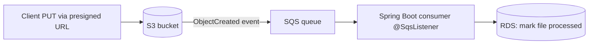
```java
// Spring Cloud AWS SQS listener receiving S3 event notifications
@Component
public class S3EventConsumer {
    @SqsListener("file-events-queue")
    public void handle(S3EventNotification notification) {
        for (var rec : notification.getRecords()) {
            String bucket = rec.getS3().getBucket().getName();
            String key = rec.getS3().getObject().getUrlDecodedKey();
            // idempotent processing: thumbnail, virus scan, metadata extraction...
        }
    }
}
```
> **Best Practice:** Prefer **S3 → SQS → consumer** over **S3 → Lambda** when processing is long-running, needs backpressure control, or must share logic with your Spring services. Always make the handler **idempotent** (events can be delivered more than once).

---

### Key Takeaways — S3
- Object storage (not a filesystem/DB): flat buckets + keys, immutable objects, **11 nines durability**.
- Keep **Block Public Access ON**, **disable ACLs** (Bucket Owner Enforced), enforce **TLS-only** + **SSE-KMS** for sensitive data.
- Use **presigned URLs** so clients upload/download directly — never proxy large files through your JVM.
- **Lifecycle rules** + storage classes/Intelligent-Tiering control cost; mind IA/Glacier minimum durations and retrieval fees.
- Drive event processing via **S3 Event Notifications → SQS/Lambda/EventBridge**; make handlers idempotent.
- Use **Multipart/Transfer Manager** for large objects; **versioning + Object Lock** protect against deletion/ransomware.

### Common Mistakes
- Leaking data via a public bucket (BPA off / public ACL).
- Proxying big uploads through the app instead of presigned URLs.
- Putting many tiny short-lived objects in IA/Glacier (minimum-duration + retrieval costs).
- Treating S3 like a filesystem (expecting rename/append/locking semantics).
- Forgetting lifecycle rules → unbounded storage growth (and orphaned multipart parts).
- Non-idempotent S3 event handlers duplicating work.

### SDE2 Interview Questions
1. **How do you let users upload large files securely?** Presigned PUT URLs (short TTL) so the client uploads directly to S3; app never sees credentials or the bytes.
2. **S3 durability vs availability?** 11 nines durability (won't lose data) vs ~99.99% availability (occasional request errors); different guarantees.
3. **SSE-S3 vs SSE-KMS?** Both encrypt at rest; KMS adds auditable, access-controlled, revocable keys (use Bucket Keys to limit KMS cost).
4. **How do you process files as they're uploaded?** S3 event notification → SQS/Lambda; idempotent consumer; backpressure via SQS.
5. **How do you control S3 cost over time?** Lifecycle transitions to IA/Glacier, expiration, Intelligent-Tiering, aborting incomplete multipart uploads.
6. **Is S3 strongly consistent?** Yes — since 2020 S3 provides strong read-after-write consistency for all operations.

### Practical Exercise
Build a Spring Boot endpoint that returns a presigned upload URL; have a client PUT a file directly to S3. Configure an S3 event → SQS → `@SqsListener` that records the upload in RDS and generates a thumbnail, made idempotent by object key. Add a lifecycle rule (30d → IA, 90d → Glacier, abort incomplete multipart after 7d), enable versioning + SSE-KMS, enforce TLS-only via bucket policy, and confirm BPA is ON.

---

# 8. RDS

**RDS (Relational Database Service)** is managed relational databases. AWS handles provisioning, patching, backups, replication, and failover; you keep your schema, queries, and connections. It solves the "I don't want to be a DBA for routine operations" problem while keeping the relational model (ACID transactions, joins, SQL) your Spring Data JPA app expects. You still own query performance, indexing, connection management, and capacity.

## 8.1 Database Fundamentals

### RDS
The managed service wrapping an engine (PostgreSQL, MySQL, etc.) with automation. You get a DB endpoint; you don't get OS/SSH access to the host.

### DB Instance
A single database server (compute + storage) of an instance class (e.g., `db.r6g.large`). The unit you connect to.

### DB Cluster
For Aurora (and MySQL/Postgres multi-AZ cluster deployments): a group with a writer + reader endpoints sharing or replicating storage. (Aurora detailed in §9.)

### DB Subnet Groups
A set of subnets (across AZs) in which RDS can place instances. Put these in **isolated/private** subnets — the DB should never be publicly reachable.

### Parameter Groups
Engine configuration (e.g., `max_connections`, `work_mem`, `shared_buffers`). Modify here, not on a host you can't access. Some changes need a reboot.

### Option Groups
Engine-specific add-on features (e.g., Oracle/SQL Server options like TDE, native backup). Postgres/MySQL mostly use parameter groups.

## 8.2 Supported Databases

| Engine | Notes / when |
|---|---|
| **PostgreSQL** | Rich features (JSONB, extensions, strong SQL); common default for new backends |
| **MySQL** | Ubiquitous, simple, huge ecosystem |
| **MariaDB** | MySQL fork, open governance |
| **Oracle** | Enterprise/legacy with licensing |
| **SQL Server** | .NET/enterprise shops |
| **Aurora** | AWS-built, MySQL/Postgres-compatible, cloud-native perf/HA (see §9) |

## 8.3 High Availability

### Multi-AZ
A **synchronous standby** replica in another AZ. On failure (host, AZ, patching), RDS **automatically fails over** (typically 60–120s) by flipping the DNS endpoint to the standby. The standby is **not** readable — it exists purely for availability/durability.

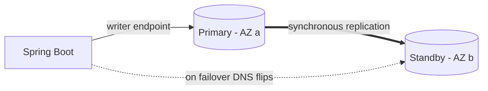

### Read Replicas
**Asynchronous** copies you can read from, to offload read traffic. Can be in-Region or cross-Region. Replication lag means **eventually consistent** reads. You must route reads to them explicitly. Can be promoted to standalone (manual DR / migration).

> **Important:** Multi-AZ ≠ read replica. Multi-AZ = **availability** (sync standby, auto-failover, not readable). Read replica = **read scaling** (async, readable, no auto-failover). Interviewers love this distinction.

### Failover
DNS endpoint repoints to the standby; your app reconnects. Design the app to **reconnect and retry** transient failures (HikariCP + retry).

### Automated Backups
Daily snapshot + continuous transaction logs enabling **Point-In-Time Recovery (PITR)** within the retention window (1–35 days). Enabled by default.

### Snapshots
Manual, user-triggered backups that persist until you delete them (beyond the automated retention). Use before risky migrations; copy cross-Region for DR.

## 8.4 Scaling

### Vertical scaling
Change the instance class (more CPU/RAM) — brief downtime (or failover with Multi-AZ). The main lever for write capacity on standard RDS.

### Read replicas
Scale **reads** horizontally; route reporting/analytics/read-heavy endpoints to replicas.

### Aurora scaling
Aurora adds up to 15 low-lag readers, Serverless v2 auto-scaling, and shared storage (see §9).

### Storage autoscaling
RDS can grow storage automatically as you approach capacity (set a max). Storage can't shrink.

## 8.5 Production Concepts

### Connection pooling
Databases have a hard `max_connections`. Each JVM instance holding a pool of connections multiplies fast (10 instances × 20 connections = 200). **Pool at the app (HikariCP)** and cap it; for serverless/many-client fan-in use **RDS Proxy** to multiplex and survive failovers.

### Failover handling
App must detect dropped connections, reconnect to the (same) endpoint, and retry idempotent operations. Keep pool `max-lifetime` below any infra idle timeout.

### Backup strategy / Restore / PITR
Set retention to your RPO (e.g., 7–35 days), take manual snapshots before migrations, test restores. PITR restores to a **new instance** at a chosen second; you then repoint the app.

### Maintenance windows
Weekly window for patching; with Multi-AZ, patching happens on the standby then fails over to minimize impact. Schedule off-peak.

### Database monitoring
CloudWatch (CPU, FreeableMemory, DatabaseConnections, Read/WriteIOPS, ReplicaLag, FreeStorageSpace), **Enhanced Monitoring** (OS-level), and **Performance Insights** (top SQL, wait events) — your first stop for "the DB is slow."

## 8.6 Spring Boot + RDS

```yaml
# application.yml (prod) — credentials come from Secrets Manager, not here (see §24)
spring:
  datasource:
    url: jdbc:postgresql://orders-db.xxxx.us-east-1.rds.amazonaws.com:5432/orders
    username: ${DB_USER}
    password: ${DB_PASSWORD}        # injected at runtime from Secrets Manager
    hikari:
      maximum-pool-size: 20         # size deliberately; see note below
      minimum-idle: 5
      connection-timeout: 3000      # fail fast if pool exhausted (ms)
      max-lifetime: 1740000         # 29 min < RDS/infra idle timeout
      idle-timeout: 600000
      validation-timeout: 2000
      pool-name: orders-pool
  jpa:
    hibernate:
      ddl-auto: validate            # never 'update'/'create' in prod
    properties:
      hibernate:
        jdbc.batch_size: 50
        order_inserts: true
```

> **Best Practice: sizing HikariCP.** Bigger pools are usually *worse*. A good starting point is small (e.g., 10–20 per instance). Ensure `instances × maximum-pool-size × (1 + replicas)` stays well under the DB `max_connections`, leaving headroom for admin/replication. Prefer a small pool + fast `connection-timeout` so overload surfaces as quick errors you can shed, not a frozen app.

Retry transient failures (e.g., during failover):
```java
@Retryable(retryFor = TransientDataAccessException.class,
           maxAttempts = 3, backoff = @Backoff(delay = 200, multiplier = 2))
public Order save(Order order) {
    return orderRepository.save(order);
}
```

Routing reads to a replica (simplified) — separate datasource / routing datasource:
```java
// Read-only transactions can target a replica datasource via AbstractRoutingDataSource
@Transactional(readOnly = true)
public List<Order> recentOrders() { return orderRepository.findTop100ByOrderByCreatedAtDesc(); }
```

> **Warning:** Reads from a replica are **eventually consistent**. Never read a value from a replica immediately after writing it to the primary and expect it to be there (read-your-writes). Route such reads to the primary.

RDS Proxy (recommended for Lambda / spiky many-client workloads):
```
App/Lambda --> RDS Proxy (pools & multiplexes, holds through failover) --> RDS
```

---

### Key Takeaways — RDS
- Managed relational DB: AWS runs ops; you own schema, queries, indexing, and **connection management**.
- **Multi-AZ = availability** (sync standby, auto-failover, not readable); **read replicas = read scaling** (async, readable, eventually consistent). Don't conflate them.
- **PITR** (automated backups) to your RPO; take manual snapshots before migrations; test restores.
- **Pool connections (HikariCP), keep pools small**, watch `max_connections`; use **RDS Proxy** for serverless/high-fan-in and smoother failover.
- Monitor with CloudWatch + **Performance Insights**; `ddl-auto: validate` in prod.
- Scale writes vertically (bigger instance) or move to Aurora; scale reads with replicas.

### Common Mistakes
- Confusing Multi-AZ with read replicas.
- Oversized/unbounded connection pools exhausting `max_connections`.
- Reading-your-writes off a lagging replica.
- `ddl-auto: update` in production (schema drift/data loss risk).
- Public RDS endpoint / DB in a public subnet.
- No retry/reconnect logic → every failover becomes an outage.
- Hardcoded DB credentials (should come from Secrets Manager).

### SDE2 Interview Questions
1. **Multi-AZ vs read replica?** Availability (sync, non-readable, auto-failover) vs read scaling (async, readable, manual promotion).
2. **How do you size a connection pool?** Small pools; `instances × pool × (1+replicas) < max_connections` with headroom; fast connection-timeout to shed load.
3. **What happens to connections during failover and how does the app cope?** Connections drop; app reconnects to the same DNS endpoint and retries idempotent ops; keep max-lifetime under idle timeouts; RDS Proxy helps.
4. **When would you use RDS Proxy?** Lambda/serverless or many clients causing connection storms; it pools/multiplexes and preserves connections across failover.
5. **PITR vs snapshot?** PITR restores to any second in the retention window (new instance) via continuous logs; snapshots are discrete manual/automated backups.
6. **The DB is at 100% CPU — first steps?** Performance Insights for top SQL/wait events, check slow query log, missing indexes, N+1 from JPA, connection count; then optimize query/index or scale.

### Practical Exercise
Provision a Multi-AZ PostgreSQL RDS in isolated subnets with credentials in Secrets Manager. Connect a Spring Boot app via HikariCP (pool 15, max-lifetime 29m), load it, then trigger a **reboot with failover** and confirm the app reconnects/retries with minimal errors. Add a read replica, route a read-only report endpoint to it, and observe `ReplicaLag`. Finally, restore a PITR copy to a point 10 minutes ago into a new instance.

---

# 9. Aurora

**Amazon Aurora** is AWS's cloud-native relational database, wire-compatible with **MySQL** and **PostgreSQL**, built to give commercial-grade performance and availability at open-source cost. The key innovation is **decoupling compute from a distributed, self-healing storage layer** shared by all nodes — which changes how replication, failover, and scaling work compared to standard RDS.

## 9.1 Aurora Architecture

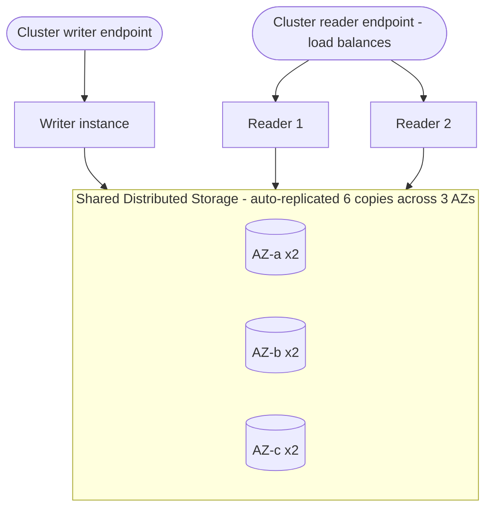

### Writer
The single instance that accepts writes. It ships **log records** (not full pages) to the storage layer; the storage layer materializes pages. This makes writes cheaper over the network than traditional replication.

### Readers
Up to **15** read-only replicas that read from the **same shared storage** as the writer — so replica lag is typically **milliseconds** (no full re-execution of writes). Any reader can be promoted to writer in seconds.

### Storage layer
A purpose-built, distributed, SSD-backed storage service that **auto-replicates 6 copies across 3 AZs**, auto-heals bad segments, and grows automatically (up to 128 TB) in 10 GB chunks. Durability and replication are a property of storage, not the DB instances.

### Shared distributed storage
Because all instances point at the same storage, adding a reader doesn't copy data, and failover doesn't require data movement — a reader just takes over. This is why Aurora failover (~30s or less) is faster than RDS Multi-AZ.

### Replicas
Readers serve the **cluster reader endpoint** (load-balanced reads) and provide HA (promotion candidates). Lag is small enough that read scaling is usually safe for most read paths.

## 9.2 Aurora Features

### Aurora Serverless (v2)
Compute auto-scales in fine-grained **ACUs** (Aurora Capacity Units) up and down with load, in ~seconds, without dropping connections. Great for variable/spiky/unpredictable workloads and dev/test. Pay for capacity used. v2 scales in-place (unlike v1's pause/resume model).

### Global Database
One primary Region + up to 5 secondary Regions with **storage-level replication** (typically <1s lag), for low-latency global reads and **cross-Region DR** with fast promotion (RTO ~1 min, RPO ~1s).

### Read Scaling
Add readers behind the reader endpoint; use Aurora **Auto Scaling** to add/remove readers by load.

### Failover
If the writer fails, a reader is promoted (seconds). With no readers, Aurora creates a new instance (slower). Prioritize readers via failover tiers.

### Backtracking
(MySQL-compatible) Rewind the cluster to a prior point **in seconds** without restoring from a backup — great for undoing a bad migration/`DELETE`. Different from PITR (which creates a new cluster).

### Automated backups
Continuous to S3, PITR, no performance hit (backups come from the storage layer, not the instances). Snapshots can be shared/copied cross-Region.

## 9.3 Aurora vs RDS

| Dimension | RDS (standard MySQL/Postgres) | Aurora (MySQL/Postgres-compatible) |
|---|---|---|
| **Architecture** | Instance with attached EBS; replication = log shipping/stream | Compute separated from shared 6-way, 3-AZ distributed storage |
| **Performance** | Good | Up to ~3–5x MySQL / ~2x PostgreSQL throughput |
| **Availability** | Multi-AZ sync standby (not readable), failover ~60–120s | Reader promotion failover (~<30s); storage spans 3 AZs |
| **Read scaling** | Async read replicas (lag seconds), max varies | Up to 15 low-lag (ms) readers on shared storage |
| **Scaling** | Vertical; storage autoscale | Vertical + Serverless v2 autoscaling + fast reader add |
| **Cost** | Lower baseline; pay instance + EBS | ~20% higher instance price + I/O (or I/O-Optimized); often worth it at scale |
| **Operational complexity** | Simple, familiar | Slightly more concepts (endpoints, ACUs, tiers) but less ops at scale |
| **Use cases** | Small/medium apps, cost-sensitive, exotic engines (Oracle/SQL Server) | High-throughput, HA-critical, read-heavy, global, variable load |

> **Interview Tip:** Pick **RDS** for simple/cost-sensitive workloads or engines Aurora doesn't offer (Oracle, SQL Server, MariaDB). Pick **Aurora** when you need higher throughput, fast failover, many low-lag read replicas, global DR, or serverless elasticity. Both speak the same wire protocol, so Spring Boot/JPA code is unchanged — you just point at a different endpoint.

> **Warning:** Aurora bills for **I/O** on the standard configuration; very I/O-heavy workloads can get expensive — evaluate **Aurora I/O-Optimized** (flat pricing, no per-I/O charge) for high-throughput systems.

---

### Key Takeaways — Aurora
- Aurora separates **compute from a distributed, auto-replicated (6×, 3-AZ) storage layer**, giving fast failover, ms-lag readers (up to 15), and auto-growing storage.
- **Serverless v2** auto-scales compute for variable load; **Global Database** gives cross-Region DR with ~1s RPO; **Backtrack** rewinds in seconds.
- Wire-compatible with MySQL/Postgres — **no app code changes**, just a different endpoint.
- Choose Aurora for throughput/HA/read-scaling/global; choose RDS for simplicity, cost, or other engines.
- Watch **I/O costs**; consider I/O-Optimized at high volume.

### Common Mistakes
- Assuming reader endpoint reads are strongly consistent (still eventually consistent, though ms-lag).
- Ignoring I/O charges on high-throughput clusters (not switching to I/O-Optimized).
- Treating Backtrack as a backup replacement (it's a limited-window rewind, not DR).
- Using Aurora for a tiny app where RDS would be cheaper and simpler.

### SDE2 Interview Questions
1. **Why is Aurora failover faster than RDS Multi-AZ?** Shared storage means a reader just takes over; no data copy/standby catch-up needed.
2. **Why is Aurora replica lag so low?** Readers read the same distributed storage as the writer; writes aren't re-executed per replica, only log records applied at storage.
3. **When Aurora Serverless v2?** Variable/unpredictable or spiky load, dev/test, or to avoid over-provisioning — scales compute in-place without dropping connections.
4. **Aurora vs RDS cost trade-off?** Higher instance price (+I/O) but better performance/HA/scaling; often cheaper at scale; use I/O-Optimized for heavy I/O.
5. **What is Backtrack and when is it useful?** Rewind the cluster seconds-fast to before a bad change, without a full restore (MySQL-compatible).

### Practical Exercise
Create an Aurora PostgreSQL cluster with a writer + 2 readers across 3 AZs. Point your Spring Boot app's writes at the **cluster (writer) endpoint** and read-only queries at the **reader endpoint**. Trigger a failover and measure recovery time versus the RDS exercise. Enable Aurora Auto Scaling for readers, generate read load, and watch a reader get added. Then convert to Serverless v2 and observe ACU scaling under a load spike.

---

# 10. DynamoDB

**DynamoDB** is a fully managed, serverless NoSQL key-value and document database delivering **single-digit-millisecond latency at any scale**. It exists because relational databases struggle to scale writes horizontally and demand careful capacity management; DynamoDB trades flexible querying (no joins, no ad-hoc queries) for predictable performance, automatic sharding, and near-infinite scale. The hard part is **data modeling** — you design the table around your **access patterns**, not around normalized entities.

## 10.1 Fundamentals

### Table
A collection of items. Schemaless except for the **primary key**; different items can have different attributes.

### Item
A single record (like a row), up to **400 KB**, identified by its primary key.

### Attribute
A field within an item (like a column), typed (String, Number, Binary, Boolean, List, Map, Set, Null).

### Partition Key (PK / hash key)
Its hash determines which **partition** stores the item, distributing data and load. Choosing a high-cardinality, evenly-accessed PK is the #1 performance decision.

### Sort Key (SK / range key)
Optional second part of a **composite** primary key. Items with the same PK are stored **sorted by SK**, enabling range queries (`begins_with`, `between`, `>`) within a partition. This is the foundation of modeling relationships.

## 10.2 Data Modeling

### Access-pattern-driven design
List every query your app must serve **first**, then design keys/indexes to satisfy them. You cannot "just add a query later" cheaply like in SQL.

### Single-table design
Store multiple entity types in **one** table, using generic key names (`PK`, `SK`) and overloaded values so related items (e.g., a customer + their orders) live in the **same partition** and are fetched in **one query**. Reduces round-trips and cost; increases modeling complexity.

### Composite keys
Encode hierarchy/relationships into keys, e.g., `PK=CUSTOMER#123`, `SK=ORDER#2026-10-04#A1`. A single `Query` on `PK=CUSTOMER#123` with `SK begins_with ORDER#` returns all that customer's orders, sorted by date.

### Hot partitions
When one PK (or small set) gets disproportionate traffic, that partition throttles even if the table has spare capacity overall. Avoid low-cardinality or time-sequential PKs for high-write workloads; use **write sharding** (append a suffix) to spread load.

### Sparse indexes
A GSI only indexes items that **have** the index's key attributes. Set that attribute only on items you want indexed (e.g., only `status=OPEN` orders) to build small, efficient "filtered" indexes.

## 10.3 Indexes

| | GSI (Global Secondary Index) | LSI (Local Secondary Index) |
|---|---|---|
| Key | Different PK **and/or** SK | Same PK, different SK |
| When created | Anytime | Only at table creation |
| Capacity | Own throughput (separate) | Shares table throughput |
| Consistency | Eventually consistent only | Strong or eventual |
| Limit | 20 (default) | 5 |
| Use | Most alternate access patterns | Alternate sort within same partition |

> **Best Practice:** Prefer **GSIs** (flexible, created anytime); LSIs are rarely worth the table-creation-time constraint and the shared throughput. Use **sparse GSIs** to model "find all X in state Y" cheaply.

## 10.4 Capacity

### Provisioned vs On-demand
- **Provisioned:** you set RCUs/WCUs (with auto scaling); cheaper for steady, predictable load.
- **On-demand:** pay per request, instant scaling, no capacity planning; best for spiky/unknown load and new apps.

### Read/Write Capacity Units
- **1 WCU** = one write up to 1 KB/sec.
- **1 RCU** = one **strongly** consistent read up to 4 KB/sec, or **two** eventually consistent reads.
Transactions cost 2× the units.

## 10.5 Consistency

### Eventually Consistent Reads (default)
May briefly return slightly stale data (replication across copies); cheaper and higher throughput.

### Strongly Consistent Reads
Return the latest committed write; cost 2× RCUs, slightly higher latency, not available on GSIs.

## 10.6 Advanced

### Conditional Writes
Write only if a condition holds (`attribute_not_exists(PK)` for insert-if-absent, optimistic locking with a version attribute). Core tool for **idempotency** and preventing lost updates.

### Transactions
`TransactWriteItems` / `TransactGetItems` give ACID across up to 100 items/multiple tables (all-or-nothing). Use for money/inventory invariants; 2× cost.

### TTL (Time To Live)
Auto-delete items after an epoch timestamp attribute — great for sessions, carts, ephemeral data. Deletion is background/best-effort (within ~48h), free.

### Streams
An ordered change log (insert/modify/remove) consumable by Lambda/KCL — powers event-driven flows, cross-Region replication (Global Tables), and cache invalidation.

### DAX (DynamoDB Accelerator)
An in-memory, write-through cache in front of DynamoDB for microsecond reads on hot items — only for read-heavy, DynamoDB-specific caching.

### Batch Operations
`BatchGetItem` / `BatchWriteItem` reduce round-trips (up to 25 writes / 100 reads per call). Handle **UnprocessedItems** (partial success) with retries + backoff.

## 10.7 Production

### Partition-key design & hot-key prevention
High cardinality + even access. For time-series/sequential keys, add a sharding suffix (`PK=METRIC#2026-10-04#<0..9>`), or use on-demand mode which adapts to traffic. Use write sharding + scatter-gather read.

### Capacity planning & throttling
Throttling (`ProvisionedThroughputExceededException`) means a partition exceeded capacity. Fix via on-demand mode, higher provisioned capacity/auto scaling, better key distribution, or exponential-backoff retries (the SDK does this by default).

### Retry strategies
SDK retries throttles with exponential backoff + jitter; make writes **idempotent** (conditional writes / client token) so retries don't duplicate.

## 10.8 Java SDK v2 + Single-Table Example

Model: customers and their orders in one table.
```
PK (partition)        SK (sort)                 Attributes
CUSTOMER#123          PROFILE                   name, email, tier
CUSTOMER#123          ORDER#2026-10-04#A1       total, status, GSI1PK, GSI1SK
CUSTOMER#123          ORDER#2026-10-05#B2       total, status, ...
```
Access patterns:
- Get customer profile → `GetItem(PK=CUSTOMER#123, SK=PROFILE)`
- List a customer's orders → `Query(PK=CUSTOMER#123, SK begins_with ORDER#)`
- List all OPEN orders → **GSI1** sparse index (`GSI1PK=STATUS#OPEN`, `GSI1SK=date`)

Enhanced client with an annotated bean:
```java
@DynamoDbBean
public class Order {
    private String pk;      // CUSTOMER#123
    private String sk;      // ORDER#2026-10-04#A1
    private BigDecimal total;
    private String status;

    @DynamoDbPartitionKey public String getPk() { return pk; }
    @DynamoDbSortKey      public String getSk() { return sk; }
    @DynamoDbSecondaryPartitionKey(indexNames = "GSI1")
    public String getStatus() { return status; }   // sparse GSI on status
    // getters/setters...
}
```
```java
@Service
public class OrderRepository {
    private final DynamoDbTable<Order> table;
    public OrderRepository(DynamoDbEnhancedClient enhanced) {
        this.table = enhanced.table("AppTable", TableSchema.fromBean(Order.class));
    }

    // Idempotent insert: only if this order doesn't already exist
    public void createOrder(Order o) {
        table.putItem(PutItemEnhancedRequest.builder(Order.class)
                .item(o)
                .conditionExpression(Expression.builder()
                        .expression("attribute_not_exists(pk)").build())
                .build());
    }

    // All orders for a customer, sorted by SK (date)
    public List<Order> ordersFor(String customerId) {
        QueryConditional q = QueryConditional.sortBeginsWith(
                k -> k.partitionValue("CUSTOMER#" + customerId).sortValue("ORDER#"));
        return table.query(q).items().stream().toList();
    }
}
```
Atomic money transfer with a transaction + optimistic condition:
```java
dynamo.transactWriteItems(tx -> tx
    .addUpdateItem(accounts, UpdateItemEnhancedRequest.builder(Account.class)
        .item(debited)
        .conditionExpression(Expression.builder()
            .expression("balance >= :amt")
            .putExpressionValue(":amt", AttributeValue.fromN(amount.toString())).build())
        .build())
    .addUpdateItem(accounts, credited));
```

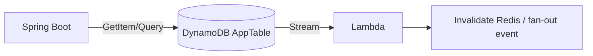

---

### Key Takeaways — DynamoDB
- Serverless NoSQL with **ms latency at any scale**; design around **access patterns**, not entities.
- **Partition key** must be high-cardinality + evenly accessed; **sort key** enables range queries and relationships; **single-table design** co-locates related items for one-query fetches.
- **GSIs** (anytime, own capacity, eventually consistent) are the main query-flexibility tool; use **sparse GSIs** for filtered views.
- **On-demand** for spiky/unknown load; **provisioned + auto scaling** for steady. Watch **hot partitions**; shard hot keys.
- Use **conditional writes/transactions** for idempotency and invariants; **TTL** for ephemeral data; **Streams** for event-driven flows; **DAX** for microsecond reads.

### Common Mistakes
- Modeling relationally (one table per entity, expecting joins) → many round-trips, Scans.
- Low-cardinality or time-sequential PK → hot partitions/throttling.
- Using `Scan` for queries (full-table, expensive) instead of `Query`/GSIs.
- Expecting strong consistency on a GSI (not supported).
- Non-idempotent writes + retries → duplicates.
- Ignoring `UnprocessedItems` from batch calls.

### SDE2 Interview Questions
1. **When DynamoDB over RDS?** Massive scale, simple key-based access, predictable low latency, spiky serverless load; not for complex ad-hoc queries/joins/strong relational integrity.
2. **What causes a hot partition and how do you fix it?** Skewed access to one PK; fix via higher-cardinality keys, write sharding, or on-demand mode.
3. **GSI vs LSI?** GSI: different key, created anytime, own capacity, eventual; LSI: same PK different SK, create-time only, shared capacity, can be strong.
4. **How do you make a DynamoDB write idempotent?** Conditional writes (`attribute_not_exists`) or a client/idempotency token; transactions for multi-item invariants.
5. **Explain single-table design and why.** One table, overloaded generic keys so related entities share a partition and are retrieved in one query — fewer round-trips, lower cost, better scale.
6. **Strongly vs eventually consistent reads?** Strong returns latest write at 2× RCU (not on GSIs); eventual may be briefly stale but cheaper/faster.

### Practical Exercise
Design a single-table schema for an e-commerce domain (customers, orders, order-items) satisfying: get profile, list a customer's orders by date, get an order with its items, and list all OPEN orders (sparse GSI). Implement it with the SDK v2 Enhanced Client in Spring Boot, make order creation idempotent with a conditional write, add a transaction for "place order + decrement inventory," enable a Stream → Lambda that invalidates a Redis cache, and add TTL on abandoned carts.

---

# 11. ElastiCache

**ElastiCache** is managed in-memory caching (Redis / Valkey and Memcached). Caching exists to serve hot data from RAM in **sub-millisecond** time, offloading databases and cutting latency/cost. For a Java backend engineer, Redis is also a Swiss-army knife: cache, session store, rate limiter, distributed lock, leaderboard, and lightweight pub/sub.

## 11.1 Redis

### Redis basics
Single-threaded (per shard) in-memory data store with optional persistence and replication. Extremely fast because data lives in RAM and most operations are O(1)/O(log n).

### Redis data structures
- **String** — simple values, counters (`INCR`), cached JSON.
- **Hash** — object fields (`user:123 → {name, email}`).
- **List** — queues/stacks (`LPUSH`/`RPOP`).
- **Set / Sorted Set (ZSet)** — uniqueness, leaderboards (score-ordered), rate windows.
- **Bitmap / HyperLogLog** — presence/approx-cardinality analytics.
- **Streams** — append-only log for messaging.

### Caching patterns
| Pattern | How | Trade-off |
|---|---|---|
| **Cache-aside (lazy)** | App checks cache; on miss, read DB, populate cache | Most common; only caches what's used; first read is a miss; risk of stale |
| **Read-through** | Cache library loads from DB on miss transparently | Cleaner app code; needs a provider that supports it |
| **Write-through** | Write to cache + DB synchronously | Cache always fresh; slower writes |
| **Write-behind (write-back)** | Write to cache, async flush to DB | Fast writes; risk of data loss if cache fails before flush |

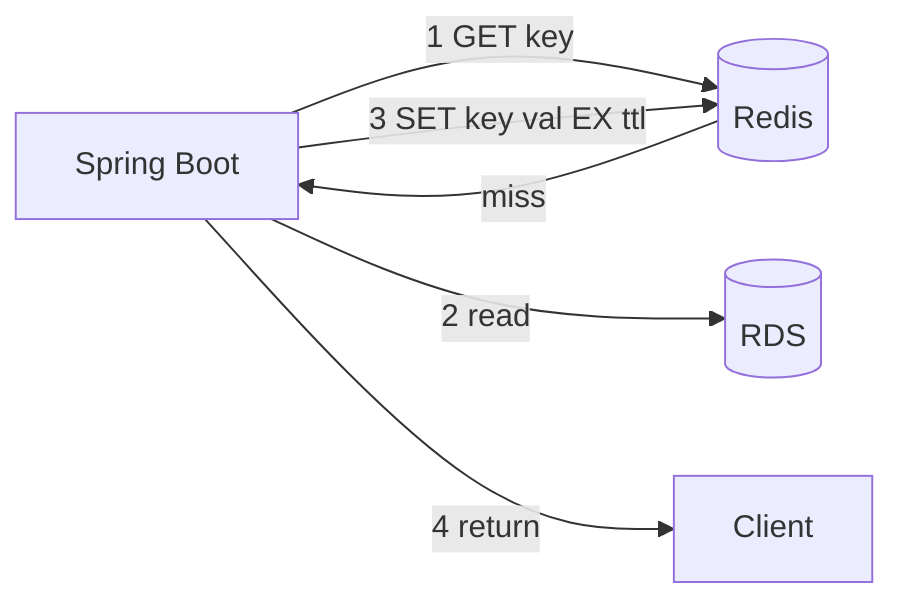

## 11.2 Caching Concepts

### Cache invalidation
Keeping cache consistent with the source of truth — famously hard. Strategies: TTL expiry, explicit delete on write, versioned keys. Prefer **delete-on-write** (invalidate) over update-in-cache to avoid races.

### TTL
Expiry time per key; bounds staleness and memory. Add **jitter** to TTLs so many keys don't expire simultaneously.

### Cache stampede (thundering herd)
Many requests miss simultaneously (e.g., a hot key expires) and all hit the DB at once. Mitigate with a **mutex/lock** so one request repopulates while others wait, **early/probabilistic re-computation**, or staggered TTLs.

### Cache penetration
Requests for keys that **don't exist** always miss and hammer the DB (often malicious). Mitigate by **caching negative results** (short TTL) or a **Bloom filter** of valid keys.

### Cache eviction
When memory is full, Redis evicts per `maxmemory-policy` (`allkeys-lru`, `volatile-lru`, `allkeys-lfu`, etc.). Choose LRU/LFU for caches; `noeviction` (errors on write) only for durable use cases.

### Hot keys
A single key with extreme traffic can bottleneck one shard. Mitigate with client-side/local caching of that key, key replication/splitting, or read replicas.

### Distributed locking
Redis as a lock (`SET key val NX PX ttl`); use **Redlock**/fencing tokens carefully. Good for "only one worker does X," but understand its limits (clock skew, GC pauses) — don't use it to guard money without a DB-level safeguard.

## 11.3 AWS

### ElastiCache Redis vs Memcached
| | Redis / Valkey | Memcached |
|---|---|---|
| Data types | Rich (hash, zset, streams...) | Strings only |
| Persistence | Optional (snapshots/AOF) | None |
| Replication/HA | Yes (replicas, Multi-AZ failover) | No (sharded only) |
| Pub/Sub, Lua, transactions | Yes | No |
| Multithreaded | Mostly single-thread per shard | Yes (multi-core) |
| Use | Default for almost everything | Pure, simple, multi-threaded object cache |

> **Best Practice:** Default to **Redis/Valkey** — Memcached only wins for a dead-simple, large, multi-threaded cache with no HA/persistence needs.

### Cluster mode
- **Cluster mode disabled:** one shard (primary + replicas); scale reads via replicas, writes vertically. Simpler.
- **Cluster mode enabled:** data sharded across multiple node groups via hash slots; scales writes + memory horizontally. Client must be cluster-aware; multi-key ops limited to same slot (`{hashtag}`).

### Replication / Failover / Multi-AZ
Replicas provide read scaling + HA; with **Multi-AZ**, ElastiCache auto-promotes a replica on primary failure. Always enable Multi-AZ in production.

## 11.4 Spring Boot + Redis

Dependency + config (Lettuce client, TLS to ElastiCache):
```xml
<dependency>
  <groupId>org.springframework.boot</groupId>
  <artifactId>spring-boot-starter-data-redis</artifactId>
</dependency>
```
```yaml
spring:
  data:
    redis:
      host: orders-cache.xxxx.ng.0001.use1.cache.amazonaws.com
      port: 6379
      ssl:
        enabled: true          # in-transit encryption on ElastiCache
      timeout: 2s
      lettuce:
        pool:
          max-active: 16
          max-idle: 8
```

### Declarative caching (`@Cacheable`) — cache-aside made easy
```java
@Configuration
@EnableCaching
public class CacheConfig {
    @Bean
    public RedisCacheManager cacheManager(RedisConnectionFactory cf) {
        RedisCacheConfiguration cfg = RedisCacheConfiguration.defaultCacheConfig()
                .entryTtl(Duration.ofMinutes(10))               // bounded staleness
                .disableCachingNullValues()                     // or enable to stop penetration
                .serializeValuesWith(SerializationPair.fromSerializer(
                        new GenericJackson2JsonRedisSerializer()));
        return RedisCacheManager.builder(cf).cacheDefaults(cfg).build();
    }
}

@Service
public class ProductService {
    @Cacheable(cacheNames = "product", key = "#id")
    public Product get(String id) { return repo.findById(id).orElseThrow(); } // runs only on miss

    @CacheEvict(cacheNames = "product", key = "#p.id")
    public Product update(Product p) { return repo.save(p); }                 // invalidate on write
}
```

### Programmatic use (counters, locks, rate limiting)
```java
@Service
public class RateLimiter {
    private final StringRedisTemplate redis;
    public RateLimiter(StringRedisTemplate redis) { this.redis = redis; }

    // Fixed-window: max N requests per user per minute
    public boolean allow(String userId, int limit) {
        String key = "rl:" + userId + ":" + (System.currentTimeMillis() / 60000);
        Long count = redis.opsForValue().increment(key);
        if (count != null && count == 1L) redis.expire(key, Duration.ofMinutes(1));
        return count != null && count <= limit;
    }

    // Simple distributed lock
    public boolean tryLock(String resource, String token, Duration ttl) {
        return Boolean.TRUE.equals(redis.opsForValue()
                .setIfAbsent("lock:" + resource, token, ttl));  // SET NX PX
    }
}
```

### Session store (stateless app servers)
```xml
<dependency>
  <groupId>org.springframework.session</groupId>
  <artifactId>spring-session-data-redis</artifactId>
</dependency>
```
Externalizing HTTP sessions to Redis makes app servers **stateless** → no sticky sessions needed → clean horizontal scaling.

> **Warning:** A cache is an **optimization, not a source of truth**. Design so the app still works (slower) if Redis is down — fall back to the DB, use short timeouts and circuit breakers, and never store the only copy of critical data in a non-persistent cache. (See scenario §56.12.)

---

### Key Takeaways — ElastiCache
- Redis gives **sub-ms** reads and doubles as session store, rate limiter, lock, leaderboard, and pub/sub.
- **Cache-aside** is the default pattern; prefer **invalidate-on-write** + **TTL with jitter**.
- Defend against **stampede** (locking/early recompute), **penetration** (negative caching/Bloom), and **hot keys** (local cache/sharding).
- Use **Redis over Memcached** unless you specifically need a plain multithreaded object cache; enable **Multi-AZ**; use cluster mode to scale writes/memory.
- The cache must be **optional** — the system should degrade gracefully to the DB if it fails.

### Common Mistakes
- Treating the cache as the source of truth (data loss on eviction/failure).
- No TTL (unbounded memory, permanent staleness) or synchronized TTLs (mass expiry → stampede).
- No fallback when Redis is down → total outage.
- Using a Redis lock to guard money without a DB-level invariant.
- Caching huge objects or using `KEYS *` in production (blocks the single thread).
- Not enabling in-transit/at-rest encryption.

### SDE2 Interview Questions
1. **Cache-aside vs write-through vs write-behind?** Lazy populate on miss vs sync write to cache+DB vs async flush; trade freshness/latency/durability.
2. **How do you prevent a cache stampede?** Per-key mutex so one request repopulates, probabilistic early expiry, and TTL jitter.
3. **Redis vs Memcached on AWS?** Redis for rich types/HA/persistence/pub-sub; Memcached only for simple multithreaded object caching.
4. **How do you keep cache and DB consistent?** Invalidate (delete) on write + TTL; accept bounded eventual consistency; avoid update-in-place races.
5. **What happens to your service if Redis dies — and how do you design for it?** Should degrade to DB with timeouts/circuit breaker; cache is an optimization, not a dependency for correctness.
6. **How would you rate-limit an API with Redis?** Atomic `INCR` on a windowed key with expiry (fixed window) or sorted-set sliding window.

### Practical Exercise
Add Redis cache-aside to a Spring Boot product API with `@Cacheable`/`@CacheEvict`, TTL 10 min + jitter, and negative caching to stop penetration. Externalize HTTP sessions to Redis (drop sticky sessions). Implement a per-user rate limiter and a distributed lock. Then kill the Redis node and verify the app degrades to the DB (with a circuit breaker) instead of failing, and that Multi-AZ failover promotes a replica.

---

# 12. SQS

**SQS (Simple Queue Service)** is a fully managed message queue that **decouples** producers from consumers. The problem it solves: when service A calls service B synchronously, A's latency and availability depend on B. With a queue, A drops a message and moves on; B processes at its own pace. This absorbs spikes (buffering), smooths load, enables async workflows, and lets you scale producers and consumers independently. It's the default async primitive for Java backends on AWS.

## 12.1 SQS Concepts

### Queue
A durable buffer that stores messages until a consumer processes and deletes them. Messages are redundantly stored across AZs.

### Producer
Any component that sends messages (`SendMessage`). Fire-and-forget — doesn't wait for a consumer.

### Consumer
A component that **polls** (`ReceiveMessage`), processes, then **deletes** (`DeleteMessage`). SQS is pull-based (unlike SNS push).

### Message
Up to **256 KB** of text (JSON/XML). For larger payloads use the **Extended Client** (store body in S3, pass a pointer).

### Visibility Timeout
When a consumer receives a message, it becomes **invisible** to others for this period. If the consumer deletes it in time → gone. If not (crash/slow) → it reappears for redelivery. Set it to ~your processing time + buffer.

### Long Polling
`ReceiveMessage` with `WaitTimeSeconds` (up to 20s) waits for messages instead of returning empty immediately — fewer empty responses, lower cost, lower latency. Always use it (vs short polling).

### Dead Letter Queue (DLQ)
A separate queue where messages land after exceeding `maxReceiveCount` redeliveries — isolates **poison messages** (ones that always fail) so they don't block the queue or loop forever. Alarm on DLQ depth.

### Message Retention
How long undeleted messages persist (1 min–14 days, default 4 days). After that they're dropped.

## 12.2 Queue Types

| | Standard | FIFO |
|---|---|---|
| Throughput | Nearly unlimited | 300 msg/s (3,000 with batching) per group; high-throughput mode higher |
| Ordering | Best-effort | Strict per **message group** |
| Delivery | **At-least-once** (possible duplicates) | **Exactly-once** processing (dedup window 5 min) |
| Use | Max throughput, order not critical | Order + no duplicates (payments, sequential events) |

### Standard Queue
Massive throughput, best-effort ordering, **at-least-once** (duplicates possible). Default for most work.

### FIFO Queue
Strict ordering within a **MessageGroupId** and dedup via **MessageDeduplicationId** (or content-based). Lower throughput; use when order/uniqueness matter.

## 12.3 Reliability

### At-least-once delivery & Duplicate messages
Standard SQS can deliver a message more than once (and FIFO can reprocess if you don't delete in time). **You must assume duplicates.**

### Idempotency
Processing the same message twice must produce the same result. Achieve via a dedup table (store processed messageId), conditional DB writes, or natural idempotency (upserts). The single most important consumer property.

### Retry & DLQ
Failed processing → message reappears after visibility timeout → retried up to `maxReceiveCount` → then DLQ. Combine with exponential backoff for downstream protection.

## 12.4 Production Concepts

### Visibility timeout tuning
Too short → message redelivered while still being processed (duplicate work). Too long → slow retries after a crash. Set ≈ p99 processing time × safety factor; extend dynamically (`ChangeMessageVisibility`) for long jobs.

### Poison messages
Messages that always fail (bad data, bug). `maxReceiveCount` + DLQ quarantine them; monitor and replay after fixing.

### Consumer scaling & Backpressure
Scale consumers on **queue depth** (`ApproximateNumberOfMessagesVisible`) or message age. The queue itself is backpressure: if consumers lag, messages buffer (bounded by retention) rather than overwhelming downstreams.

### Batch processing
`SendMessageBatch`/`ReceiveMessage` (up to 10)/`DeleteMessageBatch` cut cost and increase throughput. Handle partial batch failures (`ReportBatchItemFailures`) so only failed messages are retried.

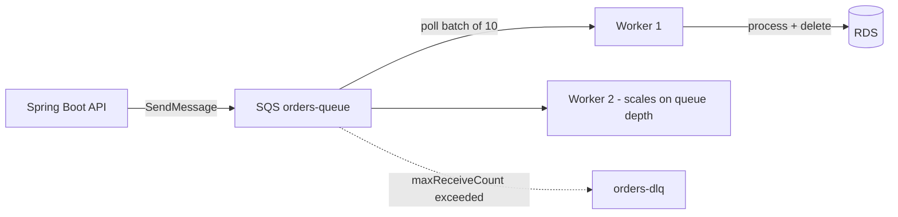

## 12.5 Java / Spring Boot Example (Spring Cloud AWS)

```xml
<dependency>
  <groupId>io.awspring.cloud</groupId>
  <artifactId>spring-cloud-aws-starter-sqs</artifactId>
</dependency>
```

### Producer
```java
@Service
public class OrderEventPublisher {
    private final SqsTemplate sqs;
    public OrderEventPublisher(SqsTemplate sqs) { this.sqs = sqs; }

    public void publish(OrderCreated event) {
        sqs.send(to -> to.queue("orders-queue")
                .payload(event)
                // for FIFO: group by customer to keep per-customer order, dedup by orderId
                .messageGroupId(event.customerId())
                .messageDeduplicationId(event.orderId()));
    }
}
```

### Consumer (idempotent)
```java
@Component
public class OrderConsumer {
    private final ProcessedRepo processed;   // dedup store (DynamoDB/RDS)
    private final OrderService orders;

    @SqsListener(value = "orders-queue", maxConcurrentMessages = "10")
    public void onMessage(OrderCreated event,
                          @Header("MessageId") String messageId) {
        // Idempotency guard: skip if we've already handled this messageId
        if (!processed.markIfNew(messageId)) return;
        orders.fulfill(event);     // if this throws, message is NOT deleted -> retried -> DLQ
    }
}
```
`markIfNew` uses a conditional write (`attribute_not_exists`) so concurrent/duplicate deliveries process once.

> **Best Practice:** Let the listener **throw on failure** (don't swallow exceptions) so SQS redelivers and eventually DLQs; make the handler idempotent; set visibility timeout > processing time; alarm on **DLQ depth** and **oldest-message age**.

---

### Key Takeaways — SQS
- SQS **decouples** producers/consumers, absorbs spikes (buffering), and lets you scale and fail independently.
- **Standard** = huge throughput, at-least-once (**expect duplicates**), best-effort order; **FIFO** = strict order + dedup, lower throughput.
- **Idempotent consumers** are mandatory; use a dedup store or conditional writes.
- Tune **visibility timeout** to processing time; use **long polling**, **batching**, and a **DLQ** for poison messages.
- Scale consumers on **queue depth/age**; the queue provides natural backpressure.

### Common Mistakes
- Assuming exactly-once on Standard queues → duplicate side effects (double charges).
- Non-idempotent consumers.
- Visibility timeout shorter than processing time → duplicate processing.
- Swallowing exceptions so failures never retry/DLQ.
- No DLQ → poison messages loop forever and block throughput.
- Short polling (empty receives, wasted cost/latency).

### SDE2 Interview Questions
1. **Standard vs FIFO?** Throughput + at-least-once/best-effort order vs strict order + exactly-once-processing with lower throughput.
2. **How do you handle duplicate messages?** Idempotent processing via dedup table/conditional writes; never rely on at-most-once from Standard SQS.
3. **What is visibility timeout and how do you set it?** The invisibility window after receive; set ≈ p99 processing time + buffer; extend for long jobs.
4. **What's a DLQ and when does a message go there?** A quarantine queue after `maxReceiveCount` failed deliveries; isolates poison messages; alarm on its depth.
5. **How do you scale consumers?** On queue depth / oldest-message-age metrics (ASG/ECS target tracking or Lambda event source); queue buffers excess as backpressure.
6. **SQS vs Kafka?** SQS: simple managed queue, per-message delete, no replay, no ordering (Standard); Kafka: ordered partitioned log, replay via offsets, high throughput, consumer groups (see §15).

### Practical Exercise
Build an order pipeline: a Spring Boot API publishes `OrderCreated` to SQS; a worker `@SqsListener` fulfills orders **idempotently** (dedup by messageId in DynamoDB). Configure a DLQ with `maxReceiveCount=5`, inject a poison message, and confirm it lands in the DLQ after retries. Scale workers on queue depth, enable batch delete + partial-batch-failure, and alarm on oldest-message age.

---

# 13. SNS

**SNS (Simple Notification Service)** is managed **pub/sub**: a publisher sends a message to a **topic**, and SNS **pushes** it to all subscribers. Where SQS is one-producer-to-one-consumer buffering (pull), SNS is one-message-to-many-subscribers broadcasting (push). It solves the **fan-out** problem: one event (e.g., "OrderCreated") needs to trigger several independent actions (email, analytics, inventory) without the publisher knowing or coupling to any of them.

## 13.1 SNS Concepts

### Topic
The named channel publishers send to and subscribers attach to. Two types: **Standard** (high throughput, at-least-once, best-effort order) and **FIFO** (ordered, dedup, delivers only to SQS FIFO).

### Publisher
Any component that `Publish`es a message to a topic. It knows nothing about who/how many subscribers exist (loose coupling).

### Subscriber
An endpoint that receives messages: SQS, Lambda, HTTP/S, Email, SMS, Kinesis Data Firehose, or mobile push.

### Subscription
The binding of a subscriber endpoint to a topic, optionally with a **filter policy** so it receives only matching messages.

### Fan-out
One publish → delivered to many subscribers in parallel. The canonical SNS pattern.

## 13.2 Subscribers

| Subscriber | Use |
|---|---|
| **SQS** | Durable, buffered processing per consumer (the key production pattern) |
| **Lambda** | Serverless reaction to events |
| **HTTP/S** | Webhook to an external/internal endpoint |
| **Email / SMS** | Human notifications/alerts |
| **Kinesis Firehose** | Archive events to S3/Redshift |

## 13.3 Concepts

### Pub/Sub
Publishers and subscribers are decoupled through the topic; add/remove subscribers without touching the publisher.

### Fan-out architecture (SNS + SQS)
The production best practice: SNS topic → **multiple SQS queues**, one per consuming service. Each service gets its **own durable buffer**, processes at its own pace, retries, and has its own DLQ. The publish is broadcast; the durability/retry is per-consumer.

### Message filtering
A **filter policy** (JSON on the subscription) lets a subscriber receive only messages whose attributes match — e.g., only `eventType = PAYMENT_FAILED` or `region = EU`. Avoids subscribers receiving-and-discarding irrelevant messages.
```json
{ "eventType": ["ORDER_CREATED"], "amount": [{ "numeric": [">=", 1000] }] }
```

### Dead-letter handling
Attach a **redrive policy** (DLQ) to the **subscription** so messages SNS can't deliver (e.g., to a failing Lambda/HTTP endpoint) are captured instead of lost.

## 13.4 SNS vs SQS (and when to combine)

| | SNS | SQS |
|---|---|---|
| Model | Pub/sub (push, 1→many) | Queue (pull, buffer, 1 consumer group) |
| Delivery | Pushes immediately | Consumer polls when ready |
| Persistence | Not stored (deliver-or-DLQ) | Stored until processed/retention |
| Fan-out | Native | Needs multiple queues |
| Together | **SNS → multiple SQS** = durable fan-out | — |

## 13.5 SNS → SQS → Spring Boot (fan-out)

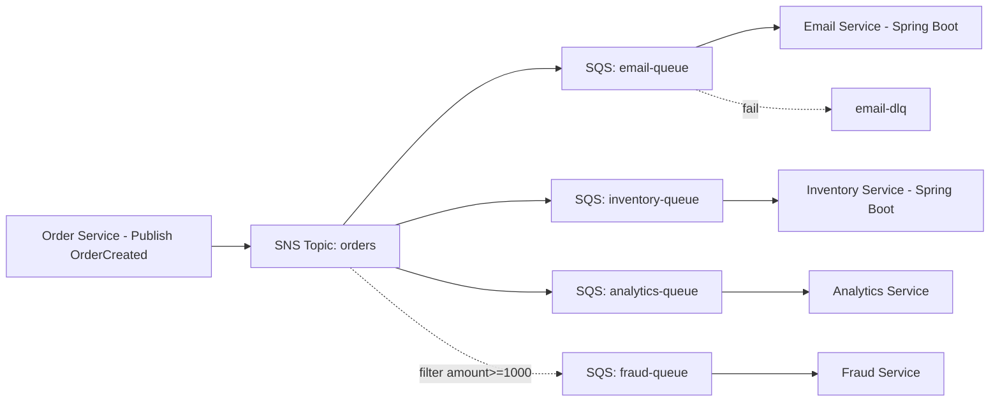

Publisher:
```java
@Service
public class OrderNotifier {
    private final SnsTemplate sns;   // Spring Cloud AWS
    public OrderNotifier(SnsTemplate sns) { this.sns = sns; }

    public void publishOrderCreated(OrderCreated e) {
        sns.sendNotification("orders-topic", e, "ORDER_CREATED",
            Map.of("eventType", "ORDER_CREATED",
                   "amount", String.valueOf(e.amount())));  // attributes drive filtering
    }
}
```
Each service subscribes its **own queue** to the topic and consumes with `@SqsListener` (idempotent — see §12). The inventory service never knows the email service exists.

> **Best Practice:** For anything beyond trivial notifications, use **SNS → SQS fan-out**, not SNS → Lambda/HTTP directly. The SQS buffer gives each consumer durability, independent retry, backpressure, and a DLQ. Raw SNS → Lambda has limited retry and no buffering.

> **Interview Tip:** SNS vs EventBridge: both do pub/sub. **SNS** = simple, ultra-high-throughput fan-out to a few endpoint types (SQS/Lambda/HTTP). **EventBridge** = richer routing (content-based rules, many AWS targets, schema registry, archive/replay, SaaS integrations) at lower throughput. Use SNS for high-volume fan-out; EventBridge for complex event routing (see §14).

---

### Key Takeaways — SNS
- SNS = managed **pub/sub push**; solves **fan-out** (one event → many independent reactions) with full publisher/subscriber decoupling.
- The production pattern is **SNS → multiple SQS queues**: broadcast + per-consumer durability, retry, backpressure, and DLQ.
- **Filter policies** route only relevant messages to each subscriber; attach a **DLQ** to subscriptions.
- Choose **SNS** for simple high-throughput fan-out, **EventBridge** for complex routing/replay, **SQS alone** for point-to-point buffering.

### Common Mistakes
- SNS → Lambda/HTTP directly for critical work (weak retry, no buffering) instead of SNS → SQS.
- Forgetting subscription DLQs → silently dropped undeliverable messages.
- No filter policy → every subscriber receives everything and discards most.
- Expecting SNS to store messages (it doesn't; undelivered → DLQ or lost).

### SDE2 Interview Questions
1. **SNS vs SQS?** Pub/sub push 1→many vs pull queue buffer; combine SNS→SQS for durable fan-out.
2. **How do you fan out one event to five services durably?** SNS topic with five SQS subscriptions, each service owning a queue + DLQ.
3. **What does a filter policy do?** Server-side attribute matching so a subscriber only receives relevant messages — saves cost and processing.
4. **SNS vs EventBridge?** SNS = simple high-throughput fan-out; EventBridge = content-based routing, many targets, schema registry, archive/replay.
5. **Why SNS→SQS instead of SNS→Lambda directly?** SQS adds durability, independent retry/backpressure, and a DLQ per consumer.

### Practical Exercise
Create an `orders` SNS topic and subscribe three SQS queues (email, inventory, analytics), each consumed by a separate Spring Boot `@SqsListener`. Publish `OrderCreated` with attributes and add a filter policy so a fourth "fraud" queue only receives orders ≥ $1000. Attach DLQs, then make one consumer fail and confirm the others still process and the failing one DLQs independently.

---

# 14. EventBridge

**Amazon EventBridge** is a serverless **event bus** for routing events between AWS services, your applications, and SaaS providers using content-based rules. Where SNS fans out a message to all subscribers, EventBridge **routes** each event to the right targets based on its **content**, and adds schema discovery, archiving/replay, and native integration with ~200 AWS services. It's the backbone of event-driven architectures on AWS.

## 14.1 Concepts

### Event
A JSON record describing something that happened, with a standard envelope (`source`, `detail-type`, `detail`, `time`, `region`). Example business event:
```json
{
  "source": "orders.service",
  "detail-type": "OrderCreated",
  "detail": { "orderId": "A1", "customerId": "123", "amount": 1500, "currency": "USD" }
}
```

### Event Bus
The pipe events are sent to. Three kinds:
- **Default bus** — receives AWS service events automatically.
- **Custom bus** — for your application's events (recommended for your domain).
- **Partner bus** — for SaaS sources (Datadog, Zendesk, Stripe, etc.).

### Rule
Matches events (by **event pattern**) on a bus and sends them to one or more **targets**. Can also transform the payload (input transformer) before delivery.

### Target
Where matched events go: Lambda, SQS, SNS, Step Functions, ECS task, Kinesis, API destinations (external HTTP), another event bus, and many more (up to 5 per rule).

### Event Pattern
JSON describing which events a rule matches — **content-based filtering**:
```json
{
  "source": ["orders.service"],
  "detail-type": ["OrderCreated"],
  "detail": { "amount": [{ "numeric": [">=", 1000] }], "currency": ["USD"] }
}
```

## 14.2 Integrations

Common targets and uses:
| Target | Use |
|---|---|
| **Lambda** | Run code on an event |
| **SQS** | Durable buffered processing (recommended for your services) |
| **SNS** | Further fan-out / notifications |
| **Step Functions** | Kick off an orchestration workflow |
| **ECS** | Run a task/job per event |
| **API destinations** | Call an external HTTP API (with managed auth + throttling) |

## 14.3 Architecture

### Event-driven architecture
Services emit events about facts ("OrderCreated"); other services react. No service calls another directly — they publish/subscribe through the bus. This yields **loose coupling** and independent evolution/deployment.

### Loose coupling
Producers don't know consumers. Add a new consumer (e.g., a loyalty service) by adding a rule — zero changes to the producer.

### Event routing & filtering
One bus receives many event types; rules route each to the right targets by content. A single `OrderCreated` can go to fulfillment (always), fraud check (amount ≥ 1000), and EU-compliance (region = EU) via three independent rules.

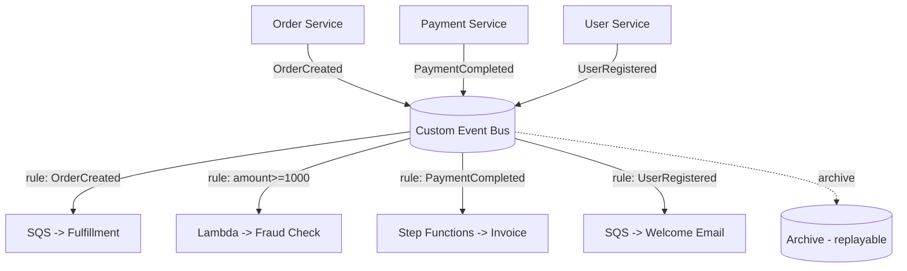

### Realistic business events
- `OrderCreated` → fulfillment queue + fraud check (if large) + analytics.
- `PaymentCompleted` → generate invoice (Step Functions), update order, notify customer.
- `UserRegistered` → send welcome email, provision defaults, add to CRM (API destination).
- `InvoiceGenerated` → email PDF, update accounting, archive to S3.

## 14.4 Extra capabilities
- **Schema Registry:** auto-discovers event schemas and generates code bindings (Java POJOs) for type-safe consumers.
- **Archive & Replay:** store events and replay them (reprocess after a bug fix, or hydrate a new consumer) — SNS/SQS can't do this.
- **Scheduler:** cron/rate schedules to trigger targets (a managed, scalable replacement for cron).

## 14.5 Publishing from Spring Boot
```java
@Service
public class EventPublisher {
    private final EventBridgeClient eb;
    public EventPublisher(EventBridgeClient eb) { this.eb = eb; }

    public void publish(OrderCreated e) {
        eb.putEvents(PutEventsRequest.builder().entries(
            PutEventsRequestEntry.builder()
                .eventBusName("app-bus")
                .source("orders.service")
                .detailType("OrderCreated")
                .detail(toJson(e))
                .build()).build());
    }
}
```

> **Interview Tip:** EventBridge vs SNS vs SQS. **SQS** = buffer between two parties. **SNS** = fast fan-out to all subscribers. **EventBridge** = smart router (content rules, many AWS targets, schema registry, archive/replay, SaaS) but lower throughput and slightly higher latency than SNS. Rule of thumb: SNS for high-volume simple fan-out; EventBridge for heterogeneous, rule-based, evolvable event routing across your architecture.

> **Best Practice:** Route EventBridge → **SQS → your service** (not directly to a long-running consumer) so you keep buffering, retry, and a DLQ. Attach a **DLQ to the rule target** for failed deliveries. Version your events (`detail-type` or a `version` field) and keep them additive to avoid breaking consumers.

---

### Key Takeaways — EventBridge
- Serverless **event bus** that **routes events by content** to many AWS/SaaS targets — the hub of event-driven architecture.
- **Rules + event patterns** give content-based filtering; add consumers by adding rules (loose coupling, no producer changes).
- Unique strengths vs SNS/SQS: **schema registry**, **archive & replay**, native **~200-service** integrations, and the **Scheduler**.
- Lower throughput/higher latency than SNS — use SNS for huge simple fan-out, EventBridge for rich routing.
- Target **SQS** behind the rule for durability/retry/DLQ; version events additively.

### Common Mistakes
- Using EventBridge for ultra-high-throughput fan-out where SNS is cheaper/faster.
- Routing directly to a slow consumer without an SQS buffer or target DLQ.
- Breaking consumers with non-additive event schema changes.
- Overloading the default bus with app events instead of a custom bus.
- No archive → can't replay after a consumer bug.

### SDE2 Interview Questions
1. **EventBridge vs SNS?** Content-based routing + many targets + schema/replay vs simple high-throughput fan-out; pick by routing complexity vs throughput.
2. **How do you add a new consumer to an event without touching producers?** Add a rule on the bus matching the event → new target; producers are unaware.
3. **How does content-based routing work?** Event patterns match on `source`/`detail-type`/`detail` fields; only matching events reach the target.
4. **How do you reprocess events after fixing a bug?** EventBridge archive + replay into the bus/rule.
5. **Communication vs orchestration — where does EventBridge sit?** Communication/routing (choreography); use Step Functions for orchestration (see §44).

### Practical Exercise
Create a custom bus `app-bus`. From Spring Boot, publish `OrderCreated`, `PaymentCompleted`, `UserRegistered`. Add rules: `OrderCreated` → fulfillment SQS; `OrderCreated` with `amount ≥ 1000` → fraud Lambda; `PaymentCompleted` → Step Functions invoice workflow; `UserRegistered` → welcome-email SQS. Enable archive, attach target DLQs, then introduce a consumer bug, fix it, and **replay** the archived events.

---

# 15. Kafka / Amazon MSK

**Apache Kafka** is a distributed, durable, **append-only commit log** for high-throughput event streaming. Unlike a queue (SQS) where a message is deleted after processing, Kafka **retains** events and lets many independent consumers read at their own offset and **replay** history. **Amazon MSK (Managed Streaming for Apache Kafka)** runs Kafka for you (brokers, patching, ZooKeeper/KRaft, scaling). Use Kafka when you need high-throughput ordered streams, replayable event logs, stream processing, or event sourcing — not just simple task queuing.

## 15.1 MSK

### Amazon MSK
Managed Kafka: provisions and operates broker clusters across AZs, handles patching/monitoring, integrates with VPC/IAM/CloudWatch. **MSK Serverless** removes capacity planning (auto-scales). You still own topic design, partitioning, and consumer logic.

### Brokers
The servers forming the cluster; they store partitions and serve reads/writes. Spread across AZs for HA. More brokers = more capacity.

### Topics
Named streams of events (e.g., `orders`, `payments`). Split into partitions.

### Partitions
The unit of parallelism and ordering. A topic is split into N partitions; each is an ordered, immutable log. Order is guaranteed **within** a partition, not across the topic.

### Replication
Each partition has `replication.factor` copies across brokers/AZs. One **leader** handles I/O; **followers** replicate. `min.insync.replicas` controls durability.

### Consumer Groups
A set of consumers sharing a `group.id`; Kafka assigns partitions across them so each partition is read by exactly one consumer in the group → horizontal scaling with preserved per-partition order. Different groups read the **same** data independently (that's the fan-out/replay power).

## 15.2 Kafka Concepts

### Producer / Consumer
Producers append records (optionally keyed); consumers poll and track their **offset**. Consumers control their own progress (can rewind/replay).

### Offset
A monotonically increasing position of a record within a partition. Committed offsets record how far a consumer group has read — the basis of at-least-once/exactly-once and replay.

### Partition / Leader / Follower
A record's **key** hashes to a partition (same key → same partition → ordered). The leader replica serves traffic; followers stay in sync.

### Replication Factor / ISR
`replication.factor` = number of copies. **ISR (In-Sync Replicas)** = replicas caught up to the leader. A write "acked" by `acks=all` is committed once all ISRs have it, so it survives broker loss. If ISR drops below `min.insync.replicas`, producers with `acks=all` fail (choosing consistency over availability).

## 15.3 Production

### Ordering
Only guaranteed **per partition**. To keep related events ordered (e.g., per order), use a stable **key** (`orderId`) so they land on the same partition. Cross-partition ordering is not guaranteed.

### Delivery semantics
- **At-least-once** (default): commit offset after processing → possible reprocessing (duplicates). Pair with idempotent consumers.
- **Exactly-once semantics (EOS):** transactions + idempotent producer (`enable.idempotence=true`, `transactional.id`) → no duplicates/loss within Kafka. Higher cost/complexity.
- **At-most-once:** commit before processing → possible loss (rarely wanted).

### Idempotency
Even with EOS inside Kafka, side effects to external systems (DB, payment) need idempotency. Use keys/dedup tables.

### Consumer lag
`log-end-offset − committed-offset` per partition = how far behind consumers are. Rising lag = consumers can't keep up. The primary health metric for streaming. Scale consumers (up to #partitions), optimize processing, or add partitions.

### Partition strategy
Choose partition count for target throughput and max consumer parallelism (max consumers per group = #partitions). You can increase partitions later but it reshuffles key→partition mapping (breaks ordering for existing keys) — plan ahead.

### Rebalancing
When consumers join/leave, Kafka reassigns partitions (a "rebalance"), briefly pausing consumption. Frequent rebalances (from slow processing exceeding `max.poll.interval.ms`) hurt throughput — tune poll size/interval; use cooperative/static membership to reduce impact.

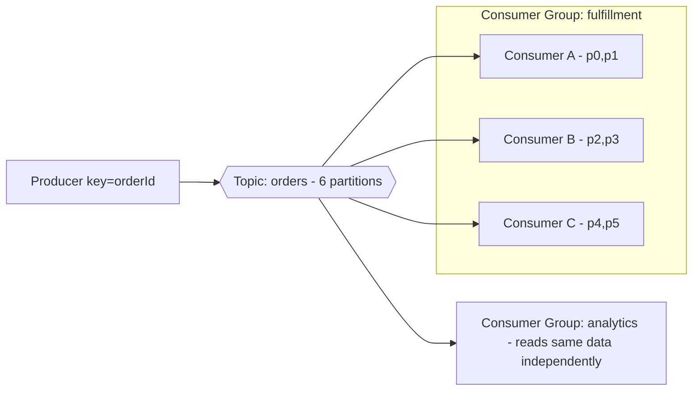

## 15.4 Spring Kafka Example
```xml
<dependency>
  <groupId>org.springframework.kafka</groupId>
  <artifactId>spring-kafka</artifactId>
</dependency>
```
```yaml
spring:
  kafka:
    bootstrap-servers: b-1.msk.xxxx:9098,b-2.msk.xxxx:9098
    properties:
      security.protocol: SASL_SSL          # MSK IAM auth
      sasl.mechanism: AWS_MSK_IAM
    producer:
      acks: all                            # durability: wait for all ISR
      properties:
        enable.idempotence: true           # no duplicate records on retry
    consumer:
      group-id: fulfillment
      enable-auto-commit: false            # commit after processing (at-least-once)
      auto-offset-reset: earliest
      max-poll-records: 100
```
Producer (keyed for ordering):
```java
@Service
public class OrderProducer {
    private final KafkaTemplate<String, OrderCreated> kafka;
    public OrderProducer(KafkaTemplate<String, OrderCreated> kafka) { this.kafka = kafka; }

    public void publish(OrderCreated e) {
        kafka.send("orders", e.orderId(), e);   // key=orderId => same partition => ordered
    }
}
```
Consumer (manual ack, idempotent):
```java
@Component
public class OrderStreamConsumer {
    private final ProcessedRepo processed;
    private final OrderService service;

    @KafkaListener(topics = "orders", groupId = "fulfillment",
                   concurrency = "3")               // up to #partitions
    public void consume(ConsumerRecord<String, OrderCreated> rec, Acknowledgment ack) {
        String id = rec.value().orderId();
        if (processed.markIfNew(id)) {              // idempotency for external side effects
            service.fulfill(rec.value());
        }
        ack.acknowledge();                          // commit offset only after success
    }
}
```

## 15.5 Kafka vs SQS vs SNS vs EventBridge

| | **Kafka / MSK** | **SQS** | **SNS** | **EventBridge** |
|---|---|---|---|---|
| Model | Durable partitioned log (stream) | Queue (buffer) | Pub/sub push | Event bus (router) |
| Retention/Replay | Yes (time/size-based, replay by offset) | Until deleted (max 14d), no replay | Not stored | Archive + replay |
| Ordering | Per partition | FIFO only | FIFO only | No |
| Throughput | Very high (millions/s) | Very high | Very high | Moderate |
| Multiple independent consumers | Yes (consumer groups) | One logical consumer per queue | Fan-out to subscribers | Fan-out via rules |
| Routing/filtering | Consumer-side / topics | None | Attribute filter | Rich content rules |
| Ops/complexity | Highest (even managed) | Lowest | Low | Low |
| Best for | High-volume streams, event sourcing, stream processing, replay | Decoupled task processing | Simple fan-out | Heterogeneous event routing |

> **Interview Tip:** The deciding questions: Do you need **replay / multiple independent readers / stream processing / strict high-throughput ordering**? → **Kafka**. Just need to **decouple and buffer tasks**? → **SQS**. **Broadcast to a few endpoints**? → **SNS**. **Route by content to many AWS services with schema/replay**? → **EventBridge**. Don't run Kafka for a workload SQS handles — Kafka's operational and cognitive cost is real.

---

### Key Takeaways — Kafka / MSK
- Kafka is a **durable, replayable, partitioned log**; consumers track **offsets** and multiple **consumer groups** read the same data independently.
- **Ordering is per-partition** — key by your ordering entity (`orderId`); partition count caps consumer parallelism.
- Durability via `acks=all` + `min.insync.replicas`; `enable.idempotence` for no in-Kafka duplicates; external side effects still need idempotency.
- **Consumer lag** is the key health metric; manage **rebalances** by tuning poll settings.
- MSK/MSK-Serverless removes broker ops; still your job to design topics/partitions/consumers.
- Choose Kafka only when you need streaming/replay/high-throughput ordering — otherwise SQS/SNS/EventBridge are simpler.

### Common Mistakes
- Expecting total ordering across a topic (it's per-partition only).
- Too few partitions → can't scale consumers; or increasing partitions later and breaking key ordering.
- Auto-commit before processing → data loss on crash.
- Slow processing exceeding `max.poll.interval.ms` → constant rebalances.
- Ignoring consumer lag until the backlog is huge.
- Running self-managed/MSK for a simple queue workload (over-engineering).

### SDE2 Interview Questions
1. **Kafka vs SQS?** Durable replayable ordered log with multiple consumer groups vs simple delete-after-process queue; Kafka for streaming/replay, SQS for task decoupling.
2. **How does Kafka guarantee ordering?** Only within a partition; key records so related events share a partition.
3. **How do consumer groups scale consumption?** Partitions are divided among group members (one partition → one consumer in the group); max parallelism = #partitions.
4. **What is consumer lag and how do you fix rising lag?** End offset minus committed offset; scale consumers (≤ partitions), optimize processing, add partitions.
5. **How do you get exactly-once?** Idempotent producer + transactions in Kafka, plus idempotent external side effects (dedup keys).
6. **What is ISR and acks=all?** In-sync replicas; `acks=all` commits only when all ISRs have the record → survives broker loss (consistency over availability).

### Practical Exercise
Create an MSK (or MSK Serverless) cluster with an `orders` topic (6 partitions, RF=3). Produce keyed events from Spring Kafka (`acks=all`, idempotent), consume with a 3-concurrency `fulfillment` group (manual commit, idempotent handler) and a separate `analytics` group reading the same data. Monitor consumer lag, kill a broker to observe leader re-election, then **replay** from offset 0 in a new group to reprocess history.

---

# 16. Lambda

**AWS Lambda** runs your code without you managing servers — you upload a function, AWS executes it on demand, scales it automatically, and you pay only for compute time used (per ms). It solves the problem of running event-driven or spiky workloads without provisioning/paying for idle servers. For a Java backend engineer, Lambda is ideal for glue, event processing, and scheduled jobs — but Java's JVM start-up makes **cold starts** a real consideration.

## 16.1 Basics

### Function
The deployable unit: your code + runtime + config (memory, timeout, role, env vars). Stateless; each invocation is independent.

### Handler
The entry-point method AWS calls per event, receiving an input object and a `Context`.

### Runtime
The language environment (Java 21/17, Node, Python, Go, or a custom/container runtime). Java runs on a managed JVM or a container image.

### Execution Role
The IAM role Lambda assumes to get temporary credentials — defines what the function can access (write logs, read DynamoDB, publish SNS). Least-privilege per function.

### Invocation
Triggering a function. Model matters (below).

## 16.2 Invocation Models

| Model | Examples | Retry on failure | Notes |
|---|---|---|---|
| **Synchronous** | API Gateway, ALB, direct `Invoke` | Caller handles | Caller waits for the response |
| **Asynchronous** | S3, SNS, EventBridge | Lambda retries 2× then DLQ/destination | Event queued internally; returns immediately |
| **Event source mapping (poll)** | SQS, Kinesis, DynamoDB Streams, MSK | Lambda polls + retries per source rules | Lambda service polls the source and batches |

> **Important:** Retry/failure behavior differs by model. For **async**, configure a **DLQ or on-failure destination** or failures vanish. For **SQS**, failures stay in the queue → redelivery → DLQ.

## 16.3 Integrations
API Gateway (HTTP backends), S3 (object events), SQS (queue consumer), SNS (fan-out target), EventBridge (rules/schedules), DynamoDB Streams (change processing). This makes Lambda the universal "run code when X happens" glue.

## 16.4 Scaling

### Concurrent executions
Lambda runs one event per **execution environment**; concurrency = simultaneous environments. It auto-scales by adding environments. Account default is 1,000 concurrent (soft limit) shared across all functions in the Region.

### Reserved concurrency
Caps **and guarantees** a function's max concurrency — protects downstream (e.g., a DB with limited connections) and prevents one function starving others.

### Provisioned concurrency
Pre-initializes N environments (kept warm) so there are **no cold starts** for that many concurrent requests — key for latency-sensitive Java functions. Costs money even when idle.

### Cold starts
When no warm environment exists, Lambda must create one: download code, start the runtime, init your handler. For the JVM this includes classloading + framework init — can be **hundreds of ms to several seconds**. Warm invocations reuse the environment (fast).

## 16.5 Advanced
- **Lambda Layers:** shared libraries/dependencies packaged separately and reused across functions.
- **Environment Variables:** config injected at runtime (encrypt sensitive ones with KMS; prefer Secrets Manager/Parameter Store for secrets).
- **Extensions:** sidecar processes for monitoring/secrets (e.g., observability agents, Parameter Store caching extension).
- **Versions & Aliases:** immutable published versions; aliases (`prod`, `canary`) point to a version and enable weighted traffic shifting (canary deploys).
- **Dead Letter Queue / Destinations:** where async failures (or successes) are routed (SQS/SNS DLQ; destinations can route success and failure to SQS/SNS/EventBridge/Lambda).

## 16.6 Java on Lambda

### JVM startup & Cold start
Plain Spring Boot on Lambda cold-starts slowly (full context init). Mitigations:
- Use a **lightweight** approach: AWS SDK v2 + a thin handler, or **Spring Cloud Function** / **Micronaut/Quarkus** (fast-boot, GraalVM native).
- **Provisioned concurrency** for predictable low latency.
- **SnapStart** (below).

### Memory configuration
Memory (128 MB–10 GB) **also scales CPU proportionally** — more memory = more CPU = faster execution, often *cheaper* overall for CPU-bound Java (finishes faster). Tune with the Lambda Power Tuning tool.

### SnapStart
For Java, Lambda takes a **snapshot of the initialized environment** (post-init) and restores from it on cold start, cutting cold starts dramatically (seconds → ~sub-second), at no extra cost. Requires handling uniqueness (e.g., regenerate random seeds/connections after restore via runtime hooks).

### Java Lambda example
```java
// Handler for an API Gateway proxy event (AWS SDK, lightweight)
public class GetOrderHandler
        implements RequestHandler<APIGatewayProxyRequestEvent, APIGatewayProxyResponseEvent> {

    // Init OUTSIDE the handler so it's reused across warm invocations (and SnapStart-friendly)
    private static final DynamoDbClient DDB = DynamoDbClient.create();

    @Override
    public APIGatewayProxyResponseEvent handleRequest(
            APIGatewayProxyRequestEvent req, Context ctx) {
        String orderId = req.getPathParameters().get("id");
        var item = DDB.getItem(b -> b.tableName("Orders")
                .key(Map.of("pk", AttributeValue.fromS("ORDER#" + orderId))));
        if (!item.hasItem()) {
            return new APIGatewayProxyResponseEvent().withStatusCode(404);
        }
        return new APIGatewayProxyResponseEvent()
                .withStatusCode(200)
                .withBody(toJson(item.item()));
    }
}
```
> **Best Practice:** Initialize clients/connections **statically (outside the handler)** so warm invocations reuse them; keep the deployment artifact small; set memory for the CPU you need; enable **SnapStart** (and/or provisioned concurrency) for latency-sensitive Java; make async handlers **idempotent** (retries) and always configure a DLQ/destination.

> **Warning:** Lambda is a poor fit for **long-running** (>15 min hard limit), steady high-throughput, or heavy-connection workloads (connection storms to RDS — use **RDS Proxy**). For always-on APIs with steady traffic, Fargate/ECS is often cheaper and avoids cold starts.

---

### Key Takeaways — Lambda
- Serverless, event-driven, auto-scaling, pay-per-ms compute; **execution role** = least-privilege identity.
- Know the three invocation models and their **retry/DLQ** behavior (sync vs async vs event-source).
- Scaling knobs: **reserved** (cap/guarantee, protect downstream) and **provisioned** (no cold starts) concurrency.
- Java cold starts are real — mitigate with **SnapStart**, provisioned concurrency, static init, small artifacts, fast-boot frameworks.
- More **memory = more CPU** (often cheaper by finishing faster).
- Not for >15 min jobs, steady high throughput, or raw DB connection fan-in (use RDS Proxy / Fargate).

### Common Mistakes
- Initializing clients inside the handler (no reuse → slow, more connections).
- No DLQ/destination on async functions → silently lost events.
- Full heavyweight Spring Boot context on Lambda without SnapStart → multi-second cold starts.
- Direct Lambda→RDS at scale → connection exhaustion (use RDS Proxy).
- Ignoring account concurrency limit → throttling across functions (use reserved concurrency).
- Non-idempotent handlers with at-least-once sources.

### SDE2 Interview Questions
1. **What causes Java cold starts and how do you reduce them?** Env creation + JVM/classload/framework init; reduce via SnapStart, provisioned concurrency, static init, small artifacts, GraalVM native.
2. **Reserved vs provisioned concurrency?** Reserved caps/guarantees max concurrency (protects downstream); provisioned keeps N warm (no cold starts).
3. **How does retry differ by invocation type?** Sync = caller retries; async = Lambda retries 2× then DLQ/destination; SQS = redelivery via the queue then DLQ.
4. **When is Lambda the wrong choice?** Long-running (>15m), steady high-throughput always-on, heavy DB connections, latency-critical without warming.
5. **Why does increasing memory sometimes lower cost?** It raises CPU proportionally, so CPU-bound work finishes faster, reducing billed ms.
6. **How do you connect Lambda to RDS safely?** Via RDS Proxy to pool/multiplex connections and survive failover.

### Practical Exercise
Build a Java Lambda behind API Gateway that reads from DynamoDB, with static client init and least-privilege role. Measure cold vs warm latency, then enable **SnapStart** and compare. Add an async S3-triggered Lambda with a DLQ, make it idempotent, and set **reserved concurrency** to protect a downstream. Finally, publish a version + alias and do a weighted canary shift to a new version.

---

# 17. API Gateway

**Amazon API Gateway** is a managed "front door" for APIs: it accepts client requests, handles auth, throttling, validation, caching, and transformation, then routes to a backend (Lambda, HTTP service, AWS service). It solves the cross-cutting concerns every public API needs so your backend doesn't reimplement them. For an SDE2, the key decisions are **which API type** and **API Gateway vs ALB**.

## 17.1 API Gateway Types

| | REST API | HTTP API | WebSocket API |
|---|---|---|---|
| Protocol | HTTP (request/response) | HTTP (request/response) | Bidirectional WebSocket |
| Features | Full (API keys, usage plans, request validation, caching, WAF, private, transformations) | Lean subset (JWT auth, basic routing) | Persistent connections, routes by message |
| Latency | Higher | Lower | — |
| Cost | Higher | ~70% cheaper | per-message + connection-minute |
| Use | Feature-rich/enterprise APIs | Simple, cost/latency-sensitive REST/Lambda proxies | Chat, live updates, streaming |

> **Best Practice:** Prefer **HTTP API** for new Lambda-backed REST services (cheaper, faster, JWT auth built-in) unless you need REST-API-only features (API keys + usage plans, request/response transformation, caching, resource policies, edge-optimized/private endpoints, WAF).

## 17.2 Concepts

### Routes / Resources & Methods
URL paths (`/orders`, `/orders/{id}`) mapped to HTTP methods (GET/POST...) and an integration.

### Stages
Named deployments (`dev`, `prod`) each with its own URL, throttling, caching, variables — lets you promote the same API through environments.

### Deployments
A snapshot of the API config published to a stage. You redeploy to apply changes.

### Integration
How a route reaches a backend: **Lambda proxy** (most common), HTTP proxy (to an ALB/EC2/external), or AWS service integration (call DynamoDB/SQS directly, no code).

### Authorizers
Mechanisms that authenticate/authorize before the request reaches the backend (below).

## 17.3 Security

### IAM Authentication
Callers sign requests with SigV4; API Gateway validates via IAM. Good for service-to-service and AWS-internal clients.

### Cognito
Attach a Cognito User Pool authorizer; the client sends a JWT; API Gateway validates it. Ideal for user-facing apps using Cognito for sign-in.

### Lambda Authorizer
A custom Lambda that inspects the token/headers and returns an allow/deny policy — for bespoke auth (your own JWT/OAuth, external IdP, API-key-in-DB). Cache the result by token to reduce calls.

### API Keys & Usage Plans
API keys identify a client; **usage plans** attach throttling + quotas (e.g., 100 req/s, 10k/day) per key — for partner/tiered API access and monetization. (REST API only.)

### Throttling
Protects backends from overload with a **token-bucket** rate (steady req/s) + **burst**; configurable per account, stage, method, and usage plan. Excess gets `429 Too Many Requests`.

## 17.4 Production

### Rate limiting
Combine account/stage/method throttles + usage-plan quotas. Return `429` with `Retry-After`. First line of defense against abuse and backend overload.

### Caching
(REST API) Cache responses per stage with a TTL and cache-key parameters → lower latency and backend load for cacheable GETs. Watch cache invalidation and per-user data.

### CORS
For browser clients, configure allowed origins/methods/headers; API Gateway can answer the `OPTIONS` preflight. A top source of "works in curl, fails in browser" bugs.

### Request validation
Validate query/path/headers/body against a JSON Schema model **at the gateway**, rejecting bad requests (`400`) before they hit your backend — cheaper and safer.

### Custom domains & TLS
Map `api.example.com` to the API with an **ACM** certificate; use base-path mapping to host multiple APIs under one domain.

## 17.5 API Gateway vs ALB

| | API Gateway | ALB |
|---|---|---|
| Primary role | API management front door | Load balancing across targets |
| Auth | Built-in (IAM, Cognito, Lambda, JWT) | Via OIDC/Cognito (limited) or app |
| Throttling/quotas/API keys | Yes | No |
| Request validation/transformation | Yes (REST) | No |
| Backend | Lambda, HTTP, AWS services | EC2/ECS/IP/Lambda targets |
| Pricing | Per request | Per hour + LCU |
| Scale pattern | Serverless, spiky | Steady, high-throughput long-lived connections |
| Best for | Serverless APIs, partner APIs, per-client control | Containerized/EC2 microservices, high steady traffic |

> **Interview Tip:** Use **API Gateway** when you want managed API features (auth, throttling, keys, validation) and/or a serverless (Lambda) backend. Use an **ALB** when you run containers/EC2 with steady high traffic and want cheaper per-request cost and L7 routing. They're not mutually exclusive — you can even put API Gateway in front of an ALB, or use ALB for internal + API Gateway for partner-facing.

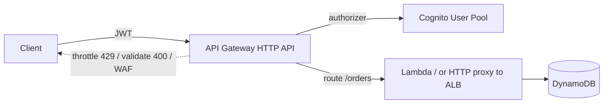

---

### Key Takeaways — API Gateway
- Managed API front door handling **auth, throttling, validation, caching, transformation, TLS**.
- **HTTP API** for lean/cheap Lambda-backed REST; **REST API** for full features (keys/usage plans, caching, transformations, private); **WebSocket** for bidirectional.
- Authorizers: **IAM** (services), **Cognito/JWT** (users), **Lambda** (custom).
- Protect backends with **throttling + usage-plan quotas**; validate requests at the gateway; handle **CORS**.
- **API Gateway vs ALB:** managed API features + serverless vs cheap high-throughput container/EC2 load balancing.

### Common Mistakes
- Using REST API (costly) where HTTP API suffices.
- No throttling → backend overwhelmed by abuse/bugs.
- CORS misconfiguration breaking browser clients.
- Doing validation/auth in the backend that the gateway could do cheaper/safer.
- Forgetting to redeploy to a stage after config changes.
- Direct Lambda integration causing RDS connection storms (no RDS Proxy).

### SDE2 Interview Questions
1. **REST vs HTTP API?** HTTP API is cheaper/faster with core features (JWT); REST API adds keys/usage plans, caching, transformations, private endpoints.
2. **API Gateway vs ALB — when each?** Gateway for managed API features/serverless; ALB for steady high-traffic container/EC2 routing at lower per-request cost.
3. **How do you authenticate users at the gateway?** Cognito/JWT authorizer validating tokens before reaching the backend; Lambda authorizer for custom schemes.
4. **How do you protect a backend from traffic spikes/abuse?** Throttling (rate+burst) + usage-plan quotas + WAF; return 429 with Retry-After.
5. **What's a usage plan + API key for?** Per-client throttling and quotas (tiered/partner access, monetization) — REST API only.

### Practical Exercise
Expose a Spring-Boot-equivalent order API via an **HTTP API** with a Cognito JWT authorizer, request validation on `POST /orders`, and stage throttling (100 rps, burst 200). Map a custom domain with ACM, configure CORS for your SPA origin, and route `/orders` to a Lambda (or HTTP proxy to an ALB). Load-test past the throttle to see `429`s, then add a REST-API variant with an API key + usage plan and response caching, and compare cost/latency.

---

# 18. ECS

**ECS (Elastic Container Service)** is AWS's container orchestrator: it runs, schedules, scales, and heals Docker containers. It solves "I have a containerized Spring Boot app — run N copies reliably across AZs, replace failures, roll out new versions, and connect it to a load balancer" without the complexity of Kubernetes. With **Fargate**, you don't even manage servers. ECS is the pragmatic default for most Java container workloads on AWS; EKS is for teams that need Kubernetes specifically (§20).

## 18.1 ECS Concepts

### Cluster
A logical grouping of capacity (Fargate, or EC2 instances) where your tasks run.

### Service
Keeps a desired number of task copies running, registers them with a load balancer, replaces unhealthy ones, and manages deployments. The long-running-app abstraction.

### Task
A running instance of a task definition — one or more containers scheduled together (share network/volumes). The unit ECS schedules.

### Task Definition
The immutable blueprint (JSON): which image(s), CPU/memory, ports, env vars, secrets, IAM roles, logging. Versioned (`family:revision`). Analogous to a Kubernetes pod spec.

### Container
A single Docker container within a task.

### Container Registry
Where images live — **ECR** (see §19).

## 18.2 Launch Types

| | Fargate | EC2 |
|---|---|---|
| Server management | None (serverless) | You manage the EC2 instances |
| Pricing | Per task vCPU/memory/sec | Per EC2 instance (pack many tasks) |
| Control | Less (no host access) | Full (daemons, GPUs, custom AMIs) |
| Best for | Most apps, variable load, less ops | High density/cost optimization at scale, special hardware |

> **Best Practice:** Default to **Fargate** — no servers to patch/scale, per-task isolation, simpler. Move to **EC2 launch type** only when cost at high steady density, GPUs, or host-level control justify the operational burden.

## 18.3 Task Definition (key fields)
- **CPU / Memory:** reserved per task (Fargate has fixed combos, e.g., 1 vCPU/2 GB). Must fit the JVM heap + overhead.
- **Port mappings:** container port (8080) exposed to the task ENI.
- **Environment variables:** non-secret config.
- **Secrets:** inject from Secrets Manager/SSM Parameter Store as env vars (not plaintext).
- **IAM roles:** **task role** (app permissions) + **task execution role** (pull image, write logs).
- **Logging:** `awslogs` driver → CloudWatch Logs (or FireLens → other sinks).

```json
{
  "family": "orders-service",
  "requiresCompatibilities": ["FARGATE"],
  "networkMode": "awsvpc",
  "cpu": "1024", "memory": "2048",
  "executionRoleArn": "arn:aws:iam::111:role/ecsTaskExecutionRole",
  "taskRoleArn": "arn:aws:iam::111:role/ordersTaskRole",
  "containerDefinitions": [{
    "name": "orders",
    "image": "111.dkr.ecr.us-east-1.amazonaws.com/orders:1.4.2",
    "portMappings": [{ "containerPort": 8080 }],
    "environment": [{ "name": "SPRING_PROFILES_ACTIVE", "value": "prod" }],
    "secrets": [{ "name": "DB_PASSWORD",
      "valueFrom": "arn:aws:secretsmanager:us-east-1:111:secret:prod/orders/db-xYz" }],
    "healthCheck": {
      "command": ["CMD-SHELL", "curl -f http://localhost:8080/actuator/health || exit 1"],
      "interval": 15, "timeout": 5, "retries": 3, "startPeriod": 60
    },
    "logConfiguration": {
      "logDriver": "awslogs",
      "options": { "awslogs-group": "/ecs/orders", "awslogs-region": "us-east-1",
                   "awslogs-stream-prefix": "orders" }
    }
  }]
}
```

> **Important:** Keep **task role** (what your app may call — S3, DynamoDB) separate from **task execution role** (what ECS needs — pull from ECR, write logs, read secrets). Mixing them violates least privilege.

## 18.4 ECS Networking

### awsvpc mode
Each task gets its **own ENI and private IP** in your VPC subnets, with its own security group — first-class VPC networking and clean per-task isolation (the default/required for Fargate).

### Security Groups / Subnets
Run tasks in **private** subnets; the task SG allows 8080 **only from the ALB SG**; tasks reach RDS via the DB SG. Same pattern as §4.

### Load Balancer
The ECS service registers/deregisters task IPs with an **ALB target group** automatically as tasks start/stop/scale — no manual target management.

## 18.5 Deployment

### Rolling deployment (default)
ECS replaces tasks gradually honoring **minimumHealthyPercent** / **maximumPercent** (e.g., 100/200 = spin up new before draining old). Zero-downtime with graceful shutdown + ALB deregistration delay.

### Blue/Green deployment (via CodeDeploy)
Launch a new task set behind a second target group, shift ALB traffic (all-at-once/linear/canary), validate, then terminate blue — instant rollback.

### Service discovery
**ECS Service Connect** / Cloud Map gives services stable internal DNS names (`orders.local`) to call each other without an ALB — for internal microservice-to-microservice traffic.

### Auto Scaling
ECS **Service Auto Scaling** (via Application Auto Scaling) target-tracks CPU, memory, or **ALBRequestCountPerTarget** to add/remove tasks. Same principles as §6.

## 18.6 Complete: Spring Boot → Docker → ECR → Fargate → ALB

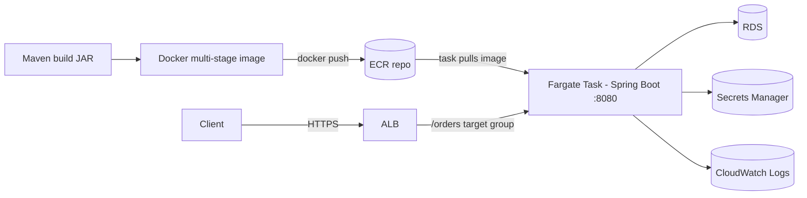
Pipeline (CLI sketch):
```bash
# Build & push image
mvn -q clean package
docker build -t orders:1.4.2 .
aws ecr get-login-password | docker login --username AWS --password-stdin 111.dkr.ecr.us-east-1.amazonaws.com
docker tag orders:1.4.2 111.dkr.ecr.us-east-1.amazonaws.com/orders:1.4.2
docker push 111.dkr.ecr.us-east-1.amazonaws.com/orders:1.4.2

# Register new task def revision and update the service (rolling deploy)
aws ecs register-task-definition --cli-input-json file://taskdef.json
aws ecs update-service --cluster prod --service orders-service \
  --task-definition orders-service --force-new-deployment
```
Spring Boot container readiness is gated by the ECS/ALB health check on `/actuator/health`; enable graceful shutdown (§5) so rolling deploys drain cleanly.

---

### Key Takeaways — ECS
- ECS runs/schedules/heals containers; a **Service** maintains desired tasks, registers them with the ALB, and manages deploys.
- **Fargate** is the serverless default (no hosts); EC2 launch type only for density/hardware/host control.
- **Task definition** is the immutable, versioned blueprint; separate **task role** (app perms) from **execution role** (pull image/logs/secrets); inject secrets from Secrets Manager, never plaintext.
- **awsvpc** gives each task its own ENI/SG in private subnets; SG-reference the ALB.
- Deploy via **rolling** (min/max %) or **blue/green** (CodeDeploy); autoscale on CPU/RequestCountPerTarget; use **Service Connect** for internal discovery.

### Common Mistakes
- One combined IAM role instead of task vs execution roles.
- Plaintext secrets in env vars instead of Secrets Manager/SSM references.
- Task memory too small for `-Xmx` + JVM overhead → container OOM-killed.
- No graceful shutdown / inadequate deregistration delay → dropped requests on deploy.
- Running tasks in public subnets; SG open to 0.0.0.0 instead of the ALB SG.
- Health check on `/` instead of a real readiness endpoint; `startPeriod` too short for JVM boot.

### SDE2 Interview Questions
1. **ECS vs EKS — when ECS?** ECS when you want simple container orchestration without Kubernetes expertise/overhead; EKS when you need K8s portability/ecosystem (see §20).
2. **Fargate vs EC2 launch type?** Fargate = no servers, per-task billing/isolation; EC2 = you manage hosts, better density/cost at scale and special hardware.
3. **Task role vs task execution role?** App permissions vs ECS-agent permissions (pull image, logs, secrets); keep separate for least privilege.
4. **How does ECS do zero-downtime deploys?** Rolling with min/max healthy %, ALB health gating + deregistration delay + app graceful shutdown; or blue/green via CodeDeploy.
5. **How do ECS tasks get a stable network identity?** `awsvpc` mode gives each task an ENI/private IP + SG; the service auto-registers IPs with the ALB target group.
6. **How do you set JVM memory in a container?** `-XX:MaxRAMPercentage` relative to the task memory, leaving headroom to avoid OOM-kill.

### Practical Exercise
Containerize a Spring Boot app (multi-stage Dockerfile, §19), push to ECR, and deploy as a Fargate service across 2 AZs in private subnets behind an ALB. Separate task vs execution roles, inject the DB password from Secrets Manager, log to CloudWatch, and set a `/actuator/health` container health check with a 60s start period. Enable Service Auto Scaling on RequestCountPerTarget, then do a rolling deploy (and a blue/green via CodeDeploy) with zero 5xx.

---

# 19. ECR

**ECR (Elastic Container Registry)** is AWS's managed, private Docker image registry. It stores your container images, integrates with IAM for access control, scans images for vulnerabilities, and is tightly wired into ECS/EKS/Fargate. It solves "where do my built images live, securely and close to where they run?" — avoiding Docker Hub rate limits and giving you private, encrypted, auditable image storage.

## 19.1 ECR Concepts

### Repository
A named container for the versions of one image (e.g., `orders`). Private by default; can be public (ECR Public Gallery).

### Image
An immutable, content-addressed artifact (layers + manifest). Pushed from `docker push`, pulled by ECS/EKS tasks.

### Tags
Human-friendly pointers to an image (`1.4.2`, `latest`). Tags are **mutable** by default (can be re-pointed) — enable **tag immutability** so a given tag can't be overwritten (critical for reproducible, auditable deploys).

### Image digest
The SHA-256 of the image content (`sha256:abc...`) — an immutable identifier. **Deploy by digest** (or immutable tag) for guaranteed reproducibility; `latest` is ambiguous.

### Lifecycle policies
Rules to auto-expire old images (e.g., keep last 10 tagged, delete untagged after 7 days) — control storage cost and clutter.

## 19.2 Docker (for Java backend images)

### Dockerfile / Image layers
A Dockerfile defines layers; each instruction adds a layer, cached and reused across builds. Order instructions **least-changing first** (dependencies before source) so code changes don't invalidate the dependency layer → fast rebuilds.

### Multi-stage builds
Build the JAR in a full JDK/Maven stage, then copy only the runtime artifacts into a slim JRE stage → small, secure final image (no Maven, no build tools, smaller attack surface).

### Container security
- Run as a **non-root** user.
- Use a **minimal base** (distroless or `-jre` on a slim distro).
- Scan images (ECR scanning / Inspector, §33).
- Pin base image by digest; don't bake secrets into layers.

### Image scanning
ECR **basic** scanning (CVE scan on push) and **enhanced** scanning (Inspector-powered, continuous). Gate deploys on scan results.

## 19.3 Production Dockerfile for Spring Boot
```dockerfile
# syntax=docker/dockerfile:1

############ Stage 1: build ############
FROM maven:3.9-eclipse-temurin-21 AS build
WORKDIR /app
# Copy pom first so the dependency layer is cached unless pom changes
COPY pom.xml .
RUN mvn -q -e -B dependency:go-offline
COPY src ./src
RUN mvn -q -B clean package -DskipTests

############ Stage 2: runtime ############
FROM eclipse-temurin:21-jre-jammy AS runtime
WORKDIR /app

# Non-root user
RUN groupadd -r app && useradd -r -g app app

# Copy only the built jar
COPY --from=build /app/target/*.jar app.jar
RUN chown -R app:app /app
USER app

EXPOSE 8080
# Respect container memory limits; sane GC
ENV JAVA_OPTS="-XX:MaxRAMPercentage=75 -XX:+UseG1GC -XX:+ExitOnOutOfMemoryError"
# Container health check (ECS can also do this)
HEALTHCHECK --interval=15s --timeout=5s --start-period=60s --retries=3 \
  CMD curl -f http://localhost:8080/actuator/health || exit 1

ENTRYPOINT ["sh","-c","java $JAVA_OPTS -jar app.jar"]
```
> **Best Practice:** `MaxRAMPercentage` (not a fixed `-Xmx`) so the JVM sizes the heap from the **container's** memory limit — otherwise the JVM may read the host's RAM and get OOM-killed. Use `-XX:+ExitOnOutOfMemoryError` so a crashed JVM exits and ECS/K8s restarts it instead of hanging.

Push to ECR:
```bash
aws ecr create-repository --repository-name orders --image-tag-mutability IMMUTABLE \
  --image-scanning-configuration scanOnPush=true
aws ecr get-login-password --region us-east-1 \
  | docker login --username AWS --password-stdin 111.dkr.ecr.us-east-1.amazonaws.com
docker build -t 111.dkr.ecr.us-east-1.amazonaws.com/orders:1.4.2 .
docker push 111.dkr.ecr.us-east-1.amazonaws.com/orders:1.4.2
```
Lifecycle policy (keep 10 newest, expire untagged after 7 days):
```json
{ "rules": [
  { "rulePriority": 1, "description": "expire untagged",
    "selection": { "tagStatus": "untagged", "countType": "sinceImagePushed",
                   "countUnit": "days", "countNumber": 7 },
    "action": { "type": "expire" } },
  { "rulePriority": 2, "description": "keep last 10 tagged",
    "selection": { "tagStatus": "any", "countType": "imageCountMoreThan", "countNumber": 10 },
    "action": { "type": "expire" } }
]}
```

---

### Key Takeaways — ECR
- Private, IAM-controlled, encrypted image registry integrated with ECS/EKS; avoids Docker Hub limits.
- Deploy by **immutable tag or digest** (enable **tag immutability**); `latest` is not reproducible.
- Use **multi-stage builds**, slim JRE base, **non-root** user, and **MaxRAMPercentage** for container-aware heaps.
- Enable **scan-on-push** and **lifecycle policies** to manage vulnerabilities and storage.

### Common Mistakes
- Deploying `:latest` (ambiguous, non-reproducible, hard to roll back).
- Fat images with JDK + Maven in the final layer (slow pulls, bigger attack surface).
- Running as root in the container.
- Fixed `-Xmx` ignoring container limits → OOM-kill.
- No lifecycle policy → unbounded storage; no scanning → shipping known CVEs.
- Baking secrets into image layers.

### SDE2 Interview Questions
1. **Why multi-stage builds?** Separate build-time (JDK/Maven) from runtime (JRE) → smaller, more secure final image.
2. **Tag vs digest deploys?** Tags are mutable; digests are immutable content hashes guaranteeing the exact image — prefer digests/immutable tags.
3. **How do you size JVM heap in a container?** `MaxRAMPercentage` relative to the container memory limit, with headroom for non-heap.
4. **How do you keep images secure and lean?** Minimal base, non-root, scan-on-push, pin bases, no secrets in layers, lifecycle expiry.
5. **Why enable tag immutability?** Prevents overwriting a released tag, ensuring auditability and reproducible rollbacks.

### Practical Exercise
Write the multi-stage Dockerfile above for your Spring Boot app, build it, confirm it runs as non-root and respects a 512 MB container memory limit (observe heap sizing). Create an ECR repo with immutable tags + scan-on-push, push `1.0.0`, review the vulnerability findings, add the lifecycle policy, and deploy to the ECS service from §18 by digest.

---

# 20. Kubernetes / EKS

**Kubernetes (K8s)** is the industry-standard container orchestration platform: declarative desired-state management, self-healing, scaling, service discovery, and a huge ecosystem. **Amazon EKS (Elastic Kubernetes Service)** is managed Kubernetes — AWS runs the control plane; you run workloads on managed nodes or Fargate. You choose EKS over ECS when you need Kubernetes specifically: multi-cloud portability, the CNCF ecosystem (Helm, Istio, operators), or existing K8s expertise/tooling.

## 20.1 Kubernetes Core Objects

### Cluster
The whole system: a **control plane** (API server, scheduler, etcd, controllers) + **worker nodes** running your pods.

### Node
A worker machine (EC2 instance or Fargate) that runs pods via the kubelet + container runtime.

### Pod
The smallest deployable unit: one or more tightly-coupled containers sharing network/storage. Usually one app container per pod. Pods are **ephemeral** (replaced, not repaired).

### Deployment
Declares desired state for a stateless app: which image, how many **replicas**, and the rollout strategy. The controller continuously reconciles reality to match (self-healing, rolling updates, rollback).

### Service
A stable virtual IP + DNS name load-balancing across a dynamic set of pods (pods come and go; the Service endpoint is stable). Types: `ClusterIP` (internal), `NodePort`, `LoadBalancer` (provisions an AWS NLB/ALB), `ExternalName`.

### Namespace
A virtual cluster partition for isolating teams/environments (quotas, RBAC, network policies per namespace).

### ConfigMap / Secret
Externalized configuration: **ConfigMap** for non-sensitive config, **Secret** for sensitive values (base64, ideally backed by AWS Secrets Manager via the Secrets Store CSI driver / External Secrets).

### Ingress
HTTP(S) routing rules (host/path) into the cluster; an **Ingress Controller** (e.g., AWS Load Balancer Controller) provisions/configures an ALB to implement them. The K8s equivalent of putting an ALB in front with path routing.

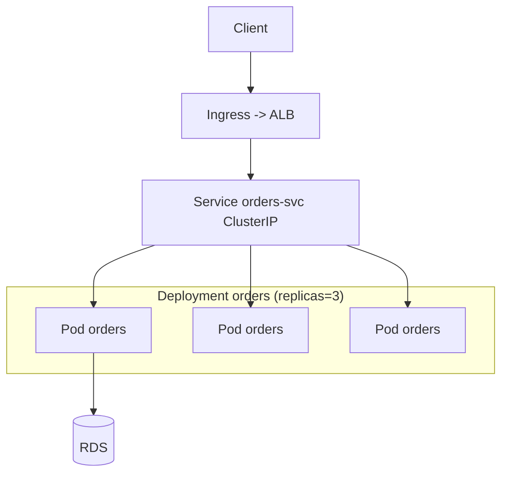

## 20.2 EKS

### Control plane
AWS-managed, multi-AZ, patched/scaled by AWS (you pay an hourly fee). You never touch etcd/API server hosts.

### Worker nodes
Where pods run — **Managed Node Groups** (EC2, AWS handles provisioning/updates), **self-managed nodes**, or **Fargate** (serverless pods, no nodes to manage). Karpenter is the modern node autoscaler.

### Managed Node Groups
EC2 node pools with automated provisioning, graceful draining, and version upgrades.

### Fargate (on EKS)
Run pods without managing nodes — per-pod serverless capacity; good for isolation and bursty/variable workloads.

### IAM integration (IRSA)
**IAM Roles for Service Accounts** map a K8s service account to an IAM role via OIDC, so pods get least-privilege AWS credentials (the EKS equivalent of ECS task roles) — no node-wide credentials.

### Load Balancers
The **AWS Load Balancer Controller** turns `Ingress` into ALBs and `Service type=LoadBalancer` into NLBs.

## 20.3 Production

### HPA (Horizontal Pod Autoscaler)
Scales pod replicas on CPU/memory/custom metrics (e.g., requests/sec via metrics adapter) — pod-level autoscaling.

### Cluster Autoscaler / Karpenter
Scales **nodes** when pods can't be scheduled (and scales down when idle). Karpenter provisions right-sized nodes quickly.

### Pod disruption (PDB)
A **PodDisruptionBudget** limits how many pods can be down during voluntary disruptions (node drains/upgrades) → maintains availability during maintenance.

### Rolling deployments
Deployments roll out new pods and retire old gradually (`maxSurge`/`maxUnavailable`), with automatic rollback on failure.

### Health probes
- **Liveness:** restart the container if it's dead/deadlocked.
- **Readiness:** remove the pod from the Service until it can serve (gates traffic).
- **Startup:** give slow-booting JVMs time before liveness kicks in.
Map these to Spring Boot `/actuator/health/liveness` and `/readiness`.

### Resource requests/limits
**Requests** = guaranteed/scheduled resources; **limits** = hard caps. For JVMs, set memory request≈limit and size the heap with `MaxRAMPercentage` under the limit; CPU limits can throttle the JVM — size carefully.

Example Deployment (abbreviated):
```yaml
apiVersion: apps/v1
kind: Deployment
metadata: { name: orders, namespace: prod }
spec:
  replicas: 3
  selector: { matchLabels: { app: orders } }
  template:
    metadata: { labels: { app: orders } }
    spec:
      serviceAccountName: orders-sa     # IRSA -> IAM role
      containers:
        - name: orders
          image: 111.dkr.ecr.us-east-1.amazonaws.com/orders:1.4.2
          ports: [{ containerPort: 8080 }]
          env: [{ name: SPRING_PROFILES_ACTIVE, value: prod }]
          resources:
            requests: { cpu: "500m", memory: "1Gi" }
            limits:   { cpu: "1",    memory: "1Gi" }
          readinessProbe:
            httpGet: { path: /actuator/health/readiness, port: 8080 }
            initialDelaySeconds: 20
          livenessProbe:
            httpGet: { path: /actuator/health/liveness, port: 8080 }
            initialDelaySeconds: 60
```

## 20.4 ECS vs EKS

| | ECS | EKS |
|---|---|---|
| Orchestrator | AWS-proprietary | Standard Kubernetes |
| Learning curve | Low | High (K8s concepts, YAML, ecosystem) |
| Portability | AWS-only | Multi-cloud / on-prem portable |
| Ecosystem | AWS-native | Huge CNCF (Helm, Istio, operators, ArgoCD) |
| Ops overhead | Low (esp. Fargate) | Higher (upgrades, add-ons, controllers) |
| Cost | No control-plane fee | Control-plane hourly fee + more ops |
| Best for | Teams wanting simple AWS container running | Teams needing K8s portability/ecosystem/expertise |

> **Interview Tip (when an SDE2 should choose each):** Choose **ECS/Fargate** when the goal is "run my containers on AWS with minimal ops" and you have no K8s requirement — it's faster to adopt and cheaper to operate. Choose **EKS** when you need Kubernetes portability, the CNCF ecosystem (service mesh, GitOps, operators), consistency with other clusters/clouds, or your org already has K8s expertise. The container image is the same — this is an orchestration/operations decision, not an application one.

---

### Key Takeaways — Kubernetes / EKS
- K8s = declarative, self-healing orchestration; **Deployment→ReplicaSet→Pods**, **Service** for stable discovery, **Ingress→ALB** for routing.
- EKS gives a managed control plane; run pods on **Managed Node Groups**, **Karpenter**-scaled nodes, or **Fargate**; use **IRSA** for per-pod IAM.
- Production essentials: **HPA** (pods) + **Cluster Autoscaler/Karpenter** (nodes), **PDBs**, **liveness/readiness/startup probes**, and correct **requests/limits**.
- JVM in K8s: size heap with `MaxRAMPercentage` under the memory limit; beware CPU-limit throttling.
- **ECS vs EKS** is an ops/portability decision — ECS for simplicity on AWS, EKS for Kubernetes portability/ecosystem.

### Common Mistakes
- Adopting EKS without a real K8s need (unnecessary complexity/cost).
- No readiness probe → traffic to not-ready pods; no startup probe → slow JVMs killed by liveness.
- Missing/incorrect resource requests → bad scheduling and noisy-neighbor issues; JVM ignoring limits → OOMKilled.
- Node-wide IAM credentials instead of **IRSA**.
- No PodDisruptionBudget → upgrades evict too many pods at once.
- CPU limits throttling the JVM unexpectedly.

### SDE2 Interview Questions
1. **ECS vs EKS — when EKS?** When you need Kubernetes portability, CNCF ecosystem, or existing K8s expertise; otherwise ECS/Fargate is simpler/cheaper.
2. **Liveness vs readiness vs startup probes?** Restart-if-dead vs gate-traffic-until-ready vs grace period for slow boot; map to Spring Boot actuator probes.
3. **How do pods get AWS permissions securely on EKS?** IRSA — service account mapped to an IAM role via OIDC (per-pod least privilege).
4. **HPA vs Cluster Autoscaler?** HPA scales pod replicas on metrics; Cluster Autoscaler/Karpenter scales nodes to fit unschedulable pods.
5. **How do you run a JVM safely in K8s?** Memory request≈limit, `MaxRAMPercentage` heap, mind CPU-limit throttling, `ExitOnOutOfMemoryError`, proper probes.
6. **What does a Service provide over pod IPs?** A stable VIP/DNS load-balancing across ephemeral pods.

### Practical Exercise
Deploy the same Spring Boot image to EKS: a Deployment (3 replicas) with readiness/liveness/startup probes, requests/limits, and IRSA granting S3/DynamoDB access. Expose it via an Ingress (ALB). Add an HPA on CPU and Karpenter/Cluster Autoscaler for nodes, plus a PDB (minAvailable 2). Roll out a new image version (observe the rolling update + automatic rollback on a bad probe), then compare the operational effort against the ECS deployment from §18.

---

# 21. Route 53

**Route 53** is AWS's highly available, scalable DNS and domain-registration service (named after DNS port 53). It translates names (`api.example.com`) to addresses, and — crucially — supports **traffic routing policies and health checks**, making DNS a tool for availability and global load distribution, not just name resolution. For a backend engineer it's how clients find your ALB/CloudFront and how you fail over between Regions.

## 21.1 DNS Fundamentals

### Domain
A human-readable name (`example.com`) you register (via Route 53 or elsewhere) and manage records for.

### Hosted Zone
A container for the DNS records of a domain. **Public** (internet-resolvable) or **Private** (resolvable only inside associated VPCs).

### Record
A DNS entry mapping a name to data: `A` (IPv4), `AAAA` (IPv6), `CNAME` (name→name), `MX`, `TXT`, `NS`, and AWS's special **Alias** record.

### TTL
How long resolvers cache a record. Low TTL (e.g., 60s) = faster failover/propagation but more queries; high TTL = fewer queries but slower changes. Alias records to AWS resources ignore TTL for health-based failover.

### DNS resolution
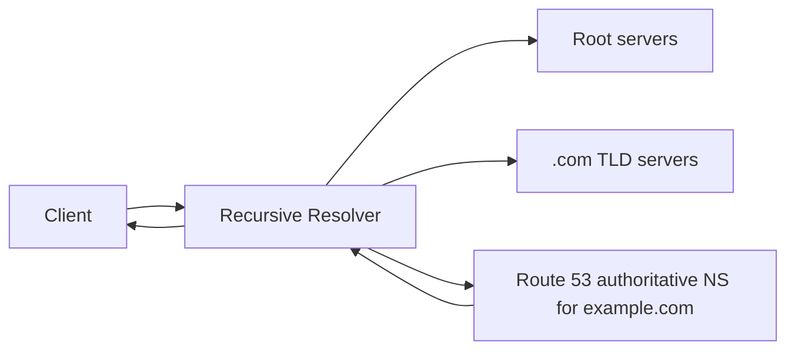
The resolver walks root → TLD → authoritative (Route 53) and caches per TTL.

### Alias vs CNAME
**Alias** is a Route 53 extension that points a name directly at an AWS resource (ALB, CloudFront, S3 website, another record), works at the **zone apex** (`example.com`, where CNAME is illegal), is **free**, and integrates with health checks. Prefer Alias over CNAME for AWS targets.

## 21.2 Routing Policies

| Policy | Routes based on | Use case |
|---|---|---|
| **Simple** | One record, no logic | Single resource |
| **Weighted** | Assigned weights (%) | A/B testing, gradual migration, blue/green |
| **Latency-based** | Lowest latency Region for the client | Global low-latency serving |
| **Failover** | Primary/secondary + health check | Active-passive DR |
| **Geolocation** | Client's country/continent | Compliance, localized content |
| **Geoproximity** | Geographic distance (+ bias) | Shift traffic between Regions by distance |
| **Multivalue** | Up to 8 healthy records at random | Simple client-side load spreading with health checks |

### Weighted
Split traffic by weight across records (e.g., 90% old stack, 10% new) — DNS-level canary/migration.

### Latency-based
Send each client to the Region giving them the lowest latency — the standard for multi-Region low-latency apps.

### Failover
Primary serves while healthy; on health-check failure, Route 53 serves the secondary (e.g., a DR Region or a static S3 "maintenance" page). Active-passive.

### Geolocation / Geoproximity
Geolocation routes by where the user is (regulatory/localization); geoproximity routes by distance between user and resource with an adjustable bias to shift load.

### Multivalue
Returns multiple healthy IPs so the client picks one — lightweight health-aware spreading (not a substitute for a real load balancer).

## 21.3 Production

### Health checks
Route 53 probes endpoints (HTTP/HTTPS/TCP) from multiple global locations; unhealthy targets are removed from DNS responses. Can also watch a **CloudWatch alarm** or be **calculated** (composite of other checks). The engine behind failover/latency routing.

### DNS failover
Combine failover routing + health checks for automatic cross-Region/active-passive failover. Keep TTL low enough that clients re-resolve quickly after a failover.

### Domain registration
Register/transfer domains, auto-renew, manage WHOIS privacy — Route 53 becomes the registrar + DNS in one place.

### Private hosted zones
Internal DNS (`orders.internal` → private ALB) resolvable only inside associated VPCs — service discovery and split-horizon (§4.7).

> **Interview Tip:** DNS is **not** a real load balancer — resolvers and clients cache aggressively (TTL + non-compliant caching). Use Route 53 for **coarse** routing (Region selection, failover, weighted migration) and an **ALB/NLB** for **fine-grained, real-time** load balancing within a Region. Low TTL reduces but never eliminates stale caching, so DNS failover is not instant.

> **Warning:** Setting very low TTLs (e.g., 1s) increases query cost and still can't force every resolver to honor it. For fast failover prefer architectures where the endpoint itself is HA (ALB across AZs) and reserve DNS failover for Region-level events.

---

### Key Takeaways — Route 53
- Managed, highly available DNS + registrar with **health-checked routing policies**.
- Use **Alias** (not CNAME) for AWS targets and the zone apex — free and health-aware.
- Routing policies map to needs: **weighted** (canary/migration), **latency** (global perf), **failover** (DR), **geolocation** (compliance), **multivalue** (simple spreading).
- **Health checks** drive failover; keep TTLs sensible — DNS is coarse routing, not real-time load balancing.
- **Private hosted zones** give internal service discovery and split-horizon DNS.

### Common Mistakes
- Treating DNS failover as instant (ignoring resolver/client caching).
- Using CNAME at the zone apex (illegal) instead of Alias.
- Over-aggressive low TTLs (cost, still cached) or over-high TTLs (slow failover).
- Relying on multivalue routing as a load balancer.
- Forgetting health checks, so failover routing never actually fails over.

### SDE2 Interview Questions
1. **Alias vs CNAME?** Alias points to AWS resources, works at the apex, is free and health-aware; CNAME is a generic name alias, not allowed at the apex.
2. **How do you do multi-Region active-passive failover?** Failover routing + health checks + low-ish TTL; secondary (DR Region or static page) serves when primary is unhealthy.
3. **Latency vs geolocation routing?** Latency routes to the lowest-latency Region; geolocation routes by the user's location (compliance/localization).
4. **Why isn't DNS a good fine-grained load balancer?** Caching/TTL means stale responses and no per-request control; use ALB/NLB within a Region.
5. **How would you canary a new stack with DNS?** Weighted records (e.g., 95/5) shifting gradually, watching metrics.

### Practical Exercise
Register (or use) a domain in Route 53. Create an Alias apex record to your ALB, add a `www` record, and a health check on `/actuator/health`. Build an active-passive setup: primary ALB in `us-east-1`, secondary static S3 maintenance page via failover routing; kill the primary and observe failover (note the delay from TTL). Then convert to latency-based routing across two Regions.

---

# 22. CloudFront

**CloudFront** is AWS's global **CDN (Content Delivery Network)**. It caches and serves content from **edge locations** close to users, cutting latency and offloading your origin. Beyond static assets, it fronts dynamic APIs (TLS termination, HTTP/2/3, connection reuse, WAF, DDoS protection via Shield) and provides a single global entry point. For a backend engineer it reduces origin load, improves global latency, and adds a security layer in front of ALBs/S3/API Gateway.

## 22.1 CDN Concepts

### Edge locations
Hundreds of global PoPs that cache content and terminate client TLS near users. A cache **hit** serves from the edge (fast); a **miss** fetches from the origin and caches it.

### Distribution
The CloudFront configuration: origins, cache behaviors, TLS cert, domain(s). You get a `*.cloudfront.net` name (or your own domain via ACM).

### Origin
Where CloudFront fetches on a miss: **S3**, **ALB**, **EC2**, **API Gateway**, or any HTTP server. Supports origin groups for origin failover.

### Cache behavior
Per path-pattern rules (`/static/*` vs `/api/*`) controlling caching, allowed methods, TLS, header/cookie/query forwarding, and which origin to use.

### Cache policy
Defines the **cache key** (which headers/cookies/query strings matter) and TTLs. Fewer cache-key dimensions = higher hit ratio.

## 22.2 Origins
| Origin | Typical use |
|---|---|
| **S3** | Static assets, SPA, images, downloads (lock down with OAC) |
| **ALB** | Dynamic app/API fronting (containers/EC2) |
| **EC2** | Legacy/custom HTTP origin |
| **API Gateway** | Cache + global edge for serverless APIs |

## 22.3 Caching

### Cache key / TTL
The cache key determines what counts as "the same" response. Include only what varies the response (e.g., `Accept-Language` if you serve localized content). Set TTLs via cache policy or origin `Cache-Control` headers.

### Cache invalidation
Remove cached objects before TTL expiry via an **invalidation** (`/images/logo.png` or `/*`). Costs money at scale and is slow — prefer **versioned object names** (`app.a1b2c3.js`) so new deploys use new URLs and never need invalidation.

### Origin request policy
Separately controls which headers/cookies/query strings are **forwarded to the origin** (independent of the cache key) — e.g., forward `Authorization` to the origin without making it part of the cache key.

## 22.4 Security

### HTTPS / TLS
Terminate TLS at the edge with an **ACM certificate** (must be in `us-east-1` for CloudFront). Enforce HTTPS (redirect HTTP→HTTPS), set modern TLS policies.

### Signed URLs / Signed Cookies
Restrict access to private content: **signed URLs** for individual files (e.g., a paid download, a presigned-like private asset), **signed cookies** for whole sections (e.g., all premium videos) with expiry and optional IP/time constraints.

### Origin Access Control (OAC)
Lets CloudFront access a **private** S3 bucket while the bucket stays fully private (Block Public Access on). The modern replacement for OAI — always use OAC for S3 origins instead of making the bucket public.

### AWS WAF integration
Attach a WAF Web ACL to the distribution to filter malicious requests (SQLi/XSS/bots/rate limits) at the edge, before they reach the origin (see §23). **Shield Standard** DDoS protection is automatic.

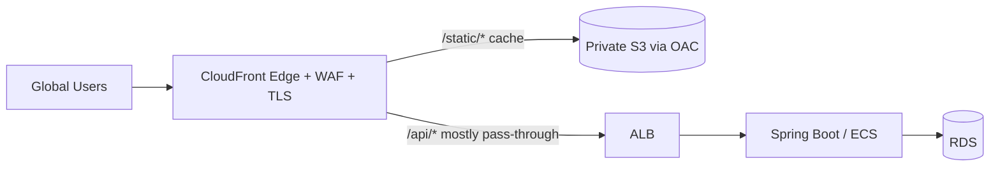

> **Best Practice:** Serve a SPA's static files from a **private S3 origin via OAC** with long-TTL versioned filenames, and route `/api/*` to the ALB with caching largely disabled (forward `Authorization`, don't cache per-user responses). Put **WAF** on the distribution. This gives global performance for assets, edge security for the API, and one HTTPS entry point.

> **Warning:** Don't cache authenticated/per-user API responses with a shared cache key — you can leak one user's data to another. Vary the cache key correctly or disable caching for those paths.

---

### Key Takeaways — CloudFront
- Global CDN caching at **edge locations**; serves static assets fast and fronts dynamic APIs with TLS, HTTP/2/3, WAF, and Shield.
- **Cache key** design drives hit ratio; prefer **versioned filenames** over invalidations.
- Secure S3 origins with **OAC** (keep the bucket private); use **signed URLs/cookies** for private content; terminate TLS with ACM in `us-east-1`.
- Separate **cache policy** (cache key) from **origin request policy** (what's forwarded).
- Never share-cache per-user authenticated responses.

### Common Mistakes
- Making the S3 bucket public instead of using OAC.
- Caching per-user/authenticated responses with a shared key (data leakage).
- Over-forwarding headers/cookies → poor hit ratio.
- Relying on invalidations for every deploy (slow/costly) instead of versioned URLs.
- Putting the ACM cert in the wrong Region (CloudFront needs `us-east-1`).

### SDE2 Interview Questions
1. **How does CloudFront reduce latency and origin load?** Caches responses at edges near users; hits avoid the origin entirely.
2. **How do you serve a private S3 bucket through CloudFront?** OAC — CloudFront is granted access while the bucket stays private (BPA on).
3. **Cache invalidation vs versioned filenames?** Invalidations purge cached objects (slow/paid); versioned names change the URL so caches naturally miss — preferred.
4. **How do you protect premium/private content on a CDN?** Signed URLs (per file) or signed cookies (per section) with expiry/IP constraints.
5. **Can you cache a dynamic API?** Yes for cacheable, non-user-specific GETs; never share-cache authenticated per-user responses.

### Practical Exercise
Put a CloudFront distribution in front of a React SPA (private S3 via OAC, versioned asset filenames, long TTL) and your `/api/*` on an ALB (caching off, forward `Authorization`). Add an ACM cert in `us-east-1` for `app.example.com`, enforce HTTPS, attach a WAF Web ACL, and serve a private download via a signed URL with a 5-minute expiry. Measure cache hit ratio and global latency before/after.

---

# 23. AWS WAF

**AWS WAF (Web Application Firewall)** inspects HTTP(S) requests at Layer 7 and blocks/allows/counts them based on rules, protecting your APIs and sites from common web exploits and abusive traffic. It solves the problem that network firewalls (SGs/NACLs) operate at L3/L4 and can't understand HTTP — WAF sees URIs, headers, bodies, and query strings. It attaches to **CloudFront, ALB, API Gateway, AppSync, and Cognito**.

## 23.1 Security Building Blocks

### Web ACL
The top-level container attached to a resource; an ordered list of rules + a default action (allow or block). Each request is evaluated against the rules in priority order.

### Rules
Conditions → action (Allow / Block / Count / CAPTCHA / Challenge). Match on IP, geo, headers, URI, query string, body, size, or **rate**.

### Rule Groups
Reusable sets of rules. **AWS Managed Rule Groups** cover OWASP Top 10 (SQLi, XSS), known-bad inputs, bot control, anonymous-IP lists — a strong, maintained baseline you enable in minutes.

### IP Sets
Named lists of IPs/CIDRs to allow or block (e.g., office allowlist, abuse blocklist).

### Rate-based Rules
Block a client IP (or by custom key) when its request rate exceeds a threshold over 5 minutes — the primary layer-7 DDoS/abuse and brute-force defense.

## 23.2 Protection
- **SQL Injection / XSS:** managed rule groups inspect inputs for injection patterns.
- **Bot protection:** Bot Control managed group classifies and challenges bots.
- **Rate limiting:** rate-based rules throttle abusive IPs.
- **IP blocking / Geo:** IP sets + geo match to block regions or known-bad sources.

## 23.3 Protecting a public Spring Boot API

```mermaid
flowchart LR
    U[Client] --> CF[CloudFront + WAF Web ACL]
    CF -->|allowed| ALB
    ALB --> APP[Spring Boot /api]
    CF -. blocked SQLi/XSS/rate .-> X[403 / CAPTCHA]
```
Example Web ACL (CLI sketch) with managed protections + rate limit + login brute-force guard:
```bash
# Rate-based rule: block IPs over 2000 req / 5 min
# Scoped rule: stricter 100 req / 5 min specifically on POST /api/login
# + AWSManagedRulesCommonRuleSet (XSS, bad inputs) + AWSManagedRulesSQLiRuleSet
aws wafv2 create-web-acl --name orders-waf --scope CLOUDFRONT \
  --default-action Allow={} \
  --rules file://rules.json \
  --visibility-config SampledRequestsEnabled=true,CloudWatchMetricsEnabled=true,MetricName=ordersWaf
```
> **Best Practice:** Deploy new rules in **Count mode** first to measure false positives against real traffic, then flip to **Block**. Enable logging to CloudWatch/S3/Kinesis for forensics. Combine WAF (L7) with **Shield** (DDoS) and SGs (L3/L4) — defense in depth. Still validate/escape inputs in the app; WAF is a layer, not a replacement for secure coding.

> **Warning:** WAF managed rules can produce **false positives** (e.g., a legitimate request body matching an SQLi pattern). Always Count-then-Block and keep an allow mechanism for known-good clients.

---

### Key Takeaways — AWS WAF
- L7 firewall for HTTP; attaches to CloudFront/ALB/API Gateway; rules match IP/geo/URI/headers/body/rate.
- Use **AWS Managed Rule Groups** for OWASP baseline + **rate-based rules** for abuse/brute-force/L7 DDoS.
- Roll out in **Count mode**, measure, then **Block**; enable logging.
- Defense in depth: WAF (L7) + Shield (DDoS) + SG/NACL (L3/L4) + secure coding.

### Common Mistakes
- Blocking straight away (false positives/outage) instead of Count-first.
- No rate-based rule → brute-force/scraping unmitigated.
- Treating WAF as a substitute for input validation.
- Not logging WAF decisions → no forensics.

### SDE2 Interview Questions
1. **WAF vs Security Group?** WAF inspects L7 HTTP content; SG filters L3/L4 by IP/port — complementary.
2. **How do you stop a login brute-force / scraping attack?** Scoped rate-based rule on the login path + managed bot rules + CAPTCHA/Challenge.
3. **How do you safely roll out WAF rules?** Count mode to assess false positives, then switch to Block; keep logs.
4. **Where can WAF be attached?** CloudFront, ALB, API Gateway, AppSync, Cognito.

### Practical Exercise
Attach a WAF Web ACL to the CloudFront distribution from §22: enable the Common + SQLi managed rule groups in **Count** mode, add a rate-based rule (2000/5min globally, 100/5min on `/api/login`), and a geo-block for a test country. Send malicious payloads and bursts, review sampled/blocked requests in logs, then promote rules to Block.

---

# 24. Secrets Manager

**AWS Secrets Manager** securely stores, encrypts, rotates, and audits secrets (DB passwords, API keys, tokens), serving them to apps at runtime via IAM — so secrets never live in code, config files, or images. It solves the universal problem of "where do credentials come from without hardcoding them?" and adds **automatic rotation**, which manual secret management lacks.

## 24.1 Secrets
Typical stored secrets: **database credentials**, **API keys** (third-party services), **OAuth client secrets**, **JWT signing keys/keystores**. Each secret is a KMS-encrypted blob (string or JSON) with versioning.

## 24.2 Features

### Encryption / KMS
Secrets are encrypted at rest with KMS (AWS-managed or your CMK). Access requires both the secret's resource policy/IAM **and** KMS key permission — two-layer control and full CloudTrail audit of every retrieval.

### Automatic rotation
A Lambda rotation function changes the secret on a schedule (e.g., every 30 days) and updates the dependent system (RDS/Redshift/DocumentDB have built-in rotation). Supports **single-user** and safer **alternating-users** strategies to rotate without downtime.

### Versioning
Each change creates a version with staging labels (`AWSCURRENT`, `AWSPREVIOUS`, `AWSPENDING`) enabling zero-downtime rotation and rollback.

### IAM access
Grant least-privilege read to exactly the secrets a workload needs (by ARN), via the workload's role (EC2/ECS/Lambda/IRSA) — no static keys anywhere.

## 24.3 Secrets Manager vs Parameter Store
| | Secrets Manager | SSM Parameter Store (SecureString) |
|---|---|---|
| Purpose | Secrets with lifecycle | Config + secrets (lightweight) |
| Rotation | Built-in (Lambda) | None built-in |
| Cost | Per secret + per API call | Standard params free |
| Cross-account resource policy | Yes | Advanced tier |
| Best for | DB creds, rotating keys | App config, feature flags, simple secrets |

> **Best Practice:** Use **Secrets Manager** for credentials that must **rotate** (DB, third-party keys). Use **Parameter Store** for plain config and simple, rarely-rotated secrets to save cost. (More on Parameter Store in §25.)

## 24.4 Spring Boot: DB connection with no hardcoded credentials

With ECS/EC2 injection (recommended) — the task definition pulls the secret into an env var (§18), and `application.yml` just references it:
```yaml
spring:
  datasource:
    url: jdbc:postgresql://orders-db.xxxx.rds.amazonaws.com:5432/orders
    username: ${DB_USERNAME}
    password: ${DB_PASSWORD}   # injected from Secrets Manager, never in source/image
```
Or fetch at runtime with Spring Cloud AWS (resolves `${sm://...}`):
```xml
<dependency>
  <groupId>io.awspring.cloud</groupId>
  <artifactId>spring-cloud-aws-starter-secrets-manager</artifactId>
</dependency>
```
```yaml
spring:
  config:
    import: aws-secretsmanager:/prod/orders/db
  datasource:
    username: ${username}      # keys from the JSON secret
    password: ${password}
```
Or directly with the SDK (handling rotation by re-fetching on auth failure):
```java
SecretsManagerClient sm = SecretsManagerClient.create();
String json = sm.getSecretValue(b -> b.secretId("prod/orders/db")).secretString();
DbCreds creds = objectMapper.readValue(json, DbCreds.class);
```
> **Production Warning:** Never hardcode credentials in source, `application.properties`, Docker images, or CI logs. Prefer **IAM role + Secrets Manager**; cache the secret in memory with a TTL to avoid per-request API calls, and refresh on authentication errors (so rotation is picked up). For RDS, **RDS Proxy** can integrate with Secrets Manager so the proxy handles credentials and rotation transparently.

---

### Key Takeaways — Secrets Manager
- Central, KMS-encrypted, IAM-controlled, **auto-rotating**, audited secret storage — zero hardcoded credentials.
- Rotation uses staging labels (`AWSCURRENT/AWSPENDING`) for zero-downtime changes; RDS/DocumentDB have built-in rotation.
- Inject via ECS/EC2 task secrets or fetch at runtime (Spring Cloud AWS / SDK); cache with TTL + refresh on auth failure.
- Use **Secrets Manager** for rotating credentials, **Parameter Store** for plain config / simple secrets.

### Common Mistakes
- Hardcoding secrets or committing them to Git/images.
- Fetching the secret on every request (cost/latency) instead of caching.
- Not refreshing after rotation → auth failures.
- Over-broad IAM allowing read of all secrets instead of specific ARNs.
- Forgetting the KMS key permission (secret access needs it too).

### SDE2 Interview Questions
1. **How does Spring Boot get DB credentials without hardcoding?** IAM role → Secrets Manager (ECS task secret injection or runtime fetch); nothing in source/image.
2. **How does rotation work without downtime?** Staging labels + alternating-user strategy; app re-fetches on auth failure.
3. **Secrets Manager vs Parameter Store?** Rotation + lifecycle + cost per secret vs lightweight free config/simple secrets.
4. **How do you minimize cost/latency of secret retrieval?** Cache in memory with a TTL; refresh on auth error.
5. **What two permissions are needed to read a secret?** IAM/resource policy on the secret **and** decrypt permission on its KMS key.

### Practical Exercise
Store `prod/orders/db` in Secrets Manager (KMS CMK), grant the ECS task role read on that ARN + decrypt on the key. Inject it into the task and connect Spring Boot with no credentials in source/image. Enable automatic rotation (alternating users) on the RDS secret, verify the app keeps working across a rotation (caching + refresh-on-failure), and confirm each retrieval appears in CloudTrail.

---

# 25. Systems Manager

**AWS Systems Manager (SSM)** is a suite for operating and configuring your fleet at scale — remote access without SSH, configuration/secret storage, running commands across many instances, patching, and automation. It solves day-2 operations: how do you access, configure, patch, and run tasks on dozens/hundreds of instances securely and auditably?

## 25.1 SSM Capabilities

### Session Manager
Browser/CLI shell to EC2 (and on-prem) with **no open inbound ports, no bastion, no SSH keys** — access is controlled by IAM and fully logged to CloudTrail/CloudWatch/S3. The modern, auditable replacement for SSH. Requires the SSM agent (preinstalled on Amazon Linux/Ubuntu AMIs) + an instance role with SSM permissions + network path to SSM endpoints (public or via interface endpoints).
```bash
aws ssm start-session --target i-0abc123
```

### Parameter Store
Hierarchical config/secret storage: **String**, **StringList**, and **SecureString** (KMS-encrypted). Free standard tier; versioned; IAM-controlled. Ideal for application config, feature flags, and simple secrets.
```bash
aws ssm put-parameter --name /orders/prod/featureX --value true --type String
aws ssm put-parameter --name /orders/prod/apiKey --value "abc" --type SecureString --key-id alias/app
aws ssm get-parameter --name /orders/prod/apiKey --with-decryption
```

### Run Command
Execute a command/script across many managed instances at once (restart a service, collect logs, apply a hotfix) without SSH — targeted by tags/instance IDs, with output captured centrally.

### Patch Manager
Automates OS/software patch compliance (baselines, maintenance windows, scanning/installing) across the fleet — reporting what's compliant/missing.

### Automation
Runbooks (documents) that codify multi-step operational workflows (create AMI, remediate a finding, restart an unhealthy service) with approvals — ops-as-code.

## 25.2 Parameter Store Types
- **String:** plain config (`/orders/prod/region`).
- **StringList:** comma-separated list.
- **SecureString:** KMS-encrypted value (simple secrets, keys).

Organize hierarchically (`/app/env/key`) so apps fetch by path and IAM scopes by prefix.

## 25.3 Production
- **SSH-less EC2 access:** Session Manager → close port 22 entirely, remove bastions, get full audit logs. Huge security win.
- **Remote commands:** Run Command for fleet-wide operations (rotate logs, deploy a config, gather diagnostics).
- **Configuration management:** Parameter Store as the source of app config; combine with Secrets Manager for rotating credentials.

Spring Boot reading config from Parameter Store (Spring Cloud AWS):
```yaml
spring:
  config:
    import: aws-parameterstore:/orders/prod/
# properties like /orders/prod/featureX become featureX
```

> **Best Practice:** Use **Session Manager** instead of SSH (no inbound 22, IAM-gated, audited). Keep **non-secret config** in Parameter Store (free) and **rotating secrets** in Secrets Manager. For private subnets, add **SSM interface endpoints** so Session Manager works without a NAT/internet path.

---

### Key Takeaways — Systems Manager
- **Session Manager** = SSH-less, keyless, portless, IAM-gated, audited instance access — remove bastions and port 22.
- **Parameter Store** = hierarchical, versioned config/secrets (SecureString via KMS); free standard tier; great for app config.
- **Run Command / Patch Manager / Automation** operate and keep the fleet compliant at scale without manual SSH.
- Pair Parameter Store (config) with Secrets Manager (rotating secrets); use interface endpoints in private subnets.

### Common Mistakes
- Keeping SSH/bastions open when Session Manager removes the need.
- Putting rotating credentials in Parameter Store (no rotation) when Secrets Manager fits.
- Forgetting the instance role/SSM agent/endpoints → Session Manager "not connected."
- Flat parameter naming → can't scope IAM by prefix.

### SDE2 Interview Questions
1. **How do you access an EC2 instance without SSH?** Session Manager (SSM agent + instance role + endpoints); no inbound ports, fully logged.
2. **Parameter Store vs Secrets Manager?** Config/simple secrets (free, no rotation) vs rotating credentials with lifecycle (per-secret cost).
3. **How do you run a fix across 50 instances at once?** SSM Run Command targeted by tags, output captured centrally.
4. **How does Session Manager work in a private subnet?** Via SSM interface (PrivateLink) endpoints — no NAT/internet required.

### Practical Exercise
Attach an SSM-enabled role to an EC2 instance in a private subnet (with SSM interface endpoints), close port 22, and connect via `aws ssm start-session`. Store app config in Parameter Store (`/orders/prod/*`, one SecureString) and load it into Spring Boot via Spring Cloud AWS. Use Run Command to restart the `orders` systemd service across tagged instances.

---

# 26. KMS

**AWS KMS (Key Management Service)** creates and controls the cryptographic keys that protect your data across AWS, with centralized policies, audit, and rotation. It solves "how do I encrypt everything, control who can decrypt, and prove it?" without managing an HSM yourself. Nearly every AWS encryption feature (S3 SSE-KMS, EBS, RDS, Secrets Manager, SQS/SNS) is built on KMS.

## 26.1 Keys

### Symmetric Keys
A single AES-256 key used to encrypt and decrypt; the default and most common (used by S3/EBS/RDS/Secrets Manager). The key material **never leaves KMS** — you send data (or a data key) to be encrypted/decrypted.

### Asymmetric Keys
Public/private key pairs for encryption or **signing/verification** where a party outside AWS needs the public key (e.g., verifying a signature, encrypting to you without AWS access).

### Customer Managed Keys (CMK)
Keys **you** create and control — you set the key policy, enable rotation, can disable/schedule deletion, and grant cross-account access. Use for sensitive/regulated data needing explicit control and audit.

### AWS Managed Keys
Keys AWS creates per-service on your behalf (e.g., `aws/s3`). Convenient, auto-rotated, but you can't edit their policy or share them. Use when you don't need fine-grained control.

## 26.2 Concepts

### Key Policies
The resource policy on a KMS key defining who can use/administer it. **The primary access control for a key** — unlike most services, a key is only usable if its key policy (plus IAM) allows it.

### Grants
Temporary, fine-grained permission delegations to use a key for specific operations (often used by AWS services acting on your behalf), without editing the key policy.

### Encryption / Decryption
`Encrypt`/`Decrypt` APIs (for small data ≤4 KB) and `GenerateDataKey` for larger data (envelope encryption, below). Every call is authorized by key policy + IAM and logged in CloudTrail.

### Envelope Encryption
The core pattern for large data: don't encrypt big data directly with the KMS key. Instead:
1. Call `GenerateDataKey` → KMS returns a **plaintext data key** + an **encrypted copy** of it.
2. Encrypt your data locally with the plaintext data key (fast, no size limit).
3. Store the **encrypted data key** alongside the ciphertext; discard the plaintext key from memory.
4. To decrypt: send the encrypted data key to KMS `Decrypt` → get plaintext data key → decrypt data locally.

```mermaid
flowchart LR
    A[App: GenerateDataKey] --> KMS
    KMS -->|plaintext DK + encrypted DK| A
    A -->|encrypt data with plaintext DK| CT[(Ciphertext + encrypted DK)]
    A -. discard plaintext DK .-> X[ ]
    CT -->|later: Decrypt encrypted DK| KMS2[KMS]
    KMS2 -->|plaintext DK| A2[App decrypts data locally]
```
This limits KMS calls (one small key, not the whole payload), keeps the master key in KMS, and is exactly what S3/EBS/RDS do internally.

### Key Rotation
CMKs can **auto-rotate** yearly (AWS keeps old versions so old ciphertext still decrypts) — transparent to apps. Managed keys rotate automatically.

## 26.3 Integrations
KMS underpins encryption in **S3 (SSE-KMS), EBS, RDS/Aurora, Secrets Manager, SQS, SNS, DynamoDB, EFS, CloudWatch Logs**, and more — you select a key and the service handles envelope encryption. CloudTrail logs every decrypt for audit.

## 26.4 Java example (envelope encryption)
```java
KmsClient kms = KmsClient.create();

// Encrypt: get a data key, encrypt locally, store ciphertext + encrypted key
GenerateDataKeyResponse dk = kms.generateDataKey(b -> b
        .keyId("alias/app-data").keySpec(DataKeySpec.AES_256));
SecretKey aesKey = new SecretKeySpec(dk.plaintext().asByteArray(), "AES");
// ... AES/GCM encrypt payload with aesKey ...
byte[] encryptedDataKey = dk.ciphertextBlob().asByteArray();   // store with ciphertext

// Decrypt later: ask KMS to decrypt the data key, then decrypt payload locally
DecryptResponse dr = kms.decrypt(b -> b
        .ciphertextBlob(SdkBytes.fromByteArray(encryptedDataKey))
        .keyId("alias/app-data"));
SecretKey restored = new SecretKeySpec(dr.plaintext().asByteArray(), "AES");
// ... AES/GCM decrypt payload with restored ...
```
> **Best Practice:** Use **CMKs with rotation** for sensitive/regulated data; scope **key policies** tightly (separate key admins from key users); rely on **envelope encryption** (what services do for you) rather than encrypting large blobs via direct KMS calls; monitor KMS request limits (high-volume small-object encryption can throttle — use **S3 Bucket Keys** / data-key caching).

---

### Key Takeaways — KMS
- Centralized key management underpinning AWS encryption; **key material never leaves KMS**.
- **Key policy** is the primary authorization (plus IAM + optional grants); every use is **CloudTrail-audited**.
- **Envelope encryption** (`GenerateDataKey`) is how large data is encrypted efficiently — the master key encrypts only data keys.
- **CMK** for control/rotation/cross-account; **AWS managed keys** for convenience.
- Mind KMS request limits (Bucket Keys / data-key caching for high volume).

### Common Mistakes
- Encrypting large payloads via direct KMS `Encrypt` (4 KB limit, throttling) instead of envelope encryption.
- Forgetting that a key's **key policy** must allow the principal (IAM alone isn't enough).
- Not scoping key use (over-broad key policy) or mixing admin/use permissions.
- Scheduling CMK deletion while ciphertext still depends on it (unrecoverable data).
- High-volume SSE-KMS without Bucket Keys → throttling and cost.

### SDE2 Interview Questions
1. **What is envelope encryption and why?** Encrypt data with a local data key, encrypt that data key with the KMS master key; avoids size limits and limits KMS calls while keeping the master key in KMS.
2. **CMK vs AWS managed key?** You control policy/rotation/sharing on a CMK; managed keys are automatic but non-editable/non-shareable.
3. **How is access to a key controlled?** The key policy (primary) + IAM + grants; a principal needs the key policy to allow it.
4. **How does automatic rotation keep old data readable?** KMS retains previous key versions so old ciphertext still decrypts.
5. **How do you reduce KMS cost/throttling for S3?** Enable S3 Bucket Keys (fewer KMS calls) / data-key caching.

### Practical Exercise
Create a CMK with rotation and a key policy separating admins from an app-user role. From Spring Boot, implement envelope encryption of a document (GenerateDataKey + AES/GCM) and store ciphertext + encrypted data key. Also enable **SSE-KMS with Bucket Keys** on the S3 bucket from §7 and RDS encryption with the same CMK. Review the decrypt calls in CloudTrail.

---

# 27. CloudWatch

**Amazon CloudWatch** is the monitoring and observability backbone of AWS: it collects **metrics**, **logs**, and **events**, lets you alarm and dashboard on them, and triggers automated actions. It answers "is my system healthy, and if not, what and why?" For a backend engineer it's where you watch latency/error rates, read application logs, and get paged when something breaks.

## 27.1 Metrics

### What metrics are
Time-ordered numeric data points in **namespaces** (e.g., `AWS/EC2`, `AWS/RDS`) with **dimensions** (instance id, queue name). Most AWS services publish metrics automatically.

### CPU / Memory / Network
- **CPU:** `CPUUtilization` is published by default for EC2/RDS/ECS.
- **Memory:** **not** collected by default for EC2 — the hypervisor can't see guest RAM. Install the **CloudWatch agent** to publish memory/disk from inside the instance. (ECS/Lambda report memory.)
- **Network:** `NetworkIn/Out`, plus per-service throughput metrics.

### Application metrics / Custom metrics
Business/app metrics you publish yourself (orders/sec, queue processing time). Via the API/agent or **EMF (Embedded Metric Format)** — log structured JSON that CloudWatch turns into metrics. Spring Boot + Micrometer can push metrics to CloudWatch:
```java
// Micrometer custom metric in Spring Boot
meterRegistry.counter("orders.created", "channel", "web").increment();
Timer.builder("orders.fulfillment.latency").register(meterRegistry)
     .record(() -> fulfill(order));
```

## 27.2 Logs

### Log Groups / Log Streams
A **log group** is a named collection (e.g., `/ecs/orders`); a **log stream** is a sequence of events from one source (one container/instance). Apps ship logs via the agent, `awslogs` driver (ECS), or Lambda's built-in logging.

### Log Retention
Default is **never expire** (cost!). Set retention per group (e.g., 30/90 days) and archive to S3 for long-term/cheap storage.

### Structured Logging
Log JSON (not free text) so fields are queryable and metrics extractable. Include a **correlation/request ID** on every line (§49).
```json
{"ts":"2026-10-04T10:00:00Z","level":"ERROR","requestId":"abc-123","msg":"DB timeout","durationMs":2041}
```

## 27.3 Alarms

### Thresholds
An alarm watches a metric against a threshold over N periods (e.g., `5xx > 10 for 2 of 3 minutes`) and changes state OK/ALARM/INSUFFICIENT_DATA.

### Composite Alarms
Combine multiple alarms with boolean logic (e.g., alarm only if `high latency AND high error rate`) to cut noise and express real incident conditions.

### Alarm Actions
On state change: notify via **SNS** (→ PagerDuty/Slack/email), trigger **Auto Scaling**, **EC2 recovery**, or a Lambda remediation.

## 27.4 Monitoring Tools

### Dashboards
Custom views combining metrics/logs/alarms for a service — the on-call "single pane."

### Logs Insights
A fast query language over log groups for ad-hoc investigation:
```
fields @timestamp, requestId, durationMs, msg
| filter level = "ERROR"
| filter durationMs > 1000
| stats count() as errors, avg(durationMs) as avgMs by bin(5m)
| sort errors desc
```
```
# p99 latency per endpoint from structured logs
fields @timestamp, path, latencyMs
| stats pct(latencyMs, 99) as p99, pct(latencyMs, 50) as p50, count() as n by path
| sort p99 desc
```

### Metric Filters
Turn log patterns into metrics (e.g., count lines matching `ERROR` → an `ErrorCount` metric to alarm on) — bridge logs → metrics → alarms.

### Anomaly Detection
ML learns a metric's normal band and alarms on deviations — useful when a static threshold is hard to pick (seasonal traffic).

## 27.5 Production (what to actually monitor)

The **Four Golden Signals / RED / USE**:
- **Latency** (p50/p95/p99 — tail matters), **Errors** (4xx/5xx rate), **Traffic/Throughput** (req/s), **Saturation** (CPU/mem/connections/queue depth).
- **Error-rate monitoring:** alarm on 5xx ratio and sustained 4xx spikes.
- **Latency monitoring:** alarm on p99, not average (averages hide tail pain).
- **Alerting:** page on **symptoms users feel** (error rate, latency, availability), not every low-level metric — reduce alert fatigue; use composite alarms.

```mermaid
flowchart LR
    APP[Spring Boot + Micrometer] --> M[CloudWatch Metrics]
    APP --> L[CloudWatch Logs]
    L --> MF[Metric Filter] --> M
    M --> AL[Alarms / Composite]
    AL --> SNS[SNS] --> PD[PagerDuty/Slack]
    AL --> ASG[Auto Scaling action]
```

> **Best Practice:** Alarm on **p99 latency** and **error rate** (symptoms), set **log retention** to control cost, use **structured logs + correlation IDs** so Logs Insights can reconstruct a request, and route alarms through **SNS** to your paging tool. Dashboards should answer "are users okay?" at a glance.

---

### Key Takeaways — CloudWatch
- Central metrics + logs + alarms + events; most services emit metrics automatically — but **EC2 memory/disk need the agent**.
- Use **structured logs + correlation IDs**; query with **Logs Insights**; turn log patterns into metrics via **metric filters**.
- Alarm on **symptoms** (p99 latency, error rate) with **composite alarms** to reduce noise; actions via SNS/Auto Scaling/Lambda.
- Set **log retention** (default never-expire is a cost trap); publish app/business **custom metrics** (Micrometer/EMF).

### Common Mistakes
- Alarming on averages instead of p99 (missing tail latency).
- No log retention → runaway cost.
- Unstructured logs → can't query/correlate incidents.
- Alert fatigue from paging on every low-level metric.
- Assuming EC2 memory is monitored by default (it isn't).

### SDE2 Interview Questions
1. **What are the key signals to monitor for a service?** Latency (p99), errors, traffic, saturation (golden signals / RED).
2. **Why isn't EC2 memory shown by default and how do you get it?** The hypervisor can't see guest RAM; install the CloudWatch agent.
3. **How do you investigate a latency spike across requests?** Logs Insights over structured logs + correlation IDs; X-Ray for cross-service tracing (§28).
4. **Metric filter vs custom metric?** Metric filter extracts a metric from log patterns; custom metrics are published directly by the app.
5. **How do you reduce alert noise?** Composite alarms on real conditions, page on symptoms not causes, tune thresholds/anomaly detection.

### Practical Exercise
Instrument the Spring Boot order service with Micrometer → CloudWatch (orders counter, fulfillment timer). Ship structured JSON logs with a `requestId`, set 30-day retention, and build a Logs Insights query for p99 latency and error counts per endpoint. Create a composite alarm (`5xx rate high AND p99 > 1s`) → SNS → email, and a dashboard showing the golden signals.

---

# 28. AWS X-Ray / Distributed Tracing

**AWS X-Ray** provides **distributed tracing**: it follows a single request as it hops across services (API Gateway → app → downstream services → DB/queue) and shows where time is spent and where errors originate. In microservices, logs and per-service metrics can't answer "which hop made this request slow?" — tracing can. It's the third pillar of observability alongside metrics and logs.

## 28.1 Concepts

### Trace
The end-to-end record of one request as it travels through the system, identified by a **trace ID** propagated across hops.

### Segment
The work done by one service for that request (e.g., the orders service's processing), including timing, status, and metadata.

### Subsegment
A unit of work within a segment — a specific downstream call (SQL query, HTTP call to another service, S3 call) — so you can see which dependency was slow.

### Service Map
A visual graph of services and their calls, annotated with latency, request rate, and error/fault rates — instantly reveals bottlenecks and failing dependencies.

```mermaid
flowchart LR
    C[Client] --> GW[API Gateway segment]
    GW --> A[Orders Service segment]
    A -->|subsegment| B[Payments Service segment]
    A -->|subsegment: SQL| DB[(RDS)]
    B -->|subsegment| EXT[External API]
```

## 28.2 Distributed Systems Use
- **Request tracing:** follow one request's full path and timing.
- **Latency analysis:** find the slow hop/dependency (the slow SQL, the chatty call).
- **Dependency analysis:** see which downstreams a service depends on and their health.
- **Error tracing:** locate the exact service/call that errored and the propagation.

## 28.3 Instrumenting Java/Spring Boot
Add the X-Ray SDK (or, increasingly, **OpenTelemetry** with the AWS Distro `ADOT`) + a servlet filter so incoming requests create segments and the trace ID propagates downstream:
```xml
<dependency>
  <groupId>com.amazonaws</groupId>
  <artifactId>aws-xray-recorder-sdk-spring</artifactId>
</dependency>
```
```java
@Bean
public Filter xrayFilter() { return new AWSXRayServletFilter("orders-service"); }
// Instrument SDK/JDBC/HTTP clients so downstream calls become subsegments automatically.
```
The X-Ray daemon/ADOT collector (sidecar on ECS/EKS, layer on Lambda) batches and ships spans.

## 28.4 Ecosystem (standards & alternatives)

### OpenTelemetry (OTel)
The **vendor-neutral CNCF standard** for traces/metrics/logs. Instrument once with OTel and export to X-Ray, Jaeger, Datadog, etc. AWS's **ADOT** (AWS Distro for OpenTelemetry) is the recommended path — avoids lock-in.

### Jaeger
Popular open-source tracing backend (CNCF), common in Kubernetes/self-hosted setups; OTel can export to it.

### Datadog
Commercial, full-stack observability (APM traces + metrics + logs in one platform); common when teams want a managed, feature-rich alternative to stitching AWS-native tools.

### Correlation IDs
A **correlation/request ID** (and trace ID) generated at the edge and propagated via headers (e.g., `X-Amzn-Trace-Id`, W3C `traceparent`) and included in every log line — the glue that ties logs, metrics, and traces to one request across services. Even without full tracing, correlation IDs make cross-service debugging possible.

> **Best Practice:** Standardize on **OpenTelemetry (ADOT)** to future-proof instrumentation; propagate a **trace/correlation ID** at the edge and log it everywhere; sample traces (e.g., 5–10% + all errors) to control cost; use the **service map** as your first stop for "where is the latency/error?"

---

### Key Takeaways — X-Ray / Tracing
- Distributed tracing follows one request across services; **trace → segments → subsegments**; the **service map** shows latency/error hotspots.
- Tracing answers "which hop is slow/failing," which logs+metrics alone can't in microservices.
- Prefer **OpenTelemetry (ADOT)** for vendor-neutral instrumentation; export to X-Ray/Jaeger/Datadog.
- Propagate **trace/correlation IDs** at the edge and log them everywhere; **sample** to manage cost (keep all errors).

### Common Mistakes
- No trace/correlation ID propagation → can't follow a request across services.
- 100% sampling in high-traffic systems → cost/overhead.
- Instrumenting only the entry point (no downstream subsegments) → can't localize the slow dependency.
- Vendor lock-in by using a proprietary SDK instead of OTel.

### SDE2 Interview Questions
1. **Why distributed tracing in microservices?** Metrics/logs show per-service symptoms; tracing localizes the slow/failing hop across the whole request path.
2. **Trace vs segment vs subsegment?** Whole request vs one service's work vs a specific downstream call within it.
3. **What is OpenTelemetry and why prefer it?** Vendor-neutral instrumentation standard; export anywhere; avoids lock-in (ADOT on AWS).
4. **What's a correlation ID and where does it come from?** A per-request ID generated at the edge, propagated via headers, logged everywhere to tie telemetry together.
5. **How do you control tracing cost?** Head/tail sampling (e.g., 10% + all errors), limit metadata.

### Practical Exercise
Instrument the orders and payments Spring Boot services with ADOT/OpenTelemetry, propagate the trace ID across the HTTP call and into SQL/SQS subsegments, and view the service map in X-Ray. Inject latency into the payments call and confirm the trace pinpoints it. Add a correlation ID filter that stamps every log line, and query a single request's logs across both services in Logs Insights.

---

# 29. CloudTrail

**AWS CloudTrail** records **API activity** in your account — who did what, when, from where, and whether it succeeded. It's the audit log of AWS itself: every console action and SDK/CLI call becomes an event. It answers security and compliance questions ("who deleted this bucket?", "which role made that call?") and is the first tool you reach for after an incident or an unexpected `AccessDenied`.

## 29.1 Auditing

### API Calls / Events
Each event captures the **principal** (user/role), action, parameters, source IP, user agent, timestamp, and result. This is the ground truth for forensics and change tracking.

### User Activity / Service Activity
Both human (console/CLI) and service-initiated (a role an AWS service assumed) actions are logged, so you can trace automated changes too.

## 29.2 Concepts

### Management Events
Control-plane operations (create/modify/delete resources, IAM changes, security-group edits). Logged **free** by default (90-day Event History). The bulk of audit value.

### Data Events
High-volume **data-plane** operations (S3 object G/PUT, Lambda invokes, DynamoDB item ops). Not logged by default (volume/cost); enable selectively for sensitive buckets/functions.

### Event History
A searchable 90-day view of recent management events — available with no setup. Good for quick lookups; limited retention/scope.

### Trails
A configured, durable capture that delivers events to **S3** (and optionally CloudWatch Logs) for long-term retention, multi-Region/org-wide coverage, and integrity validation. Set up an **organization trail** to all accounts.

### CloudTrail Lake
A managed, queryable (SQL) datastore for events — run audit queries without wiring up Athena; longer retention; can also ingest non-AWS activity.

## 29.3 Security
- **Detect unauthorized activity:** unusual principals, source IPs, or Regions; `AccessDenied` spikes.
- **Audit IAM:** who assumed which role, policy changes, key creation/use.
- **Compliance:** immutable (with log-file validation + S3 Object Lock) record for auditors.

Example — find who deleted a bucket (Athena over the trail):
```sql
SELECT eventTime, userIdentity.arn, sourceIPAddress
FROM cloudtrail_logs
WHERE eventName = 'DeleteBucket'
  AND requestParameters LIKE '%orders-prod%'
ORDER BY eventTime DESC;
```

> **Best Practice:** Enable a **multi-Region, organization-wide trail** to S3 with **log-file validation** and restrictive bucket policy + **Object Lock** (tamper-proof). Send to CloudWatch Logs for real-time **metric filters/alarms** on sensitive events (root login, policy changes, trail disabled). Enable S3/Lambda **data events** only for sensitive resources to manage cost.

> **Warning:** Attackers often try to **disable CloudTrail** first. Alarm on `StopLogging`/`DeleteTrail` and protect the config via SCP.

---

### Key Takeaways — CloudTrail
- Records **who/what/when/where** for every API call — the AWS audit log and first forensic tool.
- **Management events** are free (90-day history); **data events** (S3/Lambda/DynamoDB) are opt-in and high-volume.
- Create a durable **org-wide, multi-Region trail** to S3 with log-file validation + Object Lock; stream to CloudWatch for alarms.
- Query via Athena or **CloudTrail Lake**; alarm on security-sensitive events and on trail tampering.

### Common Mistakes
- Relying only on 90-day Event History (no durable trail) → gaps during audits/incidents.
- Not alarming on `StopLogging`/root usage/policy changes.
- Enabling data events everywhere (cost blowup).
- Trail bucket writable/mutable (tampering risk).

### SDE2 Interview Questions
1. **How do you find who deleted/changed a resource?** Query CloudTrail (Event History/Athena/Lake) by `eventName` and principal.
2. **Management vs data events?** Control-plane (free, default) vs data-plane (opt-in, high-volume, per-object).
3. **How do you make the audit log tamper-proof?** Log-file validation + S3 Object Lock + restrictive bucket policy + org trail.
4. **How do you detect someone disabling auditing?** Alarm on `StopLogging`/`DeleteTrail` via CloudWatch metric filter.

### Practical Exercise
Create an org-wide multi-Region trail to a locked-down S3 bucket (Object Lock, log-file validation) and to CloudWatch Logs. Add metric-filter alarms for root login, IAM policy changes, and `StopLogging`. Perform a test action (delete a test bucket), then locate it via Event History and an Athena/Lake query.

---

# 30. AWS Config

**AWS Config** tracks the **configuration** of your resources over time and evaluates it against rules for compliance. Where CloudTrail answers "who made an API call," Config answers "what is the current/historical **state** of this resource, and does it comply with policy?" It's the backbone of configuration governance, drift detection, and audit evidence.

## 30.1 Configuration Management

### Resource configuration
Config records the settings of supported resources (SG rules, S3 public-access, EBS encryption, IAM policies) as **configuration items**.

### Configuration history
A timeline of every change to a resource (what changed, when, by which API call — linked to CloudTrail). Enables "show me every state this security group was in."

### Compliance
Continuous evaluation of resources against rules → `COMPLIANT`/`NON_COMPLIANT`, with dashboards and notifications.

## 30.2 Concepts

### Config Rules
Checks resources against desired configuration — **AWS managed rules** (e.g., `s3-bucket-public-read-prohibited`, `encrypted-volumes`, `rds-storage-encrypted`, `restricted-ssh`) or **custom rules** (Lambda/Guard). Triggered on change or periodically.

### Conformance Packs
A deployable collection of Config rules + remediation as a single pack (e.g., a PCI/HIPAA/CIS baseline) — apply a whole compliance standard at once across accounts.

### Remediation
Automatic or on-demand fixes for non-compliant resources via **SSM Automation** documents (e.g., auto-enable S3 Block Public Access, remove an open-to-world SG rule).

```mermaid
flowchart LR
    R[Resource change] --> CFG[AWS Config records config item]
    CFG --> RULE{Config Rule evaluates}
    RULE -- Non-compliant --> N[SNS alert]
    RULE -- Non-compliant --> REM[SSM Automation remediation]
```

> **Best Practice:** Enable Config in all accounts/Regions (via Control Tower/org aggregator), apply a **Conformance Pack** (CIS/your baseline), and attach **auto-remediation** for high-risk findings (public S3, open SSH, unencrypted volumes). Use the **config aggregator** for an org-wide compliance view.

> **Interview Tip:** CloudTrail = **who did it** (API activity). Config = **what state it's in now/over time** (configuration + compliance). You use them together: Config flags a non-compliant SG and links to the CloudTrail event showing who changed it.

---

### Key Takeaways — AWS Config
- Tracks resource **configuration state + history** and evaluates **compliance** against rules.
- **Managed/custom rules**, **Conformance Packs** (whole standards), and **SSM auto-remediation**.
- Complements CloudTrail: Config = state/compliance; CloudTrail = who/what API call.
- Enable org-wide with an aggregator for a single compliance pane.

### Common Mistakes
- Enabling Config in one Region/account only (blind spots).
- Rules without remediation (findings pile up, nothing fixed).
- Confusing Config (state) with CloudTrail (activity).
- Ignoring recorder cost (scope recording to needed resource types).

### SDE2 Interview Questions
1. **Config vs CloudTrail?** Resource state/compliance over time vs API-call activity (who did what).
2. **How do you enforce "no public S3 / encrypted volumes" continuously?** Config rules (`s3-bucket-public-read-prohibited`, `encrypted-volumes`) + auto-remediation.
3. **What's a Conformance Pack?** A bundled set of rules + remediations implementing a compliance standard, deployable across accounts.
4. **How do you auto-fix a non-compliant resource?** Attach SSM Automation remediation to the Config rule.

### Practical Exercise
Enable AWS Config in your account, apply managed rules `s3-bucket-public-read-prohibited`, `encrypted-volumes`, `restricted-ssh`, and `rds-storage-encrypted`. Create a non-compliant resource (public bucket), watch Config flag it, link to the CloudTrail event that caused it, and attach SSM auto-remediation to re-enable Block Public Access.

---

# 31. GuardDuty

**Amazon GuardDuty** is a managed **threat detection** service that continuously analyzes AWS data sources (CloudTrail, VPC Flow Logs, DNS logs, S3/EKS/RDS/Lambda activity) using ML and threat intelligence to find malicious or anomalous behavior — with no agents and no logging to set up. It answers "is something bad happening in my account right now?"

## 31.1 Threat Detection
GuardDuty surfaces findings such as:
- **Suspicious activity:** API calls from unusual geographies, patterns matching reconnaissance.
- **Compromised credentials:** an IAM user/role suddenly used from a new IP/country or by Tor/known-bad IPs; instance credentials used **outside** the instance (exfiltration).
- **Malicious IPs / C2:** communication with known command-and-control, crypto-mining, or malware domains (via DNS/flow logs).
- **EC2 threats:** mining, brute-forcing, port scanning, unusual outbound traffic.
- **S3 threats:** anomalous access patterns, data exfiltration, disabled security controls.

Findings carry a **severity** (Low/Medium/High), affected resource, and evidence. Route them to **EventBridge → SNS/Lambda/Security Hub** for alerting and automated response.

```mermaid
flowchart LR
    CT[CloudTrail] --> GD[GuardDuty ML + threat intel]
    FL[VPC Flow Logs] --> GD
    DNS[DNS Logs] --> GD
    S3L[S3/EKS/Lambda activity] --> GD
    GD --> EB[EventBridge]
    EB --> SNS[SNS alert]
    EB --> L[Lambda auto-response: isolate instance / revoke keys]
```

> **Best Practice:** Enable GuardDuty org-wide (one click, no agents), route **High/Medium findings** via EventBridge to your paging + a Lambda that performs containment (quarantine SG on a compromised EC2, disable leaked keys), and aggregate findings into **Security Hub** (§32). It's low-effort, high-value — turn it on everywhere.

> **Warning:** A classic High finding is `UnauthorizedAccess:IAMUser/InstanceCredentialExfiltration` — EC2 role credentials used from an IP outside AWS, meaning IMDS was likely scraped. This is exactly what IMDSv2 (§3) mitigates.

---

### Key Takeaways — GuardDuty
- Agentless, ML-based **threat detection** over CloudTrail/VPC Flow/DNS/S3/EKS/RDS/Lambda signals.
- Detects compromised credentials, crypto-mining, C2 traffic, recon, and S3 exfiltration.
- Route findings via **EventBridge** to alerting + **automated containment**; aggregate in Security Hub.
- Low effort, high value — enable org-wide.

### Common Mistakes
- Not enabling it (missing active-threat visibility).
- Findings with no routing/response → ignored dashboards.
- No automated containment for high-severity findings.
- Ignoring credential-exfiltration findings (should force IMDSv2 + key rotation).

### SDE2 Interview Questions
1. **What is GuardDuty and what data does it use?** Managed threat detection over CloudTrail, VPC Flow, DNS, and service activity logs — agentless.
2. **How would you auto-respond to a compromised instance finding?** EventBridge → Lambda to apply a quarantine SG, snapshot for forensics, revoke credentials, page on-call.
3. **What does an instance-credential-exfiltration finding mean and how do you prevent it?** EC2 role creds used off-instance (IMDS scraped); enforce IMDSv2 and least privilege.
4. **GuardDuty vs Inspector vs Config?** Threat detection (behavior) vs vulnerability scanning (CVEs) vs configuration compliance.

### Practical Exercise
Enable GuardDuty, generate sample findings, and build an EventBridge rule that sends High/Medium findings to SNS and triggers a Lambda that attaches an isolation security group to the implicated EC2 instance. Confirm findings also flow into Security Hub.

---

# 32. Security Hub

**AWS Security Hub** is the **central aggregator** for security findings and posture across your accounts. It ingests findings from GuardDuty, Inspector, Macie, Config, IAM Access Analyzer, and partner tools into a single normalized format (ASFF), runs automated **security standard** checks (CIS, AWS Foundational, PCI), and gives one prioritized view. It solves "security signals are scattered across ten services and dozens of accounts."

## 32.1 Security
- **Centralized security findings:** one place for all findings, de-duplicated and normalized (AWS Security Finding Format).
- **Security standards:** automated best-practice checks — **AWS Foundational Security Best Practices**, **CIS Benchmark**, **PCI DSS** — scored as a posture %.
- **Compliance:** continuous control checks with pass/fail and remediation guidance; evidence for auditors.
- **Finding aggregation:** cross-account/cross-Region aggregation via a delegated administrator account, plus EventBridge integration for automated workflows and ticketing.

```mermaid
flowchart LR
    GD[GuardDuty] --> SH[Security Hub]
    INS[Inspector] --> SH
    CFG[Config] --> SH
    AA[IAM Access Analyzer] --> SH
    MAC[Macie] --> SH
    SH --> EB[EventBridge -> Jira/SNS/Lambda]
    SH --> DASH[Posture score + prioritized findings]
```

> **Best Practice:** Designate a **delegated security admin** account, enable Security Hub org-wide with the Foundational + CIS standards, auto-aggregate GuardDuty/Inspector/Config findings, and wire **EventBridge → ticketing/auto-remediation**. Track the posture score as a KPI and triage by severity.

> **Interview Tip:** Know the division of labor: **GuardDuty** detects threats (behavior), **Inspector** finds vulnerabilities (CVEs/config of workloads), **Config** checks resource compliance, **Macie** finds sensitive data in S3 — and **Security Hub** aggregates and scores them all.

---

### Key Takeaways — Security Hub
- Single pane that **aggregates and normalizes** findings from GuardDuty/Inspector/Config/Access Analyzer/Macie + partners.
- Runs automated **standards** (AWS FSBP, CIS, PCI) and gives a **posture score**.
- Org-wide via a delegated admin; integrate **EventBridge** for ticketing/auto-remediation.
- It aggregates — it doesn't replace the underlying detectors.

### Common Mistakes
- Expecting Security Hub to detect threats itself (it aggregates; GuardDuty/Inspector detect).
- Enabling standards but never triaging/remediating findings.
- Not using a delegated admin / org aggregation (fragmented view).

### SDE2 Interview Questions
1. **What does Security Hub do vs GuardDuty/Inspector?** Aggregates/normalizes/scores their findings centrally; the others do the actual detection/scanning.
2. **How do you get an org-wide security posture?** Delegated admin + org-wide enablement + cross-Region aggregation; track the standards score.
3. **How do you turn findings into action?** EventBridge → SNS/Jira/Lambda for alerting, ticketing, and auto-remediation.

### Practical Exercise
Enable Security Hub with AWS Foundational + CIS standards, aggregate GuardDuty and Inspector findings, and set a delegated admin. Review the posture score, pick the top 3 failing controls, remediate them, and create an EventBridge rule routing new Critical findings to SNS/Jira.

---

# 33. Inspector

**Amazon Inspector** is automated, continuous **vulnerability management** for your workloads. It scans EC2 instances, container images in ECR, and Lambda functions for software CVEs and unintended network exposure, prioritizing by a contextual risk score. It answers "which of my running workloads have known vulnerabilities I need to patch?"

## 33.1 Vulnerability Management
- **EC2 vulnerabilities:** uses the SSM agent to inventory installed packages and match against CVE databases — no manual scan scheduling; continuous as new CVEs are published.
- **Container vulnerabilities:** scans **ECR** images on push and continuously (OS + language-package CVEs, e.g., vulnerable JARs in your Spring Boot image).
- **Lambda vulnerabilities:** scans function code dependencies and layers for vulnerable packages.
- **Software vulnerabilities & network reachability:** flags vulnerable packages and whether a finding is actually reachable from the internet (prioritization), producing a **risk-adjusted score** (not just raw CVSS).

```mermaid
flowchart LR
    ECR[(ECR image push)] --> INS[Inspector scan]
    EC2[EC2 via SSM agent] --> INS
    LAM[Lambda packages] --> INS
    INS --> SH[Security Hub]
    INS --> EB[EventBridge -> block deploy / ticket]
```

> **Best Practice:** Enable Inspector org-wide; **gate CI/CD** so an image with Critical/High CVEs doesn't deploy (fail the pipeline on Inspector findings). For Java, Inspector catches vulnerable transitive dependencies (e.g., a Log4Shell-class CVE) in your image — complement with SCA (Dependabot/OWASP Dependency-Check) at build time. Route findings to Security Hub and prioritize by the **reachability-adjusted** score, not raw CVSS.

> **Interview Tip:** Inspector = **vulnerabilities** (known CVEs in software). GuardDuty = **threats** (active malicious behavior). Config = **misconfiguration/compliance**. Don't conflate them.

---

### Key Takeaways — Inspector
- Continuous, automated **vulnerability scanning** for EC2, ECR images, and Lambda — matched against CVE feeds.
- Prioritizes with a **reachability-adjusted risk score**, not raw CVSS.
- **Gate deploys** on Critical/High findings; integrate with Security Hub + EventBridge; pair with build-time SCA.
- Distinct from GuardDuty (threats) and Config (compliance).

### Common Mistakes
- No scanning → shipping known-vulnerable base images/dependencies (Log4Shell-style exposure).
- Treating raw CVSS as priority instead of reachability/context.
- Scanning but not blocking deploys on Critical findings.
- Forgetting the SSM agent on EC2 (no coverage).

### SDE2 Interview Questions
1. **Inspector vs GuardDuty?** Vulnerability (CVE) scanning of workloads vs active-threat behavioral detection.
2. **How do you prevent vulnerable images from reaching prod?** Scan in ECR + fail CI/CD on Critical/High findings; combine with build-time dependency scanning.
3. **How does Inspector prioritize?** Contextual, reachability-adjusted risk score, not just CVSS.
4. **How does it scan EC2 without extra agents?** Via the SSM agent inventory, matched to CVE databases continuously.

### Practical Exercise
Enable Inspector for ECR and EC2. Push an image with an intentionally outdated dependency, review the CVE findings and risk score, then add a CI/CD gate (e.g., check Inspector findings via API) that blocks promotion on Critical/High. Patch the dependency, rebuild, and confirm the finding clears.

---

# 34. AWS Certificate Manager

**AWS Certificate Manager (ACM)** provisions, manages, and **auto-renews** TLS/SSL certificates for AWS services — for free (public certs). It removes the pain of buying, installing, and (most importantly) **remembering to renew** certificates, eliminating the classic "the cert expired and prod went down" outage.

## 34.1 TLS/SSL

### Certificates
X.509 certs that enable HTTPS (encryption in transit + server identity). ACM handles the key pair and renewal; private keys never leave AWS.

### Public certificates
Free, publicly-trusted certs for your domains (DNS or email validation). **DNS validation** (a Route 53 CNAME) enables fully automatic renewal with zero ops.

### Private certificates
Issued by **ACM Private CA** for internal services (service-to-service mTLS, internal domains) where you run your own trusted CA.

### Certificate renewal
ACM **auto-renews** managed public certs (DNS-validated) before expiry — no manual action, no expiry outages. This is the headline benefit.

## 34.2 Integrations
ACM certs attach to AWS-managed endpoints that terminate TLS:
| Service | Note |
|---|---|
| **ALB** | Attach cert to the HTTPS listener |
| **CloudFront** | Cert **must be in `us-east-1`** |
| **API Gateway** | Custom domain names |
| **NLB** | TLS listener |

```mermaid
flowchart LR
    ACM[ACM cert auto-renewed] --> ALB[ALB HTTPS :443]
    ACM --> CF[CloudFront us-east-1]
    ACM --> GW[API Gateway custom domain]
    Client -->|HTTPS| ALB --> APP[Spring Boot HTTP :8080]
```

> **Important:** ACM public certs can only be deployed on **integrated AWS services** (ALB, CloudFront, API Gateway, etc.) — you **cannot export** the private key to install on a raw EC2/Nginx. For TLS directly on EC2, use Private CA, bring your own cert, or (better) terminate TLS at the ALB. Terminating at the ALB with ACM is the recommended pattern (free, auto-renew, offloads crypto from the JVM).

> **Best Practice:** Use **DNS validation** (Route 53) so renewal is fully automatic; terminate TLS at the ALB/CloudFront with ACM; set a CloudWatch alarm on `DaysToExpiry` as a safety net (especially for imported certs, which ACM does **not** auto-renew).

---

### Key Takeaways — ACM
- Free, auto-renewing public TLS certs for AWS-integrated endpoints — eliminates expiry outages.
- Use **DNS validation** for hands-off renewal; **CloudFront certs must live in `us-east-1`**.
- You **can't export** ACM public cert keys to raw servers — terminate TLS at the ALB/CloudFront/API Gateway.
- **Private CA** for internal/mTLS; imported certs are **not** auto-renewed (alarm on expiry).

### Common Mistakes
- Trying to install an ACM public cert on a standalone EC2/Nginx (not exportable).
- Putting the CloudFront cert outside `us-east-1`.
- Using email validation (manual renewal friction) instead of DNS.
- Forgetting imported certs don't auto-renew → expiry outage.

### SDE2 Interview Questions
1. **Why terminate TLS at the ALB with ACM?** Free auto-renewing certs, no key management, offloads crypto from the app; no expiry outages.
2. **Why must a CloudFront cert be in us-east-1?** CloudFront is a global service that reads certs from that Region.
3. **Can you use an ACM public cert on EC2 directly?** No — keys aren't exportable; use Private CA/BYO or terminate at the ALB.
4. **How do you ensure certs never expire?** DNS-validated ACM auto-renewal + an expiry alarm as backup (critical for imported certs).

### Practical Exercise
Request a public ACM cert for `api.example.com` with DNS validation (Route 53), attach it to the ALB's HTTPS listener, and redirect HTTP→HTTPS. Attach another (in `us-east-1`) to the CloudFront distribution from §22. Add a CloudWatch alarm on days-to-expiry, and confirm the ALB serves valid HTTPS to the Spring Boot backend.

---

# 35. CI/CD

**CI/CD (Continuous Integration / Continuous Delivery/Deployment)** automates building, testing, and releasing software so changes reach production **safely, repeatably, and fast**. CI = every commit is automatically built and tested; CD = those validated artifacts are automatically deployed (to staging, and with Continuous Deployment, to prod). It solves slow, error-prone manual releases and "works on my machine." AWS offers a native suite (Code*) and integrates with Jenkins/GitHub Actions/GitLab.

## 35.1 CodePipeline
The **orchestrator** — models the release flow as **stages** that run in order, each with actions, passing **artifacts** along.

### Stages: Source → Build → Test → Deploy
- **Source:** pull code on commit (CodeCommit/GitHub/S3) → triggers the pipeline.
- **Build:** compile + unit test + package (CodeBuild).
- **Test:** integration/security/approval gates.
- **Deploy:** release to environments (CodeDeploy/ECS/CloudFormation), often with a manual approval before prod.

## 35.2 CodeBuild
The managed **build service** (ephemeral containers). Defined by a **buildspec.yml**.

### Build environment / Buildspec / Artifacts / Env vars
```yaml
# buildspec.yml — build & push a Spring Boot image to ECR
version: 0.2
env:
  variables: { AWS_REGION: us-east-1, ECR_REPO: "111.dkr.ecr.us-east-1.amazonaws.com/orders" }
  # secrets pulled from Secrets Manager/Parameter Store, not inlined
phases:
  install:
    runtime-versions: { java: corretto21 }
  pre_build:
    commands:
      - aws ecr get-login-password | docker login --username AWS --password-stdin $ECR_REPO
      - TAG=$(echo $CODEBUILD_RESOLVED_SOURCE_VERSION | cut -c1-8)
  build:
    commands:
      - mvn -B clean verify            # compile + unit + integration tests
      - docker build -t $ECR_REPO:$TAG .
  post_build:
    commands:
      - docker push $ECR_REPO:$TAG
      - printf '[{"name":"orders","imageUri":"%s"}]' "$ECR_REPO:$TAG" > imagedefinitions.json
artifacts:
  files: [ imagedefinitions.json ]     # consumed by the ECS deploy action
cache:
  paths: [ '/root/.m2/**/*' ]          # cache Maven deps for faster builds
```

## 35.3 CodeDeploy
Automates deployments with health-aware strategies and rollback.

### Deployment groups / Blue-Green / Rolling
- **Deployment group:** the target set (ECS service, ASG, Lambda alias).
- **Blue/Green:** new version alongside old, shift traffic, auto-rollback on alarms.
- **Rolling / canary / linear:** gradually shift (e.g., 10% then 90%, or 10% every 5 min).

## 35.4 CodeArtifact

### Maven repositories / Dependency management
A managed private artifact repository (Maven/npm/PyPI). Host internal libraries, proxy/cache public repos (Maven Central), and enforce approved dependencies.
```xml
<!-- settings.xml points Maven at CodeArtifact -->
<repository>
  <id>my-domain-orders</id>
  <url>https://my-domain-111.d.codeartifact.us-east-1.amazonaws.com/maven/orders/</url>
</repository>
```

## 35.5 Also: Jenkins / GitHub Actions / GitLab + AWS
These are common alternatives/complements to Code*:
- **Jenkins + AWS:** classic, flexible; runs agents on EC2/EKS; assume an IAM role to deploy.
- **GitHub Actions + AWS:** very popular; authenticate via **OIDC** (no long-lived keys) to assume a role, build, push to ECR, deploy to ECS.
- **GitLab CI/CD:** integrated pipelines; similar OIDC-to-IAM pattern.
- **Docker / ECR / ECS deployment:** the common denominator — build image → push ECR → update ECS/EKS.

GitHub Actions (OIDC → ECR → ECS):
```yaml
name: deploy
on: { push: { branches: [main] } }
permissions: { id-token: write, contents: read }   # OIDC
jobs:
  build-deploy:
    runs-on: ubuntu-latest
    steps:
      - uses: actions/checkout@v4
      - uses: actions/setup-java@v4
        with: { distribution: corretto, java-version: '21', cache: maven }
      - run: mvn -B clean verify
      - uses: aws-actions/configure-aws-credentials@v4
        with:
          role-to-assume: arn:aws:iam::111:role/github-deploy   # no static keys
          aws-region: us-east-1
      - uses: aws-actions/amazon-ecr-login@v2
      - run: |
          docker build -t $ECR/orders:$GITHUB_SHA .
          docker push $ECR/orders:$GITHUB_SHA
      - uses: aws-actions/amazon-ecs-deploy-task-definition@v2
        with: { service: orders-service, cluster: prod, wait-for-service-stability: true }
```

## 35.6 Complete CI/CD pipeline for a Spring Boot app
```mermaid
flowchart LR
    DEV[git push main] --> SRC[Source: GitHub]
    SRC --> B[CodeBuild/Actions: mvn verify + docker build]
    B --> ECR[(ECR image by commit SHA)]
    ECR --> STG[Deploy to Staging ECS]
    STG --> IT[Integration/smoke tests]
    IT --> APV{Manual approval}
    APV -->|approve| PROD[CodeDeploy Blue/Green to Prod ECS]
    PROD -->|CloudWatch alarms| RB[Auto-rollback if error rate spikes]
```
Flow: commit → build + test → immutable image tagged by SHA → deploy to staging → automated tests → manual approval → blue/green to prod with alarm-based auto-rollback.

> **Best Practice:** Authenticate CI to AWS via **OIDC role assumption**, never static keys. Build **immutable artifacts tagged by commit SHA** (reproducible, easy rollback). Run tests + security scans (Inspector/SCA) **in the pipeline** and **gate** on them. Deploy with **blue/green or canary + automatic rollback** tied to CloudWatch alarms. Keep secrets in Secrets Manager/Parameter Store, never in buildspec/logs.

> **Warning:** Never print secrets in build logs, and scope the deploy role to least privilege (it's a high-value target — it can change prod).

---

### Key Takeaways — CI/CD
- **CodePipeline** orchestrates **Source→Build→Test→Deploy**; **CodeBuild** builds (buildspec); **CodeDeploy** deploys with blue/green/canary + rollback; **CodeArtifact** hosts private deps.
- Alternatives (Jenkins/GitHub Actions/GitLab) follow the same **build image → ECR → deploy ECS/EKS** pattern; authenticate with **OIDC**, not keys.
- Build **immutable, SHA-tagged** artifacts; **gate on tests + security scans**; deploy with **auto-rollback** on alarms; promote via staging + approval.
- Keep secrets out of logs; least-privilege deploy role.

### Common Mistakes
- Static AWS keys in CI instead of OIDC roles.
- Deploying `:latest`/mutable tags → non-reproducible, hard rollback.
- No test/scan gates (shipping broken/vulnerable builds).
- No automated rollback → a bad deploy becomes a prolonged outage.
- Secrets echoed in build logs; over-privileged deploy role.

### SDE2 Interview Questions
1. **CI vs CD?** CI = auto build+test every commit; CD = auto deliver/deploy validated artifacts.
2. **How does CI authenticate to AWS securely?** OIDC federation to assume a scoped IAM role — no long-lived keys.
3. **How do you make deployments safe?** Immutable SHA-tagged images, staging + tests + approval, blue/green/canary with alarm-based auto-rollback.
4. **What goes in a buildspec?** Phases (install/pre_build/build/post_build), runtime, commands, artifacts, cache.
5. **Blue/green vs rolling vs canary?** Parallel-env swap vs gradual in-place replacement vs small-percentage test-then-ramp.

### Practical Exercise
Build an end-to-end pipeline (CodePipeline or GitHub Actions) for the Spring Boot service: on push to `main`, `mvn verify`, build + push an SHA-tagged image to ECR (OIDC auth), deploy to a staging ECS service, run smoke tests, require manual approval, then blue/green deploy to prod via CodeDeploy with an auto-rollback tied to a 5xx CloudWatch alarm. Add an Inspector/SCA gate that fails the build on Critical CVEs.

---

# 36. Infrastructure as Code

**Infrastructure as Code (IaC)** means defining your infrastructure (VPCs, instances, databases, IAM) in version-controlled, declarative files instead of clicking in the console. It makes infrastructure **reproducible, reviewable, auditable, and automatable** — the same way you treat application code. It solves config drift, "snowflake" environments, and the inability to recreate prod. The two dominant tools: **CloudFormation** (AWS-native) and **Terraform** (multi-cloud).

## 36.1 CloudFormation
AWS's native IaC: declare resources in a YAML/JSON **template**; CloudFormation provisions them as a managed **stack** and tracks state for you.

### Templates / Stacks / Parameters / Outputs / Resources / Intrinsic Functions / Nested Stacks / StackSets
- **Template:** the declarative definition (Resources, Parameters, Outputs, Mappings, Conditions).
- **Stack:** a deployed instance of a template; CloudFormation manages create/update/rollback/delete as a unit.
- **Parameters:** inputs for reuse across environments.
- **Outputs:** exported values (e.g., the VPC ID) consumable by other stacks.
- **Resources:** the actual AWS resources to create.
- **Intrinsic functions:** `!Ref`, `!GetAtt`, `!Sub`, `!FindInMap`, `!If` — dynamic references within the template.
- **Nested stacks:** compose templates (a network stack, an app stack) for modularity.
- **StackSets:** deploy a stack across **many accounts/Regions** at once (org-wide baselines).

```yaml
AWSTemplateFormatVersion: '2010-09-09'
Parameters:
  Env: { Type: String, Default: prod }
Resources:
  AppBucket:
    Type: AWS::S3::Bucket
    Properties:
      BucketName: !Sub "orders-${Env}-${AWS::AccountId}"
      PublicAccessBlockConfiguration:
        BlockPublicAcls: true
        BlockPublicPolicy: true
        IgnorePublicAcls: true
        RestrictPublicBuckets: true
      BucketEncryption:
        ServerSideEncryptionConfiguration:
          - ServerSideEncryptionByDefault: { SSEAlgorithm: aws:kms }
Outputs:
  BucketName: { Value: !Ref AppBucket, Export: { Name: !Sub "${Env}-orders-bucket" } }
```
> **Note:** The **AWS CDK** lets you define CloudFormation in real languages (Java/TypeScript/Python) — `synth`s to templates. Great for Java teams who want typed, testable infra.

## 36.2 Terraform (HashiCorp)
The de-facto multi-cloud IaC tool, using HCL. Preferred when you want cloud-agnostic tooling, a huge provider ecosystem, and powerful modules/state workflows.

### Providers / Resources / Variables / Outputs / Modules
- **Provider:** the plugin for a platform (`aws`, `kubernetes`, `github`).
- **Resource:** an infrastructure object (`aws_instance`, `aws_db_instance`).
- **Variables / Outputs:** inputs and exported values.
- **Modules:** reusable, parameterized groups of resources (your "VPC module," "ECS service module").

### State / Remote State / State Locking / Workspaces
- **State:** Terraform's record mapping config → real resources (`terraform.tfstate`). Source of truth for diffs.
- **Remote State:** store state in **S3** (shared, durable) instead of locally.
- **State Locking:** a **DynamoDB** lock table prevents concurrent applies from corrupting state.
- **Workspaces:** multiple states from one config (e.g., dev/staging/prod) — though separate directories/backends are often clearer for strong env isolation.

### Plan / Apply / Destroy
- `terraform plan` — preview changes (review before applying; this is your safety gate).
- `terraform apply` — make reality match config.
- `terraform destroy` — tear down (use with extreme care in prod).

```hcl
terraform {
  backend "s3" {
    bucket         = "tf-state-111"
    key            = "orders/prod.tfstate"
    region         = "us-east-1"
    dynamodb_table = "tf-locks"      # state locking
    encrypt        = true
  }
}
provider "aws" { region = "us-east-1" }

module "vpc" {
  source   = "./modules/vpc"
  cidr     = "10.0.0.0/16"
  azs      = ["us-east-1a", "us-east-1b"]
}

resource "aws_db_instance" "orders" {
  identifier           = "orders-prod"
  engine               = "postgres"
  instance_class       = "db.r6g.large"
  allocated_storage    = 100
  multi_az             = true
  storage_encrypted    = true
  db_subnet_group_name = module.vpc.db_subnet_group
  vpc_security_group_ids = [aws_security_group.db.id]
  # password from Secrets Manager data source, not inline
}
```

## 36.3 CloudFormation vs Terraform
| | CloudFormation | Terraform |
|---|---|---|
| Scope | AWS-only | Multi-cloud + many providers |
| Language | YAML/JSON (or CDK) | HCL |
| State | Managed by AWS | You manage (S3 + DynamoDB lock) |
| Drift/rollback | Built-in rollback | `plan` diff; no auto-rollback |
| Ecosystem | AWS-native, StackSets | Huge module registry |
| Best for | All-in AWS, org baselines (StackSets) | Multi-cloud, portable tooling, rich modules |

## 36.4 SDE2-Level
- **Infrastructure version control:** infra in Git, reviewed via PRs, with history/blame.
- **Reproducible infrastructure:** recreate any environment identically from code.
- **Environment separation:** isolate dev/staging/prod via separate state/accounts + parameters/variables — never share state across envs.

> **Best Practice:** Keep infra in Git with PR review; **always `plan`/change-set before apply**; use **remote state + locking**; separate state per environment (ideally per account); never hardcode secrets (reference Secrets Manager); run IaC through CI (same pipeline discipline as app code); tag everything for cost allocation.

> **Warning:** `terraform destroy` / deleting a CloudFormation stack can **delete databases and data**. Protect stateful resources with deletion protection / `prevent_destroy`, and require review for prod applies.

## 36.5 Requested Terraform snippets (VPC, EC2, ALB, ECS, RDS, S3)
```hcl
# VPC (via module shown above) exposes subnets + SGs

# EC2
resource "aws_instance" "app" {
  ami                    = data.aws_ami.al2023.id
  instance_type          = "m7g.large"
  subnet_id              = module.vpc.private_subnets[0]
  vpc_security_group_ids = [aws_security_group.app.id]
  iam_instance_profile   = aws_iam_instance_profile.app.name
  metadata_options { http_tokens = "required" }   # IMDSv2
  tags = { Name = "orders-app", env = "prod" }
}

# ALB + target group + HTTPS listener
resource "aws_lb" "app" {
  name = "orders-alb"; load_balancer_type = "application"
  subnets = module.vpc.public_subnets; security_groups = [aws_security_group.alb.id]
}
resource "aws_lb_target_group" "app" {
  name = "orders-tg"; port = 8080; protocol = "HTTP"; vpc_id = module.vpc.vpc_id
  health_check { path = "/actuator/health/readiness"; matcher = "200" }
}
resource "aws_lb_listener" "https" {
  load_balancer_arn = aws_lb.app.arn; port = 443; protocol = "HTTPS"
  certificate_arn   = aws_acm_certificate.api.arn
  default_action { type = "forward"; target_group_arn = aws_lb_target_group.app.arn }
}

# ECS Fargate service
resource "aws_ecs_service" "orders" {
  name = "orders-service"; cluster = aws_ecs_cluster.prod.id
  task_definition = aws_ecs_task_definition.orders.arn
  desired_count = 3; launch_type = "FARGATE"
  network_configuration { subnets = module.vpc.private_subnets; security_groups = [aws_security_group.app.id] }
  load_balancer { target_group_arn = aws_lb_target_group.app.arn; container_name = "orders"; container_port = 8080 }
}

# RDS (shown above) + S3 (bucket with BPA + SSE-KMS)
resource "aws_s3_bucket" "attachments" { bucket = "orders-attachments-prod-111" }
resource "aws_s3_bucket_public_access_block" "attachments" {
  bucket = aws_s3_bucket.attachments.id
  block_public_acls = true; block_public_policy = true
  ignore_public_acls = true; restrict_public_buckets = true
}
```

---

### Key Takeaways — IaC
- Define infra as **version-controlled, declarative** code → reproducible, reviewable, auditable, no drift.
- **CloudFormation** (AWS-native, managed state, StackSets, CDK option) vs **Terraform** (multi-cloud, HCL, you manage state in S3 + DynamoDB lock).
- Always **plan/change-set before apply**; use **remote state + locking**; **separate state per environment**; reference secrets, never hardcode.
- Protect stateful resources from accidental destroy; run IaC through CI with PR review and tagging.

### Common Mistakes
- Clicking in the console then losing track (drift) — mixing manual + IaC changes.
- Sharing one state across environments; local unlocked state (corruption/races).
- Hardcoding secrets in templates/HCL.
- `apply`/`destroy` without reviewing the plan → accidental data loss.
- No deletion protection on prod databases.

### SDE2 Interview Questions
1. **Why IaC?** Reproducible, reviewable, auditable, drift-free, automatable infrastructure.
2. **CloudFormation vs Terraform?** AWS-native managed-state vs multi-cloud self-managed-state (S3+DynamoDB lock); pick by cloud scope/ecosystem.
3. **What is Terraform state and why lock it?** The map of config→real resources; locking (DynamoDB) prevents concurrent corrupting applies.
4. **How do you separate environments?** Separate state/backends (ideally separate accounts) + variables; never share prod/dev state.
5. **How do you avoid accidental data loss with IaC?** Review plans/change-sets, deletion protection / `prevent_destroy`, require approvals for prod.

### Practical Exercise
Write Terraform (remote state in S3 + DynamoDB lock) that provisions the full §4 architecture: VPC (3 tiers, 2 AZs), ALB, an ECS Fargate service, a Multi-AZ RDS (encrypted, deletion-protected), and an S3 bucket (BPA + SSE-KMS). Use a reusable VPC module, parameterize by `env`, run `plan` in CI on PRs, and apply to a `staging` state. Then make a change, review the plan diff, and apply.

---

# 37. Containers

**Docker / containers** package an application with its dependencies into a portable, isolated unit that runs identically on a laptop, CI, and AWS. They solve "works on my machine," enable fast consistent deploys, efficient resource use, and are the substrate for ECS/EKS/Fargate. This section covers container fundamentals and the production practices an SDE2 must apply (complementing the ECR/Dockerfile material in §19).

## 37.1 Docker Fundamentals

### Images / Containers
An **image** is an immutable, layered template (filesystem + metadata). A **container** is a running instance of an image — an isolated process with its own filesystem/network namespace, sharing the host kernel (unlike a VM, which virtualizes hardware). This is why containers start in milliseconds and are lightweight.

### Dockerfile / Layers
A **Dockerfile** builds an image step by step; each instruction is a cached **layer**. Order least-changing instructions first (deps before source) so edits reuse cached layers → fast builds (see §19).

### Volumes
Containers are **ephemeral** — the writable layer is lost when the container dies. **Volumes** (or bind mounts) persist data outside the container lifecycle. In AWS, stateful data belongs in RDS/S3/EFS, not container volumes.

### Networks
Docker networks connect containers (bridge, host, overlay). In ECS **awsvpc** mode each task gets a real VPC ENI; in Kubernetes a CNI gives each pod an IP. Containers communicate via service discovery/DNS, not hardcoded IPs.

### Registries
Where images are stored/pulled — **ECR** (private, §19), Docker Hub, GHCR. Deploy by immutable tag/digest.

## 37.2 Production Practices

### Multi-stage builds
Build in a JDK/Maven stage, ship only the JRE + jar → small, secure images (§19).

### Image optimization
Smaller images = faster pulls/deploys, lower cost, less attack surface. Use slim/distroless bases, `.dockerignore`, combine/clean layers, and leverage build cache.

### Non-root containers
Run as an unprivileged user (`USER app`) so a container escape doesn't grant root. Combine with read-only root filesystem and dropped Linux capabilities where possible.

### Container health checks
A `HEALTHCHECK` (or ECS/K8s probe) hitting `/actuator/health` so the orchestrator knows if the app is actually serving, not just "process running."

### Resource limits
Set CPU/memory limits so one container can't starve neighbors, and size the **JVM heap** relative to the container limit (`-XX:MaxRAMPercentage`, not the host RAM) to avoid OOM-kills — the single most common containerized-Java bug.

### Container security
- Scan images (ECR/Inspector, §19/§33); pin bases by digest.
- No secrets in layers/env — inject from Secrets Manager (§24).
- Minimal base, non-root, read-only FS, drop capabilities.
- Keep bases patched (rebuild regularly).

```mermaid
flowchart LR
    SRC[Source + Dockerfile] --> B[Multi-stage build]
    B --> IMG[Slim non-root JRE image]
    IMG --> SCAN[Scan: Inspector/ECR]
    SCAN -->|clean| ECR[(ECR immutable tag)]
    ECR --> RUN[ECS/EKS: limits + probes + injected secrets]
```

> **Best Practice (containerized JVM):** always set memory limits and size the heap with `MaxRAMPercentage`; add `-XX:+ExitOnOutOfMemoryError` so a dead JVM exits and the orchestrator restarts it; expose `/actuator/health/{liveness,readiness}`; run as non-root; one process per container.

> **Warning:** A JVM without container-aware memory settings may read the **host's** total RAM, size a huge heap, and get OOM-killed by the container limit. Modern JDKs are container-aware, but always set `MaxRAMPercentage` explicitly and leave headroom for non-heap (metaspace, threads, direct buffers).

---

### Key Takeaways — Containers
- Containers = portable, lightweight, kernel-sharing isolation; **images are immutable layered templates**, containers are ephemeral.
- Persist state **outside** the container (RDS/S3/EFS); communicate via service discovery, not fixed IPs.
- Production hygiene: **multi-stage builds, slim non-root images, scanning, injected secrets, resource limits, health probes**.
- **Container-aware JVM memory** is critical: `MaxRAMPercentage` + headroom + `ExitOnOutOfMemoryError`.

### Common Mistakes
- Fixed `-Xmx`/host-RAM heap → OOM-kills.
- Running as root; secrets baked into layers.
- Treating the container filesystem as durable storage.
- Fat images (JDK+Maven) and no scanning.
- No health check → orchestrator can't detect a hung app.

### SDE2 Interview Questions
1. **Container vs VM?** Containers share the host kernel (lightweight, fast) vs VMs virtualize hardware with a full OS.
2. **Why do containerized JVMs get OOM-killed and how do you fix it?** Heap sized from host RAM exceeding the container limit; set `MaxRAMPercentage` + leave non-heap headroom.
3. **How do you keep container images secure?** Minimal non-root base, multi-stage, scan, pin/patch bases, no secrets in layers.
4. **Where should container state live?** External stores (RDS/S3/EFS); the container is ephemeral.
5. **Why multi-stage builds?** Exclude build tooling from the runtime image → smaller, safer.

### Practical Exercise
Take the §19 image and harden it: run as non-root with a read-only root filesystem, set a 512 MB memory limit and confirm the JVM heap sizes correctly with `MaxRAMPercentage=75`, add `ExitOnOutOfMemoryError`, and verify the orchestrator restarts the container when you force an OOM. Scan the image and shrink it with a distroless base; compare image size and pull time.

---

# 38. AWS Architecture Patterns

This section assembles the building blocks from earlier sections into the **reliability and scalability patterns** an SDE2 is expected to design and defend. Each pattern names the AWS services involved, the trade-offs, and the failure modes it addresses. (Concrete end-to-end reference architectures are in §54.)

## 38.1 High Availability
Keep serving despite component/AZ failure, via redundancy and health-based routing.
- **Multi-AZ architecture:** every tier in ≥2 (ideally 3) AZs (ALB, app, RDS Multi-AZ). An AZ loss degrades capacity, not availability.
- **Load balancing:** ALB/NLB spreads traffic and removes unhealthy targets.
- **Auto Scaling:** replaces failed instances/tasks and maintains desired capacity.
- **Database failover:** RDS Multi-AZ / Aurora reader promotion.
- **Replication:** read replicas, S3 cross-AZ durability.

```mermaid
flowchart TD
    R53[Route 53] --> ALB[ALB across AZ-a/b/c]
    ALB --> A1[App AZ-a]
    ALB --> A2[App AZ-b]
    A1 --> DBP[(RDS primary AZ-a)]
    A2 --> DBP
    DBP == sync ==> DBS[(RDS standby AZ-b)]
```

## 38.2 Scalability
Handle growth without redesign.
- **Horizontal scaling** (add stateless instances/tasks) over **vertical** (bigger box) — horizontal is the cloud default.
- **Stateless services:** externalize session/state to Redis/DynamoDB so any instance can serve any request (enables scale-out, no sticky sessions).
- **Caching:** Redis/CloudFront to offload DB and cut latency.
- **Async processing:** SQS/Kafka to absorb spikes and smooth load.
- **Database scaling:** read replicas, Aurora, DynamoDB for write scale, sharding/partitioning.

## 38.3 Reliability
Behave correctly despite partial failures (the heart of distributed-systems design).
| Pattern | What it does | AWS/Java realization |
|---|---|---|
| **Retries** | Re-attempt transient failures | SDK retries, `@Retryable`; **only for idempotent ops** |
| **Timeouts** | Bound waiting so failures fail fast | HTTP/DB/client timeouts (never infinite) |
| **Circuit breakers** | Stop calling a failing dependency, fail fast, recover | Resilience4j |
| **Bulkheads** | Isolate resources so one dependency can't exhaust all threads/connections | separate thread/connection pools per dependency |
| **Idempotency** | Safe to process the same request twice | dedup keys, conditional writes (§10/§12) |
| **Dead-letter queues** | Quarantine poison messages | SQS/SNS/EventBridge DLQ |
| **Backpressure** | Shed/queue load instead of collapsing | SQS buffering, bounded pools, 429s |

```java
// Resilience4j: timeout + retry + circuit breaker on a downstream call
@CircuitBreaker(name = "payments", fallbackMethod = "fallback")
@Retry(name = "payments")                 // retries only idempotent calls
@TimeLimiter(name = "payments")
public CompletableFuture<Receipt> charge(Payment p) { return paymentsClient.chargeAsync(p); }

public CompletableFuture<Receipt> fallback(Payment p, Throwable t) {
    return CompletableFuture.completedFuture(Receipt.queuedForLater(p)); // graceful degradation
}
```

## 38.4 Resilience
Survive and recover from failures gracefully.
- **Failure isolation:** blast-radius containment (AZs, cells, bulkheads, separate accounts).
- **Graceful degradation:** serve reduced functionality (cached/stale data, "try later") instead of total failure.
- **Fallbacks:** default/cached responses when a dependency is down.
- **Retry with exponential backoff + jitter:** avoid retry storms/thundering herds.
- **Disaster recovery:** cross-Region strategies (§39).

```java
// Exponential backoff WITH jitter (prevents synchronized retry storms)
long base = 100, cap = 5000;
long delay = Math.min(cap, base * (1L << attempt));
long jittered = ThreadLocalRandom.current().nextLong(delay + 1);  // full jitter
```

> **Interview Tip:** "Retries improve reliability" is only half true — **naive retries amplify outages** (retry storms) and **duplicate side effects** if the operation isn't idempotent. The complete answer pairs retries with **timeouts, exponential backoff + jitter, circuit breakers, idempotency, and bulkheads**.

> **Best Practice:** Default every network call to: a **timeout**, **bounded retries with jittered backoff** (idempotent only), a **circuit breaker**, and a **fallback**. Make all consumers **idempotent**. Isolate dependencies with **bulkheads**. These five habits prevent most cascading failures.

---

### Key Takeaways — Architecture Patterns
- **HA = redundancy across AZs** + load balancing + auto scaling + DB failover.
- **Scalability = stateless + horizontal + caching + async + DB scaling.**
- **Reliability = retries + timeouts + circuit breakers + bulkheads + idempotency + DLQ + backpressure.**
- **Resilience = failure isolation + graceful degradation + fallbacks + backoff/jitter + DR.**
- Naive retries are dangerous; always combine with timeouts, jittered backoff, breakers, and idempotency.

### Common Mistakes
- Stateful app servers (sticky sessions) blocking horizontal scale.
- Infinite/absent timeouts; retries without backoff/jitter (retry storms).
- Retrying non-idempotent operations → duplicate side effects.
- Single shared pool for all dependencies (no bulkhead) → one slow dependency hangs everything.
- No graceful degradation → one dependency failure = full outage.

### SDE2 Interview Questions
1. **How do you make a service horizontally scalable?** Stateless design (externalize session/state), load balancer, auto scaling, caching, async.
2. **Why are naive retries dangerous and how do you fix them?** Retry storms + duplicate side effects; use bounded retries + jittered backoff + idempotency + circuit breakers.
3. **What is a circuit breaker and a bulkhead?** Stop calling a failing dependency to fail fast/recover; isolate resource pools so one dependency can't exhaust all threads.
4. **How do you design for graceful degradation?** Fallbacks (cached/stale/queued), feature toggles, serve reduced functionality instead of failing fully.
5. **How do you prevent duplicate processing in an at-least-once system?** Idempotency keys / conditional writes / dedup store.

### Practical Exercise
Harden the order service: add timeouts + Resilience4j retries (jittered backoff) + circuit breaker + fallback on the payments call, give payments its own bulkhead (thread/connection pool), make the SQS consumer idempotent, and add a DLQ. Load-test with the payments dependency failing and verify the service degrades gracefully (fallback) and recovers automatically instead of cascading.

---

# 39. Disaster Recovery

**Disaster Recovery (DR)** is your plan to restore service after a large-scale failure — a whole-Region outage, data corruption, ransomware, or accidental mass deletion. It's distinct from HA (which handles component/AZ failures within a Region); DR handles **Region-level or catastrophic** events. The design is driven by two numbers: **RTO** (how fast you must recover) and **RPO** (how much data loss you can tolerate), balanced against cost.

## 39.1 Key Concepts

### RTO (Recovery Time Objective)
Maximum acceptable **downtime** — time from disaster to restored service. Lower RTO = more standby infrastructure = more cost.

### RPO (Recovery Point Objective)
Maximum acceptable **data loss**, measured as time (e.g., "≤5 minutes"). Lower RPO = more frequent/continuous replication.

### Backups / Replication / Failover / Failback
- **Backups:** periodic copies (snapshots, S3) for restore.
- **Replication:** continuous copying to another Region (Aurora Global, S3 CRR, DynamoDB Global Tables).
- **Failover:** switching traffic to the DR Region (Route 53 failover routing).
- **Failback:** returning to the primary once recovered (often the trickiest step — plan and test it).

## 39.2 DR Strategies (cheapest/slowest → costliest/fastest)

| Strategy | RTO | RPO | Cost | How |
|---|---|---|---|---|
| **Backup & Restore** | Hours | Hours | $ | Back up to S3/cross-Region; rebuild infra (IaC) + restore on disaster |
| **Pilot Light** | 10s of min | Minutes | $$ | Core (DB replica) always running in DR; spin up the rest on demand |
| **Warm Standby** | Minutes | Seconds–min | $$$ | A smaller but fully-functional stack always running in DR; scale up on failover |
| **Multi-Site Active/Active** | ~0 (seconds) | ~0 | $$$$ | Full stacks serving in multiple Regions simultaneously |

```mermaid
flowchart LR
    subgraph Primary [Region us-east-1]
      P[App + Aurora primary]
    end
    subgraph DR [Region us-west-2]
      direction TB
      S[Scaled-down app]
      AR[Aurora Global secondary - <1s lag]
    end
    P == replicate ==> AR
    R53[Route 53 failover + health check] --> P
    R53 -. on primary failure .-> S
```

> **Interview Tip:** Pick the strategy from **RTO/RPO and cost**, not prestige. "Multi-Region active/active" sounds impressive but is expensive and complex (data consistency across Regions is hard). Many real systems correctly use **warm standby** or **pilot light**. State your RTO/RPO targets first, then justify the strategy.

## 39.3 AWS Services for DR
| Service | DR role |
|---|---|
| **S3** | Cross-Region Replication; durable backup store; versioning + Object Lock vs ransomware |
| **RDS** | Cross-Region automated backups / read replica (promote on DR) |
| **Aurora Global Database** | <1s cross-Region replication, ~1 min promotion (great RTO/RPO) |
| **DynamoDB Global Tables** | Multi-Region active-active replication |
| **Route 53** | Health-checked failover routing to DR |
| **AWS Backup** | Centralized, scheduled, cross-Region backups (§40) |
| **Elastic Disaster Recovery (DRS)** | Block-level replication of servers (incl. on-prem) for fast failover |

## 39.4 Realistic disaster scenarios
- **Region outage:** Route 53 health check fails → fail over to warm standby in DR Region; Aurora Global secondary promoted; validate; later fail back.
- **Data corruption / bad migration:** restore via **PITR** (RDS) or **Backtrack** (Aurora) to just before the event — DR isn't only about Regions.
- **Ransomware / accidental deletion:** S3 **versioning + Object Lock** and immutable AWS Backup vaults let you recover un-encrypted/un-deleted copies.
- **Accidental `DROP TABLE` in prod:** PITR to seconds before; this is why RPO and tested restores matter.

> **Warning:** A backup you've never restored is a hope, not a plan. **Test DR regularly** (game days): actually fail over, measure real RTO/RPO, and practice **failback**. Untested DR commonly fails during a real incident (stale IaC, missing dependencies, DNS TTLs, IAM gaps).

---

### Key Takeaways — Disaster Recovery
- DR handles **Region-level/catastrophic** events; design to explicit **RTO (downtime)** and **RPO (data loss)** targets vs cost.
- Four strategies by cost/speed: **Backup & Restore → Pilot Light → Warm Standby → Active/Active**.
- Key services: **Aurora Global** (low RTO/RPO), **DynamoDB Global Tables** (active-active), **S3 CRR**, **Route 53 failover**, **AWS Backup**, **DRS**.
- DR also covers **data corruption/ransomware** (PITR, Backtrack, versioning, Object Lock), not just Regions.
- **Test DR (and failback) regularly** — untested backups fail when it counts.

### Common Mistakes
- No stated RTO/RPO (can't choose a strategy).
- Over-engineering active/active when warm standby meets the SLA.
- Backups never restore-tested; ignoring failback.
- Forgetting data-corruption DR (relying only on Region failover).
- DNS TTLs too high to fail over quickly.

### SDE2 Interview Questions
1. **RTO vs RPO?** Max downtime vs max data loss; they drive the DR strategy and cost.
2. **Compare the four DR strategies.** Backup/restore (cheap, hours) → pilot light → warm standby → active/active (costly, ~0) — trade cost for RTO/RPO.
3. **How do you achieve low-RPO cross-Region for a relational DB?** Aurora Global Database (<1s replication, ~1 min promotion).
4. **How do you recover from a bad migration or ransomware?** PITR/Backtrack to before the event; S3 versioning + Object Lock + immutable backup vaults.
5. **Why test DR?** Untested DR hides stale IaC/dependencies/DNS/IAM gaps; game days validate real RTO/RPO and failback.

### Practical Exercise
Define RTO=15 min, RPO=1 min for the order service and implement **warm standby**: Aurora Global secondary in a second Region, a scaled-down ECS stack there, S3 CRR for attachments, and Route 53 failover routing with health checks. Run a game day: simulate primary-Region failure, fail over, measure actual RTO/RPO, then practice failback. Separately, demonstrate PITR recovery from an accidental `DELETE`.

---

# 40. AWS Backup

**AWS Backup** is a centralized, policy-driven backup service that automates and governs backups across many AWS services from one place — instead of configuring/snapshotting each service separately. It provides scheduling, retention/lifecycle, cross-Region/cross-account copies, encryption, and compliance reporting, making backups consistent and auditable (and underpinning the DR strategies in §39).

## 40.1 Concepts

### Backup Plans
A policy defining **what/when/how long**: schedule (cron/rate), which resources (by tag/resource type), lifecycle (transition to cold storage, expire), and copy actions (to another Region/account). One plan governs many resources.

### Backup Vault
An encrypted (KMS) container where recovery points are stored, with access policies. **Vault Lock** makes it **WORM/immutable** (compliance + ransomware protection) — even admins can't delete within the retention.

### Recovery Points
The individual backups (snapshots) created by a plan, each restorable to a point in time.

### Retention / Lifecycle
Rules for how long to keep recovery points and when to move them to cheaper **cold storage** (and when to expire them) — controls cost and meets compliance retention.

### Cross-region backup
Copy recovery points to another Region automatically for DR (and cross-account for isolation from a compromised account).

## 40.2 Supported Resources
One service to back up **EBS**, **RDS/Aurora**, **DynamoDB**, **EFS**, **S3**, FSx, EC2 (AMI), DocumentDB, Neptune, VMware/on-prem, and more — unified policy and reporting across all of them.

```mermaid
flowchart LR
    PLAN[Backup Plan: daily 2am, 35d retention] --> SEL[Resource selection by tag backup=true]
    SEL --> EBS[(EBS)]
    SEL --> RDS[(RDS/Aurora)]
    SEL --> DDB[(DynamoDB)]
    SEL --> EFS[(EFS)]
    EBS & RDS & DDB & EFS --> V[Backup Vault - KMS + Vault Lock]
    V -->|copy action| V2[DR Vault in us-west-2]
```

> **Best Practice:** Tag resources (`backup=true`) and let a central **Backup Plan** govern them — don't rely on ad-hoc per-service snapshots. Enable **cross-Region copy** for DR, **cross-account copy** + **Vault Lock (compliance mode)** so ransomware/a compromised account can't delete backups, and use **AWS Backup Audit Manager** to prove coverage. Always **test restores**.

> **Interview Tip:** AWS Backup is the governance/automation layer; the underlying mechanisms (EBS/RDS snapshots) still exist. Use AWS Backup when you need **centralized policy, compliance, immutability, and cross-Region/account** — not just a one-off snapshot.

---

### Key Takeaways — AWS Backup
- Centralized, policy-driven backups across EBS/RDS/Aurora/DynamoDB/EFS/S3 and more — one plan, many resources, by tag.
- **Backup Vault + Vault Lock** gives KMS-encrypted, immutable (WORM) storage — ransomware/insider protection.
- **Lifecycle** (cold storage/expiry) controls cost; **cross-Region/account copy** underpins DR and isolation.
- Prove coverage with Audit Manager; **always test restores**.

### Common Mistakes
- Ad-hoc per-service snapshots with no central policy/retention (gaps, drift).
- Backups in the same Region/account as prod only (no DR/ransomware isolation).
- No Vault Lock → backups deletable by a compromised admin/ransomware.
- Never testing restores; unbounded retention (cost) or too-short retention (compliance miss).

### SDE2 Interview Questions
1. **Why AWS Backup over per-service snapshots?** Central policy, retention/lifecycle, cross-Region/account copy, immutability, and compliance reporting across services.
2. **How do you protect backups from ransomware/insiders?** Vault Lock (immutable WORM) + cross-account copy + KMS encryption.
3. **How do backups support DR?** Cross-Region copies give a recovery source for Backup & Restore / pilot light strategies.
4. **How do you control backup cost?** Lifecycle transitions to cold storage + sensible retention + tag-scoped selection.

### Practical Exercise
Create a Backup Plan (daily 02:00, 35-day retention, transition to cold at 30 days) selecting all resources tagged `backup=true` (an EBS volume, the RDS instance, and a DynamoDB table). Add a cross-Region copy action, store in a KMS-encrypted vault with **Vault Lock** enabled, then perform and verify a restore of each resource type in the DR Region.

---

# 41. Serverless Architecture

**Serverless** means building applications from managed services where you never provision or manage servers, you **pay only for what you use**, and the platform **auto-scales** (including to zero). You still write code — "serverless" refers to who operates the infrastructure, not the absence of servers. The building blocks for a Java backend: **Lambda** (compute), **API Gateway** (HTTP), **DynamoDB** (data), **S3** (storage), **SQS/SNS/EventBridge** (messaging), **Step Functions** (orchestration).

## 41.1 Reference Serverless Flows

### Request/response API
```mermaid
flowchart LR
    Client --> CF[CloudFront]
    CF --> GW[API Gateway]
    GW --> L[Lambda]
    L --> DDB[(DynamoDB)]
```
Flow: client → CloudFront (edge cache/TLS/WAF) → API Gateway (auth/throttle/validate) → Lambda (business logic) → DynamoDB (data). Scales from zero to high concurrency automatically; you pay per request + per ms + per read/write unit.

### Event-driven file processing
```mermaid
flowchart LR
    S3[(S3 upload)] --> EB[EventBridge]
    EB --> SQS[SQS buffer]
    SQS --> L[Lambda]
    L --> DDB[(DynamoDB)]
```
Flow: object lands in S3 → event to EventBridge → routed to SQS (buffer/retry/DLQ) → Lambda processes (thumbnail, parse, index) → writes DynamoDB. The SQS buffer gives backpressure and retry that direct S3→Lambda lacks.

## 41.2 When serverless makes sense
- **Spiky/unpredictable traffic** (scales to zero — no idle cost).
- **Event-driven / glue** work (react to S3/queue/stream events).
- **Low-to-moderate steady traffic** where ops savings dominate.
- **Fast time-to-market / small teams** (no infra to run).
- **Bursty batch** (fan out thousands of concurrent Lambdas).

## 41.3 When serverless is a bad choice
- **Sustained high throughput** 24/7 — per-request pricing can exceed always-on Fargate/EC2.
- **Long-running tasks** (>15 min Lambda limit) — use ECS/Fargate/Batch/Step Functions.
- **Ultra-low, predictable latency** sensitive to **cold starts** (especially JVM) — or pay for provisioned concurrency.
- **Heavy persistent connections** (DB connection storms — needs RDS Proxy; stateful protocols).
- **Large/complex monoliths** not decomposed into functions.

## 41.4 Trade-offs
| Dimension | Serverless | Containers/EC2 |
|---|---|---|
| Ops | Minimal | You run/patch/scale |
| Scaling | Automatic, to zero | Configured (ASG/HPA) |
| Cost model | Per request/ms (great when idle/spiky) | Per running hour (great when steady/busy) |
| Latency | Cold starts (esp. JVM) | Warm, predictable |
| Runtime limits | 15 min, memory caps | Flexible |
| Connections | Need RDS Proxy | Native pooling |

> **Interview Tip:** The crossover is **utilization**. Serverless wins when capacity is idle/spiky (you pay nothing at idle); always-on containers win at high, steady utilization (flat hourly cost is cheaper than paying per request for constant load). Also weigh **cold starts** for Java and **connection management** (RDS Proxy). A mature answer says "it depends on traffic shape, latency SLO, and runtime limits," then picks.

> **Best Practice:** Mitigate Java cold starts with **SnapStart**/provisioned concurrency and lean frameworks (§16); use **RDS Proxy** for Lambda→RDS; buffer events through **SQS**; design functions **idempotent and stateless**; keep functions small and single-purpose.

---

### Key Takeaways — Serverless
- Managed, auto-scaling (to zero), pay-per-use compute/messaging/data — minimal ops.
- Great for **spiky/event-driven/low-steady** workloads and fast delivery.
- Poor for **sustained high throughput, >15 min tasks, latency-critical (cold starts), heavy DB connections**.
- The decision hinges on **utilization + latency SLO + runtime limits**; mitigate JVM cold starts and DB connections.

### Common Mistakes
- Using Lambda for steady high-throughput and overpaying vs Fargate.
- Ignoring cold starts for latency-sensitive Java.
- Lambda→RDS without RDS Proxy → connection exhaustion.
- Direct S3/stream→Lambda with no SQS buffer/DLQ.
- Over-fragmenting into too many tiny functions (operational sprawl).

### SDE2 Interview Questions
1. **When would you NOT use Lambda?** Sustained high throughput, >15 min jobs, cold-start-sensitive latency, heavy persistent connections.
2. **Serverless vs containers cost trade-off?** Per-use (wins when idle/spiky) vs per-hour (wins at steady high utilization).
3. **How do you connect serverless to RDS safely?** RDS Proxy to pool/multiplex and survive failover.
4. **How do you handle Java cold starts?** SnapStart/provisioned concurrency, static init, lean frameworks, right-sized memory.
5. **Why buffer events through SQS before Lambda?** Backpressure, retry, DLQ, and decoupling from spikes.

### Practical Exercise
Build the two reference flows: (1) API Gateway → Java Lambda (SnapStart) → DynamoDB CRUD API, measuring cold vs warm latency; (2) S3 → EventBridge → SQS → Lambda that generates thumbnails idempotently with a DLQ. Then estimate monthly cost at 50 req/s steady vs 5 req/s spiky and compare against the same workload on Fargate.

---

# 42. Event-Driven Architecture

**Event-Driven Architecture (EDA)** structures a system around the production, detection, and reaction to **events** (facts about something that happened). Services communicate by emitting/consuming events rather than calling each other directly, yielding **loose coupling**, independent scaling/deployment, and resilience. It's the dominant pattern for modern microservices — but it trades the simplicity of synchronous calls for the hard realities of distributed messaging (ordering, duplicates, eventual consistency).

## 42.1 Concepts

### Events
Immutable records of a past fact (`OrderPlaced`, `PaymentCaptured`). Named in past tense; carry the data consumers need. Distinct from **commands** (requests to do something).

### Event Producers / Consumers
Producers emit events without knowing who consumes them; consumers subscribe and react. Decoupled in time and knowledge.

### Event Brokers / Event Bus
The infrastructure that transports events: **EventBridge** (bus/router), **SNS** (pub/sub), **SQS** (queue), **Kafka/MSK** (log), **Kinesis** (stream).

### Pub/Sub & Fan-out
One event delivered to many independent consumers (SNS→SQS fan-out, EventBridge rules, Kafka consumer groups) — add consumers without touching producers.

```mermaid
flowchart LR
    OS[Order Service] -->|OrderPlaced| BUS[(EventBridge / SNS / Kafka)]
    BUS --> F[Fulfillment]
    BUS --> N[Notifications]
    BUS --> A[Analytics]
    BUS --> R[Fraud/Risk]
```

## 42.2 AWS Services for EDA
| Service | Role | Pick when |
|---|---|---|
| **EventBridge** | Content-based router/bus | Heterogeneous routing, SaaS, schema/replay |
| **SNS** | Pub/sub fan-out | Simple high-throughput broadcast |
| **SQS** | Durable queue/buffer | Point-to-point decoupling, backpressure |
| **Lambda** | Event consumer/producer | Serverless reactions |
| **Kinesis** | Ordered stream | Real-time analytics/high-volume streaming |
| **MSK/Kafka** | Durable replayable log | High-throughput streaming, event sourcing, replay |

## 42.3 The Hard Parts (what interviewers probe)
- **Eventual consistency:** consumers update asynchronously; the system is briefly inconsistent. UIs/APIs must tolerate it (e.g., "order received, processing").
- **Ordering:** often not guaranteed (SNS/EventBridge/Standard SQS); use Kafka partitions keyed by entity or FIFO when order matters — and prefer designs that don't require strict global order.
- **Idempotency & duplicate events:** at-least-once delivery means duplicates; consumers **must** dedup (idempotency keys/conditional writes).
- **Retry & DLQ:** failed processing retries, then DLQs for inspection/replay.
- **Event versioning:** schemas evolve; keep changes **additive/backward-compatible**, version events, and use a schema registry (EventBridge) so old consumers don't break.

> **Interview Tip (choreography vs orchestration):** EDA via events = **choreography** (each service reacts independently; decoupled but harder to see the end-to-end flow). When you need a controlled, visible multi-step process with compensation, use **orchestration** (Step Functions, §44). Mature systems mix both: events for decoupled reactions, orchestration for critical workflows.

> **Best Practice:** Make every consumer **idempotent**; buffer through **SQS** for retry/backpressure/DLQ; keep event schemas **additive and versioned**; design for **eventual consistency** explicitly in APIs/UX; only enforce ordering where truly required (keyed Kafka/FIFO).

---

### Key Takeaways — Event-Driven Architecture
- Services communicate via **events** → loose coupling, independent scaling/deploys, resilience, easy extensibility.
- AWS toolkit: **EventBridge** (router), **SNS** (fan-out), **SQS** (buffer), **Kafka/Kinesis** (streams/log), **Lambda** (reactions).
- Master the hard parts: **eventual consistency, ordering, idempotency/duplicates, retry/DLQ, event versioning**.
- **Choreography (events) vs orchestration (Step Functions)** — mix per workflow criticality.

### Common Mistakes
- Assuming ordering/exactly-once that the broker doesn't provide.
- Non-idempotent consumers → duplicate side effects.
- Breaking consumers with non-additive schema changes.
- Hidden synchronous coupling (service waits on an event synchronously).
- No DLQ/replay → lost or stuck events; APIs that assume immediate consistency.

### SDE2 Interview Questions
1. **Benefits and costs of EDA?** Loose coupling/scalability/extensibility vs eventual consistency, ordering/duplicate complexity, harder debugging.
2. **How do you handle duplicate/out-of-order events?** Idempotency keys/conditional writes; key by entity (Kafka) or FIFO for order; design to tolerate reordering.
3. **Choreography vs orchestration?** Decentralized event reactions vs centrally-managed workflow (Step Functions) with compensation/visibility.
4. **How do you evolve event schemas safely?** Additive/backward-compatible changes + versioning + schema registry.
5. **EventBridge vs SNS vs Kafka for EDA?** Routing/SaaS/replay vs simple fan-out vs high-throughput replayable streaming.

### Practical Exercise
Model an order lifecycle with events (`OrderPlaced`, `PaymentCaptured`, `OrderShipped`) on EventBridge. Fan out `OrderPlaced` to fulfillment, notifications, and analytics via SQS (idempotent consumers, DLQs). Introduce a duplicate and an out-of-order delivery and prove consumers handle them. Add a v2 of `OrderPlaced` with a new optional field and confirm old consumers still work. Then compare with a Step Functions orchestration of the same flow.

---

# 43. Kinesis

**Amazon Kinesis** is a family of services for **real-time streaming data** at scale — ingesting and processing continuous high-volume streams (clickstreams, IoT telemetry, logs, metrics, change feeds) with low latency. Where SQS is for decoupled task processing and Kafka is a self-managed-style streaming log, Kinesis is AWS's fully-managed streaming platform, tightly integrated with Lambda/Firehose/Analytics.

## 43.1 Kinesis Data Streams

### Stream / Shard / Partition Key / Sequence Number / Consumer
- **Stream:** an ordered, durable sequence of records retained for 24h (default) up to 365 days.
- **Shard:** the unit of capacity and ordering (1 MB/s or 1000 records/s in; 2 MB/s out). Throughput = #shards; ordering is **per shard**.
- **Partition Key:** hashed to assign a record to a shard — determines ordering grouping and distribution (hot keys → hot shards, like DynamoDB).
- **Sequence Number:** unique, increasing ID per record within a shard (ordering + checkpointing).
- **Consumer:** reads records; via the KCL (checkpointing to DynamoDB) or Lambda event source mapping.

### Concepts
- **Real-time streaming:** sub-second ingestion for immediate processing/analytics.
- **Ordering:** guaranteed per shard (per partition key) — same as Kafka's per-partition model.
- **Sharding:** scale by adding shards (resharding splits/merges); plan partition keys to avoid hot shards.
- **Retention:** replay within the retention window (reprocess after a bug) — like Kafka, unlike SQS.
- **Enhanced fan-out:** each consumer gets a dedicated 2 MB/s per shard (push, low latency) instead of sharing the standard throughput — for many parallel consumers.

```mermaid
flowchart LR
    P[Producers: clickstream/IoT] --> KDS[Kinesis Data Stream - N shards]
    KDS --> L[Lambda / KCL consumer - real-time]
    KDS --> FH[Firehose -> S3/Redshift]
    KDS --> KA[Managed Flink - analytics]
```

## 43.2 Other Kinesis
- **Data Firehose:** fully-managed **delivery** of streaming data to S3/Redshift/OpenSearch/Splunk, with buffering, format conversion (to Parquet), and compression — **no code, no shards to manage** (serverless). The easiest way to land streams in a data lake.
- **Data Analytics (Managed Service for Apache Flink):** run SQL/Flink on streams for real-time aggregations, windowing, and anomaly detection.

## 43.3 Kinesis vs Kafka vs SQS
| | Kinesis Data Streams | Kafka/MSK | SQS |
|---|---|---|---|
| Model | Managed stream (shards) | Streaming log (partitions) | Queue |
| Ordering | Per shard | Per partition | FIFO only |
| Replay | Yes (retention) | Yes | No |
| Ops | Low (managed) / zero (Firehose) | Higher | Lowest |
| Ecosystem | AWS-native | Huge Kafka ecosystem | AWS-native |
| Best for | AWS-native real-time analytics/ingest | Portable high-throughput streaming/event sourcing | Task decoupling |

> **Interview Tip:** Kinesis vs Kafka: both are partitioned, ordered, replayable streams. Choose **Kinesis** for AWS-native, low-ops streaming/analytics (especially **Firehose** to land data in S3 with zero code). Choose **Kafka/MSK** for portability, the Kafka ecosystem/tooling, very high throughput, or existing Kafka expertise. Choose **SQS** when you just need to decouple tasks (no streaming/replay).

> **Best Practice:** Design partition keys for even shard distribution (avoid hot shards); checkpoint consumers (KCL/Lambda); use **enhanced fan-out** when many consumers read the same stream; use **Firehose** (not raw Streams) when the goal is simply to archive/deliver to S3/Redshift.

---

### Key Takeaways — Kinesis
- Managed real-time streaming: **Data Streams** (shards, ordering per shard, replay), **Firehose** (zero-code delivery to S3/Redshift/OpenSearch), **Managed Flink** (stream analytics).
- Throughput/ordering scale with **shards**; partition keys must spread load (avoid hot shards).
- Replay within retention (like Kafka, unlike SQS); **enhanced fan-out** for many parallel low-latency consumers.
- Pick Kinesis (AWS-native low-ops) vs Kafka (portable/ecosystem) vs SQS (task decoupling).

### Common Mistakes
- Poor partition keys → hot shards + throttling.
- Using raw Data Streams when Firehose (serverless, zero-code) would do.
- Not checkpointing → reprocessing or data gaps.
- Expecting cross-shard ordering.
- Choosing Kinesis/Kafka when SQS (simple decoupling) suffices.

### SDE2 Interview Questions
1. **Kinesis Data Streams vs Firehose?** Streams = low-latency custom processing with shards/replay; Firehose = managed, serverless delivery to stores (no shards/code).
2. **Kinesis vs Kafka?** AWS-native low-ops streaming/analytics vs portable high-throughput Kafka ecosystem; both ordered/replayable.
3. **How do you scale and order a Kinesis stream?** Add shards; order is per shard via partition key — key by entity, avoid hot shards.
4. **Kinesis vs SQS?** Streaming/replay/multiple consumers vs simple task queue (delete-after-process, no replay).
5. **What is enhanced fan-out?** Dedicated 2 MB/s-per-shard push throughput per consumer for many parallel low-latency readers.

### Practical Exercise
Create a Data Stream for a clickstream (keyed by `userId`), produce events from a Spring Boot service, and consume with a Lambda that aggregates per-minute counts into DynamoDB (checkpointed, idempotent). Add a **Firehose** delivery of the raw stream to S3 (Parquet, partitioned by date) for the data lake, and run a Managed Flink windowed aggregation. Reshard to double throughput and observe ordering preserved per key.

---

# 44. Step Functions

**AWS Step Functions** is a serverless **workflow orchestration** service: you define a **state machine** that coordinates multiple steps (Lambdas, ECS tasks, AWS service calls, human approvals) with built-in sequencing, branching, parallelism, retries, error handling, and timeouts. It solves the problem of coordinating multi-step business processes **reliably and visibly** — logic that would otherwise be tangled, hard-to-debug "glue" spread across functions and queues.

## 44.1 Concepts

### State Machine
The workflow definition (Amazon States Language JSON). It has a start state and transitions until it reaches a terminal state. Two types: **Standard** (long-running up to 1 year, exactly-once, full history — for business workflows) and **Express** (high-volume, up to 5 min, at-least-once — for streaming/high-throughput).

### States
Each step is a **state**:
- **Task:** do work (invoke Lambda, run an ECS task, call an AWS API like DynamoDB/SQS directly).
- **Choice:** branch on conditions (if/else routing).
- **Parallel:** run branches concurrently and join.
- **Map:** run the same steps over each item in a collection (fan-out, with concurrency control; **Distributed Map** scales to millions).
- **Wait:** pause for a duration or until a timestamp.
- **Pass / Succeed / Fail:** transform data / terminate.

### Retry / Catch
Per-state **Retry** (with backoff/max attempts for specific errors) and **Catch** (route to a handling state on error) — resilient error handling declared in the workflow, not scattered in code.

```mermaid
stateDiagram-v2
    [*] --> ValidateOrder
    ValidateOrder --> ReserveInventory
    ReserveInventory --> ChargePayment
    ChargePayment --> ShipOrder: success
    ChargePayment --> RefundAndCancel: payment failed (Catch)
    ReserveInventory --> ReleaseInventory: later failure (compensation)
    ShipOrder --> [*]
    RefundAndCancel --> [*]
```

## 44.2 Use Cases
- **Order workflows:** validate → reserve inventory → charge → ship, with compensation on failure (the **Saga** pattern).
- **Payment workflows:** multi-step with retries, approvals, and rollback.
- **Long-running processes:** wait for external callbacks (`.waitForTaskToken`), human approval, or time delays — up to a year (Standard).
- **Distributed orchestration:** coordinate microservices/Lambdas/ECS with visible state and automatic retry.

Example (ASL excerpt with retry + catch):
```json
{
  "StartAt": "ChargePayment",
  "States": {
    "ChargePayment": {
      "Type": "Task",
      "Resource": "arn:aws:lambda:us-east-1:111:function:charge",
      "Retry": [{ "ErrorEquals": ["TransientError"], "IntervalSeconds": 2,
                  "BackoffRate": 2.0, "MaxAttempts": 3 }],
      "Catch": [{ "ErrorEquals": ["States.ALL"], "Next": "RefundAndCancel" }],
      "Next": "ShipOrder"
    },
    "ShipOrder": { "Type": "Task", "Resource": "...:ship", "End": true },
    "RefundAndCancel": { "Type": "Task", "Resource": "...:refund", "End": true }
  }
}
```

## 44.3 Important Distinction: Communication vs Orchestration

> **Interview Tip:** This is a classic SDE2 question.
> - **EventBridge / SNS / SQS = communication (choreography):** services send messages/events and react independently. No central controller; decoupled but the end-to-end flow is implicit and hard to see/debug.
> - **Step Functions = orchestration:** a central state machine explicitly drives the steps, holds state, retries, handles errors, and gives you a visual execution history.
>
> Use **choreography** for loosely-coupled, independent reactions; use **orchestration** when you need a **reliable, visible, stateful multi-step process** with error handling and **compensation (Saga)** — e.g., anything involving money or inventory where partial failure must be rolled back.

| | Communication (EventBridge/SNS/SQS) | Orchestration (Step Functions) |
|---|---|---|
| Control | Decentralized (each service decides) | Centralized state machine |
| Visibility | Implicit, hard to trace | Explicit, visual execution history |
| State | None (stateless messages) | Managed workflow state |
| Error handling | Per-consumer DLQ/retry | Built-in retry/catch/compensation |
| Best for | Loose coupling, fan-out, scale | Reliable multi-step business processes |

> **Best Practice:** Model money/inventory/multi-service transactions as a **Step Functions Saga** with explicit compensation steps; use **Standard** workflows for business processes (exactly-once, long-running) and **Express** for high-volume short tasks; call AWS services directly (SDK integrations) to avoid "glue" Lambdas; use `.waitForTaskToken` for human approvals/external callbacks.

---

### Key Takeaways — Step Functions
- Serverless **orchestration**: a state machine coordinates steps with built-in **retry, catch, parallelism, map, wait, and choice**.
- **Standard** (long-running, exactly-once, business workflows) vs **Express** (high-volume, short, at-least-once).
- The go-to for **reliable, visible, stateful multi-step processes** and the **Saga** (compensation) pattern.
- **Orchestration (Step Functions) vs communication (EventBridge/SNS/SQS)** — centralized visible control vs decentralized decoupled reactions.

### Common Mistakes
- Hand-rolling complex workflow/retry/compensation logic across Lambdas+queues instead of a state machine.
- Using Standard for ultra-high-volume short tasks (use Express) or vice versa.
- Over-using "glue" Lambdas where direct SDK service integrations work.
- No compensation steps for partial failures in money/inventory flows.

### SDE2 Interview Questions
1. **Orchestration vs choreography — when each?** Centralized visible stateful control (Step Functions) for critical multi-step processes vs decentralized event reactions (EventBridge/SNS/SQS) for loose coupling.
2. **How do you implement a distributed transaction across services?** Saga via Step Functions with per-step compensation (no 2PC); idempotent steps.
3. **Standard vs Express workflows?** Long-running exactly-once (business) vs high-volume short at-least-once (streaming).
4. **How does Step Functions handle failures?** Declarative Retry (backoff) + Catch (route to compensation) per state; full execution history for debugging.
5. **Why prefer direct service integrations over glue Lambdas?** Less code/cost/latency and fewer failure points.

### Practical Exercise
Build a Standard state machine for order fulfillment: Validate → ReserveInventory → ChargePayment (Retry on transient, Catch → ReleaseInventory + RefundAndCancel) → ShipOrder, invoking Lambdas/direct DynamoDB and SQS integrations. Add a human-approval step via `.waitForTaskToken` for high-value orders. Trigger it from an EventBridge `OrderPlaced` rule, force a payment failure, and verify the compensation (Saga) rolls back inventory. Inspect the visual execution history.

---

# 45. AWS Storage

AWS offers distinct storage types for distinct access models. Choosing wrong causes pain (e.g., trying to share an EBS volume across instances, or using S3 as a database). This section compares the four families — **S3 (object)**, **EBS (block)**, **EFS (file)**, **FSx (specialized file)** — across the dimensions an SDE2 is asked to reason about.

## 45.1 The Four Families

### S3 — Object storage
Store **objects** (file + metadata) accessed via HTTP APIs by key. Flat namespace, infinitely scalable, 11-nines durable, accessed by many clients concurrently. **Not** a filesystem (no partial writes/append, no POSIX). For files, backups, assets, logs, data lakes. (§7)

### EBS — Block storage
A **virtual disk** attached to **one** EC2 instance (one AZ), presenting raw blocks the OS formats with a filesystem. Low-latency, high-IOPS; the root/data volume for instances and self-managed databases. Single-attach (except io2 Multi-Attach). (§3)

### EFS — File storage (NFS)
A **shared POSIX filesystem** mountable by **many** instances/containers **across AZs** simultaneously, elastic (grows/shrinks automatically). For shared file access, content repos, lift-and-shift apps expecting a filesystem, container shared volumes.

### FSx — Specialized file systems
Managed third-party/high-performance file systems: **FSx for Windows** (SMB/Active Directory), **FSx for Lustre** (HPC/ML, S3-linked), **FSx for NetApp ONTAP** / **OpenZFS**. For specialized enterprise or high-performance workloads.

## 45.2 Comparison

| Dimension | **S3 (object)** | **EBS (block)** | **EFS (file)** | **FSx (specialized)** |
|---|---|---|---|---|
| Access model | HTTP API by key | Block device (one EC2) | NFS mount (many, multi-AZ) | SMB/Lustre/NFS |
| Concurrency | Massive, many clients | Single instance (mostly) | Many instances/AZs | Many (protocol-dependent) |
| Scale | Unlimited, auto | Provisioned (resize) | Elastic, auto | Provisioned/elastic |
| Performance | High throughput; higher latency per op | Lowest latency, high IOPS | Good; higher latency than EBS | Very high (Lustre) |
| Durability | 11 nines (multi-AZ) | Within one AZ (snapshot to S3) | Multi-AZ (Standard) | Multi-AZ (configurable) |
| Availability | 99.99% | Tied to the AZ/instance | Multi-AZ | Multi-AZ options |
| Cost | Lowest per GB (+ request/retrieval) | Per provisioned GB + IOPS | Per GB used (higher than EBS) | Higher/specialized |
| Latency | ms (per request) | sub-ms | low-ms | sub-ms–ms |
| Typical use | Files, backups, assets, logs, data lake | OS/data disk, self-managed DB | Shared files across instances/containers | Windows shares, HPC/ML |

```mermaid
flowchart TD
    Q{Access model?} -->|HTTP, by key, many clients| S3[S3 object]
    Q -->|Single instance block device, low latency| EBS[EBS block]
    Q -->|Shared POSIX across many instances/AZs| EFS[EFS file]
    Q -->|Windows SMB / HPC Lustre / NetApp| FSX[FSx specialized]
```

> **Interview Tip:** The deciding question is the **access model**, then durability/scale/cost. Need "a URL to a file many clients fetch" → **S3**. Need "a fast disk for one server/DB" → **EBS**. Need "a shared folder several servers write to" → **EFS**. Need "Windows file share / HPC scratch" → **FSx**. A common anti-pattern is reaching for EFS when S3 (object) is the right fit, or trying to share one EBS volume across instances.

> **Best Practice:** Default app artifacts/assets/backups to **S3** (cheapest, most scalable). Use **EBS gp3** for instance/DB disks. Use **EFS** only when you genuinely need a **shared, concurrent POSIX filesystem** (and know it's pricier and higher-latency than EBS). Encrypt all four at rest (KMS); for S3 enforce TLS + Block Public Access.

---

### Key Takeaways — AWS Storage
- **S3** = object (HTTP/key, massive, cheap, 11 nines); **EBS** = block (one instance, low latency, DB/OS disk); **EFS** = shared POSIX file (many instances, multi-AZ, elastic); **FSx** = specialized (Windows/Lustre/NetApp).
- Choose by **access model first**, then durability/scale/latency/cost.
- EBS is single-AZ/single-instance (snapshot to S3 for durability/DR); EFS and S3 are multi-AZ.
- Don't misuse S3 as a filesystem or EBS as shared storage; encrypt everything.

### Common Mistakes
- Using EFS where S3 fits (cost/latency) or trying to share one EBS volume across instances.
- Treating EBS as durable DR without snapshots (it's tied to one AZ).
- Treating S3 as a POSIX filesystem (expecting append/partial writes/locking).
- Not encrypting volumes/filesystems.

### SDE2 Interview Questions
1. **S3 vs EBS vs EFS?** Object (HTTP, many clients) vs block (one instance, low latency) vs shared POSIX file (many instances, multi-AZ).
2. **How do you share files across many app instances?** EFS (NFS, multi-AZ) — or S3 if object/HTTP access fits better.
3. **How do you make EBS durable/DR-ready?** Snapshots to S3 (cross-Region copy); EBS alone is single-AZ.
4. **When FSx?** Windows SMB/AD shares or HPC/ML (Lustre, S3-linked) — specialized needs.
5. **Why is S3 not a filesystem?** No partial writes/append/locking/POSIX; objects are immutable and accessed by key over HTTP.

### Practical Exercise
For the order service decide and justify storage: attachments/exports → S3; the EC2/DB disk → EBS gp3; a shared folder several worker instances read/write (e.g., a legacy report cache) → EFS mounted across AZs. Provision each, encrypt with KMS, mount EFS on two instances in different AZs and confirm concurrent access, snapshot the EBS volume and restore it in another AZ.

---

# 46. Networking for Backend Engineers

Networking fundamentals are where many "AWS" incidents actually live (a security group, a DNS TTL, a timeout). This section is the practical TCP/IP → HTTP → DNS → load-balancing → debugging knowledge an SDE2 needs to reason about distributed systems and diagnose connectivity problems on AWS.

## 46.1 TCP/IP

### IP / TCP / UDP / Ports / Connections
- **IP:** addressing + routing of packets between hosts (IPv4 `10.0.1.5`, IPv6). Best-effort, unreliable on its own.
- **TCP:** reliable, ordered, connection-oriented (3-way handshake SYN/SYN-ACK/ACK, retransmission, flow/congestion control). Used by HTTP, SQL, Redis. Reliability costs latency (handshake, acks).
- **UDP:** connectionless, no delivery guarantees, low overhead/latency. Used by DNS, QUIC/HTTP3, metrics, video.
- **Ports:** identify a service on a host (HTTP 80, HTTPS 443, PostgreSQL 5432, MySQL 3306, Redis 6379, Kafka 9092, SSH 22). A connection is the 4-tuple (src IP:port, dst IP:port).
- **Connections:** TCP connections are stateful and bounded — each DB connection consumes server resources (why pooling matters, §8).

## 46.2 HTTP

### HTTP/1.1 vs HTTP/2 vs HTTP/3 / HTTPS / TLS
| | HTTP/1.1 | HTTP/2 | HTTP/3 |
|---|---|---|---|
| Transport | TCP, one request/conn at a time (keep-alive) | TCP, **multiplexed** streams | **QUIC over UDP**, multiplexed |
| Head-of-line blocking | Yes (connection) | Reduced (but TCP-level remains) | Eliminated (per-stream) |
| Latency | Higher | Lower | Lowest (0-RTT, no TCP HoL) |
- **HTTPS = HTTP over TLS:** encrypts in transit + authenticates the server (cert). TLS handshake adds a round trip (mitigated by session resumption/0-RTT). ALB/CloudFront terminate TLS (§5/§22/§34).

## 46.3 DNS

### Resolution / A / AAAA / CNAME / Alias / TTL
- **A / AAAA:** name → IPv4 / IPv6.
- **CNAME:** name → another name (not at the zone apex).
- **Alias:** Route 53 → AWS resource, works at the apex, free (§21).
- **TTL:** cache lifetime of a record; drives failover speed and query volume.
Resolution walks resolver → root → TLD → authoritative, cached per TTL (§21). Many connectivity bugs are DNS caching/propagation issues.

## 46.4 Load Balancing

### L4 vs L7
- **L4 (NLB):** routes by IP/port, no payload inspection — ultra-fast, protocol-agnostic, preserves source IP, static IPs.
- **L7 (ALB):** understands HTTP — routes by path/host/header, TLS termination, WAF, sticky sessions. (§5)

## 46.5 Network Debugging (practical commands + scenarios)
```bash
ping api.example.com                 # ICMP reachability + RTT (note: often blocked by SGs/NACLs)
traceroute api.example.com           # path + where latency/drops occur
curl -v https://api.example.com/health   # full HTTP exchange, TLS, status, headers
curl -w "dns:%{time_namelookup} connect:%{time_connect} tls:%{time_appconnect} ttfb:%{time_starttransfer} total:%{time_total}\n" -o /dev/null -s https://api.example.com
nslookup api.example.com             # DNS resolution
dig +trace api.example.com           # full DNS resolution path + TTLs
dig @10.0.0.2 db.internal            # query a specific (VPC) resolver
nc -zv db-endpoint 5432              # is the TCP port open/reachable?
ss -tanp | grep 5432                 # local socket states (ESTABLISHED/TIME_WAIT/CLOSE_WAIT)
netstat -s                           # protocol stats (retransmits, drops)
openssl s_client -connect api.example.com:443   # inspect TLS cert/chain
```
**Scenario mapping:**
| Symptom | Likely layer | Tool / check |
|---|---|---|
| Name doesn't resolve | DNS | `dig`/`nslookup`; VPC DNS enabled; private zone assoc. |
| Resolves but connection hangs/times out | SG/NACL/route | `nc -zv`; SG inbound, NACL ephemeral return, route table |
| Connects then resets | app/TLS/firewall | `curl -v`, `openssl s_client`, app logs |
| Intermittent latency spikes | network/retrans | `traceroute`, `netstat -s`, cross-AZ/NAT path |
| Many CLOSE_WAIT sockets | app not closing conns | `ss -tanp`; fix connection/pool leak |
| Slow TLS/first byte | handshake/backend | `curl -w` timing breakdown |

> **Interview Tip:** When something "can't connect" on AWS, reason in layers: **DNS resolves? → TCP reachable (SG/NACL/route)? → TLS ok? → HTTP/app responds?** Most AWS connectivity incidents are **security groups, NACL ephemeral ports, route tables, or DNS** (§4), not the application.

> **Best Practice:** Always set explicit **connect and read timeouts** on HTTP/DB/Redis clients (never infinite); reuse connections (keep-alive/pools); understand that **cross-AZ and NAT hops add latency and cost**; prefer the ALB (L7) for HTTP routing and NLB (L4) for raw TCP/static IPs.

---

### Key Takeaways — Networking for Backend Engineers
- **TCP** (reliable/ordered, handshake cost) vs **UDP** (fast/lossy); know common **ports**; connections are finite resources (pool them).
- **HTTP/2** multiplexes over TCP; **HTTP/3** (QUIC/UDP) removes head-of-line blocking; HTTPS = HTTP+TLS (terminate at ALB/CloudFront).
- **DNS**: A/AAAA/CNAME/**Alias**, TTL drives failover/caching; many "bugs" are DNS caching.
- Debug in layers (**DNS → TCP → TLS → HTTP**) with `dig/nc/curl -v/ss/traceroute`; most AWS connectivity issues are SG/NACL/route/DNS.
- Always set explicit timeouts; mind cross-AZ/NAT latency and cost.

### Common Mistakes
- Infinite/absent client timeouts → threads hang on a slow dependency.
- Blaming the app when it's a security group/NACL/route/DNS issue.
- Ignoring CLOSE_WAIT buildup (connection leaks).
- Relying on `ping` for reachability (ICMP is often blocked; use `nc`/`curl`).
- Not reusing connections (new TCP+TLS handshake per request).

### SDE2 Interview Questions
1. **TCP vs UDP and example uses?** Reliable/ordered/connection (HTTP, SQL) vs connectionless/low-latency (DNS, QUIC, metrics).
2. **A service can't reach another on AWS — how do you debug?** Layered: DNS (`dig`) → TCP (`nc -zv`, SG/NACL/route) → TLS (`openssl`) → HTTP (`curl -v`)/app logs.
3. **HTTP/1.1 vs 2 vs 3?** Serial-per-conn vs multiplexed-over-TCP vs multiplexed-over-QUIC/UDP (no HoL).
4. **Why pool connections?** TCP/DB connections are costly, finite server resources; handshakes add latency.
5. **What do many CLOSE_WAIT sockets indicate?** The local app isn't closing connections (a leak) — fix client/pool handling.

### Practical Exercise
From an EC2 instance (via SSM), diagnose connectivity to RDS and an external API using `dig`, `nc -zv`, `curl -v`, `curl -w` timing, and `ss -tanp`. Deliberately break it three ways — remove the DB SG rule, add a blocking NACL rule, and point to a bad DNS name — and identify each from the symptoms. Then add explicit connect/read timeouts to the Spring Boot HTTP and DB clients and observe fast-fail behavior under a simulated slow dependency.

---

# 47. AWS + Spring Boot

This section ties the AWS services together from the **Spring Boot developer's** perspective: how to deploy, configure, secure, and connect a Spring Boot app to AWS data, cache, and messaging — with practical patterns and the **Spring Cloud AWS** library that makes most of it idiomatic.

## 47.1 Spring Boot Deployment Targets

| Target | How | When |
|---|---|---|
| **EC2** | JAR under systemd behind Nginx/ALB (§3) | Full OS control, legacy, simple |
| **ECS/Fargate** | Docker image → ECR → service behind ALB (§18) | **Default** for most services; low ops |
| **EKS** | Pods/Deployment behind Ingress (§20) | Need Kubernetes/portability |
| **Lambda** | Spring Cloud Function / native + SnapStart (§16) | Event-driven, spiky, glue |

```mermaid
flowchart LR
    JAR[Spring Boot JAR] --> D{Deploy target}
    D --> EC2[EC2 + systemd]
    D --> ECS[ECS/Fargate - default]
    D --> EKS[EKS]
    D --> LAM[Lambda - SnapStart]
    ECS --> ALB --> Users
```
> **Best Practice:** Default to **Fargate** for always-on services (no servers, autoscaling, blue/green). Reserve EC2 for host-level control, EKS for Kubernetes needs, Lambda for event-driven/spiky.

## 47.2 Configuration

### application.yml, Env vars, Parameter Store, Secrets Manager
Externalize config by environment; never bake secrets into images.
- **application.yml + Spring profiles** (`prod`, `staging`) for structure/defaults.
- **Environment variables** for per-deployment overrides (12-factor).
- **Parameter Store** for non-secret config (§25).
- **Secrets Manager** for rotating credentials (§24).
```yaml
spring:
  config:
    import:
      - aws-parameterstore:/orders/${spring.profiles.active}/
      - aws-secretsmanager:/orders/${spring.profiles.active}/db
  datasource:
    username: ${username}      # from the SM secret JSON
    password: ${password}
```

## 47.3 Security

### Spring Security + JWT / OAuth2 / Cognito / IAM
- **Spring Security** as the framework; secure endpoints by role/scope.
- **JWT/OAuth2 resource server:** validate tokens issued by Cognito (or any OIDC IdP). The API is stateless — no server session.
```yaml
spring:
  security:
    oauth2:
      resourceserver:
        jwt:
          # Cognito User Pool issuer; Spring validates signature, exp, audience
          issuer-uri: https://cognito-idp.us-east-1.amazonaws.com/us-east-1_XXXX
```
```java
@Configuration
@EnableWebSecurity
public class SecurityConfig {
    @Bean
    SecurityFilterChain chain(HttpSecurity http) throws Exception {
        http.authorizeHttpRequests(a -> a
                .requestMatchers("/actuator/health/**").permitAll()
                .requestMatchers(HttpMethod.POST, "/orders").hasAuthority("SCOPE_orders.write")
                .anyRequest().authenticated())
            .oauth2ResourceServer(o -> o.jwt(Customizer.withDefaults()))
            .sessionManagement(s -> s.sessionCreationPolicy(SessionCreationPolicy.STATELESS));
        return http.build();
    }
}
```
- **IAM** secures service-to-service and AWS resource access (roles, SigV4), while **Cognito/JWT** secures end-user access to your API. (§2, §17)

## 47.4 Database

### Spring Data JPA + PostgreSQL/MySQL RDS; DynamoDB; MongoDB on AWS
- **JPA + RDS:** HikariCP pool sizing + `ddl-auto: validate` + retries on failover (§8).
- **DynamoDB:** SDK v2 Enhanced Client / Spring Cloud AWS for key-value/single-table access (§10).
- **MongoDB:** Amazon **DocumentDB** (Mongo-compatible) via Spring Data MongoDB, or MongoDB Atlas on AWS.
```java
// JPA repository (RDS)
public interface OrderRepository extends JpaRepository<Order, UUID> {
    List<Order> findByCustomerIdAndStatus(String customerId, Status status);
}
```

## 47.5 Caching

### Spring Cache + Redis (ElastiCache)
Declarative `@Cacheable`/`@CacheEvict` backed by ElastiCache Redis; externalize sessions to Redis for stateless scaling (§11).

## 47.6 Messaging

### Spring Kafka + MSK; Spring Cloud AWS + SQS/SNS
- **SQS/SNS:** `@SqsListener`, `SqsTemplate`, `SnsTemplate` (§12/§13) — idempotent consumers, DLQs.
- **Kafka/MSK:** `@KafkaListener`, `KafkaTemplate` with IAM auth (§15).
- **EventBridge:** `EventBridgeClient.putEvents` for domain events (§14).

```java
// One service wiring several AWS integrations
@Service
public class OrderApplicationService {
    private final OrderRepository repo;            // RDS via JPA
    private final SqsTemplate sqs;                 // SQS
    private final SnsTemplate sns;                 // SNS fan-out
    private final StringRedisTemplate redis;       // ElastiCache
    private final S3Presigner presigner;           // S3 uploads

    @Transactional
    public OrderResult place(PlaceOrder cmd) {
        Order o = repo.save(Order.from(cmd));            // 1. persist (RDS)
        redis.opsForValue().set("order:" + o.getId(),    // 2. warm cache
                o.getStatus().name(), Duration.ofMinutes(10));
        sns.sendNotification("orders-topic", new OrderCreated(o), "ORDER_CREATED",
                Map.of("eventType", "ORDER_CREATED"));    // 3. fan-out event
        return new OrderResult(o.getId(),
                presigner.presignPutObject(/*...*/).url()); // 4. presigned upload URL
    }
}
```

> **Best Practice:** Add the **Spring Cloud AWS BOM** and only the starters you need; use the **DefaultCredentialsProvider** (role-based, no keys); keep the app **stateless** (session/state in Redis/DynamoDB); externalize all config/secrets; expose **Actuator** health/metrics; make all async consumers **idempotent**.

---

### Key Takeaways — AWS + Spring Boot
- Deploy: **Fargate by default**, EC2/EKS/Lambda for specific needs.
- Config via **profiles + env vars + Parameter Store (config) + Secrets Manager (secrets)** — nothing hardcoded.
- Secure end-users with **Cognito/JWT (Spring Security resource server, stateless)**; secure AWS access with **IAM roles**.
- Data: **JPA+RDS** (pool + validate + retry), **DynamoDB** (single-table), **DocumentDB** for Mongo.
- Cache/session in **Redis**; messaging via **SQS/SNS/EventBridge/Kafka** with idempotent consumers; use **Spring Cloud AWS** + role-based credentials.

### Common Mistakes
- Hardcoded secrets / static access keys instead of roles + Secrets Manager.
- Stateful servers (in-memory sessions) blocking horizontal scaling.
- `ddl-auto: update` in prod; oversized connection pools.
- Non-idempotent SQS/Kafka consumers.
- Server-side sessions instead of stateless JWT validation.

### SDE2 Interview Questions
1. **How do you configure a Spring Boot app across environments on AWS?** Profiles + env vars + Parameter Store (config) + Secrets Manager (secrets); no hardcoding.
2. **How do you secure a Spring Boot REST API with Cognito?** OAuth2 resource server validating Cognito JWTs; stateless sessions; authorize by scope/role.
3. **How does the app authenticate to AWS without keys?** DefaultCredentialsProvider using the task/instance/IRSA role.
4. **How do you keep the app horizontally scalable?** Stateless design, Redis sessions, externalized config, idempotent consumers.
5. **How do you integrate SQS/SNS/Kafka in Spring Boot?** Spring Cloud AWS (`@SqsListener`/`SnsTemplate`) and Spring Kafka (`@KafkaListener`); idempotent handlers + DLQs.

### Practical Exercise
Take one Spring Boot service and wire the full stack: Cognito JWT security (stateless), config from Parameter Store + DB creds from Secrets Manager, JPA→RDS with a tuned Hikari pool, Redis cache + sessions, publish `OrderCreated` to SNS→SQS, and return a presigned S3 upload URL. Deploy it to Fargate behind an ALB using role-based credentials (no keys), and verify end-to-end.

---

# 48. Java Backend + AWS Performance

Performance problems in production are where SDE2s earn their keep. This section connects **JVM internals** to **AWS resource metrics** and gives a concrete methodology for the common failure modes: high CPU, high memory/OOM, thread/connection exhaustion, slow DB, network latency, and GC pauses.

## 48.1 JVM Essentials for Ops

### Heap / Stack / GC / GC pauses / CPU / Memory
- **Heap:** where objects live; sized by `-Xmx`/`MaxRAMPercentage`. Too small → frequent GC/OOM; too large (vs container) → OOM-kill.
- **Stack:** per-thread call frames (`-Xss`); thousands of threads consume real memory (why thread-per-request + blocking I/O limits concurrency).
- **GC:** reclaims unreachable objects. **G1GC** (default) balances throughput/pause; **ZGC**/Shenandoah for very low pause on large heaps.
- **GC pauses:** stop-the-world phases add latency; long/frequent pauses show as p99 latency spikes and look like "the app froze."
- **Non-heap:** metaspace, thread stacks, direct byte buffers, code cache — must fit in container memory beyond the heap (leave ~25% headroom).

## 48.2 Mapping JVM → AWS Metrics
| Symptom (user) | JVM cause | AWS/CloudWatch signal |
|---|---|---|
| High latency / p99 spikes | GC pauses, lock contention | CPU high, GC logs, X-Ray |
| Rising memory then crash | Leak / undersized heap | ECS MemoryUtilization, OOMKilled, `dmesg` |
| Timeouts under load | Thread/connection pool exhaustion | ALB target 5xx, Hikari active=max, DB connections |
| CPU pinned at 100% | Hot loop, GC storm, under-provisioned | CPUUtilization, `top -H`, CPUCreditBalance (t-class) |
| Slow responses, low CPU | Slow DB / downstream / I/O wait | RDS Performance Insights, X-Ray subsegments |

## 48.3 Production Debugging Playbook

### High CPU
```bash
top -H -p <pid>                      # hottest threads
printf '%x\n' <TID>; jstack <pid> | grep -A30 nid=0x<hex>   # what they're doing
jcmd <pid> JFR.start duration=60s filename=cpu.jfr          # profile with Flight Recorder
```
Causes: hot loop, inefficient algorithm, GC storm (check GC logs), regex/serialization hotspots, or a throttled `t`-instance (CPUCreditBalance → 0). Fix the hotspot or scale/right-size.

### High memory / OOM
```bash
jstat -gcutil <pid> 1000             # GC activity; Old gen filling + full GCs = leak/undersize
jcmd <pid> GC.heap_info
jmap -dump:live,format=b,file=heap.hprof <pid>   # analyze in Eclipse MAT
dmesg | grep -i oom                  # Linux OOM killer? -> container/instance RAM too small
```
`OutOfMemoryError: Java heap space` = leak or undersized heap; container `OOMKilled` = heap+non-heap > limit. Fix the leak (MAT dominator tree) or size memory + `MaxRAMPercentage` correctly.

### Thread exhaustion
Symptoms: requests queue/timeout, Tomcat `maxThreads` reached, `jstack` shows all worker threads BLOCKED/WAITING on a slow downstream. Causes: blocking calls to a slow dependency with no timeout, no bulkhead. Fix: timeouts + circuit breaker + bulkhead (§38); consider reactive/virtual threads for high-fan-out I/O.

### Connection pool exhaustion
Symptoms: `HikariPool - Connection is not available, request timed out`; latency climbs then errors. Causes: pool too small for concurrency, connections held during slow queries/external calls, leaks (not returned). Fix: right-size pool vs DB `max_connections` (§8), shorten queries, never hold a DB connection across a remote call, fast `connection-timeout` to shed load.

### Slow database
Use **RDS Performance Insights** (top SQL, wait events), slow query log, `EXPLAIN ANALYZE`. Common: missing index, **N+1 queries** from JPA (fix with fetch joins/`@EntityGraph`/batch size), full scans, lock contention, replica lag. (§8, §50)

### Network latency
Cross-AZ/NAT hops, DNS, TLS handshakes, chatty calls. Diagnose with `curl -w` timing and X-Ray subsegments; reduce round trips (batch, cache), reuse connections, co-locate.

### GC pauses
Enable GC logging (`-Xlog:gc*:file=gc.log`), analyze with GCViewer/JFR. Long pauses → tune/upsize heap, switch to ZGC for large heaps, reduce allocation rate (object churn), fix memory leaks.

```java
// Container-aware JVM flags (ECS/EKS)
// -XX:MaxRAMPercentage=75 -XX:+UseG1GC -XX:+ExitOnOutOfMemoryError
// -Xlog:gc*:file=/var/log/gc.log:time,uptime:filecount=5,filesize=10m
// -XX:+HeapDumpOnOutOfMemoryError -XX:HeapDumpPath=/var/log/heap.hprof
```

> **Best Practice:** Ship **GC logs**, enable **HeapDumpOnOutOfMemoryError**, size heap with **MaxRAMPercentage** + non-heap headroom, set **timeouts + bulkheads** on every downstream, right-size pools against DB limits, and correlate JVM metrics with CloudWatch/X-Ray. Measure before scaling — vertical/horizontal scaling masks (but doesn't fix) leaks, N+1, and missing indexes.

> **Warning:** Simply "add more instances/bigger box" hides root causes. A memory leak, an N+1 query, or a missing index will resurface — and sometimes scaling out makes DB contention worse (more connections). Diagnose first.

---

### Key Takeaways — Java + AWS Performance
- Map **JVM symptoms → AWS metrics**: GC pauses→p99/CPU, leaks→MemoryUtilization/OOMKilled, pool exhaustion→target 5xx/DB connections, slow DB→Performance Insights.
- Size heap with **MaxRAMPercentage** + non-heap headroom; ship **GC logs** + **heap-dump-on-OOM**.
- Protect threads/connections with **timeouts, circuit breakers, bulkheads**, and right-sized pools.
- Use **JFR/jstack/jmap/jstat** + **RDS Performance Insights** + **X-Ray** to find root cause; **diagnose before scaling**.
- Most "slow app" cases are **N+1 queries, missing indexes, pool exhaustion, or GC** — not raw capacity.

### Common Mistakes
- Fixed `-Xmx` ignoring container limits → OOM-kill.
- No GC logs / no heap dump on OOM → can't diagnose.
- Blocking calls without timeouts → thread exhaustion/cascading hangs.
- Oversized pools exhausting DB `max_connections`.
- Scaling to mask leaks/N+1/missing indexes instead of fixing them.

### SDE2 Interview Questions
1. **App latency jumped from 100ms to 2s — how do you investigate?** Check p99 + GC logs (pauses), RDS Performance Insights (slow SQL/N+1), pool saturation, X-Ray for the slow hop; fix root cause, not just scale.
2. **How do you debug an OOM in a container?** `dmesg` (OOMKilled?) vs heap OOM; heap dump + MAT for leaks; verify MaxRAMPercentage + non-heap headroom.
3. **How do you diagnose connection pool exhaustion?** Hikari metrics (active=max, timeouts), jstack (threads waiting on pool), DB connection count; right-size + timeouts + don't hold conns across remote calls.
4. **Why can adding instances make DB problems worse?** More instances → more connections/contention; the real issue (index/N+1/pool) must be fixed.
5. **How do you reduce GC pause impact?** Tune/upsize heap, reduce allocation churn, switch to ZGC for large heaps, fix leaks, log + analyze GC.

### Practical Exercise
Load-test the order service and reproduce three issues: (1) induce an N+1 query, find it via Performance Insights/SQL logs, and fix with a fetch join; (2) shrink the Hikari pool to trigger exhaustion and observe target 5xx + jstack waiting threads, then right-size + add timeouts; (3) create a memory leak, capture a heap dump via HeapDumpOnOutOfMemoryError, and locate the leak in Eclipse MAT. Compare p99 and CPU before/after each fix.

---

# 49. AWS Observability

**Observability** is the ability to understand a system's internal state from its external outputs — to answer *new* questions about *why* it's behaving a certain way without shipping new code. It rests on three pillars — **logs, metrics, traces** — tied together by **correlation IDs**, and is measured against **SLIs/SLOs/SLAs**. Monitoring tells you *that* something is wrong; observability lets you figure out *why*.

## 49.1 The Observability Model

```mermaid
flowchart LR
    APP[Application] --> LOG[Logs -> CloudWatch Logs]
    APP --> MET[Metrics -> CloudWatch Metrics]
    APP --> TR[Traces -> X-Ray / OTel]
    LOG --> AL[Alarms]
    MET --> AL
    AL --> ALERT[SNS -> PagerDuty/Slack]
    LOG & MET & TR -. correlation ID .- CTX[Single request view]
```

## 49.2 The Three Pillars

### Logs
Discrete, timestamped records of events. **Structured (JSON)** so they're queryable (Logs Insights, §27). Best for detailed context and debugging a specific request/error.

### Metrics
Numeric time series, cheap to store and aggregate; best for trends, dashboards, and **alerting** (p99 latency, error rate, throughput, saturation). Can't hold high-cardinality per-request detail.

### Traces
The path and timing of one request across services (§28). Best for **localizing** latency/errors in distributed systems.

| Pillar | Answers | Strength | Weakness |
|---|---|---|---|
| Logs | "What exactly happened in this request?" | Rich detail/context | Volume/cost, hard to aggregate |
| Metrics | "Is the system healthy? trending?" | Cheap, alertable | No per-request detail |
| Traces | "Which hop is slow/failing?" | Cross-service latency | Sampling, overhead |

## 49.3 Tying It Together

### Correlation IDs / Request IDs
A unique ID generated at the edge (ALB/API Gateway/first service) and propagated via headers to every downstream, **stamped on every log line, metric dimension, and trace**. This is what lets you pivot: see a metric spike → find example traces → read the exact logs for that request across all services.
```java
// MDC filter so every log line carries the request/correlation ID
@Component
public class CorrelationFilter extends OncePerRequestFilter {
    protected void doFilterInternal(HttpServletRequest req, HttpServletResponse res, FilterChain chain)
            throws ServletException, IOException {
        String id = Optional.ofNullable(req.getHeader("X-Request-Id"))
                            .orElse(UUID.randomUUID().toString());
        MDC.put("requestId", id);
        res.setHeader("X-Request-Id", id);
        try { chain.doFilter(req, res); } finally { MDC.clear(); }
    }
}
```

### Structured logging / Dashboards / Alerts
- **Structured logging:** JSON with consistent fields (`requestId`, `level`, `latencyMs`, `path`).
- **Dashboards:** golden-signals view answering "are users okay?" at a glance.
- **Alerts:** on symptoms (error rate, p99 latency, availability), routed via SNS → paging; composite alarms reduce noise (§27).

## 49.4 Reliability Targets

### SLI / SLO / SLA
- **SLI (Indicator):** a measured signal of user experience (e.g., % of requests < 300 ms; % non-5xx).
- **SLO (Objective):** your internal target for an SLI (e.g., 99.9% of requests succeed over 30 days). Drives alerting and the **error budget** (allowed failure before you must stop shipping risk).
- **SLA (Agreement):** the external, contractual promise to customers (often looser than the SLO, with penalties).

> **Interview Tip:** Order of strictness: **SLA ≤ SLO** (you set internal SLOs stricter than contractual SLAs so you react before breaching the contract). Alert on **SLO burn rate** (how fast you're consuming the error budget), not on every blip — this is the modern SRE approach and a strong SDE2 answer.

> **Best Practice:** Standardize **structured logs + propagated correlation/trace IDs** everywhere; define **SLIs/SLOs** per service and alert on **error-budget burn**; build dashboards around the **golden signals**; adopt **OpenTelemetry** for portable logs/metrics/traces; sample traces (keep all errors) to manage cost.

---

### Key Takeaways — Observability
- Three pillars — **logs** (detail), **metrics** (trends/alerts), **traces** (cross-service latency) — unified by **correlation/trace IDs**.
- **Structured logging** + propagated IDs let you pivot metric → trace → logs for one request.
- Define **SLIs/SLOs**; alert on **error-budget burn rate** (SLA ≤ SLO), not noise; dashboards on **golden signals**.
- Prefer **OpenTelemetry**; sample traces but keep errors.

### Common Mistakes
- Monitoring (dashboards) without observability (can't answer new "why" questions).
- No correlation IDs → can't follow a request across services.
- Unstructured logs; alerting on causes not user-facing symptoms.
- No SLOs/error budgets → arbitrary alerting and endless firefighting.

### SDE2 Interview Questions
1. **Logs vs metrics vs traces — when each?** Detail/debug vs trends/alerting vs cross-service latency localization.
2. **What is a correlation ID and why critical?** A per-request ID propagated and logged everywhere so telemetry can be stitched into one request's story.
3. **SLI vs SLO vs SLA?** Measured indicator vs internal target vs external contract; SLA ≤ SLO.
4. **What's an error budget and how does it drive alerting?** The allowed failure under the SLO; alert on burn rate rather than individual blips.
5. **Monitoring vs observability?** Knowing *that* it's broken vs being able to ask *why* without new code.

### Practical Exercise
Instrument the order service for all three pillars: structured JSON logs with a propagated `requestId` (MDC filter), Micrometer metrics, and OTel traces. Define SLIs (p99 < 300 ms, success ≥ 99.9%), create an SLO dashboard, and a multi-window burn-rate alarm → SNS. Trigger an incident and demonstrate pivoting from a metric spike → example traces → the exact cross-service logs for one failing request.

---

# 50. Production Troubleshooting

A disciplined, repeatable **methodology** separates an SDE2 from a junior engineer during incidents. The pattern is always: **observe symptoms → form hypotheses → check the cheapest/most-likely signals first → isolate the layer → confirm root cause → fix → prevent**. Below are the common production problems with step-by-step investigation. (Quick-reference matrix in §59; narrative case studies in §56.)

## 50.1 Application Errors

### 500 Internal Server Error
Server-side bug/exception. **Check:** app logs (stack trace) via Logs Insights filtered by `requestId`; recent deploy (rollback candidate?); downstream failures (DB/cache). **Root cause:** unhandled exception, bad config, dependency failure. **Fix:** patch/rollback; add handling.

### 502 Bad Gateway
The LB got an invalid/empty response from the target. **Check:** is the app process up and listening on the right port? did it crash/OOM? ALB target health; keep-alive/idle-timeout mismatch (app idle timeout < ALB's → ALB reuses a closed conn → 502). **Fix:** restart/fix the app; set app idle timeout **>** ALB idle timeout.

### 503 Service Unavailable
No healthy targets / capacity. **Check:** target group — any healthy targets? ASG/ECS desired vs running; health checks failing (why?); throttling. **Fix:** restore capacity/health, scale out, fix the failing health check.

### 504 Gateway Timeout
Target didn't respond within the LB timeout. **Check:** slow backend (DB/downstream), ALB idle timeout vs request duration, thread/pool exhaustion, GC pause. **Fix:** speed up the slow path (query/index), add timeouts/async, raise LB timeout only as a stopgap, scale.

### Timeouts / High latency
**Check:** p99 (not avg), X-Ray service map for the slow hop, RDS Performance Insights, GC logs, pool saturation. **Fix:** per the located cause (§48).

```mermaid
flowchart TD
    E[HTTP 5xx] --> W{Which code?}
    W -->|500| APPLOG[App logs/stack trace + recent deploy]
    W -->|502| PROC[App crashed/OOM? idle-timeout mismatch?]
    W -->|503| CAP[Healthy targets? capacity? health checks?]
    W -->|504| SLOW[Slow backend/DB? pool/GC? timeouts?]
```

## 50.2 Infrastructure

### EC2 unavailable
**Check:** instance + system status checks; `dmesg`/system log; disk full; SG/NACL/route for access; is it the host (recover) or the OS/app? **Fix:** auto-recovery/replace (immutable), fix disk/config.

### Container crashes / restarts (CrashLoopBackOff)
**Check:** `kubectl logs --previous` / ECS stopped-task reason; OOMKilled? failing liveness probe? bad config/missing secret? **Fix:** raise memory/fix heap, correct probe/start period, fix config.

### OOM
**Check:** `dmesg` (OOM killer) vs Java heap OOM; container MemoryUtilization; heap dump. **Fix:** right-size memory + MaxRAMPercentage, fix leak (§48).

### CPU spikes
**Check:** `top -H` + jstack, GC storm, t-instance credits, traffic surge vs hot loop. **Fix:** optimize hotspot, scale, right-size instance.

### Disk full
**Check:** `df -h`, `du` — usually unrotated logs. **Fix:** logrotate, ship logs to CloudWatch, grow volume (gp3), clean temp.

### Network failures
**Check (layered, §46):** DNS → TCP (SG/NACL/route) → TLS → app. **Fix:** correct the offending SG/NACL/route/DNS.

## 50.3 Database

### Slow queries
**Check:** Performance Insights (top SQL/wait events), slow query log, `EXPLAIN ANALYZE`, N+1 from JPA. **Fix:** add index, rewrite query, fetch join, cache.

### Connection exhaustion
**Check:** DB `DatabaseConnections` vs `max_connections`, Hikari active=max + timeouts, leaks. **Fix:** right-size pools, RDS Proxy, close/return connections, don't hold across remote calls.

### Deadlocks
**Check:** DB deadlock log (who held/waited on what), transaction order. **Fix:** consistent lock ordering, shorter transactions, retry on deadlock, lower isolation if safe.

### Replication lag
**Check:** `ReplicaLag`; are reads hitting a lagging replica (read-your-writes failures)? write spikes? **Fix:** route critical reads to primary, scale replica, reduce write bursts.

### Lock contention
**Check:** blocking sessions, long transactions, hot rows. **Fix:** shorten transactions, optimistic locking, reduce hot-row updates (shard/aggregate).

## 50.4 AWS-Specific

### IAM AccessDenied
Read the message literally → principal/action/resource/reason; check identity + resource policy + SCP/boundary + conditions; confirm in CloudTrail/Policy Simulator (§2).

### Security Group blocking traffic
Does the destination SG allow the source **SG** (not IP) on the port? SGs are stateful (§4).

### NACL blocking traffic
Allowed inbound **and** ephemeral (1024–65535) return outbound? NACLs are stateless (§4).

### Wrong route table
Subnet associated with the right table? `0.0.0.0/0 → IGW` (public) or `→ NAT` (private)? peering/endpoint routes present?

### NAT failure
Private subnet route `0.0.0.0/0 → nat-xxx`? NAT in a public subnet with an IGW route? NAT healthy / per-AZ? (§4)

### DNS failure
`dig` the name; VPC DNS enabled; private hosted zone associated; TTL/propagation (§21/§46).

### ALB unhealthy targets
Health check path/port/matcher correct? app actually up and returning 200 on that path? SG allows ALB→target on the port? start/grace period long enough for JVM boot? (§5/§6)

> **Best Practice (methodology):** 1) Define the symptom precisely (what/when/scope/blast radius). 2) Check **recent changes first** (deploys/config/infra — most incidents follow a change → consider rollback). 3) Narrow to a **layer** (client → DNS → LB → app → DB → downstream) using metrics/traces/logs with the correlation ID. 4) Confirm root cause with evidence (don't guess-fix). 5) Apply the smallest safe fix (often **rollback**). 6) Write a blameless postmortem and add **prevention** (alarm, test, guardrail).

> **Warning:** Under pressure, don't "fix" by randomly restarting/scaling. That can mask the cause and destroy evidence (e.g., a heap you needed to dump). Stabilize (rollback/scale/shed) **and** capture diagnostics (heap dump, thread dump, logs) for root-cause analysis.

---

### Key Takeaways — Production Troubleshooting
- Use a **methodology**: symptom → recent changes → isolate layer → confirm → minimal fix (often rollback) → prevent.
- Know the **5xx map**: 500 app bug, 502 bad/empty target (crash/idle-timeout mismatch), 503 no capacity/health, 504 slow backend/timeout.
- DB issues: Performance Insights for slow SQL/N+1, pool/`max_connections` for exhaustion, deadlock/lag/contention patterns.
- AWS connectivity issues are usually **SG/NACL/route/DNS/NAT**; `AccessDenied` is read literally and traced in CloudTrail.
- **Capture diagnostics while stabilizing**; most incidents follow a recent change.

### Common Mistakes
- Random restart/scale without diagnosis (masks cause, destroys evidence).
- Ignoring the "what changed recently?" question.
- Alerting on averages → missing p99 pain.
- Treating 502 vs 504 as the same (different causes/fixes).
- Guess-fixing AccessDenied by widening IAM to `*`.

### SDE2 Interview Questions
1. **Walk me through debugging a sudden spike in 504s.** Locate slow hop (X-Ray), check DB (Performance Insights), pool/GC saturation, ALB idle timeout; fix slow path; rollback if deploy-induced.
2. **502 vs 503 vs 504 — causes?** Bad/empty target response vs no healthy capacity vs backend timeout.
3. **AccessDenied in prod — method?** Parse message → identity + resource policy + SCP/boundary + conditions → CloudTrail/Policy Simulator.
4. **App can't reach DB — method?** Layered: SG (allow app SG on 5432) → NACL ephemeral → route → DNS → DB health.
5. **First question in any incident?** "What changed recently?" — deploys/config/infra; consider rollback.

### Practical Exercise
Run a game day on the order stack: inject (1) a bad deploy causing 500s, (2) an app crash causing 502s, (3) a slow query causing 504s, (4) a removed SG rule causing DB connection failures, and (5) an over-broad-to-least-privilege IAM change causing AccessDenied. For each, follow the methodology end-to-end using CloudWatch/Logs Insights/X-Ray/Performance Insights/CloudTrail, capture diagnostics, apply the minimal fix, and write a one-paragraph postmortem with a prevention item.

---

# 51. AWS Cost Optimization

Cost is a design constraint an SDE2 is expected to reason about. AWS cost grows silently (idle resources, over-provisioning, data transfer, unbounded storage/logs). The discipline: **measure (tags + Cost Explorer), right-size, buy commitments for steady load, use Spot for interruptible, and eliminate waste** — without harming reliability. (Checklist in §61.)

## 51.1 EC2
- **Right-sizing:** match instance type/size to actual CPU/mem usage (Compute Optimizer recommends). Over-provisioning is the biggest EC2 waste.
- **Reserved Instances / Savings Plans:** commit for steady baseline load (up to ~72% off) — buy Savings Plans for your 24/7 floor (§1).
- **Spot:** up to ~90% off for interruptible, stateless, fault-tolerant work (batch, CI, queue workers).
- **Graviton (ARM):** `*g` instances are cheaper and more power-efficient — adopt if your JVM/deps support ARM.
- **Stop/schedule** non-prod outside business hours.

## 51.2 ECS / Compute
- **Fargate right-sizing:** set task CPU/memory to actual usage (don't over-allocate; you pay per task-second).
- **Fargate Spot** for interruptible tasks; EC2 launch type for high-density steady workloads.
- **Scale to demand** (autoscaling) and scale non-prod to zero off-hours.
- **Lambda:** right-size memory (power tuning — more memory can be cheaper by finishing faster), avoid idle provisioned concurrency, trim package size/duration.

## 51.3 RDS / Database
- **Instance sizing:** right-size on real metrics; stop/downscale non-prod.
- **Reserved Instances** for steady DB load.
- **Read replicas** only where they offload meaningful read traffic (each is a full-cost instance).
- **Storage optimization:** gp3 over gp2; enable storage autoscaling with a cap; clean old snapshots.
- **Aurora:** consider **Serverless v2** for variable load and **I/O-Optimized** for high-I/O to flatten I/O charges (§9).

## 51.4 S3 / Storage
- **Lifecycle policies:** transition to IA/Glacier, expire old data and old versions, abort incomplete multipart uploads (§7).
- **Intelligent-Tiering** for unknown access patterns (auto-tiering, no retrieval surprises).
- **EBS optimization:** gp3; delete unattached volumes; right-size provisioned IOPS.
- **Snapshot cleanup:** delete orphaned/old snapshots and AMIs (lifecycle via AWS Backup/DLM).

## 51.5 Networking (often-missed costs)
- **NAT Gateway:** charged per hour **and per GB processed** — a frequent surprise. Use **VPC Gateway Endpoints** (free) for S3/DynamoDB to bypass NAT; consolidate egress; don't route AWS-service traffic through NAT.
- **Data transfer:** egress to the internet costs money (ingress is free); CloudFront can lower egress cost for cacheable content.
- **Cross-AZ traffic:** charged in both directions — keep chatty traffic within an AZ where safe (e.g., per-AZ NAT so private subnets use their own-AZ NAT).
- **Cross-Region traffic:** more expensive than cross-AZ — replicate deliberately (DR), not accidentally.

```mermaid
flowchart TD
    C[Cost optimization loop] --> M[Measure: tags + Cost Explorer + CUR]
    M --> R[Right-size: Compute Optimizer]
    R --> COMMIT[Commit: Savings Plans/RIs for steady]
    COMMIT --> SPOT[Spot/Fargate Spot for interruptible]
    SPOT --> WASTE[Kill waste: idle, orphaned, logs, NAT, cross-AZ]
    WASTE --> M
```

> **Best Practice:** Tag everything for **cost allocation** (`team`, `env`, `service`), set **Budgets + alerts** (§1), review **Cost Explorer** monthly, act on **Compute Optimizer**, cover the steady baseline with **Savings Plans**, use **Spot** for interruptible work, add **S3/DynamoDB gateway endpoints** to cut NAT cost, and set **log retention** (unbounded CloudWatch Logs is a silent cost sink). Optimize **without** sacrificing multi-AZ reliability.

> **Warning:** Don't cost-cut into an outage — e.g., dropping to a single AZ/NAT or removing Multi-AZ RDS saves money but destroys availability. The goal is eliminating **waste**, not **resilience**.

## 51.6 Realistic scenarios
- **"Bill jumped 40% this month":** Cost Explorer → group by service → find a new NAT-heavy workload or a runaway Lambda/log group; add a gateway endpoint, fix the loop, set a budget alarm. (§56.15)
- **"Dev costs as much as prod":** non-prod running 24/7 → schedule stop off-hours, scale to zero, use Spot.
- **"S3 bill creeping up":** no lifecycle rules → add IA/Glacier transitions + version/multipart expiry.
- **"RDS over-provisioned":** right-size on Performance Insights/CloudWatch; buy an RI for the right size.

---

### Key Takeaways — Cost Optimization
- **Measure first** (tags + Cost Explorer + Budgets); then **right-size** (Compute Optimizer), **commit** (Savings Plans/RIs) for steady load, **Spot** for interruptible, and **kill waste**.
- Networking is a hidden cost center: **NAT per-GB, cross-AZ/Region transfer, internet egress** — use **gateway endpoints**, per-AZ NAT, CloudFront.
- Storage: **S3 lifecycle/Intelligent-Tiering**, gp3, snapshot cleanup, **log retention**.
- Adopt **Graviton** and **Fargate/Lambda right-sizing**; schedule non-prod off-hours.
- Never trade away **multi-AZ reliability** for cost.

### Common Mistakes
- No tags/budgets → cost invisibility and surprise bills.
- Over-provisioned EC2/Fargate/RDS; non-prod running 24/7.
- NAT for S3/DynamoDB instead of free gateway endpoints.
- Accidental cross-AZ/Region/egress traffic.
- Unbounded S3/log growth (no lifecycle/retention).
- Cost-cutting into single-AZ (reliability loss).

### SDE2 Interview Questions
1. **The bill spiked — how do you investigate?** Cost Explorer grouped by service/tag + CUR; find the new/runaway resource (often NAT/data transfer/logs/Lambda loop); set budget alarms.
2. **Hidden networking costs?** NAT per-GB, cross-AZ (both directions), cross-Region, internet egress; mitigate with gateway endpoints, per-AZ NAT, CloudFront.
3. **How do you cut compute cost without hurting reliability?** Right-size + Savings Plans (baseline) + Spot (interruptible) + Graviton; keep multi-AZ.
4. **How do you control S3/log cost?** Lifecycle/Intelligent-Tiering + version/multipart expiry; set CloudWatch Logs retention.
5. **Spot vs Savings Plans vs On-Demand?** Interruptible deep discount vs committed steady discount vs flexible full price.

### Practical Exercise
Audit the order stack: tag all resources, open Cost Explorer and identify the top 3 cost drivers, apply Compute Optimizer right-sizing to EC2/Fargate/RDS, add S3/DynamoDB gateway endpoints and measure NAT savings, add S3 lifecycle + CloudWatch Logs retention, schedule non-prod to stop off-hours, and model a Savings Plan for the steady baseline. Confirm multi-AZ reliability is preserved and set a Budget alarm.

---

# 52. AWS Security Architecture

Security on AWS is **layered (defense in depth)** across identity, network, data, and threat protection — no single control is sufficient. This section organizes the security services and patterns from across the guide into a coherent architecture an SDE2 can design and defend. (Checklist in §60.)

## 52.1 Application Security
- **Authentication:** who you are — Cognito/OIDC/JWT for end users (§17/§47), IAM/SigV4 for services.
- **Authorization:** what you may do — Spring Security scopes/roles at the app; IAM least-privilege at AWS.
- **Encryption:** TLS in transit (ACM at ALB/CloudFront), KMS at rest everywhere (§26/§34).
- **Secrets management:** Secrets Manager (rotating) + Parameter Store (config); never hardcode (§24).
- **Input validation / WAF:** validate at the gateway + app; WAF for OWASP/rate limiting (§17/§23).

## 52.2 Network Security
- **VPC + private subnets:** app in private, DB in isolated; nothing public that needn't be (§4).
- **Security Groups:** stateful, reference-by-SG, least-port (§4).
- **NACLs:** coarse subnet guardrails / explicit blocks (§4).
- **VPC endpoints:** reach AWS services privately, remove NAT exposure (§4).
- **Edge:** CloudFront + WAF + Shield in front of public endpoints (§22/§23).

## 52.3 Data Security
- **Encryption at rest:** S3 SSE-KMS, EBS/RDS/DynamoDB/EFS encryption with CMKs (§26).
- **Encryption in transit:** TLS everywhere, incl. to RDS/Redis and internal service calls.
- **KMS + key rotation:** CMKs with tight key policies, auto-rotation, CloudTrail audit (§26).
- **Data classification / Macie:** discover sensitive data (PII) in S3.
- **Backups + Object Lock/Vault Lock:** ransomware/deletion protection (§40).

## 52.4 Identity
- **IAM roles over keys**, temporary credentials, workload identity (instance profile/task role/IRSA) (§2).
- **STS** for cross-account/federation; **IAM Identity Center** for workforce SSO.
- **Least privilege** + permission boundaries + SCP guardrails (§1/§2).
- **MFA**, locked-down root, access-key hygiene.

## 52.5 Threat Protection
- **WAF** (L7 filtering), **Shield** (DDoS), **GuardDuty** (threat detection), **Inspector** (vuln scanning), **Security Hub** (aggregation/posture), **Config** (compliance), **CloudTrail** (audit), **Macie** (sensitive data). (§23/§29–§33)

```mermaid
flowchart TD
    U[User] --> EDGE[CloudFront + WAF + Shield]
    EDGE --> ALB[ALB TLS/ACM in public subnet]
    ALB --> APP[App private subnet - SG, IAM role, Spring Security/JWT]
    APP --> SEC[Secrets Manager + KMS]
    APP --> DB[(RDS isolated subnet - encrypted, SG)]
    subgraph Detect & Govern
      GD[GuardDuty] --- INS[Inspector] --- CFG[Config] --- CT[CloudTrail] --- SH[Security Hub]
    end
    APP -. logs/activity .-> CT
```

> **Best Practice (defense in depth):** Combine **identity** (least-privilege roles, MFA, SCP), **network** (private subnets, SGs, endpoints, WAF/Shield at edge), **data** (KMS everywhere, TLS, backups + Object Lock), and **detection** (GuardDuty/Inspector/Config/CloudTrail → Security Hub). Assume any single layer can fail; no plaintext secrets, no public data stores, no long-lived keys, everything encrypted and audited.

> **Interview Tip:** Articulate the **layers** and that most breaches are **customer misconfiguration** (public S3, over-broad IAM, leaked keys — the Shared Responsibility Model, §1). A strong answer maps a request's journey and names the control at each hop.

---

### Key Takeaways — Security Architecture
- **Defense in depth** across **identity, network, data, threat protection** — no single control suffices.
- Identity: **roles + temporary creds + least privilege + MFA + SCP**; never long-lived keys.
- Network: **private/isolated subnets, SGs, VPC endpoints, WAF/Shield at the edge**.
- Data: **KMS at rest + TLS in transit everywhere + backups with Object/Vault Lock**.
- Detect/govern: **GuardDuty + Inspector + Config + CloudTrail → Security Hub**.
- Most breaches are **customer misconfiguration** — public buckets, broad IAM, leaked keys.

### Common Mistakes
- One-layer security (e.g., only SGs, or only WAF).
- Public S3/RDS; over-broad IAM; hardcoded/long-lived keys.
- Unencrypted data or secrets in plaintext/config.
- No detection/audit (GuardDuty/CloudTrail off).
- Ignoring the Shared Responsibility Model.

### SDE2 Interview Questions
1. **Describe defense in depth on AWS.** Layered identity + network + data + threat-protection controls; assume any one can fail.
2. **How do you secure data end to end?** TLS in transit + KMS at rest everywhere + least-privilege access + backups with immutability.
3. **How do you secure service-to-service vs end-user access?** IAM roles/SigV4 for services; Cognito/JWT (Spring Security) for users.
4. **What are the most common AWS breaches and why?** Customer misconfig — public buckets, broad IAM, leaked keys (Shared Responsibility).
5. **How do you detect and respond to threats?** GuardDuty findings → EventBridge → auto-containment + Security Hub aggregation; CloudTrail for forensics.

### Practical Exercise
Draw and implement the layered architecture for the order service: edge (CloudFront+WAF+Shield) → ALB(TLS/ACM) → private app (SG + IAM role + JWT) → isolated encrypted RDS, with secrets in Secrets Manager (KMS), VPC endpoints, GuardDuty/Inspector/Config/CloudTrail enabled and aggregated in Security Hub. Then run the §60 Security Checklist against it and remediate every gap.

---

# 53. AWS Well-Architected Framework

The **Well-Architected Framework (WAF-R)** is AWS's set of best practices for building sound systems, organized into **six pillars**. It gives you a shared vocabulary and a review process (the Well-Architected Tool) to evaluate trade-offs. SDE2 interviews frequently ask you to reason about a design through these pillars.

## 53.1 The Six Pillars (overview)
| Pillar | Core question | Key services |
|---|---|---|
| Operational Excellence | Can we run and improve it? | CloudFormation/CDK, CloudWatch, Systems Manager, CI/CD |
| Security | Is it protected? | IAM, KMS, WAF, GuardDuty, Config, CloudTrail |
| Reliability | Does it recover from failure? | Multi-AZ, Auto Scaling, SQS, Route 53, backups |
| Performance Efficiency | Does it use resources well? | Right-sizing, caching, Auto Scaling, Graviton, serverless |
| Cost Optimization | Are we spending wisely? | Cost Explorer, Savings Plans, Spot, lifecycle, right-sizing |
| Sustainability | Minimizing environmental impact? | Graviton, right-sizing, managed services, Region choice |

### 1. Operational Excellence
**Concept:** run workloads effectively, gain insight, and continuously improve via automation. **Services:** IaC (CloudFormation/CDK/Terraform), CI/CD (Code*/Actions), CloudWatch/X-Ray, Systems Manager. **Best practices:** everything as code; small reversible changes; observability + runbooks; blameless postmortems; automate operations. **Common mistakes:** manual changes/drift, no runbooks, no postmortems. **SDE2 design:** automated pipelines, infra as code, dashboards/alarms, documented on-call. **Example:** blue/green deploys via CodeDeploy with auto-rollback on CloudWatch alarms.

### 2. Security
**Concept:** protect data/systems/assets with least privilege, encryption, traceability, defense in depth. **Services:** IAM, KMS, Secrets Manager, WAF, Shield, GuardDuty, Config, CloudTrail, Security Hub. **Best practices:** least privilege, encrypt everywhere, roles not keys, audit everything, automate detection/response. **Common mistakes:** public data stores, broad IAM, leaked keys, no encryption/audit. **SDE2 design:** layered architecture (§52). **Example:** private subnets + roles + KMS + WAF + GuardDuty.

### 3. Reliability
**Concept:** a workload performs its function correctly and recovers from failure. **Services:** Multi-AZ, ALB, Auto Scaling, RDS/Aurora failover, SQS, Route 53, AWS Backup. **Best practices:** multi-AZ redundancy, auto-healing, retries+backoff+idempotency, DLQs, DR with tested RTO/RPO, quotas management. **Common mistakes:** single AZ, no retries/idempotency, untested backups, SPOFs. **SDE2 design:** stateless + multi-AZ + autoscaling + queue decoupling + circuit breakers. **Example:** ALB across 3 AZs + RDS Multi-AZ + SQS buffering + Route 53 failover.

### 4. Performance Efficiency
**Concept:** use computing resources efficiently and maintain efficiency as demand/tech changes. **Services:** right-sized instances, Auto Scaling, ElastiCache, CloudFront, DynamoDB, Graviton, serverless. **Best practices:** choose the right resource type, cache, scale elastically, measure, adopt newer/efficient options (Graviton, serverless), go global via edge. **Common mistakes:** over/under-provisioning, no caching, wrong DB for the access pattern. **SDE2 design:** caching tiers, async, right data store, autoscaling. **Example:** CloudFront + Redis + autoscaled Fargate + DynamoDB for key-value.

### 5. Cost Optimization
**Concept:** deliver value at the lowest price point. **Services:** Cost Explorer, Budgets, Savings Plans, Spot, S3 lifecycle, Compute Optimizer. **Best practices:** measure/attribute (tags), right-size, commit for baseline, Spot for interruptible, kill waste, manage data-transfer. **Common mistakes:** idle/over-provisioned resources, no tags/budgets, NAT/egress surprises, unbounded storage/logs. **SDE2 design:** §51. **Example:** Savings Plans for baseline + Spot workers + gateway endpoints + lifecycle rules.

### 6. Sustainability
**Concept:** minimize the environmental impact of running cloud workloads. **Services/levers:** Graviton (energy-efficient), right-sizing, managed/serverless (higher utilization), efficient storage tiering, Region selection (greener grids), reducing idle. **Best practices:** maximize utilization, right-size, use efficient hardware/managed services, delete unused data, batch/async to smooth demand. **Common mistakes:** idle over-provisioned fleets, retaining data forever, inefficient instance types. **SDE2 design:** Graviton + autoscaling to actual demand + lifecycle data management + serverless where idle. **Example:** migrate to `m7g` Graviton + scale to demand + S3 lifecycle to delete stale data.

```mermaid
flowchart LR
    W[Well-Architected Review] --> OE[Operational Excellence]
    W --> SEC[Security]
    W --> REL[Reliability]
    W --> PERF[Performance Efficiency]
    W --> COST[Cost Optimization]
    W --> SUS[Sustainability]
```

> **Interview Tip:** When asked to design anything, structure the discussion by **naming the pillars and the trade-offs between them** — e.g., Multi-AZ improves reliability but costs more (cost vs reliability); caching improves performance but adds consistency complexity (performance vs operational/complexity). SDE2 interviewers reward engineers who make trade-offs **explicit** rather than claiming a design is "best."

> **Best Practice:** Run a Well-Architected review (via the WA Tool) on real workloads; the pillars often **tension** each other (cost vs reliability, performance vs security/complexity) — document the chosen trade-offs rather than optimizing one pillar blindly.

---

### Key Takeaways — Well-Architected
- Six pillars: **Operational Excellence, Security, Reliability, Performance Efficiency, Cost Optimization, Sustainability.**
- Each has concepts, services, best practices, and common mistakes — know how to reason about a design through all six.
- Pillars **trade off** against each other; the SDE2 skill is making trade-offs **explicit and justified**.
- Use the **WA Tool** for structured reviews.

### Common Mistakes
- Optimizing one pillar (e.g., cost) at the expense of others (reliability).
- Claiming a design is "best" instead of stating trade-offs.
- Forgetting newer pillars (Sustainability) and levers (Graviton).
- Treating the framework as a checklist rather than a reasoning tool.

### SDE2 Interview Questions
1. **Name the six pillars and one practice each.** (As above.)
2. **Give an example of two pillars in tension.** Reliability (Multi-AZ/replicas) vs Cost; Performance (caching) vs Operational complexity/consistency.
3. **How would you improve the reliability of a single-AZ app?** Multi-AZ, autoscaling, queue decoupling, retries+idempotency, backups/DR with tested RTO/RPO.
4. **How does Graviton touch multiple pillars?** Cost (cheaper) + Performance (good perf/$) + Sustainability (energy efficient).
5. **What's the value of a Well-Architected review?** Shared vocabulary + structured trade-off evaluation + prioritized improvements.

### Practical Exercise
Run a Well-Architected review of the order architecture across all six pillars. For each pillar, list the current state, one gap, and a concrete remediation (e.g., Reliability: add Route 53 failover; Cost: add gateway endpoints; Sustainability: migrate to Graviton). Produce a prioritized improvement backlog and note the trade-offs for each change.

---

# 54. AWS Architecture Design Patterns

Five reference architectures an SDE2 should be able to draw, justify, and critique. For each: components, request/data flow, failure scenarios, scaling, security, monitoring, cost, trade-offs, and **why each service was chosen**.

## 54.1 Basic Web Application
```mermaid
flowchart TD
    R53[Route 53] --> CF[CloudFront]
    CF --> ALB[ALB - TLS/ACM]
    ALB --> ECS[ECS Fargate - Spring Boot]
    ECS --> RDS[(RDS Multi-AZ)]
```
- **Components:** Route 53 (DNS), CloudFront (CDN/edge TLS/WAF), ALB (L7 routing), ECS Fargate (app), RDS (relational data).
- **Request flow:** DNS → CloudFront (cache static, forward dynamic) → ALB → a healthy Fargate task → RDS.
- **Data flow:** writes/reads to RDS primary; static assets cached at the edge.
- **Failure scenarios:** AZ loss → ALB routes to healthy AZ, RDS fails over to standby; task crash → ECS replaces; CloudFront absorbs edge load.
- **Scaling:** ECS Service Auto Scaling on RequestCountPerTarget; RDS vertical + read replica if needed.
- **Security:** private subnets for app/DB, SG-by-reference, ACM TLS, WAF at CloudFront, secrets in Secrets Manager.
- **Monitoring:** CloudWatch golden signals, ALB 5xx/latency, RDS Performance Insights, structured logs.
- **Cost:** Fargate right-sized + Savings Plans, CloudFront offload, gp3; modest.
- **Trade-offs:** simple and robust; single-Region (not DR by itself); RDS write scaling is vertical.
- **Why these:** managed, low-ops, HA building blocks; Fargate avoids server management; RDS gives ACID with managed failover.

## 54.2 Scalable Application
```mermaid
flowchart TD
    R53[Route 53] --> CF[CloudFront]
    CF --> ALB[ALB]
    ALB --> ASG[ECS/EC2 Auto Scaling - Spring Boot]
    ASG --> REDIS[(ElastiCache Redis)]
    ASG --> RDS[(RDS primary + read replicas)]
```
- **Components:** adds **Redis** (cache/session) and **read replicas** to the basic app.
- **Request flow:** app checks Redis (cache-aside) → on miss reads RDS; reads routed to replicas, writes to primary; sessions in Redis (stateless app).
- **Data flow:** hot reads served from Redis; write-through/invalidate on updates.
- **Failure scenarios:** Redis down → degrade to DB (circuit breaker); replica lag → route critical reads to primary; multi-AZ throughout.
- **Scaling:** horizontal app autoscaling (stateless + Redis sessions); read scaling via replicas; cache offloads DB.
- **Security:** as §54.1 + Redis in private subnet, in-transit/at-rest encryption.
- **Monitoring:** cache hit ratio, replica lag, pool saturation, golden signals.
- **Cost:** Redis + replicas add cost but cut DB load/latency; Spot for stateless tier possible.
- **Trade-offs:** cache adds consistency complexity (invalidation); more moving parts.
- **Why these:** Redis for sub-ms reads + stateless scaling; replicas for read scale; the standard high-traffic web pattern.

## 54.3 Async Architecture
```mermaid
flowchart LR
    API[API - Spring Boot] --> SQS[SQS]
    SQS --> W[Worker fleet - ECS autoscaled]
    W --> DB[(Database)]
    SQS -. poison .-> DLQ[DLQ]
```
- **Components:** API (accepts + enqueues), SQS (buffer), worker fleet (processes), DB, DLQ.
- **Request flow:** API validates, enqueues, returns `202 Accepted` immediately; workers poll and process asynchronously.
- **Data flow:** message → worker → DB; failures retry → DLQ.
- **Failure scenarios:** spike → queue absorbs (backpressure); worker crash → message redelivered; poison → DLQ; downstream slow → queue grows, workers scale.
- **Scaling:** workers autoscale on **queue depth/age**; API stays fast (decoupled from processing time).
- **Security:** least-privilege queue policy, encryption, idempotent workers.
- **Monitoring:** queue depth, oldest-message age, DLQ depth, processing latency.
- **Cost:** workers scale with backlog (Spot-friendly); API small.
- **Trade-offs:** eventual completion (not synchronous result); must handle duplicates/idempotency.
- **Why these:** SQS decouples and buffers spikes; async improves API latency/resilience; the canonical "accept now, process later" pattern.

## 54.4 Event-Driven Architecture
```mermaid
flowchart LR
    A[Service A] -->|event| EB[EventBridge]
    EB --> B[Service B]
    EB --> SQS[SQS]
    SQS --> L[Lambda]
```
- **Components:** producer service, EventBridge (router), consumer service, SQS buffer, Lambda.
- **Request flow:** A emits a domain event → EventBridge rules route by content to B and to an SQS→Lambda path.
- **Data flow:** events fan out to independent consumers; each processes idempotently with its own retry/DLQ.
- **Failure scenarios:** consumer down → SQS buffers + retries + DLQ; replay via EventBridge archive; producers unaffected by consumer failures.
- **Scaling:** each consumer scales independently; add consumers via rules without touching producers.
- **Security:** per-rule target permissions, encryption, idempotency.
- **Monitoring:** rule match/failed-invocation metrics, SQS depth, DLQ, consumer lag.
- **Cost:** pay per event/invoke; efficient at variable load.
- **Trade-offs:** eventual consistency, ordering/duplicate handling, harder end-to-end tracing (use correlation IDs).
- **Why these:** EventBridge for content routing + loose coupling + replay; SQS for durable buffering; the microservices integration backbone.

## 54.5 File Processing
```mermaid
flowchart TD
    C[Client] -->|presigned URL| S3[(S3)]
    S3 -->|ObjectCreated event| E[Event]
    E --> SQS[SQS]
    SQS --> P[Lambda/ECS worker]
    P --> DB[(Database)]
```
- **Components:** client, presigned S3 URL, S3, event notification, SQS, processing worker (Lambda or ECS), DB.
- **Request flow:** client requests a presigned URL from the API → uploads **directly to S3** (bytes never touch the app) → S3 emits an event → SQS → worker processes (virus scan, thumbnail, parse) → records result in DB.
- **Data flow:** large files bypass the app; metadata/results go to DB; derived assets back to S3.
- **Failure scenarios:** worker failure → SQS redelivery + DLQ; large files → multipart; idempotent by object key (duplicate events).
- **Scaling:** workers scale on queue depth; S3 scales infinitely; Lambda for small files, ECS for heavy/long processing.
- **Security:** presigned URLs (short TTL), bucket private + SSE-KMS + BPA, least-privilege worker role.
- **Monitoring:** upload success, queue/DLQ depth, processing latency/errors.
- **Cost:** cheap (no app bandwidth for uploads); storage lifecycle-managed.
- **Trade-offs:** eventual processing; must handle duplicate events idempotently; choose Lambda vs ECS by job length.
- **Why these:** presigned S3 offloads uploads; event+SQS gives durable, backpressured processing; the standard user-upload pipeline.

> **Interview Tip:** For any design question, explicitly cover the eight dimensions above and **justify each service choice** (and name an alternative you rejected and why). "I chose SQS over direct calls to decouple and absorb spikes; I rejected SNS alone because I need per-consumer durability/retry." That reasoning is what distinguishes an SDE2.

---

### Key Takeaways — Architecture Design Patterns
- **Basic web:** Route53→CloudFront→ALB→Fargate→RDS — simple, HA, low-ops default.
- **Scalable:** add **Redis (cache/session) + read replicas** for stateless horizontal scale and DB offload.
- **Async:** **API→SQS→workers** to decouple, absorb spikes, and keep APIs fast.
- **Event-driven:** **EventBridge + SQS + consumers** for loose coupling, independent scaling, replay.
- **File processing:** **presigned S3 → event → SQS → worker** so uploads bypass the app and processing is durable/idempotent.
- Always justify choices and state trade-offs across the eight dimensions.

### Common Mistakes
- Synchronous calls where async/queue decoupling is needed (fragile under spikes).
- Stateful app servers blocking the scalable pattern.
- Proxying file uploads through the app instead of presigned S3.
- Event-driven without idempotency/DLQ/replay.
- Single-Region designs presented as DR-complete.

### SDE2 Interview Questions
1. **Design a scalable web app on AWS.** Route53→CloudFront→ALB→autoscaled stateless Fargate→Redis→RDS(+replicas); justify each + trade-offs.
2. **How do you keep an API fast when processing is slow?** Accept + enqueue (SQS) → return 202 → async workers scale on queue depth.
3. **Design a file-upload/processing pipeline.** Presigned S3 upload → event → SQS → idempotent worker → DB; private bucket + SSE-KMS.
4. **When event-driven vs request/response?** Loose coupling/extensibility/variable load (events) vs immediate result/simplicity (sync).
5. **How do you justify a service choice in a design?** State the requirement, the chosen service, the rejected alternative, and the trade-off.

### Practical Exercise
Pick one real feature (e.g., "users upload and process invoices") and produce all five architectures' relevant pieces: a synchronous API (basic), a cached scalable version, an async SQS worker variant, an event-driven fan-out (notify + index + analytics), and the presigned-upload processing pipeline. For each, write the eight-dimension analysis and defend every service choice with a rejected alternative.

---

# 55. AWS SDE2 Decision Making

Decision tables for the comparisons that come up constantly in design and interviews. Each entry gives the essentials; deeper treatment is in the referenced section.

## 55.1 EC2 vs ECS vs EKS vs Lambda (compute)
| | EC2 | ECS (Fargate) | EKS | Lambda |
|---|---|---|---|---|
| What | VMs you control | AWS container orchestration | Managed Kubernetes | Serverless functions |
| How | You run OS + app | Tasks on Fargate/EC2 | Pods on nodes/Fargate | Event-triggered code |
| Advantages | Full control, any workload | Low-ops containers | K8s portability/ecosystem | No servers, scale-to-zero |
| Disadvantages | You patch/scale/operate | AWS-only | K8s complexity/cost | 15-min limit, cold starts |
| When | Host control, legacy, special HW | **Default** containers | Need K8s/multi-cloud | Event-driven/spiky/glue |
| When not | You want less ops | Need raw K8s | No K8s need | Steady high-throughput/long jobs |
| Cost | Per hour (RI/Spot) | Per task-sec | Control-plane fee + nodes | Per req/ms |
| Scalability | ASG | Service AutoScaling | HPA + Karpenter | Automatic |
| Availability | Multi-AZ ASG | Multi-AZ service | Multi-AZ | Managed |
| Ops complexity | High | Low | High | Lowest |
| Example | Self-managed Kafka | Spring Boot microservices | Platform with mesh/GitOps | S3 event thumbnailer |
> **Interview Q:** *Pick compute for a steady microservice vs a spiky event handler.* Fargate for steady low-ops containers; Lambda for the spiky event handler (SnapStart for Java). (§3/§16/§18/§20)

## 55.2 ALB vs NLB
| | ALB (L7) | NLB (L4) |
|---|---|---|
| Routing | Path/host/header, HTTP-aware | IP/port, flow hash |
| Features | WAF, TLS, auth, sticky | Static IP, ultra-low latency, extreme scale |
| When | HTTP APIs/microservices | Static IP, non-HTTP, millions of conns |
| Cost | per hour + LCU | per hour + LCU |
| Example | Spring Boot REST | gRPC/TCP, IP-allowlisted clients |
> **Interview Q:** *Client needs a fixed IP to allowlist — which LB?* NLB (static EIP per AZ). (§5)

## 55.3 SQS vs SNS vs EventBridge vs Kafka
| | SQS | SNS | EventBridge | Kafka/MSK |
|---|---|---|---|---|
| Model | Queue (buffer) | Pub/sub push | Event router | Streaming log |
| Replay | No | No | Archive+replay | Yes (offsets) |
| Ordering | FIFO only | FIFO only | No | Per partition |
| When | Decouple tasks | Simple fan-out | Content routing/SaaS | High-throughput streams/event sourcing |
| Ops | Lowest | Low | Low | Highest |
| Example | Order worker | Notify N services | Domain-event routing | Clickstream/event sourcing |
> **Interview Q:** *Need replay + multiple independent readers + high throughput.* Kafka. *Just decouple one producer/consumer?* SQS. (§12–§15)

## 55.4 RDS vs Aurora vs DynamoDB
| | RDS | Aurora | DynamoDB |
|---|---|---|---|
| Model | Managed relational | Cloud-native relational | Serverless NoSQL |
| Scale | Vertical + replicas | 15 low-lag readers, Serverless v2 | Unlimited, auto-sharded |
| Consistency | Strong (ACID) | Strong (ACID) | Eventual/strong per read |
| Queries | Full SQL/joins | Full SQL/joins | Key/access-pattern only |
| When | Standard relational, cost-sensitive, other engines | High throughput/HA/read-scale/global | Massive scale, key access, spiky |
| When not | Extreme scale/write-horizontal | Tiny app (cost), other engines | Ad-hoc queries/joins |
| Example | CRUD app | High-traffic transactional | Carts, sessions, IoT, feeds |
> **Interview Q:** *Unbounded write scale + simple key access + ms latency?* DynamoDB. *Complex joins + transactions?* RDS/Aurora. (§8–§10)

## 55.5 Redis vs database caching
| | ElastiCache Redis | DB-internal caching (buffer pool/query cache) |
|---|---|---|
| What | External in-memory cache | DB's own memory caching |
| Control | Full (patterns, TTL, structures) | Limited/implicit |
| When | Offload DB, sessions, sub-ms, cross-service shared cache | Rely on DB when load is modest |
| Risk | Extra component, consistency/invalidation | Doesn't offload connections/compute |
| Example | Cache-aside hot products, rate limiting | Small app, hot dataset fits DB RAM |
> **Interview Q:** *Reduce DB load for hot reads across many app instances?* Redis cache-aside (shared, sub-ms, offloads DB). (§11)

## 55.6 S3 vs EBS vs EFS
| | S3 | EBS | EFS |
|---|---|---|---|
| Model | Object (HTTP) | Block (1 instance) | Shared POSIX file (many) |
| Scale | Unlimited | Provisioned | Elastic |
| When | Files/assets/backups/data lake | OS/DB disk, low latency | Shared files across instances/AZs |
| Example | Uploads, logs | DB storage | Shared content/config |
> **Interview Q:** *Many app servers need one shared writable folder?* EFS (or S3 if object access fits). (§45)

## 55.7 API Gateway vs ALB
| | API Gateway | ALB |
|---|---|---|
| Role | API management front door | Load balancer |
| Features | Auth, throttle, keys, validation, cache | L7 routing to targets |
| Backend | Lambda/HTTP/AWS services | EC2/ECS/IP/Lambda |
| Cost | Per request | Per hour + LCU |
| When | Serverless APIs, partner APIs, per-client control | Steady high-traffic containers/EC2 |
| Example | Public JWT API over Lambda | Microservices on Fargate |
> **Interview Q:** *Serverless API needing API keys + per-client quotas?* API Gateway. *High steady container traffic?* ALB. (§17)

## 55.8 ECS vs EKS
| | ECS | EKS |
|---|---|---|
| Orchestrator | AWS-proprietary | Kubernetes |
| Complexity/ops | Low | High |
| Portability | AWS-only | Multi-cloud |
| When | Simple AWS containers | K8s portability/ecosystem/expertise |
| Example | Standard services | Platform with Istio/ArgoCD |
> **Interview Q:** *No K8s requirement, small team, AWS-only?* ECS/Fargate. (§18/§20)

## 55.9 CloudFront vs ALB
| | CloudFront | ALB |
|---|---|---|
| Role | Global CDN/edge | Regional L7 LB |
| Caching | Yes (edge) | No |
| Scope | Global PoPs | One Region |
| When | Static/global content, edge TLS/WAF, offload origin | Route dynamic traffic to targets |
| Together | CloudFront → ALB → app | — |
> **Interview Q:** *Reduce global latency + offload static assets?* CloudFront in front of the ALB. (§5/§22)

## 55.10 Secrets Manager vs Parameter Store
| | Secrets Manager | Parameter Store |
|---|---|---|
| Purpose | Rotating secrets | Config + simple secrets |
| Rotation | Built-in (Lambda) | None |
| Cost | Per secret + calls | Standard free |
| When | DB creds/API keys that rotate | App config, feature flags, simple secrets |
> **Interview Q:** *Auto-rotating DB credentials?* Secrets Manager. *Non-secret config/flags?* Parameter Store. (§24/§25)

## 55.11 Multi-AZ vs Multi-Region
| | Multi-AZ | Multi-Region |
|---|---|---|
| Protects against | AZ/host failure | Region failure/DR, global latency |
| Complexity | Low (default) | High (data consistency, failover) |
| Cost | Moderate | High |
| When | Always (baseline HA) | DR SLA, global users, compliance |
| Example | RDS Multi-AZ | Aurora Global / DynamoDB Global Tables |
> **Interview Q:** *Default HA stance?* Multi-AZ everywhere; Multi-Region only when RTO/RPO/global/compliance justify it. (§1/§39)

## 55.12 Synchronous vs Asynchronous processing
| | Synchronous | Asynchronous |
|---|---|---|
| Model | Caller waits for result | Enqueue, process later |
| Latency coupling | Caller tied to processing time | Decoupled, fast ack |
| Failure handling | Caller sees error | Retry/DLQ/backpressure |
| When | Immediate result needed | Long/spiky/decoupled work |
| Example | GET order details | Order fulfillment, emails, file processing |
> **Interview Q:** *Processing takes 30s and spikes — sync or async?* Async (SQS + worker, return 202); keep sync for immediate reads. (§12/§54.3)

## 55.13 REST vs event-driven architecture
| | REST (request/response) | Event-driven |
|---|---|---|
| Coupling | Tight (caller knows callee) | Loose (producers unaware of consumers) |
| Consistency | Immediate | Eventual |
| Extensibility | Change callers | Add consumers freely |
| Debuggability | Easier (linear) | Harder (needs correlation IDs/tracing) |
| When | CRUD, immediate result, simple flows | Decoupled microservices, fan-out, variable load |
| Example | `GET /orders/{id}` | `OrderPlaced` → fulfillment/notify/analytics |
> **Interview Q:** *Trade-offs of going event-driven?* Loose coupling/scalability/extensibility vs eventual consistency, ordering/duplicate complexity, harder tracing. (§42)

> **Interview Tip:** For every one of these, the strong-answer formula is: **"It depends on [the key dimension]. Use X when [condition] because [reason]; use Y when [condition]. The trade-off is [A vs B]."** Never answer "X is better" unconditionally.

---

### Key Takeaways — Decision Making
- Every choice is a **trade-off**, not a ranking — state the deciding dimension, the condition, and the cost/benefit.
- Memorize the headline rule for each pair (e.g., Fargate default / Lambda spiky; SQS decouple / Kafka stream+replay; RDS joins / DynamoDB scale; API Gateway managed-API / ALB steady-container).
- Multi-AZ is the **default**; Multi-Region only when justified. Async for long/spiky; sync for immediate reads.

### Common Mistakes
- Answering "X is better" without context.
- Defaulting to the trendy option (EKS/Kafka/Multi-Region) regardless of need.
- Ignoring operational complexity and cost in the decision.

### SDE2 Interview Questions
(See the per-table Interview Q lines above — each is a classic SDE2 decision question.)

### Practical Exercise
For the order platform, write a one-paragraph decision record (ADR) for each of the 13 comparisons stating what you chose, the deciding dimension, the rejected alternative, and the trade-off. This becomes a portfolio-quality design document and interview rehearsal.

---

# 56. SDE2 Production Scenarios

Fifteen realistic incidents. Each follows: **Symptoms → Possible causes → Investigation → AWS tools → Logs/metrics → Root cause → Fix → Prevention.** These mirror on-call reality and common SDE2 interview "what would you do" questions.

## 56.1 Spring Boot API suddenly receives 10x traffic
- **Symptoms:** latency up, 5xx rising, CPU/connections saturated.
- **Possible causes:** marketing event, retry storm, scraping/bot, upstream fan-out, viral spike.
- **Investigation:** confirm it's real traffic (not retries/bots) via ALB request count + WAF; check autoscaling reacting; DB/pool saturation.
- **Tools:** CloudWatch (RequestCount, TargetResponseTime, 5xx), WAF, X-Ray, RDS Performance Insights.
- **Metrics:** RequestCountPerTarget, p99 latency, Hikari active, DB connections/CPU.
- **Root cause:** real surge outpacing capacity + a DB connection bottleneck.
- **Fix:** scale out (ensure ASG/ECS max high enough), enable WAF rate-limiting for abuse, add caching, shed load (429) gracefully.
- **Prevention:** load test to known limits; autoscale on RequestCountPerTarget with headroom; cache hot reads; rate-limit at API Gateway/WAF; circuit breakers.

## 56.2 Database CPU reaches 100%
- **Symptoms:** slow queries, API 504s, growing connections.
- **Possible causes:** missing index, N+1 from JPA, full scans, traffic surge, bad query after deploy, lock contention.
- **Investigation:** Performance Insights top SQL + wait events; slow query log; `EXPLAIN ANALYZE`; correlate with a recent deploy.
- **Tools:** RDS Performance Insights, CloudWatch (CPUUtilization, DatabaseConnections), slow query log.
- **Metrics:** CPU, read/write IOPS, top SQL, wait events.
- **Root cause:** e.g., a new query lacking an index doing full scans under load (often N+1).
- **Fix:** add index / rewrite query / fetch join; add caching; temporarily scale instance / add read replica; roll back the offending deploy.
- **Prevention:** query review + `EXPLAIN` in CI, index strategy, cache hot reads, Performance Insights alarms, route reads to replicas.

## 56.3 API latency increases from 100ms to 2s
- **Symptoms:** p99 (and p50) climb; possibly intermittent.
- **Possible causes:** slow DB/downstream, GC pauses, pool exhaustion, cross-AZ/network, cold caches, chatty calls.
- **Investigation:** X-Ray service map → which hop; GC logs; pool metrics; Performance Insights.
- **Tools:** X-Ray, CloudWatch, GC logs/JFR, Performance Insights.
- **Metrics:** per-hop latency, GC pause time, Hikari wait, cache hit ratio.
- **Root cause:** e.g., a downstream dependency slowed and no timeout, backing up threads; or GC storm from a leak.
- **Fix:** add timeouts/circuit breaker, fix the slow dependency/query, tune GC/heap, warm caches.
- **Prevention:** timeouts+bulkheads on every call, p99 alarms, tracing, GC monitoring, capacity headroom.

## 56.4 One Availability Zone goes down
- **Symptoms:** partial errors/latency; some targets unhealthy.
- **Possible causes:** AZ infrastructure failure.
- **Investigation:** confirm via AWS Health Dashboard; check ALB target health per AZ; RDS failover status.
- **Tools:** AWS Health Dashboard, CloudWatch, EC2/ECS/RDS consoles.
- **Metrics:** HealthyHostCount per AZ, RDS failover events.
- **Root cause:** single-AZ event (expected and survivable if multi-AZ).
- **Fix:** usually automatic — ALB routes to healthy AZs, ASG/ECS launches replacements in healthy AZs, RDS fails over to standby.
- **Prevention:** **multi-AZ everything** (≥2–3 AZs), per-AZ NAT, RDS Multi-AZ, cross-zone LB, capacity headroom to absorb one AZ's loss.

## 56.5 An SQS message is processed multiple times
- **Symptoms:** duplicate side effects (double emails, double records).
- **Possible causes:** at-least-once delivery; visibility timeout < processing time; consumer crashed after work but before delete.
- **Investigation:** check processing time vs visibility timeout; look for redeliveries (ApproximateReceiveCount); non-idempotent handler.
- **Tools:** SQS metrics, CloudWatch Logs (messageId + receiveCount), DLQ.
- **Metrics:** ApproximateReceiveCount, oldest-message age, processing duration.
- **Root cause:** standard at-least-once + non-idempotent consumer (and/or too-short visibility timeout).
- **Fix:** make the consumer **idempotent** (dedup by messageId/business key, conditional writes); increase visibility timeout to > processing time; delete only after success.
- **Prevention:** idempotency by design, visibility timeout tuning, FIFO when uniqueness/order required, DLQ + alarms. (§12)

## 56.6 A payment is accidentally processed twice
- **Symptoms:** customer double-charged.
- **Possible causes:** retry without idempotency, duplicate event/message, client double-submit, non-atomic workflow.
- **Investigation:** trace the request (correlation ID) across services; check retries at each hop; look for missing idempotency key.
- **Tools:** X-Ray, CloudTrail/app logs, payment provider logs.
- **Metrics:** duplicate transaction count, retry counts.
- **Root cause:** a retried/duplicated charge call with no idempotency key.
- **Fix:** enforce **idempotency keys** on the payment API (provider-supported), conditional writes to prevent double-apply, Step Functions Saga with exactly-once semantics; refund the duplicate.
- **Prevention:** idempotency keys end-to-end, FIFO/dedup, orchestration with compensation, client-side submit guards. (§10/§44)

## 56.7 An EC2 instance becomes unreachable
- **Symptoms:** SSH/SSM fails, health checks fail, no response.
- **Possible causes:** status check failure (host/OS), disk full, kernel panic, SG/NACL/route change, app crash, high load.
- **Investigation:** EC2 status checks (system vs instance); system log/screenshot; recent SG/route changes; disk via CloudWatch agent.
- **Tools:** EC2 status checks, system log, CloudWatch, VPC Reachability Analyzer.
- **Metrics:** StatusCheckFailed (System/Instance), CPU, disk.
- **Root cause:** e.g., disk full from unrotated logs, or a host failure.
- **Fix:** auto-recovery/replace (immutable); if disk — clean/grow + logrotate; fix SG/route if misconfig.
- **Prevention:** ASG auto-recovery, immutable infra, log rotation + shipping, SSM access (no SSH dependency), status-check alarms.

## 56.8 ECS containers repeatedly restart (CrashLoopBackOff)
- **Symptoms:** tasks start then stop; service never stabilizes.
- **Possible causes:** OOMKilled (heap > task memory), failing health check / too-short start period, missing secret/config, bad image, port mismatch.
- **Investigation:** ECS stopped-task **reason**; container logs; check memory vs heap; health check config.
- **Tools:** ECS console (stopped reason), CloudWatch Logs, container insights.
- **Metrics:** MemoryUtilization, exit codes, health check status.
- **Root cause:** e.g., JVM heap sized from host → exceeds task memory → OOMKilled; or liveness kills a slow-booting JVM.
- **Fix:** set `MaxRAMPercentage` + raise task memory; lengthen health-check start period; fix missing secret/port.
- **Prevention:** container-aware heap, correct probes/start period, config validation in CI, canary deploy. (§18/§37)

## 56.9 A Spring Boot application gets OutOfMemoryError
- **Symptoms:** `OutOfMemoryError`, GC thrash, crashes/restarts.
- **Possible causes:** memory leak, undersized heap, unbounded cache/collection, large request/response, too many threads.
- **Investigation:** heap dump (HeapDumpOnOutOfMemoryError) → Eclipse MAT dominator tree; `jstat` GC; distinguish heap OOM vs container OOMKilled (`dmesg`).
- **Tools:** JVM tools (jmap/jstat/jcmd/JFR), CloudWatch memory, MAT.
- **Metrics:** heap used/old gen, full GC frequency, MemoryUtilization.
- **Root cause:** e.g., an unbounded in-memory cache or a leak holding references.
- **Fix:** fix the leak / bound the cache (use Redis), right-size heap + non-heap headroom.
- **Prevention:** heap-dump-on-OOM + MAT reviews, bounded caches, load testing, memory alarms, `ExitOnOutOfMemoryError`. (§48)

## 56.10 An AWS API returns AccessDenied
- **Symptoms:** `AccessDenied`/403 on an AWS call; feature breaks.
- **Possible causes:** missing IAM permission, explicit Deny (SCP/boundary/resource policy), wrong role assumed, failing condition (MFA/SourceIp), KMS key access missing, cross-account resource policy gap.
- **Investigation:** read the error (principal/action/resource/reason); check the identity's policies + resource policy + SCP/boundary + conditions; CloudTrail event; Policy Simulator.
- **Tools:** CloudTrail, IAM Policy Simulator, Access Analyzer.
- **Metrics:** AccessDenied events in CloudTrail.
- **Root cause:** e.g., the task role lacks `secretsmanager:GetSecretValue` or the KMS decrypt permission.
- **Fix:** add the least-privilege permission (and KMS key access); fix the trust/resource policy for cross-account.
- **Prevention:** least-privilege generated from usage (Access Analyzer), test in staging, CloudTrail alarms on AccessDenied spikes. (§2)

## 56.11 A service receives 504 Gateway Timeout
- **Symptoms:** ALB returns 504; requests exceed timeout.
- **Possible causes:** slow backend (DB/downstream), thread/pool exhaustion, GC pause, ALB idle timeout < request time, target overloaded.
- **Investigation:** X-Ray for the slow hop; Performance Insights; pool metrics; GC logs; compare request time vs ALB timeout.
- **Tools:** X-Ray, CloudWatch (TargetResponseTime, 5xx), Performance Insights.
- **Metrics:** TargetResponseTime, HTTPCode_ELB_5XX, pool wait, GC pause.
- **Root cause:** e.g., a slow query exhausting threads so new requests time out.
- **Fix:** optimize the slow path (index/query), add timeouts/async, scale, adjust ALB timeout as stopgap.
- **Prevention:** timeouts+bulkheads, p99 alarms, async for long work, capacity headroom. (§50)

## 56.12 Redis goes down
- **Symptoms:** cache errors, latency spike (all reads hit DB), possible DB overload.
- **Possible causes:** node failure, failover in progress, network, memory eviction/maxmemory, connection limits.
- **Investigation:** ElastiCache events/metrics; is failover happening (Multi-AZ)? app fallback behavior?
- **Tools:** ElastiCache CloudWatch (CPU, Evictions, CurrConnections, replication), app logs.
- **Metrics:** cache hit ratio drop, DB load spike, Redis connections/evictions.
- **Root cause:** primary node failure (or no fallback → DB stampede).
- **Fix:** rely on Multi-AZ failover (auto-promote replica); ensure app **degrades to DB** with timeouts/circuit breaker; mitigate stampede.
- **Prevention:** Multi-AZ Redis, graceful degradation (cache optional), stampede protection, short client timeouts + circuit breaker. (§11)

## 56.13 Kafka consumer lag continuously increases
- **Symptoms:** growing lag, delayed processing, backlog.
- **Possible causes:** consumers too few (< partitions), slow processing, frequent rebalances, downstream slow, poison messages, under-provisioned.
- **Investigation:** per-partition lag; consumer throughput vs production rate; rebalance frequency; `max.poll.interval.ms` breaches; downstream latency.
- **Tools:** MSK/CloudWatch (consumer lag, bytes in/out), Kafka tooling, X-Ray.
- **Metrics:** consumer lag per partition, processing time, rebalance count.
- **Root cause:** e.g., processing slower than production and only 2 consumers for 6 partitions (or constant rebalances from slow polls).
- **Fix:** scale consumers (≤ partitions), optimize processing (batch, async, parallelism), tune poll settings to stop rebalances, add partitions (plan key impact).
- **Prevention:** size partitions for peak + consumer parallelism, lag alarms, idempotent fast handlers, backpressure design. (§15)

## 56.14 An S3 bucket accidentally becomes public
- **Symptoms:** data exposed; GuardDuty/Config/Macie alert; external access.
- **Possible causes:** BPA disabled, public ACL/bucket policy, misconfigured static hosting.
- **Investigation:** check BPA settings, bucket policy, ACLs, Access Analyzer; what was exposed; CloudTrail for who changed it.
- **Tools:** AWS Config (`s3-bucket-public-read-prohibited`), GuardDuty, Macie, IAM Access Analyzer, CloudTrail.
- **Metrics:** Config non-compliance, GuardDuty S3 findings.
- **Root cause:** someone disabled BPA / added a public policy.
- **Fix:** re-enable **Block Public Access** immediately, remove public policy/ACL, rotate any exposed secrets, assess data impact.
- **Prevention:** account-level BPA on, SCP forbidding public buckets, Config auto-remediation, disable ACLs (Bucket Owner Enforced), Macie for sensitive data. (§7/§30/§31)

## 56.15 AWS bill suddenly increases
- **Symptoms:** unexpected cost jump.
- **Possible causes:** runaway Lambda/loop, NAT/data-transfer spike, forgotten large resource, log explosion, DynamoDB on-demand surge, crypto-mining from leaked keys, new workload.
- **Investigation:** Cost Explorer grouped by service/tag/region; find the delta; check for a recursive Lambda/S3-event loop; GuardDuty for compromise.
- **Tools:** Cost Explorer, CUR/Athena, Budgets, GuardDuty, CloudTrail.
- **Metrics:** per-service cost delta, Lambda invocations, NAT GB, data transfer, log ingestion.
- **Root cause:** e.g., an S3→Lambda→S3 recursive loop, or NAT-heavy data transfer, or leaked keys mining.
- **Fix:** stop the runaway resource/loop, add gateway endpoints, set log retention, rotate/disable compromised keys.
- **Prevention:** Budgets + anomaly alerts, tags, reserved-concurrency caps on Lambda, GuardDuty, least-privilege keys (prefer roles). (§51)

> **Interview Tip:** For any scenario, lead with **"what changed recently?"**, then follow the methodology (§50): isolate the layer with metrics/traces/logs (correlation ID), confirm root cause with evidence, apply the **minimal** fix (often rollback), capture diagnostics, and finish with a **prevention** item. Interviewers care about the *process* as much as the answer.

---

### Key Takeaways — Production Scenarios
- Every incident: **symptom → recent change → isolate layer → confirm → minimal fix → prevent.**
- Recurring root causes: **non-idempotency** (duplicates/double-charge), **pool/thread exhaustion** (504), **container-unaware heap** (OOMKilled), **missing indexes/N+1** (DB CPU/504), **no graceful degradation** (Redis down), **under-partitioned consumers** (Kafka lag), **misconfig** (public S3, AccessDenied), **runaway/NAT/leaked-key** cost.
- **Multi-AZ, idempotency, timeouts/bulkheads, graceful degradation, right-sized heaps/pools, and least privilege** prevent most of these.

### Common Mistakes
- Treating symptoms (restart/scale) without root cause and without capturing diagnostics.
- No idempotency → duplicate side effects.
- Single-AZ, no graceful degradation.
- Ignoring "what changed recently?".

### SDE2 Interview Questions
(Each scenario above is itself a classic interview question — practice narrating the full methodology for 56.1, 56.2, 56.5, 56.6, 56.11, 56.13, and 56.15 end to end.)

### Practical Exercise
Pick five scenarios and run them as game days against the order stack (several are already set up in §48/§50 exercises). For each, produce a short incident report: timeline, how you isolated the layer, the evidence for root cause, the fix, and the concrete prevention you added (alarm/test/guardrail/code change).

---

# 57. Final AWS SDE2 Cheat Sheet

## Core Services (one-liners)
| Service | What | Use for |
|---|---|---|
| EC2 | VMs | Full-control compute |
| ECS/Fargate | Container orchestration | Default container runtime |
| EKS | Managed Kubernetes | K8s portability/ecosystem |
| Lambda | Serverless functions | Event-driven/spiky/glue |
| S3 | Object storage | Files, backups, assets, data lake |
| EBS | Block storage | Instance/DB disk |
| EFS | Shared file system | Multi-instance POSIX files |
| RDS | Managed relational | Standard SQL DB |
| Aurora | Cloud-native relational | HA/throughput/read-scale/global |
| DynamoDB | Serverless NoSQL | Massive scale, key access |
| ElastiCache | Redis/Memcached | Cache, session, rate limit, lock |
| SQS | Queue | Decouple/buffer tasks |
| SNS | Pub/sub | Fan-out |
| EventBridge | Event bus/router | Content routing, SaaS, replay |
| MSK/Kafka | Streaming log | High-throughput streams, event sourcing |
| Kinesis | Managed streaming | Real-time analytics/ingest |
| Step Functions | Orchestration | Multi-step workflows / Saga |
| API Gateway | API front door | Auth/throttle/validate for APIs |
| ALB / NLB | L7 / L4 LB | HTTP routing / static IP+TCP |
| CloudFront | CDN | Edge cache, global, WAF/TLS |
| Route 53 | DNS | Routing policies, failover |
| ACM | TLS certs | Free auto-renew certs |
| IAM / STS | Identity/temp creds | AuthZ, roles |
| KMS | Key management | Encryption everywhere |
| Secrets Manager | Secrets + rotation | DB creds/API keys |
| SSM Parameter Store | Config/simple secrets | App config, flags |
| CloudWatch | Metrics/logs/alarms | Monitoring |
| X-Ray | Tracing | Distributed latency |
| CloudTrail | API audit | Who did what |
| Config | Config/compliance | Resource state/rules |
| GuardDuty | Threat detection | Active threats |
| Inspector | Vuln scanning | CVEs in workloads |
| Security Hub | Posture aggregation | Central security view |
| WAF / Shield | L7 firewall / DDoS | Protect public endpoints |

## Important CLI commands
```bash
# Identity & debugging
aws sts get-caller-identity
aws sts assume-role --role-arn <arn> --role-session-name s
# EC2 / SSM
aws ec2 describe-instances --filters Name=tag:env,Values=prod
aws ssm start-session --target i-0abc
# S3
aws s3 ls; aws s3 cp file s3://bucket/key; aws s3 sync ./dir s3://bucket/prefix
aws s3api put-public-access-block --bucket b --public-access-block-configuration BlockPublicAcls=true,IgnorePublicAcls=true,BlockPublicPolicy=true,RestrictPublicBuckets=true
# ECS / ECR
aws ecr get-login-password | docker login --username AWS --password-stdin <acct>.dkr.ecr.<r>.amazonaws.com
aws ecs update-service --cluster prod --service orders --force-new-deployment
# Logs / metrics
aws logs tail /ecs/orders --follow
aws cloudwatch get-metric-statistics --namespace AWS/ApplicationELB --metric-name HTTPCode_Target_5XX_Count ...
# Cost
aws ce get-cost-and-usage --time-period Start=2026-10-01,End=2026-10-31 --granularity MONTHLY --metrics UnblendedCost --group-by Type=DIMENSION,Key=SERVICE
```

## Important terminology
Region/AZ/Edge; VPC/Subnet/CIDR/Route table/IGW/NAT; SG(stateful)/NACL(stateless); IAM role/policy/STS/AssumeRole; RTO/RPO; p50/p99; SLI/SLO/SLA; idempotency; backpressure; envelope encryption; IMDSv2; least privilege; blue/green & canary.

## Architecture patterns
Route53→CloudFront→ALB→Fargate→RDS (web); +Redis+replicas (scalable); API→SQS→workers (async); EventBridge fan-out (event-driven); presigned S3→event→SQS→worker (file processing).

## Important ports
| Port | Service |
|---|---|
| 22 | SSH (prefer SSM) |
| 80 / 443 | HTTP / HTTPS |
| 3306 | MySQL |
| 5432 | PostgreSQL |
| 6379 | Redis |
| 9092 / 9098 | Kafka / MSK(IAM) |
| 27017 | MongoDB/DocumentDB |
| 53 | DNS |

## Networking concepts
Public subnet = route to IGW + public IP; private = NAT egress; isolated = no internet. SGs reference SGs; NACLs need ephemeral return ports (1024–65535). VPC endpoints: Gateway (S3/DynamoDB, free), Interface (PrivateLink).

## Security concepts
Roles > keys; temporary creds; MFA; least privilege; explicit Deny wins; KMS at rest + TLS in transit; Block Public Access on; Secrets Manager (rotate) / Parameter Store (config); WAF+Shield+GuardDuty+Config+CloudTrail; defense in depth.

## Scaling concepts
Horizontal + stateless > vertical; autoscale on RequestCountPerTarget; cache (Redis/CloudFront); async (SQS/Kafka); DB: replicas/Aurora/DynamoDB; scale out fast, in slow.

## Reliability concepts
Multi-AZ (≥2–3); retries+exponential backoff+jitter (idempotent only); timeouts; circuit breakers; bulkheads; idempotency; DLQ; backpressure; graceful degradation; DR (RTO/RPO).

## Monitoring concepts
Golden signals (latency p99, errors, traffic, saturation); structured logs + correlation IDs; metrics→alarms→SNS; X-Ray tracing; SLO error-budget burn-rate alerts; log retention set.

---

# 58. AWS Service Selection Guide

| Need | Use | Why / notes |
|---|---|---|
| Object storage | **S3** | Files, assets, backups, data lake; 11 nines |
| Relational database | **RDS** (or **Aurora** for scale/HA/global) | ACID, SQL, joins |
| NoSQL | **DynamoDB** | Massive scale, key access, serverless |
| Document DB (Mongo) | **DocumentDB** | Mongo-compatible |
| Caching | **ElastiCache Redis** | Sub-ms, sessions, rate limit, locks |
| Asynchronous processing | **SQS** (+ worker fleet) | Decouple/buffer, backpressure, DLQ |
| Pub/sub (fan-out) | **SNS** (→ SQS for durability) | Broadcast to many consumers |
| Event routing | **EventBridge** | Content rules, SaaS, archive/replay |
| High-throughput streaming / replay | **Kafka/MSK** or **Kinesis** | Streams, event sourcing (Kinesis = AWS-native low-ops) |
| Workflow orchestration | **Step Functions** | Multi-step/Saga, retries, visibility |
| Containers (simple) | **ECS/Fargate** | Low-ops default |
| Containers (Kubernetes) | **EKS** | Portability/ecosystem |
| Serverless compute | **Lambda** | Event-driven/spiky/glue (SnapStart for Java) |
| API management | **API Gateway** | Auth/throttle/keys/validation |
| Load balancing (HTTP) | **ALB** | L7 routing |
| Load balancing (TCP/static IP) | **NLB** | L4, ultra-low latency |
| DNS | **Route 53** | Routing policies + health checks |
| CDN | **CloudFront** | Edge cache, global, TLS/WAF |
| Secrets (rotating) | **Secrets Manager** | DB creds/API keys |
| Config / simple secrets | **SSM Parameter Store** | App config, flags |
| Encryption / keys | **KMS** | Envelope encryption, CMKs |
| TLS certificates | **ACM** | Free, auto-renew |
| Monitoring (metrics/logs) | **CloudWatch** | Golden signals, alarms |
| Distributed tracing | **X-Ray** (or **OTel/ADOT**) | Localize cross-service latency |
| Threat detection | **GuardDuty** | Active threats |
| Vulnerability scanning | **Inspector** | CVEs in EC2/ECR/Lambda |
| Security posture | **Security Hub** | Aggregate findings + standards |
| API audit | **CloudTrail** | Who did what |
| Config compliance | **AWS Config** | Resource state + rules |
| WAF / DDoS | **WAF / Shield** | L7 filtering / DDoS |
| Shared file system | **EFS** | Multi-instance POSIX |
| Backups (central) | **AWS Backup** | Policy-driven, cross-Region, Vault Lock |
| IaC | **CloudFormation/CDK** or **Terraform** | AWS-native vs multi-cloud |
| CI/CD | **CodePipeline/Build/Deploy** or **GitHub Actions** | Build→test→deploy |

---

# 59. Production Troubleshooting Guide

| Problem | Likely causes | First things to check | AWS tools | Possible fix |
|---|---|---|---|---|
| **500** | App bug, bad config, dependency fail | App logs/stack trace, recent deploy | Logs Insights, X-Ray | Fix/rollback; add handling |
| **502** | Target crashed/empty response; idle-timeout mismatch | App up & listening? OOM? ALB vs app idle timeout | ECS/EC2, CloudWatch, Logs | Restart/fix app; app idle timeout > ALB |
| **503** | No healthy targets / capacity / throttling | Target health, ASG/ECS desired vs running, health checks | CloudWatch, target groups | Restore health/capacity, scale out |
| **504** | Slow backend/DB, pool/GC, timeout mismatch | X-Ray slow hop, Performance Insights, pool/GC | X-Ray, PI, CloudWatch | Optimize query/async, timeouts, scale |
| **High CPU** | Hot loop, GC storm, surge, t-credits | `top -H`+jstack, GC logs, CPUCreditBalance | CloudWatch, JFR | Fix hotspot, scale, right-size |
| **OOM** | Leak, heap>limit, unbounded cache | `dmesg` vs heap OOM, heap dump | CloudWatch mem, MAT | Fix leak, size heap+headroom |
| **DB slow** | Missing index, N+1, scans, contention | Top SQL/waits, `EXPLAIN`, slow log | RDS Performance Insights | Index/rewrite/cache/replica |
| **AccessDenied** | Missing perm, explicit Deny, condition, KMS, cross-acct | Error msg (principal/action/resource), policies | CloudTrail, Policy Simulator | Add least-priv perm, fix resource/trust policy |
| **SQS duplicates** | At-least-once, short visibility, crash before delete | ReceiveCount, processing vs visibility, idempotency | SQS metrics, Logs, DLQ | Idempotent consumer, tune visibility, FIFO |
| **Kafka lag** | Too few consumers, slow processing, rebalances | Per-partition lag, throughput, rebalance count | MSK/CloudWatch | Scale consumers, optimize, add partitions |
| **Redis down** | Node fail, failover, eviction, conns | ElastiCache events/metrics, app fallback | ElastiCache CloudWatch | Multi-AZ failover, degrade to DB, stampede guard |
| **Can't reach DB** | SG/NACL/route/DNS/DB health | SG allows app SG:5432, NACL ephemeral, route, DNS | VPC console, Reachability Analyzer | Fix SG/NACL/route/DNS |
| **No internet (private)** | NAT/route/SG | Route 0.0.0.0/0→NAT, NAT in public+IGW, SG out | VPC console | Fix NAT/route |
| **Container crashloop** | OOMKilled, probe, missing secret, bad image | Stopped-task reason, logs, mem vs heap | ECS console, Logs | Heap/mem, probe/start period, config |
| **Cost spike** | Runaway Lambda/loop, NAT/transfer, logs, leaked keys | Cost Explorer by service/tag, GuardDuty | Cost Explorer, CUR, GuardDuty | Stop runaway, endpoints, retention, rotate keys |

---

# 60. Security Checklist

Production security checklist. Treat unchecked items as risks to remediate.

**IAM**
- [ ] Roles (not users/keys) for all workloads; temporary credentials everywhere.
- [ ] Least privilege (no `Action:*`/`Resource:*`); permission boundaries for role creators.
- [ ] SCP guardrails (Region/service restrictions, deny public buckets).
- [ ] Access Analyzer used to generate/validate policies; unused permissions removed.

**Credentials & MFA**
- [ ] Root user: MFA on, no access keys, used only for the few root-only tasks.
- [ ] MFA for all human users / IAM Identity Center for workforce SSO.
- [ ] No long-lived access keys in code/images/CI; rotate/remove any that exist.
- [ ] CI authenticates via OIDC role assumption.

**Secrets**
- [ ] All secrets in Secrets Manager (rotating) / Parameter Store (SecureString); none hardcoded.
- [ ] Automatic rotation enabled for DB/third-party credentials.
- [ ] Secrets never logged or echoed in build output.

**Encryption & KMS**
- [ ] Encryption at rest everywhere (S3 SSE-KMS, EBS, RDS, DynamoDB, EFS, SQS/SNS).
- [ ] TLS in transit everywhere (ALB/CloudFront ACM; TLS to RDS/Redis; internal calls).
- [ ] CMKs with tight key policies (admins ≠ users); auto-rotation on; S3 Bucket Keys for volume.

**VPC & Network**
- [ ] 3-tier multi-AZ VPC; app in private, DB in isolated subnets; nothing public that needn't be.
- [ ] Security Groups least-port, reference-by-SG (not 0.0.0.0/0) for internal.
- [ ] NACLs as coarse guardrails; explicit blocks for known-bad.
- [ ] VPC endpoints for AWS services (reduce NAT/exposure).
- [ ] IMDSv2 enforced on all instances.

**S3**
- [ ] Account-level Block Public Access ON; no public buckets.
- [ ] ACLs disabled (Bucket Owner Enforced); access via policies only.
- [ ] TLS-only bucket policy; SSE-KMS; versioning + Object Lock for critical data.

**RDS / EC2 / ECS / ECR**
- [ ] RDS: isolated subnet, encrypted, Multi-AZ, not public, deletion protection.
- [ ] EC2: SSM (no open 22), patched/immutable AMIs, IMDSv2.
- [ ] ECS: task role vs execution role separated; secrets injected; non-root; private subnets.
- [ ] ECR: scan-on-push, tag immutability, lifecycle policy, deploy by digest.

**APIs / WAF**
- [ ] AuthN/AuthZ on every endpoint (Cognito/JWT/IAM); stateless sessions.
- [ ] WAF (OWASP managed rules + rate-based) on public endpoints; Shield for DDoS.
- [ ] Input validation at gateway + app; throttling/quotas; CORS correct.

**Audit, Detection, Monitoring**
- [ ] CloudTrail org-wide, multi-Region, to locked S3 (log-file validation + Object Lock); alarms on root login/policy change/StopLogging.
- [ ] GuardDuty enabled org-wide → EventBridge auto-response.
- [ ] AWS Config rules + auto-remediation (public S3, encryption, open SSH).
- [ ] Inspector scanning EC2/ECR/Lambda; CI gated on Critical CVEs.
- [ ] Security Hub aggregating findings; posture score tracked.
- [ ] Logs: retention set; structured; correlation IDs; alarms on security events.

**Vulnerability & Least Privilege (ongoing)**
- [ ] Dependency scanning (SCA) in build; base images patched/rebuilt regularly.
- [ ] Periodic access review; remove unused roles/keys; verify least privilege.

---

# 61. Cost Optimization Checklist

**EC2**
- [ ] Right-sized (Compute Optimizer); no idle/over-provisioned instances.
- [ ] Savings Plans/RIs for steady baseline; Spot for interruptible.
- [ ] Graviton (`*g`) where supported; non-prod stopped off-hours.

**ECS / Compute**
- [ ] Fargate tasks right-sized (CPU/mem = actual); Fargate Spot for interruptible.
- [ ] Autoscaling to demand; non-prod scaled to zero off-hours.

**Lambda**
- [ ] Memory power-tuned; package/duration trimmed; idle provisioned concurrency removed; reserved concurrency caps on risky functions.

**RDS**
- [ ] Right-sized; RIs for steady; replicas only where they offload real reads; gp3; storage autoscale capped; Aurora Serverless v2 / I/O-Optimized where it helps.

**S3**
- [ ] Lifecycle rules (IA/Glacier transitions, version + multipart expiry); Intelligent-Tiering for unknown patterns.

**NAT Gateway**
- [ ] S3/DynamoDB gateway endpoints (free) instead of NAT; per-AZ NAT to avoid cross-AZ; consolidate egress.

**CloudFront & Data transfer**
- [ ] CloudFront to cut egress for cacheable content; minimize internet egress.

**Cross-AZ / Cross-Region**
- [ ] Keep chatty traffic in-AZ where safe; replicate cross-Region deliberately (DR only).

**EBS & Snapshots**
- [ ] gp3; delete unattached volumes; right-size IOPS; delete orphaned/old snapshots & AMIs (DLM/AWS Backup lifecycle).

**DynamoDB**
- [ ] On-demand vs provisioned+autoscaling chosen by load; avoid hot partitions; TTL to expire data.

**CloudWatch / Logs**
- [ ] Log retention set (no never-expire); drop noisy logs; metric/alarm sprawl pruned.

**Kafka / MSK**
- [ ] Right-sized brokers / MSK Serverless for variable load; retention tuned; monitor idle capacity.

**Governance (always on)**
- [ ] Cost allocation tags on everything; Budgets + anomaly alerts; monthly Cost Explorer review; cost never traded for single-AZ/no-backup reliability loss.

---

# 62. SDE2 Interview Question Bank

For each important question: **Q**, what's being tested, strong answer, common wrong answer, follow-ups.

## Beginner — AWS Fundamentals
**Q: What are Regions and AZs, and why do they matter?** *(Tests infra basics.)*
- **Strong:** Regions are isolated geographic areas; AZs are independent data centers within a Region connected by low-latency links. Deploy across ≥2 AZs for HA; the AZ is the fault-isolation boundary.
- **Wrong:** "AZs are the same as Regions" / "one AZ is fine for prod."
- **Follow-ups:** How many AZs for prod? What's an Edge Location?

**Q: Explain the Shared Responsibility Model.** *(Tests security ownership.)*
- **Strong:** AWS secures the cloud (hardware, managed-service internals); you secure what's in it (data, IAM, config, patching on EC2). Most breaches are customer misconfig.
- **Wrong:** "AWS handles all security."
- **Follow-ups:** Apply it to S3 / Lambda.

## Intermediate — Individual Services
**Q: Multi-AZ vs read replica in RDS?** *(DB HA vs scaling.)*
- **Strong:** Multi-AZ = sync standby for availability/failover (not readable); read replica = async readable copy for read scaling (eventually consistent). Different purposes.
- **Wrong:** "Both are for scaling reads."
- **Follow-ups:** Reads-your-writes off a replica? Failover handling in the app?

**Q: Standard vs FIFO SQS; how do you handle duplicates?** *(Messaging semantics.)*
- **Strong:** Standard = high throughput, at-least-once (duplicates), best-effort order; FIFO = ordered + dedup, lower throughput. Make consumers idempotent (dedup key/conditional write) regardless.
- **Wrong:** "Standard is exactly-once."
- **Follow-ups:** Visibility timeout? DLQ? When FIFO?

**Q: When DynamoDB over RDS?** *(Data store choice.)*
- **Strong:** Massive scale, key/access-pattern-driven, predictable ms latency, spiky serverless — not for ad-hoc joins/complex queries. Model around access patterns (single-table).
- **Wrong:** "DynamoDB is just a faster relational DB."
- **Follow-ups:** Hot partitions? GSI vs LSI? Idempotent writes?

## Advanced — Architecture
**Q: Design a scalable, highly-available web backend.** *(System design.)*
- **Strong:** Route53→CloudFront→ALB→autoscaled **stateless** Fargate→Redis (cache/session)→RDS Multi-AZ(+replicas); SQS for async; multi-AZ; justify each + trade-offs; monitoring/security/cost.
- **Wrong:** Single instance/AZ; stateful servers; no caching/async.
- **Follow-ups:** How do you scale writes? Add DR? Zero-downtime deploy?

**Q: Communication vs orchestration (EventBridge/SNS/SQS vs Step Functions)?** *(Integration design.)*
- **Strong:** Choreography (events, decoupled, implicit flow) vs orchestration (central state machine, visible, retry/compensation). Use Step Functions for critical multi-step/Saga; events for loose coupling.
- **Wrong:** "They're interchangeable."
- **Follow-ups:** Implement a distributed transaction? (Saga)

## Production — Troubleshooting
**Q: Sudden 504s — how do you investigate?** *(Methodology.)*
- **Strong:** What changed? → X-Ray slow hop → Performance Insights (slow SQL/N+1) → pool/GC saturation → ALB idle timeout; fix slow path/timeouts; rollback if deploy-induced; capture diagnostics.
- **Wrong:** "Just raise the timeout / restart."
- **Follow-ups:** 502 vs 504 difference? Prevent recurrence?

**Q: A payment was charged twice — root cause and fix?** *(Idempotency.)*
- **Strong:** At-least-once/retry without idempotency key. Fix with idempotency keys + conditional writes + Saga; refund the dup; prevent via FIFO/dedup + client guards.
- **Wrong:** "Add a try/catch."
- **Follow-ups:** How does the idempotency key work end-to-end?

## System Design — AWS architecture
**Q: Design a file-upload & processing service for millions of users.** 
- **Strong:** Presigned S3 upload (bytes bypass app) → ObjectCreated event → SQS → idempotent worker (Lambda small / ECS heavy) → DB; private bucket + SSE-KMS + BPA; lifecycle; DLQ; CloudFront for downloads.
- **Wrong:** Proxy uploads through the app; synchronous processing.
- **Follow-ups:** Large files? Virus scanning? Backpressure?

## Security — IAM/network/security
**Q: How does an app access AWS without hardcoded keys?** 
- **Strong:** Workload identity (instance profile/task role/IRSA) → STS temporary creds via the default credential chain; secrets from Secrets Manager; least privilege.
- **Wrong:** "Put keys in env vars / config."
- **Follow-ups:** Cross-account access? Debug AccessDenied?

**Q: Explain IAM policy evaluation order.** 
- **Strong:** Explicit Deny > SCP > permission boundary > explicit Allow > implicit deny; cross-account needs resource policy + identity policy.
- **Wrong:** "Allow always wins."
- **Follow-ups:** Permission boundary vs SCP?

## Performance — Scaling/optimization
**Q: Latency went 100ms→2s under load — diagnose.** 
- **Strong:** p99 + GC logs (pauses), Performance Insights (slow SQL/N+1), pool saturation, X-Ray hop; fix root cause (index/query/timeout/heap); diagnose before scaling.
- **Wrong:** "Add more instances."
- **Follow-ups:** Why can scaling make DB worse? Connection pool sizing?

**Q: How do you reduce DB load for a read-heavy service?** 
- **Strong:** Redis cache-aside (hot reads), read replicas (route read-only), query/index optimization, CloudFront for cacheable responses; mind consistency/invalidation.
- **Wrong:** "Just upgrade the DB."
- **Follow-ups:** Cache stampede? Read-your-writes?

## Scenario-Based — real incidents
**Q: Redis goes down in prod — what happens and how did you design for it?** 
- **Strong:** Multi-AZ auto-failover; app degrades to DB with timeouts/circuit breaker (cache is optional); stampede protection; alarms. No cache = slower, not down.
- **Wrong:** "The app goes down."
- **Follow-ups:** Prevent DB stampede on cache loss?

**Q: Kafka consumer lag keeps growing — causes and fixes?** 
- **Strong:** Too few consumers (< partitions), slow processing, rebalances, slow downstream. Scale consumers, optimize/batch, tune poll settings, add partitions; alarm on lag.
- **Wrong:** "Add more brokers."
- **Follow-ups:** Why can't consumers exceed partitions? Exactly-once?

> **Interview Tip:** Across all of these, the SDE2 differentiator is **stating trade-offs and methodology explicitly**, not reciting service names. Lead with the deciding dimension; name a rejected alternative; mention cost/reliability/operability.

---

# 63. Hands-On Project Roadmap

Eight progressive projects taking you from a single EC2 deploy to production-grade microservices. Each lists architecture, services, components, steps, security, monitoring, deployment, failure scenarios, scaling, and learning outcomes. Build them in order — each reuses and extends the last.

## Project 1 — Deploy a basic Spring Boot app to EC2
- **Architecture:** Client → EC2 (Nginx → Spring Boot) → (local H2 or RDS later).
- **AWS services:** EC2, VPC, Security Groups, SSM, CloudWatch, ACM/Nginx TLS.
- **Java/Spring Boot:** a simple REST API (`/orders`), Actuator health.
- **Steps:** launch EC2 (IMDSv2, instance role), install Corretto via user data, run the JAR under **systemd** (`Restart=always`, non-root), Nginx reverse proxy with TLS, SG allows only 443, access via **SSM** (no SSH).
- **Security:** no inbound 22, instance role (no keys), least-privilege SG, TLS.
- **Monitoring:** CloudWatch agent (CPU/mem/disk), app logs to CloudWatch, Actuator.
- **Deployment:** build JAR, copy via SSM/S3, restart service.
- **Failure scenarios:** app crash (systemd restarts), disk full (logrotate), host failure (manual rebuild → motivates ASG).
- **Scaling:** single instance (none yet) — the limitation motivates Project 3.
- **Learn:** EC2 lifecycle, systemd, IMDSv2, SSM, SG basics, running a JVM in Linux.

## Project 2 — Spring Boot + RDS + S3
- **Architecture:** EC2 app → RDS (PostgreSQL) + S3 (attachments).
- **AWS services:** + RDS Multi-AZ, S3, Secrets Manager, KMS.
- **Java/Spring Boot:** Spring Data JPA, HikariCP, S3 SDK v2, presigned URLs.
- **Steps:** RDS in isolated subnet; DB creds in **Secrets Manager** injected to the app (no hardcoding); JPA entities/repos; S3 bucket (BPA + SSE-KMS); presigned upload/download endpoints.
- **Security:** DB SG allows app SG only; Secrets Manager + KMS; S3 private + TLS-only.
- **Monitoring:** RDS Performance Insights, S3 metrics, pool metrics.
- **Deployment:** flyway/liquibase migrations; `ddl-auto: validate`.
- **Failure scenarios:** RDS failover (reconnect/retry), slow query (index), S3 duplicate event.
- **Scaling:** connection pool sizing vs `max_connections`; presigned uploads offload the app.
- **Learn:** managed relational data, secrets handling, pooling, object storage, presigned URLs.

## Project 3 — Spring Boot + Redis + RDS + ALB
- **Architecture:** ALB → ASG (stateless app ×N) → Redis + RDS.
- **AWS services:** + ALB, Auto Scaling, ElastiCache Redis (Multi-AZ), Launch Template.
- **Java/Spring Boot:** `@Cacheable`/`@CacheEvict`, Spring Session (Redis), graceful shutdown.
- **Steps:** ALB + target group (readiness health check); ASG (min 2, multi-AZ) from a Launch Template; Redis cache-aside + sessions → **stateless** app; target-tracking autoscaling.
- **Security:** app in private subnets, SG by reference, TLS at ALB (ACM), Redis encrypted.
- **Monitoring:** ALB 5xx/latency, cache hit ratio, ASG metrics, golden-signals dashboard.
- **Deployment:** Instance Refresh (rolling) with graceful shutdown + deregistration delay.
- **Failure scenarios:** instance failure (ASG replaces), AZ loss (survives), Redis down (degrade to DB), scale-out under load.
- **Scaling:** horizontal + stateless; cache offloads DB; autoscale on RequestCountPerTarget.
- **Learn:** load balancing, autoscaling, statelessness, caching, zero-downtime deploys, HA.

## Project 4 — Docker + ECR + ECS Fargate
- **Architecture:** Image → ECR → Fargate service behind ALB → RDS/Redis.
- **AWS services:** + ECR, ECS/Fargate, CloudWatch Logs.
- **Java/Spring Boot:** multi-stage Dockerfile, container-aware heap, Actuator probes.
- **Steps:** production Dockerfile (non-root, MaxRAMPercentage); push to ECR (scan-on-push, immutable); task def (task role vs execution role, secrets from Secrets Manager, awslogs); Fargate service (private subnets, ALB TG) with Service Auto Scaling.
- **Security:** separate roles, injected secrets, image scanning, private subnets.
- **Monitoring:** Container Insights, task logs, ALB metrics.
- **Deployment:** rolling (min/max %) and a **blue/green** via CodeDeploy.
- **Failure scenarios:** OOMKilled (fix heap/mem), crashloop (probe/start period), task replacement.
- **Scaling:** service autoscaling on CPU/RequestCountPerTarget; Fargate per-task.
- **Learn:** containerization, ECR, Fargate, task roles, container-aware JVM, container deploys.

## Project 5 — Spring Boot + SQS + worker service
- **Architecture:** API → SQS → worker fleet → DB; DLQ.
- **AWS services:** + SQS (+ DLQ), (optional) separate worker ECS service.
- **Java/Spring Boot:** `SqsTemplate` producer, `@SqsListener` **idempotent** consumer, dedup store.
- **Steps:** API enqueues and returns `202`; worker processes idempotently (dedup by messageId/business key); DLQ with `maxReceiveCount`; autoscale workers on queue depth.
- **Security:** least-privilege queue policy, encryption, idempotency.
- **Monitoring:** queue depth, oldest-message age, DLQ depth, processing latency.
- **Deployment:** independent API/worker deploys.
- **Failure scenarios:** duplicate delivery (idempotency), poison message (DLQ), spike (buffer/backpressure), worker crash (redelivery).
- **Scaling:** workers scale on backlog; API decoupled from processing time.
- **Learn:** async decoupling, idempotency, DLQs, backpressure, consumer autoscaling.

## Project 6 — Event-driven architecture (EventBridge/SNS/SQS)
- **Architecture:** services emit domain events → EventBridge rules → SNS/SQS → consumers.
- **AWS services:** + EventBridge (custom bus, archive), SNS.
- **Java/Spring Boot:** publish `OrderPlaced`/`PaymentCaptured`; multiple independent consumers (fulfillment, notifications, analytics) each with its own SQS + DLQ.
- **Steps:** custom bus; content-based rules (e.g., amount ≥ 1000 → fraud); SNS→SQS fan-out; versioned additive events; enable archive/replay.
- **Security:** per-rule target perms, encryption, idempotent consumers.
- **Monitoring:** rule match/failed-invocation, SQS/DLQ depth, correlation IDs across services.
- **Deployment:** add consumers via rules without touching producers.
- **Failure scenarios:** consumer down (buffer+DLQ), replay after bug fix, duplicate/out-of-order handling, schema evolution.
- **Scaling:** each consumer scales independently.
- **Learn:** loose coupling, choreography, event routing/versioning, replay, eventual consistency.

## Project 7 — Kafka/MSK-based architecture
- **Architecture:** producers → MSK topic (partitioned) → consumer groups → sinks.
- **AWS services:** + MSK (or Serverless), (optional) Kinesis Firehose to S3.
- **Java/Spring Boot:** Spring Kafka producer (keyed, `acks=all`, idempotent) + `@KafkaListener` groups (manual commit, idempotent, concurrency ≤ partitions).
- **Steps:** topic (6 partitions, RF=3, IAM auth); key by `orderId` for ordering; one group for fulfillment, another for analytics (same data); monitor consumer lag; replay from offset 0 in a new group.
- **Security:** MSK IAM/TLS, VPC, least privilege.
- **Monitoring:** consumer lag per partition, throughput, rebalances, broker metrics.
- **Deployment:** rolling consumer deploys; mind rebalances.
- **Failure scenarios:** broker loss (leader re-election), rising lag (scale consumers), rebalance storms (tune polls), replay.
- **Scaling:** partitions cap consumer parallelism; scale consumers up to #partitions.
- **Learn:** streaming log, partitions/offsets/consumer groups, ordering, lag, replay, event sourcing concepts.

## Project 8 — Production-grade microservices architecture
- **Architecture:** CloudFront+WAF → API Gateway/ALB → multiple services (ECS/EKS) → RDS/Aurora + DynamoDB + Redis + EventBridge/SQS/MSK; Step Functions for order Saga; multi-AZ; IaC; CI/CD; full observability; DR.
- **AWS services:** the whole stack — compute, data, messaging, orchestration, security (IAM/KMS/Secrets/WAF/GuardDuty), observability (CloudWatch/X-Ray), IaC (Terraform/CDK), CI/CD (CodePipeline/Actions), Route 53, CloudFront, ACM, AWS Backup.
- **Java/Spring Boot:** several services (orders, payments, inventory, notifications) with JWT security, resilience (Resilience4j), idempotency, tracing (OTel), health probes.
- **Steps:** provision everything via **IaC** (per-env state); CI/CD with scans + blue/green + auto-rollback; order fulfillment as a **Step Functions Saga** with compensation; events via EventBridge/SQS; cache/sessions in Redis; secrets in Secrets Manager; **warm-standby DR** (Aurora Global + Route 53 failover); SLIs/SLOs + burn-rate alerts; Security Hub/GuardDuty/Config/Inspector enabled.
- **Security:** full §60 checklist — layered defense in depth.
- **Monitoring:** golden signals per service, X-Ray service map, correlation IDs, SLO dashboards, composite alarms → paging.
- **Deployment:** fully automated pipeline, immutable artifacts, canary/blue-green, IaC reviewed in PRs.
- **Failure scenarios:** run all §56 game days; AZ loss, Region failover (DR), dependency failures (circuit breakers/fallbacks), Saga compensation on partial failure.
- **Scaling:** independent per-service autoscaling, caching, async/streaming, DB scaling per store.
- **Learn:** end-to-end production system design, resilience, DR, security, observability, IaC, CI/CD — the full SDE2 skill set integrated.

> **Best Practice:** Keep each project in Git with IaC and a short ADR explaining service choices + trade-offs. This becomes an interview portfolio and forces the SDE2 habit of justifying decisions.

---

# Final Learning Checklist

**Fundamentals**
- [ ] Explain Regions/AZs/Edge and why multi-AZ.
- [ ] Shared Responsibility Model with concrete examples.
- [ ] Pricing models (On-Demand/Spot/Savings Plans/RIs) and when each.
- [ ] Resilience vocabulary: scalability/elasticity/HA/fault tolerance/DR, RTO/RPO.

**Identity & Security**
- [ ] IAM roles vs users; policy evaluation order; least privilege; debug AccessDenied.
- [ ] Workload identity (instance profile/task role/IRSA); STS/AssumeRole; cross-account.
- [ ] KMS envelope encryption; Secrets Manager vs Parameter Store; encrypt everywhere.
- [ ] WAF/Shield/GuardDuty/Inspector/Config/CloudTrail/Security Hub roles; defense in depth.
- [ ] Run the §60 Security Checklist from memory.

**Compute**
- [ ] EC2 (instance types, EBS vs instance store, IMDSv2, systemd); when EC2.
- [ ] ECS/Fargate (task vs execution role, awsvpc, deploys); default container choice.
- [ ] EKS basics (pods/deploy/service/ingress, IRSA, probes, HPA); ECS vs EKS.
- [ ] Lambda (invocation models, cold starts, SnapStart, concurrency); when (not) serverless.

**Networking**
- [ ] Build a 3-tier multi-AZ VPC; SG vs NACL; public/private/isolated; NAT; endpoints.
- [ ] Route 53 routing policies + failover; CloudFront + OAC; ACM.
- [ ] TCP/HTTP/DNS fundamentals; layered network debugging (DNS→TCP→TLS→HTTP).

**Data**
- [ ] RDS (Multi-AZ vs replica, PITR, pooling); Aurora (storage/readers/global/serverless).
- [ ] DynamoDB (access-pattern/single-table, GSI, capacity, hot partitions, idempotency).
- [ ] ElastiCache Redis (cache-aside, stampede/penetration, Multi-AZ, degrade-to-DB).
- [ ] Storage families: S3 vs EBS vs EFS vs FSx by access model.

**Messaging & Events**
- [ ] SQS (visibility, DLQ, idempotency, FIFO vs Standard).
- [ ] SNS fan-out (SNS→SQS); EventBridge content routing/replay.
- [ ] Kafka/MSK (partitions/offsets/consumer groups/lag); Kinesis; Step Functions orchestration vs choreography.

**Delivery & Operations**
- [ ] IaC (CloudFormation/CDK vs Terraform; state/locking; env separation).
- [ ] CI/CD (OIDC, immutable artifacts, test/scan gates, blue/green + rollback).
- [ ] Docker production practices (multi-stage, non-root, container-aware heap, scanning).
- [ ] Observability (logs/metrics/traces, correlation IDs, SLIs/SLOs/error budgets).

**Resilience & Performance**
- [ ] Retries+backoff+jitter, timeouts, circuit breakers, bulkheads, idempotency, backpressure.
- [ ] JVM↔AWS performance debugging (CPU/OOM/pools/GC/slow DB/N+1).
- [ ] DR strategies (backup/pilot-light/warm-standby/active-active) + tested game days.

**Design & Interview Readiness**
- [ ] Draw/justify the five reference architectures (§54).
- [ ] Answer all 13 decision comparisons with trade-offs (§55).
- [ ] Narrate all 15 production scenarios end to end (§56).
- [ ] Well-Architected six pillars + explicit trade-offs (§53).
- [ ] Complete Projects 1–8 with IaC + ADRs as a portfolio.

---

*End of guide. This document is designed to be read top-to-bottom for learning and jumped-into (via the Table of Contents, Cheat Sheet §57, Decision Guide §55/§58, Troubleshooting §59, and Checklists §60/§61) for revision and on-call reference.*
