# Spring Boot SDE2 — Java Backend Developer Complete Guide

> A production-oriented Spring Boot reference for a Java backend engineer (~3 years' experience) moving to SDE2 level.
> The goal is not to teach Spring Boot from scratch — it is to make you capable of independently building, reviewing, debugging, testing, securing, optimizing, deploying, and operating production-grade Spring Boot services, and to help you reason about trade-offs like an SDE2.

---

## How to Use This Guide

- **Learning path:** Read §1–§20 first (core Spring, REST, JPA/Hibernate, transactions, connection pooling). They are prerequisites for everything else.
- **Interview revision:** Each major section ends with *SDE2 Interview Questions*. The dedicated interview bank is §66, the priority map is §67, and the cheat sheet is §68.
- **On-call / production:** Use the *Production Troubleshooting Playbook* (§62) and *Realistic SDE2 Production Scenarios* (§63).
- **Design & review:** Use *Architecture and Code Organization* (§60) and the *SDE2 Code Review Checklist* (§64).
- **Capstone:** §65 is a complete E-Commerce Order Management System that forces you to use most of the concepts in this guide.

Every major section ends with: **Key Takeaways**, **Common Mistakes**, **Production Considerations**, **SDE2 Interview Questions**, and a **Practical Exercise**.

Callouts used throughout:

> **Important:** a correctness point you must not get wrong.

> **Production Warning:** something that causes outages, data loss, or security incidents.

> **SDE2 Interview Tip:** how to frame an answer at SDE2 level.

> **Best Practice:** the production-recommended default.

Assumed stack: Java 21, Spring Boot 3.x (Jakarta namespace), Maven, PostgreSQL, Hibernate 6, HikariCP, Redis, Apache Kafka, Docker, Resilience4j, Micrometer/OpenTelemetry.

---

## Priority Classification (read this first)

The curriculum is large. Spend your time proportionally to how often each topic shows up in real SDE2 work and interviews.

### 🔴 MUST KNOW DEEPLY

Spring Core · IoC/DI · Beans & lifecycle · Spring Boot & auto-configuration · Configuration & profiles · REST APIs · Spring MVC request lifecycle · DTOs & mapping · Bean Validation · Exception handling · Spring Data JPA · Hibernate internals · N+1 · Transactions & `@Transactional` internals · HikariCP · Spring Security architecture · JWT · OAuth2/OIDC fundamentals · Redis caching · Kafka fundamentals · Testing (unit + slice + integration) · Actuator · Logging · Metrics · Performance methodology · Production troubleshooting · Microservice fundamentals · Idempotency · Resilience (timeout/retry/circuit breaker).

*Why:* these are the daily tools and the subjects of 80% of SDE2 backend interview questions. Getting transaction boundaries, N+1, connection pooling, and auth wrong causes real outages.

### 🟠 KNOW WELL

Spring AOP · Spring Cache abstraction · Resilience4j config · RestClient/WebClient/OpenFeign · Flyway/Liquibase · Testcontainers · Scheduling + distributed locks · OpenTelemetry/distributed tracing · Virtual threads · Spring Cloud Gateway · Saga · OpenAPI/springdoc · WebFlux fundamentals.

*Why:* you will use these on real projects and should be able to apply and discuss them, but they are built on the MUST-KNOW foundations.

### 🟡 KNOW CONCEPTUALLY

Spring Batch · Spring Integration · Spring Cloud Config · Eureka/Consul · advanced Reactor/WebFlux · advanced Spring Cloud components · gRPC.

*Why:* understand what they are and when they apply so you can make a build/adopt decision, but deep mastery is rarely required at SDE2 unless your team specifically uses them.

---

## Table of Contents

1. Spring Ecosystem and Spring Boot Fundamentals
2. IoC, Dependency Injection and Beans
3. Spring Boot Auto-Configuration
4. Configuration and Profiles
5. Spring MVC and HTTP Request Lifecycle
6. REST API Development
7. REST API Design at SDE2 Level
8. DTOs and Mapping
9. Jackson and JSON
10. Exception Handling
11. Bean Validation
12. Spring Data JPA
13. Entity Relationships
14. Hibernate Internals Required for SDE2
15. N+1 Query Problem
16. JPA Queries
17. Database Transactions
18. @Transactional Internals
19. Database Connection Pooling
20. Database Performance
21. Spring Security
22. JWT Authentication
23. OAuth2 and OpenID Connect
24. Authorization
25. CORS, CSRF and Security Headers
26. Spring AOP
27. Spring Caching
28. Redis with Spring Boot
29. Kafka with Spring Boot
30. Kafka Reliability
31. Messaging and Asynchronous Processing
32. HTTP Clients
33. Resilience and Fault Tolerance
34. Scheduling
35. Database Migrations
36. Testing
37. Spring Boot Testing
38. Testcontainers
39. Testing Strategy
40. Spring Boot Actuator
41. Observability
42. Logging
43. Performance Optimization
44. Thread Pools and Concurrency
45. JVM Knowledge Required for Spring Boot SDE2
46. Virtual Threads
47. Reactive Spring
48. Microservices with Spring Boot
49. Distributed Transactions and Saga
50. Idempotency
51. Concurrency and Data Consistency
52. External API Integrations
53. File Uploads and Storage
54. Spring Cloud — Relevant SDE2 Concepts
55. API Gateway / Spring Cloud Gateway
56. Security Vulnerabilities Relevant to Spring Boot
57. Production Configuration
58. Graceful Shutdown
59. API Documentation
60. Architecture and Code Organization
61. Design Patterns Relevant to Spring
62. Production Troubleshooting Playbook
63. Realistic SDE2 Production Scenarios
64. SDE2 Code Review Checklist
65. Complete Hands-On Project
66. SDE2 Interview Preparation
67. Priority Classification (detailed)
68. Final SDE2 Cheat Sheet · What an SDE2 Actually Needs to Know

---

# 1. Spring Ecosystem and Spring Boot Fundamentals

## 1.1 What Spring Is and Why It Exists

**Spring Framework** is a dependency-injection container plus a large set of integration modules (web, data, security, messaging, testing). At its heart it is an *inversion of control* container: you declare components and their dependencies, and Spring wires them together and manages their lifecycle.

**Why it exists / what problem it solves.** Early Java EE forced you to write a lot of boilerplate: look up resources via JNDI, manage transactions manually, deal with heavyweight EJBs, and couple your classes to concrete implementations with `new`. Spring's answers:

- **Loose coupling via DI** — classes depend on interfaces; wiring is externalized.
- **Declarative cross-cutting concerns via AOP** — transactions, security, caching, metrics added without polluting business code.
- **Consistent abstractions** — `JdbcTemplate`, `RestClient`, `KafkaTemplate`, `@Transactional` hide vendor-specific plumbing and inconsistent checked-exception handling.
- **Testability** — because dependencies are injected, you can swap real collaborators for mocks.

### Spring vs Spring Boot

| Aspect | Spring Framework | Spring Boot |
|---|---|---|
| What it is | The core DI/AOP container + modules | An opinionated layer *on top of* Spring |
| Configuration | You configure everything explicitly | Auto-configuration based on classpath |
| Dependencies | You pick compatible versions yourself | Starters + managed BOM pin versions |
| Server | Deploy a WAR to external Tomcat/JBoss | Embedded server, run a fat JAR |
| Goal | Flexibility | Get a production app running fast |

> **Important:** Spring Boot does not replace Spring — it *is* Spring with sensible defaults, auto-configuration, starters, embedded servers, and production features (Actuator). Everything you learn about the core container still applies.

## 1.2 The Spring Ecosystem — What an SDE2 Actually Needs

| Module | What it does | SDE2 priority |
|---|---|---|
| **Spring Core** | IoC container, DI, beans, AOP | 🔴 daily |
| **Spring MVC** | Servlet-based REST/web layer | 🔴 daily |
| **Spring Data JPA** | Repository abstraction over Hibernate | 🔴 daily |
| **Spring Security** | Authn/authz, filter chain | 🔴 daily |
| **Spring AOP** | Proxy-based cross-cutting concerns | 🟠 understand (powers `@Transactional`, `@Cacheable`) |
| **Spring Test** | Test slices, `MockMvc`, context caching | 🔴 daily |
| **Spring for Kafka** | Producers/consumers/listeners | 🔴 common |
| **Spring Cloud** | Gateway, Config, discovery, LB | 🟠 subset only |
| **Spring Batch** | Chunk-based batch jobs | 🟡 conceptual |
| **Spring Integration** | Enterprise integration patterns | 🟡 conceptual |
| **Spring WebFlux** | Reactive non-blocking web | 🟠 fundamentals |

Most SDE2 CRUD/microservice work lives in Core + MVC + Data JPA + Security + Test + Kafka/Redis. Don't over-invest in Batch/Integration/Cloud Config unless your team uses them.

## 1.3 Boot's Core Ideas

- **Convention over configuration** — defaults that work for 90% of apps (e.g., Jackson configured, `/error` endpoint, component scanning from the main package down).
- **Auto-configuration** — Boot inspects the classpath and configured properties and backs off or wires beans accordingly (§3).
- **Starter dependencies** — `spring-boot-starter-web`, `-data-jpa`, `-security` are curated dependency bundles. The parent BOM pins mutually compatible versions so you avoid dependency hell.
- **Embedded server** — Tomcat (default), Jetty, or Undertow is bundled inside the JAR. You ship one artifact; no external container to install/patch.
- **Production-ready** — Actuator gives health, metrics, and info endpoints out of the box.

## 1.4 What Happens When `java -jar app.jar` Runs

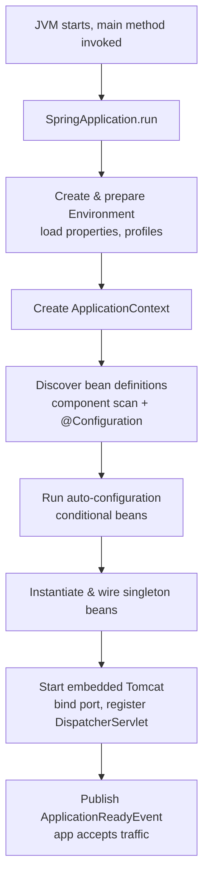

Step by step, at a practical level:

1. **JVM starts** and calls your `main`, which calls `SpringApplication.run(App.class, args)`.
2. **Environment created** — property sources are assembled and ordered: command-line args > OS env vars > `application-{profile}.yml` > `application.yml` > defaults. Active profiles are resolved here.
3. **ApplicationContext created** — for a web app this is a `ServletWebServerApplicationContext`.
4. **Bean definitions discovered** — component scanning finds `@Component/@Service/@Repository/@Controller`, and `@Configuration` classes contribute `@Bean` methods. Nothing is instantiated yet; definitions are just registered.
5. **Auto-configuration runs** — `spring.factories`/`AutoConfiguration.imports` classes are evaluated against `@Conditional` rules.
6. **Beans instantiated & wired** — singletons are eagerly created, dependencies injected, `@PostConstruct` and `InitializingBean` run. **Startup failures usually happen here** (missing bean, bad config, DB unreachable at init).
7. **Embedded server starts** — Tomcat binds the port and registers the `DispatcherServlet`.
8. **ApplicationReadyEvent** published — the app is live. Good place for warm-up/cache priming (but keep it fast — it delays readiness).

> **SDE2 Interview Tip:** If asked "why is startup slow / why did startup fail?", map the symptom to a phase: config/profile issues → step 2; `NoSuchBeanDefinitionException`/circular refs → steps 4–6; "port already in use" / DB connection at boot → steps 6–7.

## Key Takeaways
- Spring Boot = Spring + auto-config + starters + embedded server + Actuator. The core container knowledge is the foundation.
- Startup is a deterministic lifecycle; knowing the phases makes startup failures debuggable.
- Invest deeply in Core/MVC/Data/Security/Test; treat Batch/Integration/Cloud as conceptual.

## Common Mistakes
- Treating Boot as "magic" and never learning the underlying container — you can't debug auto-configuration you don't understand.
- Fighting the conventions (e.g., custom component-scan packages above the main class) and then wondering why beans aren't found.
- Doing heavy work in `ApplicationReadyEvent`/`@PostConstruct` and delaying readiness.

## Production Considerations
- Pin versions through the Boot BOM; don't override transitive versions casually.
- Keep the main application class in a root package so component scanning covers all sub-packages.
- Externalize config (§4); never bake environment-specific values into the JAR.

## SDE2 Interview Questions
- *Walk me through what happens from `java -jar` to the app serving traffic.* (lifecycle above)
- *What's the difference between Spring and Spring Boot?* (Boot adds opinionated auto-config/starters/embedded server; same container.)
- *Which Spring modules do you actually use and why?*

## Practical Exercise
Create a minimal Boot app with `spring-boot-starter-web`. Add an `ApplicationListener<ApplicationReadyEvent>` that logs startup duration. Then add `-Ddebug=true` and inspect the auto-configuration report to see which auto-configs matched/were excluded.

---

# 2. IoC, Dependency Injection and Beans

## 2.1 Inversion of Control and Dependency Injection

**IoC** means the framework, not your code, controls object creation and wiring. **DI** is the mechanism: instead of a class constructing its collaborators (`new OrderRepository()`), the collaborators are *given* to it.

```java
// Tight coupling — hard to test, hard to swap implementations
public class OrderService {
    private final OrderRepository repo = new JpaOrderRepository(); // bad
}

// DI — the container supplies the dependency
@Service
public class OrderService {
    private final OrderRepository repo;
    public OrderService(OrderRepository repo) { this.repo = repo; } // good
}
```

Benefits: testability (inject a mock), swappability (inject a different implementation per profile), lifecycle management, and centralized configuration.

## 2.2 ApplicationContext vs BeanFactory

- **`BeanFactory`** — the base container: lazily instantiates beans on demand. Rarely used directly.
- **`ApplicationContext`** — the production container: a `BeanFactory` superset that adds eager singleton instantiation, event publishing, internationalization, resource loading, and `BeanPostProcessor`/`BeanFactoryPostProcessor` support. This is what Boot creates.

## 2.3 Stereotypes and Configuration Annotations

| Annotation | Meaning |
|---|---|
| `@Component` | Generic Spring-managed bean |
| `@Service` | Component in the business/service layer (semantic only) |
| `@Repository` | Data-access component; **also** translates persistence exceptions into Spring's `DataAccessException` hierarchy |
| `@Controller` | Web controller returning views |
| `@RestController` | `@Controller` + `@ResponseBody` — returns serialized bodies |
| `@Configuration` | Class that declares `@Bean` methods; proxied so inter-bean calls return singletons |
| `@Bean` | Factory method producing a bean (use for third-party classes you can't annotate) |

> **Important:** `@Repository`'s exception translation is real behavior, not just documentation. `@Service`/`@Component` are semantically identical to the container; the distinction is for humans and tooling.

## 2.4 Injection Styles

```java
// 1. Constructor injection — PREFERRED
@Service
public class OrderService {
    private final OrderRepository repo;
    private final PaymentClient payment;
    public OrderService(OrderRepository repo, PaymentClient payment) {
        this.repo = repo;
        this.payment = payment;
    }
}

// 2. Setter injection — for optional/reconfigurable dependencies
@Autowired
public void setAuditSink(AuditSink sink) { this.sink = sink; }

// 3. Field injection — AVOID
@Autowired private OrderRepository repo; // discouraged
```

**Why constructor injection is preferred:**

- **Immutability** — fields can be `final`; the object is fully initialized once constructed.
- **Explicit required dependencies** — the compiler forces callers (and tests) to provide them; no half-built objects.
- **No hidden container coupling** — you can `new` the class in a unit test without Spring.
- **Fail-fast on cycles** — circular dependencies are detected at startup rather than hidden.
- **Thread safety** — `final` fields are safely published.

Field injection hides dependencies, makes testing require reflection, and permits unbounded constructor growth to go unnoticed (a design smell).

> **Best Practice:** Constructor injection everywhere. With a single constructor you don't even need `@Autowired` (Spring infers it). If a class needs many dependencies, that's a signal it's doing too much — split it.

## 2.5 Bean Scopes

| Scope | Lifetime | Use when |
|---|---|---|
| `singleton` (default) | One instance per container | Stateless services, repositories — 95% of beans |
| `prototype` | New instance per injection/lookup | Stateful, short-lived helpers |
| `request` | One per HTTP request | Request-scoped state (rare) |
| `session` | One per HTTP session | Per-user web state (rare in stateless APIs) |
| `application` | One per `ServletContext` | App-wide servlet state |
| `websocket` | One per WebSocket session | WS session state |

> **Production Warning:** Singleton beans are shared across all request threads. Keep them **stateless**. Mutable instance fields on a singleton are a race condition waiting to happen. If a singleton must depend on a shorter-lived scoped bean, inject an `ObjectProvider` or a scoped proxy — don't inject the short-lived bean directly (it would be captured once at startup).

## 2.6 Bean Lifecycle

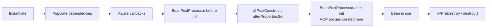

```java
@Component
public class WarmupCache {
    @PostConstruct
    void init() { /* load reference data after wiring */ }

    @PreDestroy
    void shutdown() { /* release resources before context closes */ }
}
```

- `@PostConstruct` / `InitializingBean.afterPropertiesSet()` run after dependencies are injected.
- `@PreDestroy` / `DisposableBean.destroy()` run on graceful shutdown (singletons only; prototypes are not destroyed by the container).
- **AOP proxies are created by a `BeanPostProcessor` after initialization** — this is why self-invocation bypasses proxies (§18).

## 2.7 Disambiguation and Wiring Helpers

```java
public interface PaymentGateway {}

@Component @Primary
class StripeGateway implements PaymentGateway {}

@Component("paypal")
class PaypalGateway implements PaymentGateway {}

@Service
class CheckoutService {
    // @Primary wins by default
    CheckoutService(PaymentGateway defaultGateway,
                    @Qualifier("paypal") PaymentGateway paypal) { ... }
}
```

- `@Primary` — the default choice when multiple candidates exist.
- `@Qualifier` — select a specific bean by name/qualifier.
- `@Lazy` — defer instantiation until first use (also one way to break a cycle).
- `ObjectProvider<T>` — lazy, optional, or multiple-candidate resolution without failing at startup:

```java
@Service
class NotificationService {
    private final ObjectProvider<SmsSender> smsSenders;
    NotificationService(ObjectProvider<SmsSender> smsSenders) { this.smsSenders = smsSenders; }
    void notifyUser() {
        smsSenders.ifAvailable(sender -> sender.send(...)); // no-op if none configured
    }
}
```

## 2.8 Multiple Implementations and Collections

Spring can inject all implementations of a type as a `List` or `Map` — a clean Strategy pattern:

```java
@Service
class DiscountEngine {
    private final List<DiscountRule> rules; // all beans implementing DiscountRule
    DiscountEngine(List<DiscountRule> rules) { this.rules = rules; }
    BigDecimal apply(Cart cart) {
        return rules.stream().map(r -> r.discount(cart)).reduce(ZERO, BigDecimal::add);
    }
}
```

## 2.9 Circular Dependencies

If A needs B and B needs A via **constructor injection**, startup fails (neither can be built first). Spring can resolve setter/field cycles for singletons by injecting a partial reference, but this is fragile.

> **Best Practice:** A circular dependency is a design smell. Fix it by extracting the shared logic into a third bean, using an event, or injecting `ObjectProvider`/`@Lazy` as a last resort — don't just add `@Lazy` and move on.

## Key Takeaways
- Prefer constructor injection: immutable, explicit, testable, fail-fast.
- Singletons are shared and must be stateless/thread-safe.
- `@PostConstruct`/`@PreDestroy` bracket the usable lifetime; AOP proxies wrap the bean after init.
- Use `@Primary`/`@Qualifier`/`ObjectProvider` for multiple implementations; prefer collection injection for Strategy.

## Common Mistakes
- Field injection, then needing reflection to unit test.
- Mutable state on singletons → race conditions.
- Injecting a request/prototype bean directly into a singleton (captured once).
- Hiding circular dependencies with `@Lazy` instead of fixing the design.

## Production Considerations
- Keep constructor dependency counts low; many dependencies = SRP violation.
- Use `@PreDestroy` to release pools/clients so graceful shutdown is clean (§58).

## SDE2 Interview Questions
- *Why is constructor injection preferred?* (immutability, explicit deps, testability, cycle detection, thread safety)
- *Are singleton beans thread-safe?* (The bean *instance* is shared; thread safety depends on your not holding mutable state.)
- *How do you inject one of several implementations?* (`@Qualifier`/`@Primary`/collection/`ObjectProvider`)
- *What does `@Repository` add beyond `@Component`?* (exception translation)

## Practical Exercise
Define an interface with three `@Component` implementations. Inject them as a `List` and as a `Map<String,Impl>`. Add a `@Primary`, then override it at one injection point with `@Qualifier`. Add a `@PostConstruct` log line and confirm ordering relative to dependency injection.

---

# 3. Spring Boot Auto-Configuration

## 3.1 `@SpringBootApplication`

```java
@SpringBootApplication // = @Configuration + @EnableAutoConfiguration + @ComponentScan
public class Application {
    public static void main(String[] args) { SpringApplication.run(Application.class, args); }
}
```

- `@Configuration` — this class can declare beans.
- `@ComponentScan` — scan this package and below for stereotypes.
- `@EnableAutoConfiguration` — activate Boot's conditional auto-configuration.

## 3.2 How Auto-Configuration Decides

Boot ships hundreds of `@AutoConfiguration` classes (listed in `META-INF/spring/org.springframework.boot.autoconfigure.AutoConfiguration.imports`). Each is guarded by `@Conditional` rules evaluated at startup:

```java
@AutoConfiguration
@ConditionalOnClass(DataSource.class)                 // JDBC on classpath?
@ConditionalOnMissingBean(DataSource.class)           // user hasn't defined one?
@EnableConfigurationProperties(DataSourceProperties.class)
class DataSourceAutoConfiguration {
    @Bean
    DataSource dataSource(DataSourceProperties props) { /* build HikariCP */ }
}
```

So "I see PostgreSQL driver + Spring Data JPA on the classpath + `spring.datasource.*` properties → configure a HikariCP `DataSource`, an `EntityManagerFactory`, a `JpaTransactionManager`, and enable repositories" is just a chain of these conditions matching.

| Condition | Fires when |
|---|---|
| `@ConditionalOnClass` | A class is present on the classpath |
| `@ConditionalOnMissingClass` | A class is absent |
| `@ConditionalOnBean` | A bean of a type already exists |
| `@ConditionalOnMissingBean` | No such bean exists (lets you override by defining your own) |
| `@ConditionalOnProperty` | A property has a given value |
| `@ConditionalOnWebApplication` | Running as a web app |

> **Important:** `@ConditionalOnMissingBean` is the override hook. Define your own `DataSource`/`ObjectMapper`/`SecurityFilterChain` bean and Boot backs off. You rarely need to disable auto-config explicitly — just provide the bean.

## 3.3 Debugging Auto-Configuration

- Run with `--debug` (or `-Ddebug=true`) to print the **Condition Evaluation Report**: *Positive matches* (auto-configs that applied) and *Negative matches* (and *why* they didn't).
- Common reasons a bean "doesn't exist": the triggering class isn't on the classpath, a required property is missing, or another bean of that type already exists so `@ConditionalOnMissingBean` suppressed it.

```bash
java -jar app.jar --debug | grep -A2 "DataSourceAutoConfiguration"
```

## 3.4 Overriding and Excluding

```java
// Exclude a specific auto-config
@SpringBootApplication(exclude = { SecurityAutoConfiguration.class })

// Or just define your own bean — @ConditionalOnMissingBean steps aside
@Bean
ObjectMapper objectMapper() { return JsonMapper.builder()... .build(); }
```

**When explicit configuration is better:** when defaults don't match your needs (custom connection-pool tuning, custom security chain, multiple datasources), or when you want the configuration to be visible and reviewable rather than implicit.

## Key Takeaways
- Auto-config is just conditional beans evaluated against classpath + properties + existing beans.
- Override by defining your own bean (`@ConditionalOnMissingBean` backs off) or by excluding the auto-config.
- `--debug` prints exactly what matched and why.

## Common Mistakes
- Assuming a bean exists when a condition silently failed (missing driver, missing property).
- Excluding whole auto-configs when defining one override bean would suffice.
- Multiple `DataSource` beans without `@Primary`, breaking JPA auto-config.

## Production Considerations
- Keep auto-config visible in reviews: when you deviate from defaults (pool size, security), do it in an explicit `@Configuration`.
- Beware two libraries both auto-configuring the same concern (e.g., two tracing agents).

## SDE2 Interview Questions
- *How does Boot know to configure a DataSource?* (conditions on classpath + properties + missing bean)
- *How do you override an auto-configured bean?* (`@ConditionalOnMissingBean` → define your own)
- *How do you debug why a bean wasn't created?* (condition evaluation report)

## Practical Exercise
Add `spring-boot-starter-data-jpa` + the Postgres driver but no `spring.datasource.url`. Observe the startup failure. Then add the property and inspect the condition report to see `DataSourceAutoConfiguration` flip from negative to positive match.

---

# 4. Configuration and Profiles

## 4.1 Property Sources and Precedence

Boot assembles many property sources into one `Environment`. Later (higher-precedence) sources override earlier ones. Simplified order (highest wins):

1. Command-line args (`--server.port=9090`)
2. OS environment variables (`SERVER_PORT=9090`) and `SPRING_APPLICATION_JSON`
3. `application-{profile}.yml` / `.properties`
4. `application.yml` / `.properties`
5. `@PropertySource` and defaults

> **Important:** Environment variables use relaxed binding: `spring.datasource.url` ↔ `SPRING_DATASOURCE_URL`. This is how you inject config in Docker/Kubernetes/ECS without changing files.

## 4.2 `application.yml` and Profiles

```yaml
# application.yml (common defaults)
spring:
  application:
    name: order-service
  jpa:
    open-in-view: false        # turn OSIV off — see §14
server:
  shutdown: graceful           # see §58

---
spring:
  config:
    activate:
      on-profile: dev
  datasource:
    url: jdbc:postgresql://localhost:5432/orders
logging:
  level:
    org.hibernate.SQL: debug

---
spring:
  config:
    activate:
      on-profile: prod
  datasource:
    url: ${DB_URL}             # injected from env/secret
    hikari:
      maximum-pool-size: 20
```

Activate a profile: `--spring.profiles.active=prod` or `SPRING_PROFILES_ACTIVE=prod`. Keep `application-dev.yml`, `application-test.yml`, `application-prod.yml` for environment-specific values; never put prod secrets in the repo.

## 4.3 `@Value` vs `@ConfigurationProperties`

```java
// @Value — fine for one-off scalars
@Value("${app.max-upload-size:10MB}")
private String maxUploadSize;

// @ConfigurationProperties — PREFERRED for grouped, typed, validated config
@ConfigurationProperties(prefix = "app.payment")
@Validated
public record PaymentProperties(
    @NotBlank String apiBaseUrl,
    @NotNull Duration timeout,
    @Min(1) int maxRetries
) {}
```

```yaml
app:
  payment:
    api-base-url: https://payments.example.com
    timeout: 2s
    max-retries: 3
```

Enable with `@ConfigurationPropertiesScan` on the main class (or `@EnableConfigurationProperties`).

| | `@Value` | `@ConfigurationProperties` |
|---|---|---|
| Grouping | Scattered individual fields | Cohesive typed object |
| Type conversion | Strings, SpEL | Rich (`Duration`, `DataSize`, enums, nested) |
| Validation | None built in | `@Validated` + Jakarta constraints |
| Relaxed binding | Limited | Full |
| IDE/metadata | No | Yes (with the metadata processor) |

> **Best Practice:** Use `@ConfigurationProperties` for any logically grouped config. It fails fast at startup if invalid, is strongly typed, and is far easier to test and document than scattered `@Value`s.

## 4.4 External Config & Secret Management

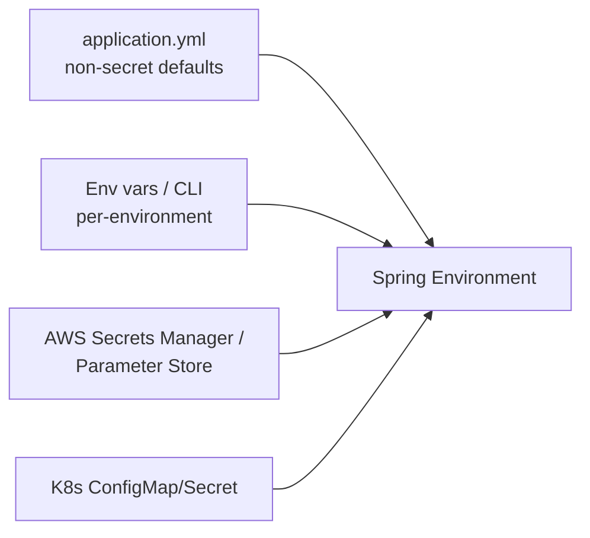

- **Docker:** pass `-e SPRING_PROFILES_ACTIVE=prod -e DB_URL=...`.
- **AWS Parameter Store / Secrets Manager:** inject via container env at task launch, or use `spring-cloud-aws` to pull them into the `Environment`.
- **Kubernetes:** `ConfigMap` → env/mounted file for non-secrets; `Secret` → env/mounted file for secrets (prefer mounted files + restricted RBAC).

> **Production Warning:** Never commit secrets (DB passwords, JWT signing keys, API keys) to the repo or bake them into images. Never log them (§42). Rotate them. Prefer a secret manager over plain env vars where possible, and restrict who/what can read them.

### Good vs bad

```yaml
# BAD — secret in repo, environment-specific URL hardcoded
spring:
  datasource:
    url: jdbc:postgresql://prod-db:5432/orders
    password: S3cr3t!

# GOOD — placeholder resolved from env/secret manager at runtime
spring:
  datasource:
    url: ${DB_URL}
    username: ${DB_USER}
    password: ${DB_PASSWORD}
```

## Key Takeaways
- One `Environment` built from ordered sources; env vars/CLI override files (great for containers).
- Profiles separate environments; keep secrets out of the repo.
- Prefer typed, validated `@ConfigurationProperties` over scattered `@Value`.

## Common Mistakes
- Secrets in `application-prod.yml` committed to Git.
- Relying on `@Value` for complex config and discovering typos only at runtime.
- Forgetting relaxed binding and fighting env-var naming.

## Production Considerations
- Validate config at startup (`@Validated` on properties) so bad config fails fast, not at first request.
- Keep `open-in-view: false` and `server.shutdown: graceful` in prod config.

## SDE2 Interview Questions
- *How does property precedence work and why does it matter for containers?*
- *`@Value` vs `@ConfigurationProperties` — when do you use each?*
- *How do you manage secrets in prod?* (secret manager, env injection, no repo secrets, rotation, no logging)

## Practical Exercise
Create `PaymentProperties` with `@ConfigurationProperties` + `@Validated`. Give it an invalid default and confirm the app fails to start with a clear message. Then supply a valid value via an environment variable and confirm relaxed binding works.

---

# 5. Spring MVC and HTTP Request Lifecycle

## 5.1 The Journey of a Request

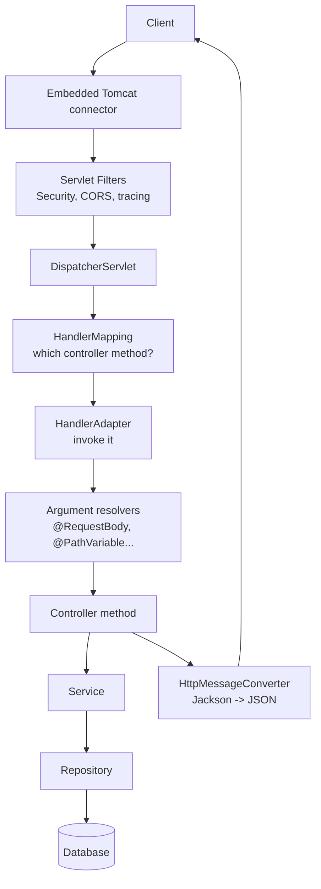

1. **Tomcat** accepts the connection and hands the request to a worker thread (thread-per-request model, §44).
2. **Servlet filters** run first (ordered). Spring Security's filter chain, CORS, request-logging/MDC filters live here — *before* any controller code.
3. **`DispatcherServlet`** is the front controller. It orchestrates everything below.
4. **`HandlerMapping`** maps the URL+method to a `@RequestMapping` handler method.
5. **`HandlerAdapter`** invokes the handler. **Argument resolvers** populate parameters (`@RequestBody` via `HttpMessageConverter`, `@PathVariable`, `@RequestParam`, `@RequestHeader`, `Authentication`, etc.).
6. The **controller** delegates to the **service** (business logic + transactions) → **repository** → **DB**.
7. The return value is turned into a response by an **`HttpMessageConverter`** (Jackson for JSON). Exceptions are routed to `@ExceptionHandler`/`@ControllerAdvice` (§10).

> **Important:** Filters run outside Spring MVC and even outside `@ControllerAdvice`. An exception thrown in a filter (e.g., auth failure) is *not* caught by your `@RestControllerAdvice` unless you handle it in the filter chain / an `AuthenticationEntryPoint`. This trips up a lot of engineers.

## 5.2 Key Components

- **`DispatcherServlet`** — single front controller; everything flows through it.
- **`HandlerMapping`** — resolves the handler (`RequestMappingHandlerMapping`).
- **`HandlerAdapter`** — calls the handler and manages arg resolution/return handling.
- **`HttpMessageConverter`** — (de)serializes bodies; `MappingJackson2HttpMessageConverter` for JSON.

## 5.3 Mapping Annotations

```java
@RestController
@RequestMapping("/api/orders")
public class OrderController {
    @GetMapping("/{id}")          // GET
    @PostMapping                  // POST (create)
    @PutMapping("/{id}")          // PUT (full replace)
    @PatchMapping("/{id}")        // PATCH (partial update)
    @DeleteMapping("/{id}")       // DELETE
}
```

`@Controller` returns view names (server-rendered); `@RestController` = `@Controller + @ResponseBody`, returning serialized bodies — the default for APIs.

## Key Takeaways
- One `DispatcherServlet` orchestrates mapping → adapter → controller → converters.
- Filters (incl. Security) run before controllers and outside `@ControllerAdvice`.
- Thread-per-request: a blocked controller thread holds a Tomcat worker (§44).

## Common Mistakes
- Expecting `@RestControllerAdvice` to catch filter-level/security exceptions.
- Heavy logic in controllers instead of services.

## Production Considerations
- Put correlation-ID/MDC population in a filter so every log line (incl. errors) carries it (§41–42).
- Tune Tomcat threads relative to the DB pool (§57) — the chain is only as wide as its narrowest pool.

## SDE2 Interview Questions
- *Trace an HTTP request through Spring MVC.*
- *Why can't `@ControllerAdvice` catch a Spring Security authentication failure?*
- *What is the thread model of Spring MVC?*

## Practical Exercise
Add an `OncePerRequestFilter` that puts a generated `traceId` into the MDC and a response header. Confirm it appears in logs for both successful and error responses.

---

# 6. REST API Development

## 6.1 REST Principles

REST models your domain as **resources** identified by URIs, manipulated with standard **HTTP methods**, communicating **stateless** requests (every request carries its own auth/context — crucial for horizontal scaling). Representations (usually JSON) are exchanged; status codes convey outcome.

| Method | Semantics | Safe | Idempotent |
|---|---|---|---|
| GET | Read | ✅ | ✅ |
| POST | Create / non-idempotent action | ❌ | ❌ |
| PUT | Full replace/create at known URI | ❌ | ✅ |
| PATCH | Partial update | ❌ | ❌ (usually) |
| DELETE | Remove | ❌ | ✅ |

> **Important:** *Safe* = no state change. *Idempotent* = same effect whether called once or N times. These drive retry safety (§33, §50): clients/proxies may safely retry GET/PUT/DELETE but not POST unless you add idempotency keys.

## 6.2 Binding Request Data

```java
@GetMapping("/{id}")
public OrderResponse get(@PathVariable UUID id,
                         @RequestParam(defaultValue = "false") boolean expand,
                         @RequestHeader("X-Tenant-Id") String tenant,
                         @CookieValue(value = "sid", required = false) String session) { ... }

@PostMapping
public ResponseEntity<OrderResponse> create(@Valid @RequestBody CreateOrderRequest req) {
    OrderResponse created = service.create(req);
    return ResponseEntity
        .created(URI.create("/api/orders/" + created.id())) // 201 + Location header
        .body(created);
}
```

- `@PathVariable` — identity in the path.
- `@RequestParam` — query params for filters/pagination/flags.
- `@RequestBody` — deserialized JSON payload (validate it with `@Valid`).
- `@RequestHeader` / `@CookieValue` — headers/cookies.

## 6.3 `ResponseEntity`, DTOs, and Status Codes

Use `ResponseEntity` when you need to control status/headers (e.g., `201 Created` + `Location`, `ETag`, cache headers). Return DTOs, never entities (§8).

| Code | Meaning | When |
|---|---|---|
| 200 | OK | Successful GET/PUT/PATCH with body |
| 201 | Created | POST created a resource (+ `Location`) |
| 202 | Accepted | Async accepted, not yet processed |
| 204 | No Content | Success, no body (DELETE, some PUT) |
| 400 | Bad Request | Malformed/invalid input (validation) |
| 401 | Unauthorized | Missing/invalid authentication |
| 403 | Forbidden | Authenticated but not authorized |
| 404 | Not Found | Resource doesn't exist (or hidden for authz) |
| 409 | Conflict | Version conflict / duplicate / state conflict |
| 422 | Unprocessable Entity | Syntactically valid but semantically invalid |
| 429 | Too Many Requests | Rate limited (+ `Retry-After`) |
| 500 | Internal Server Error | Unhandled server bug |
| 502 | Bad Gateway | Upstream returned invalid response |
| 503 | Service Unavailable | Overloaded/shutting down (+ `Retry-After`) |
| 504 | Gateway Timeout | Upstream timed out |

> **Best Practice:** 400 vs 422 — use 400 for malformed requests (bad JSON, wrong types, missing required field) and 422 for well-formed requests that violate business rules (e.g., "order already shipped"). Pick one convention and apply it consistently. Use 409 for optimistic-lock/version conflicts (§51).

> **Production Warning:** Return 404 (not 403) for resources the caller isn't allowed to even know exist — leaking existence via 403 is an information-disclosure issue in multi-tenant systems.

## Key Takeaways
- Model resources + standard methods; keep requests stateless.
- Validate request bodies; return DTOs; set precise status codes and `Location`.
- Method safety/idempotency drives retry behavior.

## Common Mistakes
- 200 for everything; using 500 for client input errors.
- Returning entities directly (§8).
- Not setting `Location` on 201 or `Retry-After` on 429/503.

## Production Considerations
- Standardize an error body across all endpoints (§10).
- Document status codes in OpenAPI (§59).

## SDE2 Interview Questions
- *Which HTTP methods are idempotent and why does it matter for retries?*
- *400 vs 422 vs 409 — give concrete examples.*
- *When do you return 404 vs 403?*

## Practical Exercise
Implement full CRUD for `Order` returning correct codes: 201+`Location` on create, 200 on read/update, 204 on delete, 404 on missing, 409 on version conflict.

---

# 7. REST API Design at SDE2 Level

## 7.1 URI and Resource Design

- Use **plural nouns**: `/orders`, `/orders/{id}/items`. Avoid verbs in paths (`/getOrders` ❌).
- **Nested resources** express ownership: `/customers/{id}/orders`. Don't nest more than ~2 levels; prefer top-level resources with filters beyond that.
- Keep responses consistent; use `kebab-case` or `camelCase` consistently for fields.

## 7.2 Pagination, Filtering, Sorting

```java
// GET /api/orders?status=PAID&sort=createdAt,desc&page=0&size=20
@GetMapping
public Page<OrderResponse> list(@RequestParam(required=false) OrderStatus status,
                                Pageable pageable) {
    return service.search(status, pageable).map(mapper::toResponse);
}
```

### Pagination strategies

| Strategy | How | Pros | Cons | Use when |
|---|---|---|---|---|
| **Offset** (`LIMIT/OFFSET`) | `page*size` | Simple, jump to any page | Slow at high offsets (DB scans+discards), inconsistent under writes | Small datasets, admin UIs |
| **Keyset / Seek** | `WHERE (created_at,id) < (:ts,:id) ORDER BY ... LIMIT n` | Fast at any depth, stable under inserts | No random page jumps | Large, frequently-updated tables |
| **Cursor** | Opaque token encoding keyset position | Clean API, hides internals | Server must encode/decode cursor | Public APIs, infinite scroll |

> **Production Warning:** Offset pagination degrades badly on large tables: `OFFSET 1000000` makes the DB read and discard a million rows. For large or hot tables, use **keyset/cursor pagination** ordered by an indexed, unique, monotonic key (§20).

## 7.3 Versioning and Backward Compatibility

- **URI versioning** (`/v1/orders`) — simplest, most visible, cache/proxy friendly. Most common.
- **Header/media-type versioning** (`Accept: application/vnd.acme.v2+json`) — cleaner URIs, harder to test/debug.

**Non-breaking changes** (safe): adding optional fields, adding new endpoints, adding new optional params. **Breaking changes** (require a new version): removing/renaming fields, changing types, tightening validation, changing semantics.

> **Best Practice:** Follow the robustness principle — be strict in what you require, tolerant in what you accept. Deserialize ignoring unknown fields (§9) and never remove a response field without a version bump and a deprecation window.

## 7.4 Idempotency and Safe Retries

Networks fail after the server committed but before the client got the response. The client retries → double creation unless the write is idempotent.

```java
// POST /api/payments   Idempotency-Key: 7c9e-...
@PostMapping("/payments")
public ResponseEntity<PaymentResponse> pay(@RequestHeader("Idempotency-Key") String key,
                                           @Valid @RequestBody PaymentRequest req) {
    return ResponseEntity.ok(paymentService.process(key, req));
}
```

Store the key with the result; a replay returns the stored result instead of re-charging (full pattern in §50).

## 7.5 ETags, Cache-Control, Conditional Requests

```java
@GetMapping("/{id}")
public ResponseEntity<OrderResponse> get(@PathVariable UUID id) {
    OrderResponse o = service.get(id);
    return ResponseEntity.ok()
        .eTag("\"" + o.version() + "\"")                 // weak concurrency token
        .cacheControl(CacheControl.maxAge(Duration.ofSeconds(30)))
        .body(o);
}
```

- `If-None-Match` → return **304 Not Modified** when unchanged (saves bandwidth).
- `If-Match` on PUT/PATCH → return **412 Precondition Failed** on stale updates (optimistic concurrency over HTTP, pairs with `@Version`, §51).

## Key Takeaways
- Nouns + nesting for ownership; filters/sort/pagination via query params.
- Prefer keyset/cursor pagination on large tables.
- Version to avoid breaking clients; add idempotency keys for unsafe retries.
- ETags/conditional requests give caching + optimistic concurrency at the HTTP layer.

## Common Mistakes
- Deep offset pagination on huge tables.
- Breaking clients by removing/renaming fields without versioning.
- Non-idempotent create endpoints that double-charge on retry.

## Production Considerations
- Cap page size server-side (e.g., max 100) to protect the DB.
- Treat the API as a contract: document it (§59), test it, deprecate gracefully.

## SDE2 Interview Questions
- *Offset vs keyset vs cursor pagination — trade-offs and when to use each.*
- *How do you evolve an API without breaking clients?*
- *How do ETags enable both caching and optimistic concurrency?*

## Practical Exercise
Implement keyset pagination on `/orders` ordered by `(createdAt, id)` returning a `nextCursor`. Add ETag support with `If-None-Match` → 304.

---

# 8. DTOs and Mapping

## 8.1 Entity vs DTO

An **entity** is a persistence object managed by Hibernate (mutable, has lazy associations, maps to a table). A **DTO** is a plain data carrier shaping your API contract. Keep **request DTOs** (what clients may send) separate from **response DTOs** (what you return).

```java
public record CreateOrderRequest(@NotNull UUID customerId,
                                 @NotEmpty List<@Valid OrderLineRequest> items) {}

public record OrderResponse(UUID id, OrderStatus status, BigDecimal total,
                            Instant createdAt, long version) {}
```

## 8.2 Why Not Expose Entities Directly

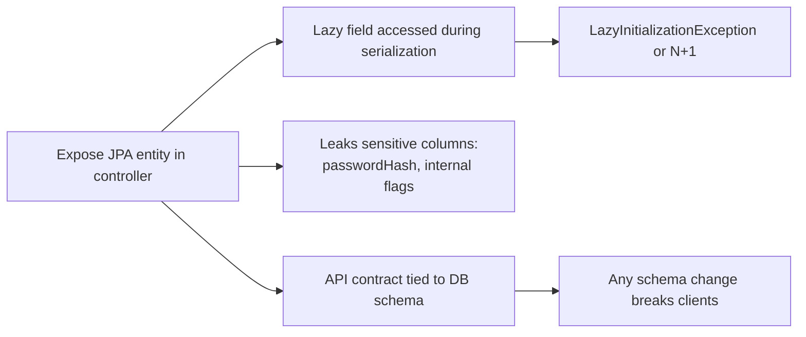

- **Lazy loading / `LazyInitializationException`** — Jackson touches a lazy association after the transaction/session closed (made worse by relying on Open-Session-In-View, which you should disable, §14).
- **Sensitive fields** — entities often carry columns clients must never see.
- **Coupling** — your API contract becomes your DB schema; migrations become breaking API changes.
- **Serialization problems** — bidirectional relationships cause infinite recursion.

> **Best Practice:** Controllers accept and return DTOs only. Map at the service/boundary. This decouples the wire contract from storage and eliminates lazy-loading-during-serialization bugs.

## 8.3 Mapping: Manual vs MapStruct

```java
// MapStruct — compile-time generated mappers, fast, type-safe
@Mapper(componentModel = "spring")
public interface OrderMapper {
    OrderResponse toResponse(Order order);
    @Mapping(target = "id", ignore = true)
    @Mapping(target = "status", constant = "CREATED")
    Order toEntity(CreateOrderRequest req);
}
```

- **Manual mapping** — explicit, zero magic, verbose; fine for small projects.
- **MapStruct** — generates mapping code at compile time (no reflection, fast, fails the build on mismatches). Preferred for non-trivial projects. Avoid reflection-based mappers (ModelMapper) in hot paths.

## Key Takeaways
- Separate request/response DTOs from entities; map at the boundary.
- Exposing entities leaks data, couples contract to schema, and causes lazy-loading bugs.
- MapStruct for performant, compile-time-checked mapping.

## Common Mistakes
- `@Entity` as `@RequestBody`/response → `LazyInitializationException`, over-posting, leaks.
- Reusing the same DTO for request and response with half the fields ignored.
- Reflection mappers in hot paths.

## Production Considerations
- Validate request DTOs (§11); never trust client-supplied `id`/`status`/`role` on writes (mass-assignment).
- Keep response DTOs stable; evolve carefully (§7).

## SDE2 Interview Questions
- *Why not return JPA entities from controllers?*
- *How do you prevent over-posting / mass assignment?* (explicit request DTOs with only mutable fields)
- *MapStruct vs manual vs reflection mapping — trade-offs.*

## Practical Exercise
Convert an endpoint that returns an entity to return a DTO via a MapStruct mapper. Add a `passwordHash`/internal field to the entity and confirm it no longer leaks.

---

# 9. Jackson and JSON

## 9.1 Serialization / Deserialization

Boot auto-configures a single `ObjectMapper`. Serialization = object→JSON (responses); deserialization = JSON→object (`@RequestBody`). Customize globally via properties or by defining your own `ObjectMapper`/`Jackson2ObjectMapperBuilderCustomizer`.

## 9.2 Core Annotations

```java
public record UserResponse(
    @JsonProperty("user_id") UUID id,         // rename on the wire
    String email,
    @JsonIgnore String passwordHash,          // never serialize
    @JsonFormat(shape = STRING, pattern = "yyyy-MM-dd'T'HH:mm:ssXXX")
    Instant createdAt,
    @JsonInclude(JsonInclude.Include.NON_NULL) String nickname // omit when null
) {}
```

- `@JsonProperty` — rename / include a field.
- `@JsonIgnore` — exclude (e.g., secrets).
- `@JsonInclude(NON_NULL)` — omit nulls to keep payloads lean.
- `@JsonFormat` — control date/enum formatting.

## 9.3 Dates, Enums, Nulls, Unknown Fields

```yaml
spring:
  jackson:
    default-property-inclusion: non_null
    deserialization:
      fail-on-unknown-properties: false   # tolerant reads (API evolution)
    serialization:
      write-dates-as-timestamps: false    # ISO-8601 strings, not epoch millis
```

- **Dates:** use `java.time` (`Instant`/`OffsetDateTime`) with `jackson-datatype-jsr310` (bundled). Serialize as ISO-8601, not epoch numbers, and always include a timezone/offset.
- **Enums:** by default serialize by `name()`. For stable contracts, map explicitly (`@JsonValue`) so renaming the Java enum doesn't break the wire format.
- **Unknown fields:** keep `fail-on-unknown-properties=false` so adding fields upstream doesn't break your consumer (robustness principle).

> **Production Warning:** Enum pitfalls bite in production: an unknown incoming enum value throws during deserialization (→ 400), and renaming an enum constant silently changes the wire value. Use a dedicated string field or `@JsonValue`/custom deserializer with an explicit `UNKNOWN` fallback for forward compatibility on consumers.

## 9.4 Custom (De)serializers

```java
public class MoneySerializer extends JsonSerializer<Money> {
    public void serialize(Money m, JsonGenerator g, SerializerProvider p) throws IOException {
        g.writeString(m.amount().toPlainString() + " " + m.currency());
    }
}
```

Register with `@JsonSerialize(using = MoneySerializer.class)` or a module. Use for value types (money, custom IDs) where default mapping is wrong.

## Key Takeaways
- One shared `ObjectMapper`; tune globally via properties.
- ISO-8601 dates with offsets; be deliberate with enums; tolerate unknown fields.
- Use annotations/custom serializers to shape and protect the contract.

## Common Mistakes
- Epoch-millis dates and timezone-less timestamps.
- Enum renames breaking the wire format; unknown enum values crashing deserialization.
- `fail-on-unknown-properties=true` making every upstream addition a breaking change.

## Production Considerations
- Never serialize secrets; `@JsonIgnore` + DTO separation is defense in depth.
- Keep payloads small (`NON_NULL`) for latency/bandwidth.

## SDE2 Interview Questions
- *How do you handle dates/timezones in a JSON API?*
- *What breaks when you rename an enum constant and how do you prevent it?*
- *Why tolerate unknown fields on deserialization?*

## Practical Exercise
Create a `Money` type with a custom serializer/deserializer. Add an endpoint, verify round-trip, then add an unknown field to the request and confirm it's ignored (not a 400).

---

# 10. Exception Handling

## 10.1 Exception Taxonomy

Model three kinds of failures distinctly:

- **Business exceptions** — expected domain violations (`OrderNotFoundException`, `InsufficientStockException`). Map to 4xx. Extend `RuntimeException` (checked exceptions pollute signatures and don't trigger rollback by default).
- **Infrastructure exceptions** — DB down, timeout, serialization failure. Map to 5xx (sometimes 503). Usually transient/retryable.
- **Validation exceptions** — bad input (`MethodArgumentNotValidException`). Map to 400/422.

```java
public class OrderNotFoundException extends RuntimeException {
    public OrderNotFoundException(UUID id) { super("Order not found: " + id); }
}
```

## 10.2 Centralized Handling with `@RestControllerAdvice`

```java
@RestControllerAdvice
public class GlobalExceptionHandler {

    @ExceptionHandler(OrderNotFoundException.class)
    public ResponseEntity<ApiError> handleNotFound(OrderNotFoundException ex,
                                                   HttpServletRequest req) {
        return build(HttpStatus.NOT_FOUND, "ORDER_NOT_FOUND", ex.getMessage(), req);
    }

    @ExceptionHandler(MethodArgumentNotValidException.class)
    public ResponseEntity<ApiError> handleValidation(MethodArgumentNotValidException ex,
                                                     HttpServletRequest req) {
        var fields = ex.getBindingResult().getFieldErrors().stream()
            .map(f -> new FieldError(f.getField(), f.getDefaultMessage())).toList();
        ApiError body = base(HttpStatus.BAD_REQUEST, "VALIDATION_FAILED",
                             "Request validation failed", req).withErrors(fields);
        return ResponseEntity.badRequest().body(body);
    }

    @ExceptionHandler(ObjectOptimisticLockingFailureException.class)
    public ResponseEntity<ApiError> handleConflict(Exception ex, HttpServletRequest req) {
        return build(HttpStatus.CONFLICT, "CONCURRENT_MODIFICATION",
                     "Resource was modified concurrently; retry", req);
    }

    @ExceptionHandler(Exception.class) // last-resort catch-all
    public ResponseEntity<ApiError> handleUnexpected(Exception ex, HttpServletRequest req) {
        log.error("Unhandled exception", ex);              // full detail in logs only
        return build(HttpStatus.INTERNAL_SERVER_ERROR, "INTERNAL_ERROR",
                     "An unexpected error occurred", req); // generic message to client
    }
}
```

`@RestControllerAdvice` = `@ControllerAdvice` + `@ResponseBody`, applied across all controllers. `@ExceptionHandler` on a controller handles only that controller.

> **Important:** Spring Boot 3's `ProblemDetail` (RFC 7807) is the modern standard body. You can extend `ResponseEntityExceptionHandler` and return `ProblemDetail`. A custom error model (below) is equally fine — just be consistent everywhere.

## 10.3 A Consistent Production Error Model

```json
{
  "code": "ORDER_NOT_FOUND",
  "message": "Order was not found",
  "timestamp": "2026-10-04T10:00:00Z",
  "path": "/api/orders/123",
  "traceId": "abc123",
  "errors": [ { "field": "quantity", "message": "must be >= 1" } ]
}
```

- **`code`** — stable, machine-readable; clients branch on this, not on human text.
- **`traceId`** — correlate the client-visible error with server logs/traces (§41). Give support/users the traceId, not a stack trace.

## 10.4 What NOT to Expose

> **Production Warning:** Never return stack traces, SQL, class names, internal hostnames, or raw exception messages to clients. They leak implementation details and attack surface. Log full detail server-side (with the traceId); return a generic, safe message. Map DB/infra exceptions to generic 5xx; map external-API failures to 502/503/504 as appropriate — don't bubble the raw upstream error.

Handling auth exceptions: `AuthenticationException`/`AccessDeniedException` are thrown in the Security filter chain and are handled by `AuthenticationEntryPoint`/`AccessDeniedHandler`, **not** `@RestControllerAdvice` (§5, §21). Configure those for consistent 401/403 bodies.

## Key Takeaways
- Distinguish business/infra/validation exceptions; map to appropriate codes centrally.
- Use a single consistent error body with a stable `code` and a `traceId`.
- Never leak internals; log detail, return generic messages.
- Security exceptions need entry-point/handler, not `@ControllerAdvice`.

## Common Mistakes
- Returning raw exception messages/stack traces to clients.
- `try/catch` sprinkled in controllers instead of centralized advice.
- Catching `Exception` in a `@Transactional` method and swallowing it, hiding a rollback-worthy failure.

## Production Considerations
- Alert on 5xx rate and on specific error `code`s.
- Keep the catch-all handler logging at ERROR with the traceId; everything else at WARN/INFO as appropriate.

## SDE2 Interview Questions
- *How do you design a consistent error contract across a service?*
- *Why can't `@RestControllerAdvice` handle a 401 from Spring Security?*
- *What should never appear in an error response?*

## Practical Exercise
Build `@RestControllerAdvice` producing the error model above, including `traceId` from MDC. Add handlers for not-found (404), validation (400), optimistic lock (409), and a catch-all (500). Verify a thrown business exception yields the right JSON.

---

# 11. Bean Validation

## 11.1 Jakarta Bean Validation

Declarative constraints on DTOs, validated by Hibernate Validator. `@Valid` on a `@RequestBody` triggers validation; failures become `MethodArgumentNotValidException` (handled in §10). `@Validated` (Spring) enables validation on method params and supports validation groups.

```java
public record CreateOrderRequest(
    @NotNull UUID customerId,
    @NotEmpty @Size(max = 50) List<@Valid OrderLineRequest> items,
    @Email String notifyEmail,
    @Pattern(regexp = "[A-Z]{3}") String currency
) {}

public record OrderLineRequest(
    @NotNull UUID productId,
    @Positive @Max(1000) int quantity
) {}

@PostMapping
public ResponseEntity<OrderResponse> create(@Valid @RequestBody CreateOrderRequest req) { ... }
```

| Annotation | Checks |
|---|---|
| `@NotNull` | not null (allows empty/blank) |
| `@NotBlank` | string: not null and has non-whitespace |
| `@NotEmpty` | collection/string: not null and size > 0 |
| `@Size(min,max)` | length/size bounds |
| `@Min`/`@Max` | numeric bounds |
| `@Positive`/`@PositiveOrZero` | sign |
| `@Email` | email shape |
| `@Pattern` | regex |

> **Important:** `@NotNull` ≠ `@NotEmpty` ≠ `@NotBlank`. `@NotNull` lets `""` pass; `@NotEmpty` requires size>0 (but allows `"  "`); `@NotBlank` requires visible characters. Choosing the wrong one is a classic bug.

## 11.2 Nested, Groups, Custom

- **Nested:** `@Valid` on a field cascades validation into nested objects (`List<@Valid OrderLineRequest>` above).
- **Groups:** validate different rules in different contexts (create vs update):

```java
public interface OnCreate {}
public interface OnUpdate {}
public record UserDto(@Null(groups=OnCreate.class) @NotNull(groups=OnUpdate.class) UUID id,
                      @NotBlank String name) {}

@PostMapping void create(@Validated(OnCreate.class) @RequestBody UserDto d) {}
@PutMapping  void update(@Validated(OnUpdate.class) @RequestBody UserDto d) {}
```

- **Custom constraints** for domain rules:

```java
@Constraint(validatedBy = CurrencyValidator.class)
@Target(FIELD) @Retention(RUNTIME)
public @interface SupportedCurrency { String message() default "Unsupported currency";
    Class<?>[] groups() default {}; Class<? extends Payload>[] payload() default {}; }

public class CurrencyValidator implements ConstraintValidator<SupportedCurrency, String> {
    private static final Set<String> SUPPORTED = Set.of("USD","EUR","GBP");
    public boolean isValid(String v, ConstraintValidatorContext ctx) {
        return v == null || SUPPORTED.contains(v); // null handled by @NotNull separately
    }
}
```

## 11.3 Validation vs Business Rules

Bean Validation handles **structural/syntactic** rules (format, bounds, presence). **Cross-entity / stateful** rules ("customer has sufficient credit", "SKU exists and is in stock") belong in the service layer because they need the DB/other services. Don't try to force those into annotations.

## Key Takeaways
- `@Valid`/`@Validated` + Jakarta constraints validate DTOs declaratively; failures → 400 via advice.
- Use the right null/empty/blank constraint; cascade with `@Valid`; use groups for context.
- Structural rules → annotations; stateful rules → service layer.

## Common Mistakes
- Confusing `@NotNull`/`@NotEmpty`/`@NotBlank`.
- Forgetting `@Valid` → validation silently not applied.
- Putting DB-dependent rules into custom constraints.

## Production Considerations
- Return field-level errors (§10) so clients can show per-field messages.
- Validate at the boundary; don't re-validate structurally deep in the stack.

## SDE2 Interview Questions
- *`@Valid` vs `@Validated`?* (JSR vs Spring wrapper enabling groups/method validation)
- *Difference between the null/empty/blank constraints?*
- *Where do business rules go vs bean validation?*

## Practical Exercise
Add nested validation to `CreateOrderRequest`, a custom `@SupportedCurrency` constraint, and create/update groups. Verify the error response lists each invalid field.

---

# 12. Spring Data JPA

## 12.1 The Layers

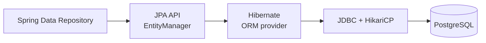

- **JPA** is a *specification* (interfaces + annotations). **Hibernate** is the default *implementation*.
- **`EntityManager`** is the JPA gateway for persistence operations; it owns the **persistence context** (first-level cache, §14).
- **Spring Data JPA** generates repository implementations at runtime so you don't write boilerplate DAOs.

## 12.2 Entities and Mapping

```java
@Entity
@Table(name = "orders", indexes = @Index(name="idx_orders_customer", columnList="customer_id"))
public class Order {
    @Id
    @GeneratedValue(strategy = GenerationType.UUID)  // app/db-generated UUID
    private UUID id;

    @Column(name = "customer_id", nullable = false, updatable = false)
    private UUID customerId;

    @Enumerated(EnumType.STRING)                     // store enum as text, never ORDINAL
    @Column(nullable = false, length = 20)
    private OrderStatus status;

    @Column(nullable = false, precision = 19, scale = 2)
    private BigDecimal total;                         // money = BigDecimal, never double

    @Version
    private long version;                            // optimistic locking (§51)

    @Column(nullable = false, updatable = false)
    private Instant createdAt;

    protected Order() {}  // JPA requires a no-arg constructor
}
```

| Annotation | Purpose |
|---|---|
| `@Entity` | Maps class to a table |
| `@Table` | Table name, indexes, unique constraints |
| `@Id` | Primary key |
| `@GeneratedValue` | ID generation strategy |
| `@Column` | Column name, nullability, length, precision |
| `@Enumerated(STRING)` | Enum persistence (use STRING) |
| `@Version` | Optimistic-lock version column |

## 12.3 ID Generation Strategies

| Strategy | How | Pros | Cons |
|---|---|---|---|
| `IDENTITY` | DB auto-increment column | Simple | **Disables JDBC batch inserts** (Hibernate must fetch the id per row) |
| `SEQUENCE` | DB sequence (with Hibernate pooled/`hi-lo` optimizer) | Batchable, efficient | Postgres/Oracle only |
| `UUID` / assigned | App or DB generates a UUID | No DB round-trip, globally unique, good for distributed systems | 16 bytes, random UUIDv4 hurts index locality |
| `TABLE` | Separate id table | Portable | Slow, contended — avoid |

> **Production Warning:** With PostgreSQL prefer `SEQUENCE` (pooled) for numeric keys so Hibernate can batch inserts; `IDENTITY` quietly kills batching. If you use UUIDs for distributed-friendliness, prefer time-ordered UUIDs (v7) to preserve B-tree index locality — random v4 UUIDs fragment indexes and bloat write amplification on large tables.

## 12.4 Repositories

```java
public interface OrderRepository extends JpaRepository<Order, UUID> {
    Optional<Order> findByIdAndCustomerId(UUID id, UUID customerId); // derived query
    Page<Order> findByStatus(OrderStatus status, Pageable pageable);
    boolean existsByCustomerIdAndStatus(UUID customerId, OrderStatus status);
}
```

`JpaRepository` gives CRUD, paging, and sorting. Methods are implemented from their names (§16). You get `save`, `findById`, `findAll(Pageable)`, `delete`, etc. for free.

> **Important:** `save()` on a *managed* entity may issue no SQL by itself — Hibernate flushes dirty state at transaction commit via **dirty checking** (§14). On a *new* entity, `save()` triggers an insert (or pre-fetches the id). Understanding this prevents "I called save but nothing happened / it happened twice" confusion.

## Key Takeaways
- JPA = spec, Hibernate = impl, `EntityManager` owns the persistence context, Spring Data generates repos.
- Store enums as STRING; money as `BigDecimal`; add `@Version` for concurrency.
- Prefer `SEQUENCE` (batchable) or time-ordered UUIDs; avoid `IDENTITY` where batching matters.

## Common Mistakes
- `EnumType.ORDINAL` (reordering enum breaks data).
- `double` for money.
- `IDENTITY` ids then wondering why batch inserts don't batch.

## Production Considerations
- Add DB indexes to match query predicates/foreign keys (§20).
- Keep entities free of API concerns; map to DTOs (§8).

## SDE2 Interview Questions
- *JPA vs Hibernate vs Spring Data JPA?*
- *Why does `IDENTITY` prevent batch inserts?*
- *When does `save()` actually hit the DB?*

## Practical Exercise
Model `Order`/`OrderItem` with `SEQUENCE` ids, `@Version`, STRING enum. Add derived finders and confirm the generated SQL via `spring.jpa.show-sql` / `hibernate.format_sql`.

---

# 13. Entity Relationships

## 13.1 The Four Mappings

```java
@Entity
public class Order {
    @ManyToOne(fetch = FetchType.LAZY, optional = false)   // many orders -> one customer
    @JoinColumn(name = "customer_id")
    private Customer customer;

    @OneToMany(mappedBy = "order", cascade = CascadeType.ALL, orphanRemoval = true)
    private List<OrderItem> items = new ArrayList<>();      // one order -> many items
}

@Entity
public class OrderItem {
    @ManyToOne(fetch = FetchType.LAZY, optional = false)
    @JoinColumn(name = "order_id")                          // owning side (has the FK)
    private Order order;
}
```

- **Owning side** holds the foreign key and controls persistence of the association. `@JoinColumn` marks it.
- **`mappedBy`** marks the *inverse* (non-owning) side; it points at the field that owns the relationship. The inverse side's changes alone are **not** persisted.
- **`@ManyToMany`** uses a join table (`@JoinTable`); in practice, prefer modeling the join as its own entity so you can add columns (e.g., quantity, added_at).

> **Important:** Keep both sides of a bidirectional relationship in sync in your code (`order.addItem(item)` sets both `items.add(item)` and `item.setOrder(this)`). Hibernate persists based on the owning side; forgetting to set it means the FK stays null.

## 13.2 Cascade and Orphan Removal

```java
@OneToMany(mappedBy = "order", cascade = CascadeType.ALL, orphanRemoval = true)
```

- **Cascade** propagates operations (PERSIST, MERGE, REMOVE…) from parent to children.
- **`orphanRemoval = true`** deletes a child when it's removed from the parent collection.

> **Production Warning:** `cascade = CascadeType.ALL` is dangerous when applied blindly. On `@ManyToOne` or shared references it can delete rows you didn't intend (REMOVE cascades to shared parents/other aggregates). Use CascadeType.ALL + orphanRemoval only for true parent→child *aggregate* ownership (Order → OrderItems). Never cascade from a child to a shared reference entity (like Customer or Product).

## 13.3 Lazy vs Eager

| | LAZY | EAGER |
|---|---|---|
| When loaded | On first access (proxy) | Immediately with the parent |
| Default for | `@OneToMany`, `@ManyToMany` | `@ManyToOne`, `@OneToOne` |
| Risk | `LazyInitializationException` outside session | **N+1**, loading huge graphs you don't need |

> **Best Practice:** Make **everything LAZY** (`@ManyToOne(fetch = LAZY)` explicitly, since it defaults to EAGER) and fetch exactly what each use case needs via `JOIN FETCH`/EntityGraph/DTO projections (§15–16). EAGER is a global decision that's wrong for most queries and the root cause of surprise N+1 and giant object graphs. Avoid lazy-triggered loading during serialization by mapping to DTOs (§8) and disabling Open-Session-In-View (§14).

## Key Takeaways
- Owning side has the FK; `mappedBy` marks the inverse; sync both sides in code.
- Cascade/orphanRemoval only for true aggregate ownership; never cascade REMOVE to shared refs.
- Default to LAZY everywhere; fetch intentionally per query.

## Common Mistakes
- `CascadeType.ALL` on `@ManyToOne` → accidental deletes.
- Forgetting to set the owning side → null FK.
- Leaving `@ManyToOne` EAGER → N+1.

## Production Considerations
- Model aggregates deliberately; a `Customer` is not owned by an `Order`.
- Index all foreign keys (Postgres does not auto-index FKs).

## SDE2 Interview Questions
- *Owning vs inverse side — who controls the FK?*
- *When is `CascadeType.ALL` appropriate vs dangerous?*
- *Why default to LAZY and how do you then avoid N+1?*

## Practical Exercise
Model `Order`→`OrderItem` with proper owning side, cascade+orphanRemoval, and add/remove helper methods. Prove orphan removal deletes items removed from the list on commit.

---

# 14. Hibernate Internals Required for SDE2

## 14.1 Persistence Context (First-Level Cache)

The persistence context is a session-scoped map of managed entities keyed by id. Within one transaction/session:

- Loading the same id twice returns the **same instance** (identity guarantee) and the second load hits no DB.
- Managed entities are tracked for **dirty checking**.

## 14.2 Dirty Checking and Flush

```java
@Transactional
public void renameCustomer(UUID id, String newName) {
    Customer c = customerRepository.findById(id).orElseThrow();
    c.setName(newName);   // no save() call needed
}                         // on commit, Hibernate detects the change and issues UPDATE
```

Hibernate snapshots each managed entity on load. At **flush** (before commit, before certain queries, or explicit `flush()`) it compares current state to the snapshot and emits `UPDATE` for changed entities — **dirty checking**. This is why you don't need `save()` for updates to managed entities.

> **Important:** This surprises people both ways: (1) you *forgot* you don't need `save()` and it updated anyway; (2) you mutated a *detached* entity expecting an update and nothing happened. Know which state you're in.

## 14.3 Entity Lifecycle States

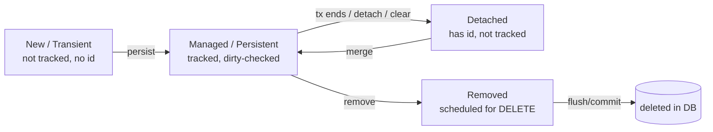

- **Transient** — `new Order()`, not associated with any context, no persistent identity.
- **Managed/Persistent** — attached to the context; changes auto-persisted via dirty checking.
- **Detached** — was managed, but the context closed (e.g., after the transaction). Changes are **not** tracked; use `merge()` to reattach.
- **Removed** — scheduled for deletion at flush.

> **Production Warning:** `LazyInitializationException` happens when you access a lazy association on a **detached** entity (session already closed). The fix is to fetch what you need inside the transaction (JOIN FETCH / EntityGraph) and map to DTOs there — **not** to re-enable Open-Session-In-View.

## 14.4 Open-Session-In-View (OSIV)

Boot enables OSIV by default (`spring.jpa.open-in-view=true`), keeping the Hibernate session open for the whole request so lazy loads work during view/JSON rendering. This hides N+1 problems and holds a DB connection for the entire request (including serialization time).

> **Best Practice:** Set `spring.jpa.open-in-view=false` in production. Then fetch required data explicitly in the service layer and map to DTOs. You trade a few `LazyInitializationException`s during development for honest, bounded queries and shorter connection hold times in production.

## Key Takeaways
- Persistence context = first-level cache + identity + dirty checking.
- Dirty checking means managed-entity updates persist without `save()`.
- Lifecycle: transient→managed→detached/removed; lazy access on detached → exception.
- Disable OSIV; fetch explicitly and map to DTOs.

## Common Mistakes
- Expecting updates on detached entities to persist.
- Relying on OSIV, hiding N+1 and lengthening connection hold time.
- Calling `save()` in a loop expecting immediate SQL (it flushes at commit).

## Production Considerations
- Keep transactions short so the persistence context and connection are held briefly (§18–19).
- `clear()`/batch flush for large bulk operations to avoid context bloat/OOM.

## SDE2 Interview Questions
- *Explain dirty checking and when an UPDATE is emitted.*
- *Walk through the entity lifecycle states.*
- *What causes `LazyInitializationException` and how do you fix it properly?*
- *What is OSIV and why disable it?*

## Practical Exercise
With OSIV off, load an entity in a service method, return it (as DTO) and access a lazy field in the controller — observe the exception. Then fetch via JOIN FETCH in the service and map to DTO inside the transaction; confirm it works.

---

# 15. N+1 Query Problem

## 15.1 What It Is

Fetching N parents then issuing one query per parent to load a child association = **1 + N** queries.

```java
// BAD: lazy items, accessed in a loop
List<Order> orders = orderRepository.findAll();          // 1 query: SELECT * FROM orders
for (Order o : orders) {
    o.getItems().size();                                 // N queries: one per order
}
```

```sql
SELECT * FROM orders;                       -- 1
SELECT * FROM order_items WHERE order_id=1; -- +1
SELECT * FROM order_items WHERE order_id=2; -- +1
-- ... N times
```

With 1,000 orders that's 1,001 queries — each a network round-trip. It looks fine with 5 rows in dev and melts the DB in prod.

## 15.2 Detecting It

- Enable SQL logging in dev (`spring.jpa.show-sql`, `hibernate.format_sql`) and watch for repeated identical queries.
- Use `datasource-proxy` / Hibernate statistics (`hibernate.generate_statistics=true`) to count queries per request.
- In prod, APM traces (§41) show a span fan-out of many identical DB calls.

> **Best Practice:** Fail the build if a request exceeds a query budget. Libraries/assertions that count SQL statements per test catch N+1 before it ships.

## 15.3 Solutions

```java
// 1. JOIN FETCH (JPQL) — one query, join the collection
@Query("select distinct o from Order o join fetch o.items where o.status = :s")
List<Order> findWithItems(@Param("s") OrderStatus s);

// 2. EntityGraph — declarative fetch plan on a derived/standard method
@EntityGraph(attributePaths = "items")
List<Order> findByStatus(OrderStatus status);

// 3. Batch fetching — turn N selects into N/batchSize IN-queries
// application.yml: spring.jpa.properties.hibernate.default_batch_fetch_size: 100
//   SELECT * FROM order_items WHERE order_id IN (?, ?, ... up to 100)

// 4. DTO projection — fetch only needed columns, no entities at all
@Query("""
    select new com.acme.OrderSummary(o.id, o.status, count(i))
    from Order o left join o.items i group by o.id, o.status
""")
List<OrderSummary> summaries();
```

| Solution | Best for | Caveat |
|---|---|---|
| `JOIN FETCH` | One collection you need fully | Row duplication (`distinct`); can't paginate *and* join-fetch a collection safely in memory |
| `@EntityGraph` | Declarative, reusable fetch plans | Same pagination caveat for collections |
| Batch fetching | Many associations, lists | Still multiple queries, but bounded (1 + N/batch) |
| DTO projection | Read/list endpoints | Read-only; no managed entities |

> **Production Warning:** `JOIN FETCH` on a `@OneToMany` **plus** pagination makes Hibernate fetch *all* rows and paginate in memory (it even warns in the log). For paginated lists with collections, fetch IDs page-by-page then batch-fetch children, or use DTO projections. For paginating a `@ManyToOne` fetch join, it's fine.

## 15.4 Why EAGER Is Not the Fix

Making the association EAGER doesn't eliminate N+1 — Hibernate often still issues per-parent selects for collections, and now it does so for *every* query whether you need the data or not, turning one N+1 into N+1 everywhere. Fetch intentionally per use case instead.

## Key Takeaways
- N+1 = 1 parent query + N child queries; invisible in dev, fatal in prod.
- Fix with JOIN FETCH / EntityGraph / batch fetching / DTO projections — chosen per query.
- EAGER is not a fix; it spreads the problem.
- Watch the pagination + collection fetch-join trap.

## Common Mistakes
- Iterating lazy collections in a loop.
- EAGER "to be safe."
- Join-fetching a collection with pagination.

## Production Considerations
- Set a global `default_batch_fetch_size` as a safety net.
- Add query-count assertions in integration tests.

## SDE2 Interview Questions
- *What is N+1, how do you detect it, and give three distinct fixes.*
- *Why doesn't EAGER solve N+1?*
- *What happens when you JOIN FETCH a collection with `Pageable`?*

## Practical Exercise
Reproduce N+1 with `Order`/`OrderItem`, confirm the query count, then fix it three ways (JOIN FETCH, EntityGraph, batch fetch) and compare the emitted SQL.

---

# 16. JPA Queries

## 16.1 Query Options

| Approach | Use when | Notes |
|---|---|---|
| **Derived queries** (`findByStatusAndCustomerId`) | Simple finders | Readable; name explodes with complexity |
| **JPQL** (`@Query`) | Most custom queries | Object-oriented, portable, type-checked at startup |
| **Native SQL** (`@Query(nativeQuery=true)`) | DB-specific features, complex analytics | Not portable; bypasses some JPA features |
| **Criteria API** | Programmatic/type-safe dynamic queries | Verbose |
| **Specifications** | Dynamic, composable filters | Clean for optional filters |

```java
// JPQL with join, fetch, pagination, projection
@Query("select o from Order o join fetch o.customer where o.status = :s")
Page<Order> findPaid(@Param("s") OrderStatus s, Pageable pageable);

// Native
@Query(value = "SELECT * FROM orders WHERE total > :min", nativeQuery = true)
List<Order> expensive(@Param("min") BigDecimal min);
```

## 16.2 Specifications for Dynamic Filtering

```java
public class OrderSpecs {
    public static Specification<Order> hasStatus(OrderStatus s) {
        return (root, q, cb) -> s == null ? null : cb.equal(root.get("status"), s);
    }
    public static Specification<Order> minTotal(BigDecimal min) {
        return (root, q, cb) -> min == null ? null : cb.ge(root.get("total"), min);
    }
}
// repository extends JpaSpecificationExecutor<Order>
Page<Order> result = repo.findAll(where(hasStatus(status)).and(minTotal(min)), pageable);
```

Specifications shine when filters are optional/combinatorial (search endpoints) — you avoid writing one query per filter combination.

## 16.3 Projections

```java
// Interface projection — Spring builds a proxy exposing just these getters
public interface OrderView { UUID getId(); OrderStatus getStatus(); BigDecimal getTotal(); }
List<OrderView> findByCustomerId(UUID customerId);

// DTO/class projection — constructor expression
@Query("select new com.acme.OrderSummary(o.id, o.status, o.total) from Order o")
List<OrderSummary> summaries();
```

Projections fetch only the columns you need (`SELECT id,status,total` not `SELECT *`), reducing I/O and avoiding entity management overhead for read-only endpoints.

> **Best Practice:** Default read/list endpoints to **DTO projections**. They're faster (no persistence context, fewer columns), immune to lazy-loading issues, and decouple the query shape from the entity.

## Key Takeaways
- Derived for simple, JPQL for most, native for DB-specific, Specifications for dynamic.
- Projections (interface/DTO) for lean, read-only reads.
- `GROUP BY`/`HAVING`/aggregations are available in JPQL.

## Common Mistakes
- Giant derived method names instead of JPQL.
- `SELECT *` entities for list endpoints that need three fields.
- Native queries where JPQL would be portable.

## Production Considerations
- Ensure predicates are index-backed (§20).
- Paginate every list endpoint; cap page size.

## SDE2 Interview Questions
- *When do you choose native SQL over JPQL?*
- *How do you build dynamic optional filters cleanly?* (Specifications/Criteria)
- *Interface vs DTO projections?*

## Practical Exercise
Build a `/orders/search` endpoint with optional `status`/`minTotal`/date-range filters using Specifications and return a DTO projection with keyset pagination.

---

# 17. Database Transactions

## 17.1 ACID

- **Atomicity** — all statements in a transaction commit or none do.
- **Consistency** — a transaction moves the DB from one valid state to another (constraints hold).
- **Isolation** — concurrent transactions don't corrupt each other's view (tunable, below).
- **Durability** — once committed, data survives crashes (WAL/fsync).

## 17.2 `@Transactional` Basics

```java
@Service
public class OrderService {
    private final OrderRepository orderRepository;
    public OrderService(OrderRepository orderRepository) { this.orderRepository = orderRepository; }

    @Transactional                       // write transaction, owned by the service layer
    public OrderResponse createOrder(CreateOrderRequest req) {
        Order order = ...;               // build aggregate
        orderRepository.save(order);     // participates in this transaction
        // more writes here commit atomically with the save above
        return mapper.toResponse(order);
    }

    @Transactional(readOnly = true)      // read path: no dirty checking, can hint the driver
    public OrderResponse get(UUID id) {
        return orderRepository.findById(id).map(mapper::toResponse)
            .orElseThrow(() -> new OrderNotFoundException(id));
    }
}
```

> **Important:** The **service layer owns the transaction**, not the controller or repository. The service is where a business operation (which may touch several repositories) must be atomic. `readOnly = true` lets Hibernate skip dirty-check snapshots and can enable DB read optimizations.

## 17.3 Rollback Rules

By default Spring rolls back on **unchecked** exceptions (`RuntimeException`, `Error`) and **commits** on checked exceptions. Override with `rollbackFor`/`noRollbackFor`.

```java
@Transactional(rollbackFor = Exception.class) // also roll back on checked exceptions
```

> **Production Warning:** A classic data-corruption bug: catching an exception inside a `@Transactional` method and *not* rethrowing. The transaction may already be marked **rollback-only** by an inner call, so your commit throws `UnexpectedRollbackException`, or you swallow a failure and commit partial state. Don't silently swallow exceptions in transactional methods.

## 17.4 Propagation

| Propagation | Behavior |
|---|---|
| `REQUIRED` (default) | Join existing tx, or start one |
| `REQUIRES_NEW` | Suspend the current tx, start a brand-new independent tx |
| `SUPPORTS` | Join if one exists, else run non-transactionally |
| `NOT_SUPPORTED` | Suspend any tx, run non-transactionally |
| `MANDATORY` | Must run inside an existing tx, else error |
| `NEVER` | Must run with no tx, else error |
| `NESTED` | Savepoint within the current tx (partial rollback) |

**`REQUIRES_NEW`** is the one SDE2s must understand: use it when an operation must commit independently of the caller — e.g., writing an audit/outbox record that should persist even if the main business transaction rolls back. It consumes a *second* DB connection while the outer tx is suspended (pool-exhaustion risk, §19).

## 17.5 Isolation and Anomalies

| Anomaly | Meaning |
|---|---|
| **Dirty read** | Read another tx's uncommitted change |
| **Non-repeatable read** | Re-reading a row returns different data (another tx updated+committed) |
| **Phantom read** | Re-running a range query returns new/removed rows |
| **Lost update** | Two txs read-modify-write; one overwrites the other |

| Isolation level | Prevents |
|---|---|
| `READ_UNCOMMITTED` | nothing (allows dirty reads) |
| `READ_COMMITTED` | dirty reads (**PostgreSQL default**) |
| `REPEATABLE_READ` | + non-repeatable reads (**MySQL/InnoDB default**) |
| `SERIALIZABLE` | + phantoms (full isolation, lowest concurrency) |

> **Important:** Higher isolation = more locking/aborts = less throughput. Most services run at `READ_COMMITTED` and handle lost updates with **optimistic locking** (`@Version`, §51) rather than raising isolation. Reach for `SERIALIZABLE` only for specific invariants, and be ready to retry serialization failures.

Deadlocks occur when two transactions lock resources in opposite order. Mitigate by acquiring locks in a consistent order, keeping transactions short, and retrying on deadlock.

## Key Takeaways
- ACID; service layer owns transactions; `readOnly` for reads.
- Default rollback on unchecked only; don't swallow exceptions.
- Know propagation (esp. `REQUIRES_NEW`) and isolation levels/anomalies.
- Prefer optimistic locking over high isolation for lost updates.

## Common Mistakes
- Transactions on controllers/repositories instead of services.
- Swallowing exceptions → partial commits / `UnexpectedRollbackException`.
- Cranking isolation to SERIALIZABLE to "be safe," killing throughput.

## Production Considerations
- Keep transactions short (§18).
- Set statement/transaction timeouts; retry deadlock/serialization failures.

## SDE2 Interview Questions
- *Default rollback behavior and how to change it?*
- *When do you use `REQUIRES_NEW` and what's the cost?*
- *Which anomaly does each isolation level prevent? What's Postgres' default?*

## Practical Exercise
Write a service method with an audit write in `REQUIRES_NEW` and confirm the audit row persists even when the outer transaction rolls back.

---

# 18. @Transactional Internals

## 18.1 How Spring Implements It (Proxies + AOP)

`@Transactional` is implemented with **AOP proxies**. When a bean has transactional methods, Spring wraps it in a proxy (JDK dynamic proxy if it implements interfaces, else CGLIB subclass). Callers get the proxy; the proxy opens/commits/rolls back the transaction *around* the real method.

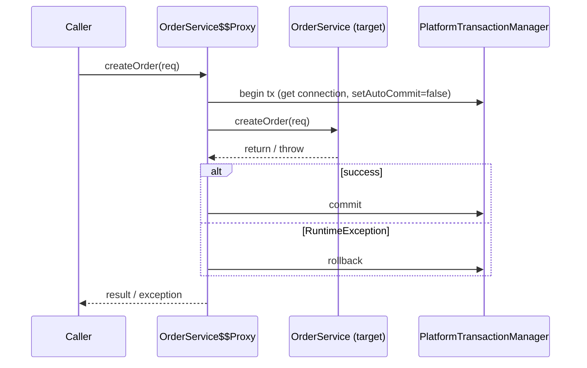

The `PlatformTransactionManager` (e.g., `JpaTransactionManager`) binds a DB connection to the current thread (via `TransactionSynchronizationManager`) so all repository calls in that thread share the same connection/transaction.

## 18.2 Self-Invocation — The #1 Gotcha

```java
@Service
public class ReportService {
    public void methodA() {
        methodB();     // internal call — goes through 'this', NOT the proxy
    }
    @Transactional
    public void methodB() { /* expected to be transactional */ }
}
```

> **Production Warning:** Calling `methodB()` from `methodA()` on the same bean bypasses the proxy — the annotation does **nothing**. The proxy only intercepts calls that come *through* it (from other beans). Self-invocation is why "my `@Transactional` isn't working." The same applies to `@Async`, `@Cacheable`, `@Retryable` — all are proxy-based.

**Fixes:** move `methodB` into a separate bean and inject it; or inject self (`@Lazy ReportService self`) and call `self.methodB()`; or use `TransactionTemplate` programmatically. Also note: `@Transactional` on `private`/`final` methods doesn't work (can't be proxied).

## 18.3 Why External Calls Inside Transactions Are Dangerous

```java
// BAD
@Transactional
public void processPayment(UUID orderId) {
    Payment p = savePayment(orderId);          // opens tx, holds a DB connection
    callExternalPaymentProvider(p);            // network call: could take seconds / hang
    updatePayment(p, SUCCESS);                 // still inside the same tx
}                                              // connection held the entire time
```

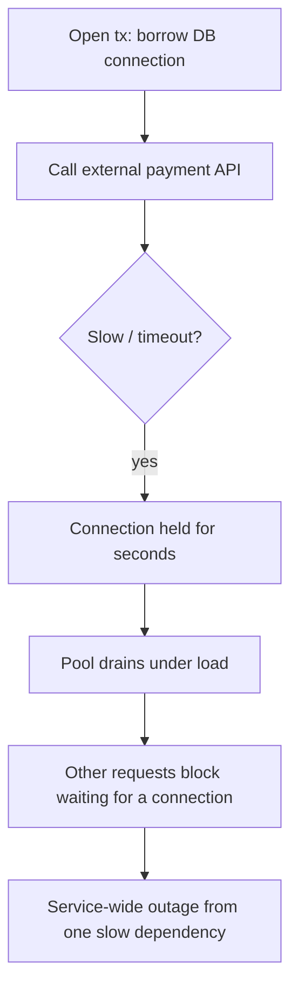

Problems: the DB connection (and any row locks) are held for the full external call; if the provider is slow or hangs, you hold connections and locks far too long → **connection pool exhaustion** (§19), lock contention, timeouts, and cascading failure. Distributed state is also inconsistent (the external side committed but your local tx might roll back).

**Better designs:**
- Do the external call **outside** the transaction: commit local state first (e.g., `PENDING`), then call the provider, then update status in a short second transaction.
- Use the **outbox pattern** (§49): within the transaction, persist an event row; a separate process makes the external call and handles retries.
- Make the external call idempotent and the local write idempotent so retries are safe (§50).

## 18.4 Long Transactions

Long transactions hold connections and locks, bloat the persistence context, increase deadlock probability, and block vacuum/replication. Keep transactions **short and CPU/DB-only** — no network I/O, no user think-time, no sleeping. Set a transaction timeout.

## Key Takeaways
- `@Transactional` = proxy-based AOP; the proxy begins/commits/rolls back around the method.
- Self-invocation and private/final methods bypass the proxy — annotation ignored.
- Never call external APIs inside a transaction; keep transactions short.

## Common Mistakes
- Self-invocation expecting transactional behavior.
- Holding transactions open across network calls.
- Catching and swallowing inside the method.

## Production Considerations
- Transaction/statement timeouts; monitor long-running transactions in the DB.
- Prefer outbox for "DB write + external side effect" atomicity.

## SDE2 Interview Questions
- *How is `@Transactional` implemented? Why does self-invocation break it?*
- *What happens if you call a slow external API inside a transaction under load?*
- *How do you atomically "save to DB and publish an event"?* (outbox)

## Practical Exercise
Demonstrate self-invocation failure: log the active transaction (`TransactionSynchronizationManager.isActualTransactionActive()`) in `methodB` when called internally vs via another bean. Then refactor an external-call-in-transaction into commit-then-call.

---

# 19. Database Connection Pooling

## 19.1 Why Pool, and HikariCP

Opening a DB connection is expensive (TCP + TLS + auth). A **connection pool** keeps a bounded set of open connections and lends them to request threads. Boot ships **HikariCP** (fast, lightweight) by default.

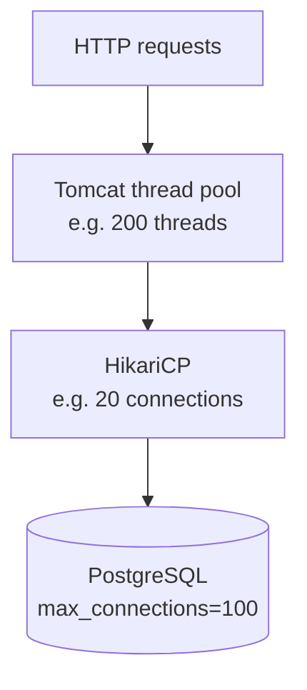

The pool is a **shared, bounded resource smaller than the thread pool**. If 200 Tomcat threads each want a connection but the pool has 20, 180 wait.

## 19.2 Key Settings

```yaml
spring:
  datasource:
    hikari:
      maximum-pool-size: 20        # max connections (the critical knob)
      minimum-idle: 20             # keep pool "fixed-size" to avoid churn (often = max)
      connection-timeout: 3000     # ms to wait for a connection before failing fast
      idle-timeout: 600000         # ms before an idle conn (above min-idle) is retired
      max-lifetime: 1800000        # ms max life (< DB/LB idle timeout) to recycle conns
      validation-timeout: 2000
```

| Setting | Meaning | Guidance |
|---|---|---|
| `maximum-pool-size` | Hard cap on connections | Size to the DB and workload, not "big = fast" |
| `minimum-idle` | Min kept warm | Often set = max for stable latency |
| `connection-timeout` | Wait before failing | Keep small (fail fast, don't pile up) |
| `max-lifetime` | Recycle before DB/LB kills idle conns | Set below DB/infra idle timeout |

> **Important:** Sizing. A common heuristic: `pool size ≈ (core_count * 2) + effective_spindle_count`, and crucially **sum of all instances' pool sizes must stay under the DB's `max_connections`**. 10 app instances × 20 connections = 200 connections — if Postgres `max_connections=100`, instances fail to connect. Bigger pools are usually *slower* (context switching, lock contention in the DB), not faster.

## 19.3 Pool Exhaustion

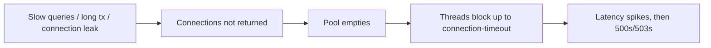

Symptoms: requests block then fail with `Connection is not available, request timed out after ...`. Likely causes:

- **Slow queries** holding connections too long → fix queries/indexes (§20).
- **Long transactions / external calls in transactions** (§18).
- **Connection leaks** — connection borrowed and never returned (manual JDBC without try-with-resources, or a non-transactional path that opens a connection and forgets it). Set `leakDetectionThreshold` to log leaks.
- **Pool too small** for the concurrency, or DB `max_connections` too low.

## 19.4 Interplay With Thread Pools

The system throughput is gated by the **narrowest** pool. If Tomcat has 200 threads but HikariCP has 20 connections, effective DB concurrency is 20; the other 180 threads either wait or do non-DB work. Size them together (§44, §57).

## Key Takeaways
- HikariCP lends a bounded set of connections; it's a shared resource smaller than the thread pool.
- Size pools to the DB (`sum < max_connections`); bigger isn't faster.
- Exhaustion comes from slow queries, long/external-call transactions, or leaks.

## Common Mistakes
- Huge pools "for performance."
- Ignoring that N instances multiply connection count against `max_connections`.
- External calls inside transactions holding connections (§18).

## Production Considerations
- Monitor Hikari metrics (active, idle, pending, acquire time) via Actuator/Micrometer.
- Set `leakDetectionThreshold`; set `max-lifetime` below DB/LB idle timeouts.

## SDE2 Interview Questions
- *How do you size a connection pool? Why can bigger be slower?*
- *You see "connection timed out" under load — how do you diagnose?*
- *How do Tomcat threads and Hikari connections interact?*

## Practical Exercise
Set `maximum-pool-size: 2` and run a load test hitting a slow query; observe pending connections and timeouts in Hikari metrics. Add an index, re-test, and watch acquire time drop.

---

# 20. Database Performance (Spring/Hibernate side)

## 20.1 Indexes and Query Plans

Every predicate (`WHERE`), join column, and `ORDER BY` on a large table should be index-backed. Postgres does **not** auto-index foreign keys. Use `EXPLAIN (ANALYZE, BUFFERS)` to read the plan: watch for `Seq Scan` on large tables, high `rows` estimates vs actual, and expensive sorts.

```sql
EXPLAIN ANALYZE SELECT * FROM orders WHERE customer_id = '...' ORDER BY created_at DESC LIMIT 20;
-- want: Index Scan using idx_orders_customer_created, not Seq Scan + Sort
CREATE INDEX idx_orders_customer_created ON orders (customer_id, created_at DESC);
```

## 20.2 Common Hibernate-side Performance Issues

| Problem | Cause | Fix |
|---|---|---|
| N+1 | lazy association in a loop | JOIN FETCH / batch / projection (§15) |
| `SELECT *` | entity loads all columns | DTO projections (§16) |
| Offset pagination slowness | `OFFSET n` scans+discards n rows | keyset pagination (§7) |
| Unbatched inserts/updates | `IDENTITY` ids, no batch config | `SEQUENCE` + `hibernate.jdbc.batch_size` |
| Over-fetching graphs | EAGER everywhere | LAZY + intentional fetch (§13) |
| Long transactions | external calls in tx | shorten (§18) |

```yaml
spring:
  jpa:
    properties:
      hibernate:
        jdbc.batch_size: 50
        order_inserts: true
        order_updates: true
        default_batch_fetch_size: 100
```

## 20.3 Why SELECT * and Over-fetching Hurt

Fetching all columns pulls large/unused data (text blobs, JSON columns) over the wire, bloats the persistence context, and prevents index-only scans. Fetching too many rows (no pagination) causes memory pressure and GC, and can OOM the app. Always paginate and project.

## 20.4 Diagnosing Slow Queries

- Enable `pg_stat_statements` (Postgres) to find the costliest queries.
- Enable slow-query logging; set `log_min_duration_statement`.
- Hibernate statistics / `datasource-proxy` to attribute queries to code paths.
- APM traces to see DB span latency per endpoint (§41).

## Key Takeaways
- Index predicates/joins/sorts; read `EXPLAIN ANALYZE`.
- Project columns, paginate (keyset), batch writes, avoid EAGER graphs and long transactions.
- Use DB + Hibernate diagnostics to find real bottlenecks.

## Common Mistakes
- Unindexed FKs and sort columns.
- `SELECT *` entities for read endpoints.
- Deep offset pagination.

## Production Considerations
- Review query plans for new endpoints before shipping.
- Watch slow-query logs and `pg_stat_statements` in prod.

## SDE2 Interview Questions
- *How do you find and fix a slow query from a Spring Boot service?*
- *Why is offset pagination slow and what's the alternative?*
- *How do you make Hibernate batch inserts?*

## Practical Exercise
Create a table with 1M rows. Compare `OFFSET 900000 LIMIT 20` vs keyset pagination with `EXPLAIN ANALYZE`. Add a composite index and measure the difference.

---

# 21. Spring Security

## 21.1 Architecture

Spring Security is a chain of **servlet filters** that run before your controllers. Each request passes through the `SecurityFilterChain`; filters authenticate, populate the `SecurityContext`, and enforce authorization.

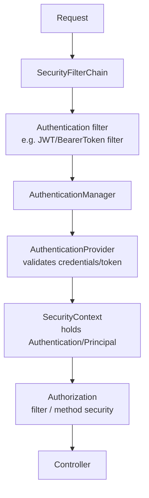

| Concept | Meaning |
|---|---|
| **Authentication** | *Who are you?* Verifies identity (token/credentials) |
| **Authorization** | *What may you do?* Checks roles/authorities/permissions |
| **Principal** | The authenticated identity (user) |
| **Authorities** | Granted permissions (`ROLE_ADMIN`, `order:read`) |
| **`SecurityContext`** | Thread-bound holder of the current `Authentication` |

Key beans: **`SecurityFilterChain`** (declares the rules), **`AuthenticationManager`** (coordinates authentication), **`AuthenticationProvider`** (performs it), **`UserDetailsService`** (loads users for form/basic auth).

## 21.2 Configuring a Stateless API

```java
@Configuration
@EnableWebSecurity
@EnableMethodSecurity              // enables @PreAuthorize/@PostAuthorize
public class SecurityConfig {

    @Bean
    SecurityFilterChain filterChain(HttpSecurity http) throws Exception {
        http
          .csrf(csrf -> csrf.disable())                      // stateless JWT API (see §25)
          .sessionManagement(s -> s.sessionCreationPolicy(STATELESS))
          .authorizeHttpRequests(auth -> auth
              .requestMatchers("/actuator/health/**", "/v3/api-docs/**").permitAll()
              .requestMatchers(HttpMethod.POST, "/api/admin/**").hasRole("ADMIN")
              .anyRequest().authenticated())
          .oauth2ResourceServer(oauth -> oauth.jwt(Customizer.withDefaults())) // validate JWTs
          .exceptionHandling(e -> e
              .authenticationEntryPoint(restAuthEntryPoint)   // 401 body (§10)
              .accessDeniedHandler(restAccessDeniedHandler)); // 403 body
        return http.build();
    }

    @Bean
    PasswordEncoder passwordEncoder() { return new BCryptPasswordEncoder(); }
}
```

> **Important:** Rule order matters — the first matching `requestMatcher` wins. Put `permitAll()` for public paths before `anyRequest().authenticated()`. Store passwords only as `BCrypt`/`Argon2` hashes, never plaintext or fast hashes (MD5/SHA).

> **Production Warning:** Authentication exceptions are handled by `AuthenticationEntryPoint` (401) and `AccessDeniedHandler` (403), inside the filter chain — **not** your `@RestControllerAdvice`. Configure them so auth errors return your standard JSON error body (§10), not Spring's default HTML.

## Key Takeaways
- Security is a filter chain running before controllers; it authenticates then authorizes.
- Stateless APIs: `STATELESS` session, validate tokens per request, CSRF off (§25).
- Auth errors handled by entry point/handler, not controller advice.

## Common Mistakes
- Wrong matcher order exposing endpoints.
- Plaintext/weak password hashing.
- Expecting `@RestControllerAdvice` to format 401/403.

## Production Considerations
- Secure Actuator (§40); expose only health publicly.
- Default-deny (`anyRequest().authenticated()`); whitelist public paths explicitly.

## SDE2 Interview Questions
- *Walk through the Spring Security filter chain.*
- *Authentication vs authorization — who/what handles each?*
- *How do you return a JSON body for 401/403?*

## Practical Exercise
Configure a stateless chain with a public health endpoint, role-gated admin path, and custom 401/403 JSON bodies.

---

# 22. JWT Authentication

## 22.1 Anatomy

A JWT is `header.payload.signature`, each Base64URL-encoded:

- **Header** — alg + type (`{"alg":"RS256","typ":"JWT"}`).
- **Payload (claims)** — `sub` (subject/user), `exp` (expiry), `iat`, `iss`, `aud`, plus custom claims (roles, tenant).
- **Signature** — HMAC or RSA/EC signature over header+payload; proves integrity and authenticity.

> **Important:** JWTs are **signed, not encrypted** (unless JWE). Anyone can read the payload. Never put secrets/PII in a JWT. The signature only guarantees it wasn't tampered with.

## 22.2 Flow

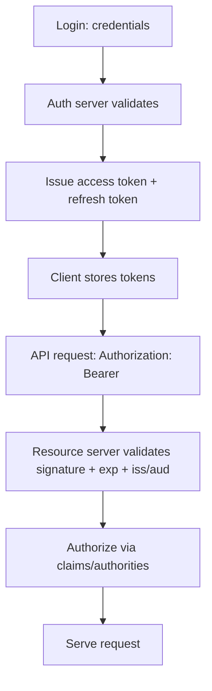

## 22.3 Access vs Refresh Tokens

| | Access token | Refresh token |
|---|---|---|
| Lifetime | Short (5–15 min) | Long (hours–days) |
| Sent on | Every API request | Only to the auth server to mint new access tokens |
| Storage | Memory (SPA) | HttpOnly secure cookie or secure store |
| Revocation | Hard (stateless) | Easier (stored, can be invalidated) |

- **Rotation:** issue a new refresh token on each use and invalidate the old one (detects theft — reuse of an old refresh token signals compromise).
- **Revocation:** stateless access tokens can't be revoked before expiry; keep them short-lived, maintain a denylist (Redis) for emergencies, or use token introspection for critical operations.

## 22.4 Signing: Symmetric vs Asymmetric

| | HMAC (HS256) symmetric | RSA/EC (RS256/ES256) asymmetric |
|---|---|---|
| Keys | One shared secret | Private signs, public verifies |
| Who can verify | Anyone with the secret (also can forge) | Anyone with the public key (cannot forge) |
| Use when | Single service signs & verifies | Many services verify tokens issued by one auth server |

> **Best Practice:** For microservices, use **asymmetric (RS256)** so resource servers verify with the public key (JWKS endpoint) and never hold signing material. Rotate keys and publish them via JWKS so verifiers pick up new keys automatically.

## 22.5 Validating JWTs in Spring (Resource Server)

```yaml
spring:
  security:
    oauth2:
      resourceserver:
        jwt:
          issuer-uri: https://auth.example.com   # discovers JWKS, validates iss/exp/sig
```

With `oauth2ResourceServer().jwt()` Spring validates signature (via JWKS), `exp`, `iss`, and `aud`, and builds an `Authentication` from the claims. Map claims to authorities with a `JwtAuthenticationConverter`.

## 22.6 Threats

> **Production Warning:** Mitigate: **token theft** (short expiry, HttpOnly cookies, TLS everywhere), **replay** (short expiry + `jti`/nonce for sensitive ops), **weak secrets** (long random HMAC secret or asymmetric keys; reject `alg:none`), **long-lived tokens** (keep access tokens minutes, not days), and **sensitive data in JWT** (never). Always validate `exp`, `iss`, `aud`, and the algorithm — pin the expected algorithm to prevent algorithm-confusion attacks.

## Key Takeaways
- JWT = signed (not encrypted) claims; validate sig+exp+iss+aud+alg every request.
- Short-lived access + rotating refresh tokens; asymmetric signing for microservices.
- Never store secrets/PII in the token; keep tokens short-lived.

## Common Mistakes
- Long-lived access tokens with no revocation story.
- Secrets/PII in the payload.
- Accepting `alg:none` or not pinning the algorithm.

## Production Considerations
- Use JWKS + key rotation; a Redis denylist for emergency revocation.
- Clock skew tolerance for `exp`/`nbf` validation.

## SDE2 Interview Questions
- *Is a JWT encrypted? What stops tampering?*
- *How do you revoke a stateless token?*
- *Symmetric vs asymmetric signing in microservices?*

## Practical Exercise
Configure a resource server validating RS256 JWTs via `issuer-uri`, map a `roles` claim to authorities, and gate an endpoint by role. Try a tampered token and confirm 401.

---

# 23. OAuth2 and OpenID Connect

## 23.1 Concepts

**OAuth2** is a *delegated authorization* framework (grant an app limited access without sharing your password). **OIDC** adds an *identity* layer on top (authentication + an **ID token** describing the user).

| Role | Who |
|---|---|
| **Resource Owner** | The user |
| **Client** | Your app requesting access |
| **Authorization Server** | Issues tokens (Cognito, Okta, Keycloak, Google) |
| **Resource Server** | API that accepts access tokens (your Spring service) |

| Token | Purpose |
|---|---|
| **Access token** | Authorizes API calls (OAuth2) |
| **ID token** | Proves who the user is (OIDC, a JWT with user claims) |
| **Refresh token** | Obtains new access tokens |

## 23.2 Grants

| Grant | Use case |
|---|---|
| **Authorization Code (+ PKCE)** | User login via browser (web/mobile/SPA). PKCE for public clients |
| **Client Credentials** | Service-to-service (no user) |
| **Refresh Token** | Renew access tokens silently |

> **Important:** The legacy *password* and *implicit* grants are discouraged. For SPAs/mobile use **Authorization Code with PKCE**. For backend-to-backend use **Client Credentials**.

## 23.3 Spring as Client vs Resource Server

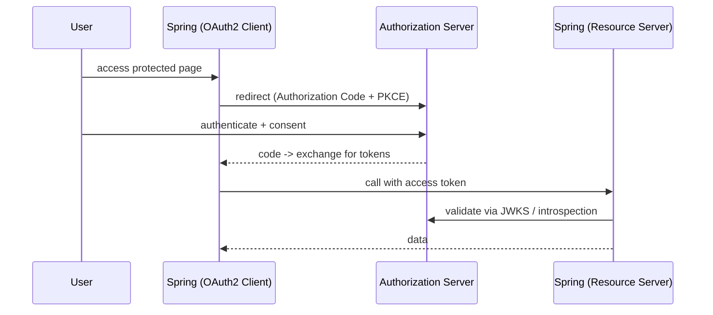

```java
// Resource Server (API) — validate incoming access tokens
http.oauth2ResourceServer(o -> o.jwt(Customizer.withDefaults()));

// Client (server-side web app logging users in)
http.oauth2Login(Customizer.withDefaults());
```

```yaml
# Client registration (e.g., Google / Cognito / Keycloak)
spring:
  security:
    oauth2:
      client:
        registration:
          cognito:
            client-id: ${OIDC_CLIENT_ID}
            client-secret: ${OIDC_CLIENT_SECRET}
            scope: openid,profile,email
        provider:
          cognito:
            issuer-uri: https://cognito-idp.<region>.amazonaws.com/<poolId>
```

Practical providers: **Google** (social login), **AWS Cognito** (managed user pools), **Okta/Auth0** (enterprise IdP), **Keycloak** (self-hosted). All expose OIDC discovery (`/.well-known/openid-configuration`) so Spring auto-configures endpoints and JWKS.

## Key Takeaways
- OAuth2 = authorization; OIDC adds authentication + ID token.
- Authorization Code+PKCE for users; Client Credentials for services.
- Spring is a Resource Server (validate tokens) and/or Client (log users in).

## Common Mistakes
- Using implicit/password grants.
- Treating the access token as proof of identity (that's the ID token's job).
- Hardcoding provider endpoints instead of using `issuer-uri` discovery.

## Production Considerations
- Validate `aud`/`iss`/scopes; least-privilege scopes.
- Store client secrets in a secret manager; rotate.

## SDE2 Interview Questions
- *OAuth2 vs OIDC? Access token vs ID token?*
- *Which grant for an SPA? For service-to-service?*
- *How does Spring validate tokens from an external IdP?*

## Practical Exercise
Point a resource server at Keycloak (Docker) via `issuer-uri`, obtain a token with Client Credentials, and call a protected endpoint. Inspect the decoded claims.

---

# 24. Authorization

## 24.1 RBAC vs Permission-Based

- **RBAC** — grant roles (`ROLE_ADMIN`), check roles. Simple, coarse-grained.
- **Permission/authority-based** — grant fine-grained authorities (`order:read`, `order:refund`) and check those. Scales better as rules grow; roles become bundles of permissions.

> **Important:** Authentication ≠ authorization. A valid token proves identity; it says nothing about whether *this* user may act on *this* resource. You must still authorize every protected operation.

## 24.2 Method Security

```java
@PreAuthorize("hasRole('ADMIN')")
public void deleteUser(UUID id) { ... }

@PreAuthorize("hasAuthority('order:refund')")
public void refund(UUID orderId) { ... }

// Resource-level (ownership) check — prevents horizontal privilege escalation
@PreAuthorize("#order.ownerId == authentication.name or hasRole('ADMIN')")
public void cancel(@P("order") Order order) { ... }

@PostAuthorize("returnObject.ownerId == authentication.name")
public OrderResponse get(UUID id) { ... }
```

Enable with `@EnableMethodSecurity`. `@PreAuthorize` runs before the method (preferred); `@PostAuthorize` after (filters the return). SpEL expressions can reference arguments, the principal, and bean methods.

## 24.3 Privilege Escalation Mistakes

> **Production Warning:** Common escalation bugs:
> - **Missing ownership checks (IDOR):** `GET /orders/{id}` returns any order because you only checked authentication, not that the order belongs to the caller. Always scope queries by owner/tenant (`findByIdAndCustomerId`) or check ownership.
> - **Trusting client-supplied role/userId** in the request body (mass assignment, §8). Derive identity from the authenticated principal, never from the payload.
> - **Role string typos:** `hasRole('admin')` vs stored `ROLE_ADMIN` — `hasRole` auto-prefixes `ROLE_`; `hasAuthority` does not. Mismatches silently deny or (worse) a misconfigured rule allows.
> - **Vertical escalation:** forgetting to gate an admin endpoint.

## Key Takeaways
- Authn proves identity; you must still authorize each operation.
- RBAC for coarse, authorities for fine-grained; `@PreAuthorize` with SpEL.
- Enforce resource ownership to prevent IDOR; never trust client-supplied identity.

## Common Mistakes
- IDOR: no ownership check on by-id endpoints.
- `hasRole` vs `hasAuthority` prefix confusion.
- Authorizing in the controller but exposing a service method elsewhere unguarded.

## Production Considerations
- Centralize authorization logic; test it with security-aware tests.
- Default-deny; log authorization failures for audit.

## SDE2 Interview Questions
- *Difference between authentication and authorization — give an escalation example.*
- *RBAC vs permission-based — trade-offs.*
- *How do you prevent IDOR in a by-id endpoint?*

## Practical Exercise
Add `@PreAuthorize` ownership checks to `cancelOrder`. Write a test where user B tries to cancel user A's order and expect 403 (or 404 to avoid existence leakage).

---

# 25. CORS, CSRF and Security Headers

## 25.1 CORS

The browser **same-origin policy** blocks JS from reading responses from a different origin (scheme+host+port). **CORS** lets a server opt in. For non-simple requests the browser sends a **preflight** `OPTIONS` with `Origin`/`Access-Control-Request-*`; the server must answer with `Access-Control-Allow-*`.

```java
@Bean
CorsConfigurationSource corsConfigurationSource() {
    CorsConfiguration c = new CorsConfiguration();
    c.setAllowedOrigins(List.of("https://app.example.com")); // explicit, not "*"
    c.setAllowedMethods(List.of("GET","POST","PUT","PATCH","DELETE"));
    c.setAllowedHeaders(List.of("Authorization","Content-Type"));
    c.setAllowCredentials(true);                              // required for cookies
    c.setMaxAge(Duration.ofHours(1));                         // cache preflight
    var src = new UrlBasedCorsConfigurationSource();
    src.registerCorsConfiguration("/api/**", c);
    return src;
}
// http.cors(Customizer.withDefaults());
```

> **Production Warning:** CORS is a **browser** mechanism, not server-side access control — it does not protect your API from non-browser clients. Never use `allowedOrigins("*")` together with `allowCredentials(true)` (the spec forbids it and browsers reject it). List explicit origins.

## 25.2 CSRF

CSRF tricks a logged-in user's browser into sending an authenticated request using **ambient credentials (cookies)**. It matters when auth is **cookie/session-based**. For a **stateless JWT API** where the token is sent in the `Authorization` header (not auto-attached by the browser), CSRF protection is generally unnecessary and commonly disabled.

```java
// Stateless JWT API:
http.csrf(csrf -> csrf.disable());

// Cookie/session app (or JWT stored in a cookie): keep CSRF on
http.csrf(csrf -> csrf.csrfTokenRepository(CookieCsrfTokenRepository.withHttpOnlyFalse()));
```

> **Important:** If you store the JWT in a cookie, you reintroduce CSRF risk and must keep CSRF protection (and `SameSite` cookies). CSRF decision follows *how credentials are transmitted*, not whether you use JWT.

## 25.3 Security Headers

| Header | Purpose |
|---|---|
| `Strict-Transport-Security` (HSTS) | Force HTTPS |
| `Content-Security-Policy` (CSP) | Restrict script/resource origins (anti-XSS) |
| `X-Content-Type-Options: nosniff` | Stop MIME sniffing |
| `Referrer-Policy` | Limit referrer leakage |
| `X-Frame-Options` / CSP `frame-ancestors` | Clickjacking protection |

Spring Security sets several by default; add CSP/HSTS explicitly.

## 25.4 React/Next.js + Spring Boot

Typical setup: SPA at `https://app.example.com`, API at `https://api.example.com`. Configure CORS on the API to allow the SPA origin; send the JWT in `Authorization: Bearer`; keep the API stateless (CSRF off). If you instead use session cookies, enable CSRF with a cookie token repo and `SameSite=Lax/Strict`.

## Key Takeaways
- CORS is browser-side opt-in, not API access control; list explicit origins.
- CSRF matters for cookie-based auth; stateless header-token APIs typically disable it.
- Add HSTS/CSP/nosniff/Referrer-Policy.

## Common Mistakes
- `allowedOrigins("*")` + credentials.
- Disabling CSRF while using cookie auth.
- Treating CORS as security against non-browser clients.

## Production Considerations
- Terminate TLS and set HSTS at the edge; set CSP to your actual asset origins.
- Use `SameSite` cookies if any cookie-based auth exists.

## SDE2 Interview Questions
- *What problem does CORS solve and what does it NOT protect against?*
- *When is CSRF protection needed with JWT?*
- *Which security headers do you set and why?*

## Practical Exercise
Set up CORS for a specific SPA origin with credentials. Confirm a preflight `OPTIONS` succeeds for your origin and is rejected for another. Add CSP + HSTS and verify via response headers.

---

# 26. Spring AOP

## 26.1 Concepts

AOP factors **cross-cutting concerns** (logging, metrics, auditing, transactions, caching) out of business code into **aspects**.

| Term | Meaning |
|---|---|
| **Aspect** | Module bundling a cross-cutting concern |
| **Join point** | A point in execution (in Spring AOP: a method call) |
| **Pointcut** | Expression selecting join points |
| **Advice** | Code run at a join point |
| **Proxy** | The wrapper Spring creates to apply advice |

Advice types: `@Before`, `@AfterReturning`, `@AfterThrowing`, `@After` (finally), `@Around` (wraps, most powerful).

```java
@Aspect @Component
public class TimingAspect {
    private static final Logger log = LoggerFactory.getLogger(TimingAspect.class);

    @Around("@annotation(com.acme.Timed)")   // methods annotated @Timed
    public Object time(ProceedingJoinPoint pjp) throws Throwable {
        long start = System.nanoTime();
        try {
            return pjp.proceed();
        } finally {
            long ms = (System.nanoTime() - start) / 1_000_000;
            log.info("{} took {}ms", pjp.getSignature(), ms);
        }
    }
}
```

## 26.2 Proxies: JDK vs CGLIB

Spring AOP is **proxy-based** (not full AspectJ weaving). If the target implements an interface, Spring uses a **JDK dynamic proxy** (proxies the interface); otherwise a **CGLIB** subclass proxy. This is why:

- Self-invocation bypasses advice (§18) — internal calls don't go through the proxy.
- `final`/`private` methods and `final` classes can't be proxied (CGLIB subclasses).

`@Transactional`, `@Cacheable`, `@Async`, `@Retryable`, and method security are all built on this same proxy mechanism.

## Key Takeaways
- AOP externalizes cross-cutting concerns via aspects/pointcuts/advice.
- Spring uses JDK/CGLIB proxies; self-invocation and final/private methods bypass advice.
- Spring's own features (tx, cache, async, retry) are AOP under the hood.

## Common Mistakes
- Expecting advice on self-invoked/private/final methods.
- Heavy logic in `@Around` adding latency to every call.

## Production Considerations
- Keep aspects fast and exception-safe; a buggy aspect affects every matched method.
- Prefer Micrometer `@Timed`/`Observed` over hand-rolled timing aspects when possible.

## SDE2 Interview Questions
- *What are join point/pointcut/advice?*
- *JDK vs CGLIB proxies and the self-invocation consequence.*
- *Name Spring features built on AOP.*

## Practical Exercise
Write an `@Around` auditing aspect that logs method, args, and duration for a custom `@Audited` annotation. Prove it doesn't fire on a self-invoked call.

---

# 27. Spring Caching

## 27.1 The Abstraction

Spring's cache abstraction decouples your code from the cache implementation (Caffeine, Redis). Annotations are AOP-based (proxy, §26).

```java
@Service
public class ProductService {
    @Cacheable(cacheNames = "product", key = "#id")
    public ProductDto get(UUID id) { return load(id); }          // populate on miss

    @CachePut(cacheNames = "product", key = "#result.id")
    public ProductDto update(UUID id, UpdateReq r) { return save(id, r); } // always run + refresh

    @CacheEvict(cacheNames = "product", key = "#id")
    public void delete(UUID id) { repo.deleteById(id); }         // invalidate
}
```

- `@Cacheable` — return cached value if present, else execute and cache (cache-aside read).
- `@CachePut` — always execute, update the cache with the result (write-through-ish).
- `@CacheEvict` — remove entries (invalidate on update/delete).
- **Cache key** — default is all params; use SpEL (`key = "#id"`) for precision.

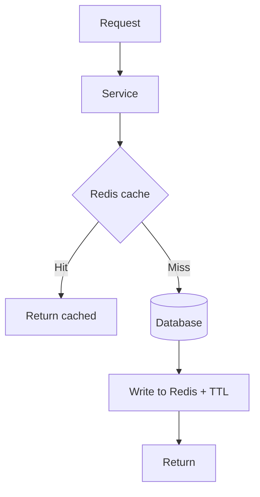

## 27.2 Patterns and Hazards

- **Cache-aside** (most common): app reads cache, on miss loads DB and populates. `@Cacheable` implements this.
- **TTL**: always set an expiry; unbounded caches leak memory and serve stale data forever.

> **Production Warning:** Classic cache failure modes:
> - **Stampede / thundering herd:** a hot key expires and thousands of requests simultaneously miss and hit the DB. Mitigate with a short lock/single-flight, staggered TTLs (jitter), or `sync = true` on `@Cacheable`.
> - **Penetration:** requests for keys that don't exist bypass the cache and hammer the DB. Cache negative results (short TTL) or use a Bloom filter.
> - **Hot key:** one key gets disproportionate traffic, overloading a single Redis shard. Replicate/split hot keys or add a local (near) cache tier.
> - **Consistency:** cache and DB can diverge. Prefer invalidate-on-write (evict) over update-in-cache; accept bounded staleness via TTL. There is no perfect cache invalidation — design for acceptable staleness.

## Key Takeaways
- `@Cacheable`/`@CachePut`/`@CacheEvict` implement cache-aside; always set TTL.
- Beware stampede, penetration, hot keys, and consistency.
- Caching is a staleness/perf trade-off, not free correctness.

## Common Mistakes
- No TTL; unbounded growth and permanent staleness.
- Caching per-user data under a shared key (data leakage).
- Relying on perfect invalidation.

## Production Considerations
- Add jitter to TTLs; use `sync=true` for hot keys.
- Monitor hit ratio; a low ratio means the cache isn't helping.

## SDE2 Interview Questions
- *Explain cache-aside and the three annotations.*
- *What is a cache stampede and how do you prevent it?*
- *How do you keep cache and DB consistent?* (invalidate-on-write + TTL; accept staleness)

## Practical Exercise
Cache `ProductService.get` in Redis with a 60s TTL + jitter and `sync=true`. Load-test a cold hot key and observe DB calls with/without `sync`.

---

# 28. Redis with Spring Boot

## 28.1 Access Options

- **Spring Data Redis + `RedisTemplate`/`StringRedisTemplate`** — low-level operations.
- **Cache abstraction** (§27) — `spring-boot-starter-data-redis` + `@Cacheable`.
- Lettuce is the default (netty-based, thread-safe, connection pooling via `commons-pool2`).

```java
@Configuration
class RedisConfig {
    @Bean
    RedisTemplate<String,Object> redisTemplate(RedisConnectionFactory f) {
        var t = new RedisTemplate<String,Object>();
        t.setConnectionFactory(f);
        t.setKeySerializer(new StringRedisSerializer());
        t.setValueSerializer(new GenericJackson2JsonRedisSerializer()); // JSON, not JDK serialization
        return t;
    }
}
```

> **Important:** Use JSON (or a compact binary) serializer, not JDK serialization — JDK serialization is slow, fragile across versions, and a deserialization security risk. Always set TTLs on cache keys.

## 28.2 Use Cases

| Use case | How |
|---|---|
| **Caching** | `@Cacheable` / `RedisTemplate` with TTL |
| **Sessions** | Spring Session Redis (shared sessions across instances) |
| **Rate limiting** | `INCR` + `EXPIRE`, or token-bucket Lua script |
| **Distributed lock** | `SET key val NX PX ttl` (or Redisson) |
| **Idempotency** | Store idempotency key→result with TTL (§50) |

```java
// Simple fixed-window rate limit
Long count = stringRedis.opsForValue().increment("rl:" + userId);
if (count == 1) stringRedis.expire("rl:" + userId, Duration.ofMinutes(1));
if (count > 100) throw new TooManyRequestsException();
```

```java
// Distributed lock (atomic SET NX PX). Release only if we still own it (Lua CAS).
Boolean acquired = stringRedis.opsForValue()
    .setIfAbsent("lock:job", token, Duration.ofSeconds(30));
```

> **Production Warning:** A naive Redis lock is **not** a perfect distributed lock (clock skew, failover can lose the lock). For correctness-critical locking prefer a DB lock or Redisson/Redlock *with* a fencing token, and always set a TTL so a crashed holder's lock expires. Release only if you still own the lock (compare token via Lua) to avoid releasing someone else's lock.

## 28.3 When NOT to Use Redis

- As a **primary datastore** for durable, relational data (it's in-memory; persistence is best-effort).
- For data that must be **strongly consistent/transactional** across entities.
- When the dataset exceeds memory budget (eviction will surprise you).
- When a simple local cache (Caffeine) suffices for single-instance data.

## Key Takeaways
- Use JSON serializer, TTLs, and connection pooling.
- Great for caching, sessions, rate limiting, locks, idempotency.
- Not a durable primary store; Redis locks need fencing + TTL.

## Common Mistakes
- JDK serialization; missing TTLs.
- Trusting a naive `SETNX` lock for correctness.
- Using Redis where a relational DB is required.

## Production Considerations
- Monitor memory, eviction policy (`allkeys-lru` etc.), and latency.
- Plan for Redis unavailability — degrade gracefully (§63 Scenario 6).

## SDE2 Interview Questions
- *Which serializer and why not JDK?*
- *How do you implement a rate limiter / idempotency store in Redis?*
- *Why isn't a Redis lock a safe distributed lock by itself?*

## Practical Exercise
Implement a token-bucket rate limiter with a Lua script and an idempotency store with TTL. Simulate Redis down and confirm the app degrades (fails open/closed by design) rather than crashing.

---

# 29. Kafka with Spring Boot

## 29.1 Fundamentals

| Concept | Meaning |
|---|---|
| **Broker** | A Kafka server; a cluster has many |
| **Topic** | Named log of records |
| **Partition** | A topic is split into partitions (unit of parallelism & ordering) |
| **Producer** | Writes records; a key chooses the partition |
| **Consumer** | Reads records |
| **Consumer group** | Consumers sharing work; each partition goes to exactly one consumer in the group |
| **Offset** | Position of a consumer in a partition |
| **Replication** | Partitions replicated across brokers for durability |

> **Important:** Ordering is **per partition**, not per topic. Records with the same key go to the same partition and are ordered relative to each other. If you need per-entity ordering (e.g., all events for one order), key by that entity id.

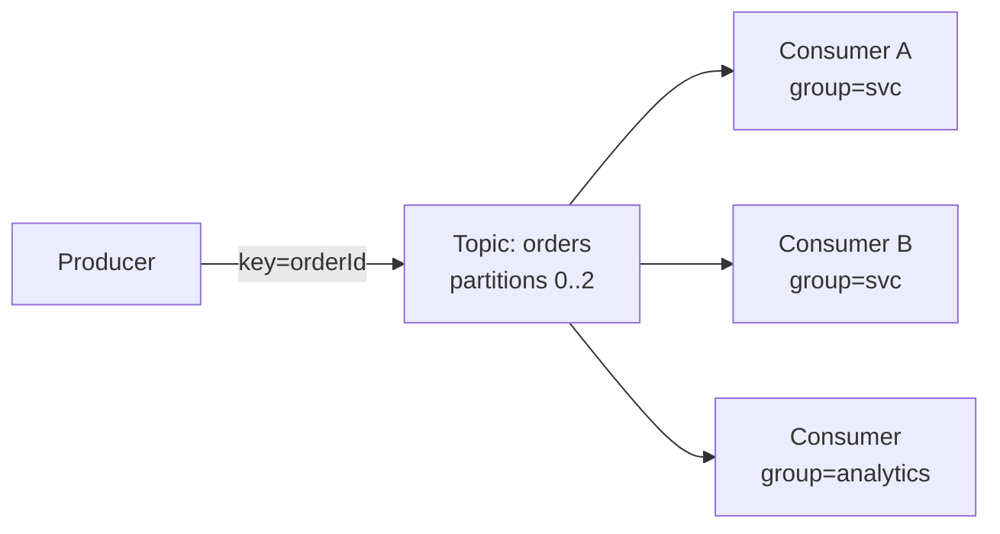

## 29.2 Spring Kafka

```java
@Component
public class OrderEventPublisher {
    private final KafkaTemplate<String, OrderEvent> template;
    public OrderEventPublisher(KafkaTemplate<String, OrderEvent> template) { this.template = template; }
    public void publish(OrderEvent e) {
        template.send("orders", e.orderId().toString(), e);   // key = orderId for ordering
    }
}

@Component
public class OrderEventConsumer {
    @KafkaListener(topics = "orders", groupId = "notification-service")
    public void onEvent(ConsumerRecord<String, OrderEvent> rec, Acknowledgment ack) {
        process(rec.value());
        ack.acknowledge();                 // manual commit after successful processing
    }
}
```

```yaml
spring:
  kafka:
    producer:
      acks: all                 # wait for all in-sync replicas (durability)
      properties:
        enable.idempotence: true
    consumer:
      group-id: notification-service
      enable-auto-commit: false # commit manually after processing
      auto-offset-reset: earliest
    listener:
      ack-mode: manual
```

## 29.3 Groups, Rebalancing, Lag, Ordering

- **Consumer group** parallelism is capped by **partition count**: more consumers than partitions = idle consumers. Size partitions for peak parallelism.
- **Rebalancing** reassigns partitions when consumers join/leave/fail — processing pauses briefly. Frequent rebalances (slow processing exceeding `max.poll.interval.ms`) hurt throughput.
- **Consumer lag** = how far behind the latest offset a consumer is; the key health metric (§62).

## Key Takeaways
- Partitions are the unit of parallelism and ordering; key for per-entity ordering.
- Manual commit after processing; `acks=all` + idempotent producer for durability.
- Group parallelism ≤ partitions; watch rebalances and lag.

## Common Mistakes
- Assuming topic-wide ordering.
- Auto-commit before processing → message loss on crash.
- Too few partitions limiting scale.

## Production Considerations
- Monitor lag; alert when it grows unbounded.
- Keep processing under `max.poll.interval.ms` or increase it / reduce `max.poll.records`.

## SDE2 Interview Questions
- *How does Kafka guarantee ordering?*
- *What happens if you have more consumers than partitions?*
- *Why commit offsets after processing, not before?*

## Practical Exercise
Produce `OrderEvent`s keyed by orderId to a 3-partition topic; run two consumers in one group and confirm each partition is owned by one consumer and per-order ordering holds.

---

# 30. Kafka Reliability

## 30.1 Delivery Semantics

| Semantic | Meaning | How |
|---|---|---|
| **At-most-once** | May lose, never duplicate | Commit offset *before* processing |
| **At-least-once** | Never lose, may duplicate | Commit *after* processing (**default, recommended**) |
| **Exactly-once** | No loss, no duplicate | Kafka transactions (EOS) within Kafka; still need idempotent *side effects* |

> **Important:** "Exactly-once" within Kafka (transactions/EOS) does not extend to external side effects (DB writes, emails, charges). In practice you run **at-least-once + idempotent consumers** so duplicates are harmless. Design for duplicates; don't chase perfect EOS across systems.

Duplicates happen because of retries, rebalances, and the commit-after-processing window (process succeeds, crash before offset commit → reprocess).

## 30.2 Reliability Patterns

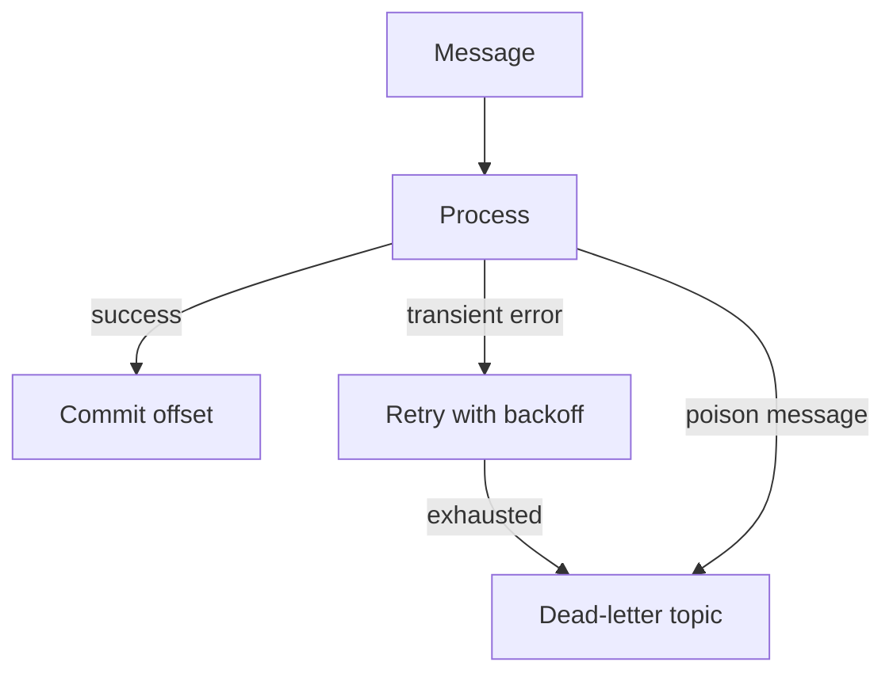

- **Idempotent consumer:** dedupe by a stable key (store processed message id/business key; skip if seen) — the single most important reliability measure (§50).
- **Retry + backoff:** Spring Kafka `DefaultErrorHandler` with `ExponentialBackOff` retries transient failures.
- **Dead-letter topic (DLT):** after retries exhaust (or for **poison messages** that can never succeed), route to a DLT for inspection/replay instead of blocking the partition forever.

```java
@Bean
DefaultErrorHandler errorHandler(KafkaTemplate<Object,Object> template) {
    var recoverer = new DeadLetterPublishingRecoverer(template); // -> <topic>.DLT
    return new DefaultErrorHandler(recoverer,
        new ExponentialBackOff(1000L, 2.0));                     // 1s,2s,4s...
}
```

> **Production Warning:** A poison message with infinite in-place retries blocks its entire partition — all later messages stall and lag grows. Always bound retries and route failures to a DLT.

## 30.3 Kafka vs SQS/SNS/EventBridge

| Need | Choose |
|---|---|
| High-throughput ordered event **log**, replay, many consumer groups, stream processing | **Kafka** |
| Simple decoupled **work queue**, per-message visibility/retry/DLQ, minimal ops | **SQS** |
| Fan-out pub/sub to multiple subscribers | **SNS** (often SNS→SQS) |
| Event routing/filtering between AWS services & SaaS | **EventBridge** |

Kafka is powerful but operationally heavy; if you just need a managed queue with retries/DLQ, SQS is simpler.

## Key Takeaways
- Default to at-least-once + idempotent consumers; design for duplicates.
- Bound retries with backoff; use DLTs for poison messages.
- Pick Kafka for log/replay/streaming, SQS/SNS/EventBridge for simpler decoupling.

## Common Mistakes
- Chasing exactly-once across systems instead of idempotency.
- Unbounded in-place retries blocking a partition.
- Using Kafka where SQS would be far simpler.

## Production Considerations
- Monitor DLT volume; alert and have a replay runbook.
- Make consumers idempotent before scaling throughput.

## SDE2 Interview Questions
- *Why is exactly-once hard with external side effects?*
- *How do you handle a poison message?*
- *Kafka vs SQS — when each?*

## Practical Exercise
Add a `DefaultErrorHandler` with exponential backoff + DLT. Send a message that always fails; confirm bounded retries then landing in `<topic>.DLT`, with the partition continuing to progress.

---

# 31. Messaging and Asynchronous Processing

## 31.1 Sync vs Async

Synchronous: caller waits for the result (REST call). Asynchronous: caller hands off work and continues; a worker processes later. Async decouples producer/consumer availability and smooths load spikes, at the cost of **eventual consistency** and added complexity.

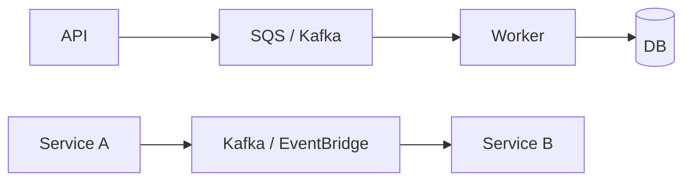

- **Queue (point-to-point):** one message, one consumer processes it (work distribution) — SQS.
- **Pub/Sub:** one message, many subscribers each get a copy — SNS/Kafka consumer groups.
- **Event-driven:** services emit domain events; others react, enabling loose coupling.

## 31.2 Cross-cutting Concerns

| Concern | Approach |
|---|---|
| **Retry** | Backoff + jitter; cap attempts |
| **DLQ** | Park unprocessable messages for inspection/replay |
| **Idempotency** | Dedupe by key — consumers must tolerate redelivery (§50) |
| **Backpressure** | Bounded queues/prefetch; slow down or shed load when overwhelmed |
| **Eventual consistency** | Readers may lag; design UX/APIs to tolerate it |

> **Best Practice:** Any async consumer must be **idempotent** and have a **DLQ**. Redelivery is a *when*, not an *if*. Also prefer the **transactional outbox** (§49) over "write DB then publish" to avoid losing events when the publish fails after the DB commit.

## Key Takeaways
- Async decouples and smooths load but introduces eventual consistency.
- Queue = one consumer; pub/sub = many; events = loose coupling.
- Always: idempotent consumers, retries+backoff, DLQ, backpressure.

## Common Mistakes
- Treating async as "fire and forget" with no retry/DLQ.
- Non-idempotent consumers.
- Ignoring backpressure until the queue explodes.

## Production Considerations
- Monitor queue depth/age and DLQ volume.
- Alert on consumer lag/backlog growth.

## SDE2 Interview Questions
- *Queue vs pub/sub vs event-driven?*
- *How do you handle redelivery and poison messages?*
- *What is backpressure and how do you apply it?*

## Practical Exercise
Build an async flow: API publishes to a queue, a worker consumes idempotently with retry+DLQ. Force a transient failure and confirm retry; force a permanent failure and confirm DLQ.

---

# 32. HTTP Clients

## 32.1 The Modern Options

| Client | Style | Use when |
|---|---|---|
| **`RestClient`** (Boot 3.2+) | Synchronous, fluent | New blocking code — the modern default (replaces `RestTemplate`) |
| **`WebClient`** | Reactive/non-blocking (also usable blocking) | Reactive stacks, high-concurrency I/O, streaming |
| **OpenFeign** | Declarative interface | Many internal service calls; you prefer interface-style clients |

```java
// RestClient
@Bean
RestClient paymentClient(RestClient.Builder b) {
    return b.baseUrl("https://payments.example.com")
            .requestInterceptor(correlationIdInterceptor())
            .build();
}
PaymentResult r = paymentClient.post().uri("/charges")
    .body(req).retrieve().body(PaymentResult.class);

// Declarative HTTP interface (RestClient/WebClient backed)
interface PaymentApi {
    @PostExchange("/charges") PaymentResult charge(@RequestBody ChargeRequest r);
}
```

## 32.2 Timeouts, Pooling, Headers, Correlation

> **Production Warning:** Every external HTTP call **must** have an explicit connect timeout and read/response timeout. The default for many clients is effectively infinite. One slow dependency with no timeout → threads block forever → thread/connection pool exhaustion → your whole service goes down (§52). Set timeouts shorter than your own request SLA.

```java
var factory = new SimpleClientHttpRequestFactory();   // or Apache/JDK HttpClient factory
factory.setConnectTimeout(1000);   // ms to establish TCP
factory.setReadTimeout(2000);      // ms to wait for response
```

- **Connection pooling:** reuse connections (Apache HttpClient / JDK `HttpClient` pool) to avoid TCP+TLS handshake per call. Bound the pool.
- **Headers/auth:** set `Authorization`, content type, and a **correlation/trace id** (propagate the incoming `traceparent`/`X-Request-Id`) so cross-service calls are traceable (§41).
- **Error handling:** map 4xx/5xx and timeouts to meaningful exceptions; don't bubble raw bodies to your clients (§10).

## Key Takeaways
- `RestClient` for new blocking code, `WebClient` for reactive/high-concurrency, Feign for declarative internal calls.
- Always set connect + read timeouts and pool connections.
- Propagate correlation IDs; translate upstream errors.

## Common Mistakes
- No timeouts → cascading failure.
- New connection per call (no pooling).
- Leaking upstream error details.

## Production Considerations
- Wrap external calls in Resilience4j (§33); set timeouts below SLA.
- Record client metrics (latency, error rate) per dependency.

## SDE2 Interview Questions
- *RestClient vs WebClient vs Feign — when each?*
- *Why are timeouts mandatory on external calls?*
- *How do you propagate trace context across services?*

## Practical Exercise
Build a `RestClient` with 1s/2s timeouts, connection pooling, and a correlation-id interceptor. Point it at a slow mock and confirm it fails fast at the read timeout instead of hanging.

---

# 33. Resilience and Fault Tolerance

## 33.1 Patterns (Resilience4j)

| Pattern | Protects against |
|---|---|
| **Timeout** | Slow/hung dependencies |
| **Retry** (+ backoff + jitter) | Transient failures |
| **Circuit breaker** | A persistently failing dependency (stop hammering it) |
| **Bulkhead** | One dependency exhausting all threads (isolate pools) |
| **Rate limiter** | Overloading yourself or a downstream |

```java
@Service
public class PaymentGateway {
    @CircuitBreaker(name = "payments", fallbackMethod = "fallback")
    @Retry(name = "payments")
    @TimeLimiter(name = "payments")
    public CompletableFuture<PaymentResult> charge(ChargeRequest r) { ... }

    private CompletableFuture<PaymentResult> fallback(ChargeRequest r, Throwable t) {
        return CompletableFuture.completedFuture(PaymentResult.deferred()); // graceful degrade
    }
}
```

```yaml
resilience4j:
  circuitbreaker:
    instances:
      payments:
        sliding-window-size: 50
        failure-rate-threshold: 50     # open at 50% failures
        wait-duration-in-open-state: 10s
  retry:
    instances:
      payments:
        max-attempts: 3
        wait-duration: 200ms
        enable-exponential-backoff: true
```

## 33.2 Circuit Breaker States

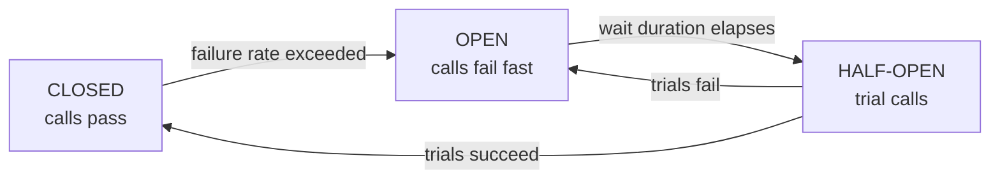

- **CLOSED:** normal; count failures.
- **OPEN:** short-circuit immediately (fail fast / fallback) — gives the dependency time to recover and protects your threads.
- **HALF-OPEN:** allow a few probes; close if they succeed, re-open if not.

## 33.3 Retries Can Make Things Worse

> **Production Warning:** Blind retries amplify load on an already-struggling dependency and cause **cascading failure / retry storms**. Rules: (1) retry only **transient, idempotent** operations; (2) use **exponential backoff + jitter** so clients don't retry in lockstep; (3) cap attempts; (4) put a **circuit breaker in front of retries** so a down dependency isn't retried relentlessly; (5) never retry non-idempotent writes without an idempotency key (§50).

## Key Takeaways
- Combine timeout + retry(backoff+jitter) + circuit breaker + bulkhead per dependency.
- Circuit breaker fails fast when a dependency is down, protecting your threads.
- Retry only idempotent/transient ops; backoff+jitter; breaker in front; cap attempts.

## Common Mistakes
- Retry without backoff/jitter → retry storm.
- No timeout under the retry (each attempt hangs).
- Retrying non-idempotent writes → duplicates.

## Production Considerations
- Expose Resilience4j metrics to Micrometer; alert on open circuits.
- Tune windows/thresholds to real traffic, not defaults.

## SDE2 Interview Questions
- *Explain circuit breaker states and why OPEN protects you.*
- *How can retries cause an outage? How do you make them safe?*
- *What is a bulkhead and when do you need it?*

## Practical Exercise
Wrap a flaky dependency with timeout+retry+circuit breaker and a fallback. Drive its failure rate above threshold and watch the breaker open (fast failures), then recover via half-open.

---

# 34. Scheduling

## 34.1 `@Scheduled`

```java
@Component
public class ReportJobs {
    @Scheduled(fixedRate = 60_000)       // every 60s from start-to-start
    void pollQueue() { ... }

    @Scheduled(fixedDelay = 60_000)      // 60s after previous completion
    void reconcile() { ... }

    @Scheduled(cron = "0 0 2 * * *", zone = "UTC")  // 02:00 UTC daily
    void nightlyRollup() { ... }
}
```

Enable with `@EnableScheduling`. `fixedRate` ignores run duration (can overlap/pile up); `fixedDelay` waits after completion; `cron` for calendar schedules.

## 34.2 The Multi-Instance Problem

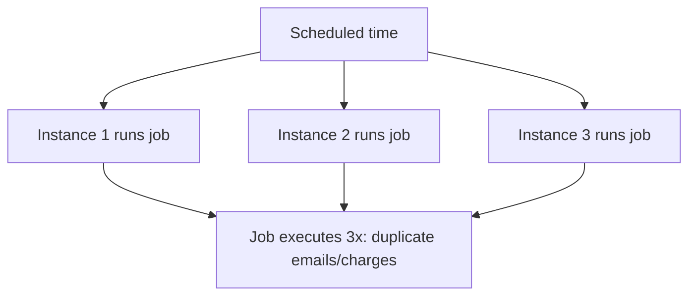

> **Production Warning:** When you run N replicas (normal in prod), **every instance fires every `@Scheduled` job** — the job runs N times. For anything with side effects (emails, billing, data mutation) this means duplicates. Local `@Scheduled` is only safe for truly idempotent or per-instance work.

## 34.3 Preventing Duplicate Execution

| Approach | How |
|---|---|
| **ShedLock** | Annotate the job; it grabs a DB/Redis lock so only one instance runs | 
| **Quartz** (clustered) | JDBC job store coordinates execution across the cluster |
| **External scheduler** | K8s CronJob / EventBridge / cron triggers a single pod/endpoint |

```java
@Scheduled(cron = "0 0 2 * * *")
@SchedulerLock(name = "nightlyRollup", lockAtMostFor = "10m", lockAtLeastFor = "1m")
void nightlyRollup() { ... }   // ShedLock ensures single execution across instances
```

> **Best Practice:** For side-effecting scheduled work across replicas, use ShedLock (simple) or a clustered scheduler, and still make the job idempotent as defense in depth. Many teams move scheduling out of the app entirely (K8s CronJob/EventBridge) so scaling the app doesn't multiply jobs.

## Key Takeaways
- `fixedRate` vs `fixedDelay` vs `cron`; `fixedRate` can overlap.
- Every replica runs every `@Scheduled` job — duplicates for side-effecting work.
- Use ShedLock/Quartz/external scheduler + idempotency.

## Common Mistakes
- Side-effecting `@Scheduled` jobs on multi-replica deployments.
- `fixedRate` jobs piling up when a run exceeds the interval.
- No idempotency as backup to the lock.

## Production Considerations
- Set `lockAtMostFor` > max expected runtime so a crashed holder's lock releases.
- Monitor job success/duration; alert on missed/overrunning jobs.

## SDE2 Interview Questions
- *What happens to `@Scheduled` jobs with 3 replicas?*
- *How does ShedLock prevent duplicate runs?*
- *`fixedRate` vs `fixedDelay`?*

## Practical Exercise
Add a side-effecting `@Scheduled` job, run two instances, observe double execution, then add `@SchedulerLock` and confirm single execution.

---

# 35. Database Migrations

## 35.1 Flyway and Liquibase

Schema must evolve in version control, applied consistently across environments, automatically, and in order. **Flyway** (SQL-first, versioned files `V1__init.sql`, `V2__add_col.sql`) and **Liquibase** (changelogs in XML/YAML/SQL with richer abstractions/rollback) both do this. Boot runs them on startup.

```sql
-- src/main/resources/db/migration/V2__add_order_status_index.sql
CREATE INDEX CONCURRENTLY idx_orders_status ON orders(status);
```

| | Flyway | Liquibase |
|---|---|---|
| Format | SQL files | XML/YAML/JSON/SQL changelogs |
| Rollback | Manual (community) | Built-in rollback tags |
| Learning curve | Low | Higher |
| Best for | SQL-comfortable teams | DB-agnostic / complex rollback needs |

## 35.2 Zero-Downtime: Expand and Contract

During a rolling deploy, **old and new app versions run simultaneously**. A migration must be compatible with *both*.

```mermaid
flowchart TB
    A[Old app running] --> B[Expand: add nullable column / new table<br/>backward compatible]
    B --> C[Deploy new app that writes both old+new]
    C --> D[Backfill data]
    D --> E[Switch: new app reads/writes new]
    E --> F[Contract later: drop old column after old app gone]
```

> **Production Warning:** A single migration that renames/drops a column and deploys atomically **breaks the old instances still running during the rollout** (they query the old column) → 500s (§63 Scenario 13). Never rename/drop in one step. Use **expand/contract**: add new → make app write both → backfill → switch reads → (next release) drop old. Also avoid long-locking DDL on big tables during traffic; use `CREATE INDEX CONCURRENTLY`, add columns without volatile defaults, and batch backfills.

## Key Takeaways
- Version-control schema with Flyway/Liquibase, applied automatically in order.
- Rolling deploys run old+new together; migrations must be backward compatible.
- Expand/contract for destructive changes; avoid long table locks.

## Common Mistakes
- Rename/drop in one deploy → old instances crash.
- `NOT NULL` + default on a huge table locking it during peak.
- Editing an already-applied migration (checksum mismatch).

## Production Considerations
- Test migrations against a production-sized copy.
- Make migrations idempotent-ish and reversible where possible; keep a rollback plan.

## SDE2 Interview Questions
- *How do you do a zero-downtime column rename?* (expand/contract)
- *Why can a migration break currently-running instances?*
- *Flyway vs Liquibase trade-offs.*

## Practical Exercise
Rename a column via expand/contract across three steps and verify both app versions work at each stage against the same DB.

---

# 36. Testing (Unit, JUnit 5, Mockito)

## 36.1 Unit Testing with JUnit 5

Unit tests verify a single class in isolation — fast, no Spring context, collaborators mocked.

```java
class OrderServiceTest {
    OrderRepository repo = mock(OrderRepository.class);
    PaymentClient payment = mock(PaymentClient.class);
    OrderService service = new OrderService(repo, payment); // constructor injection = easy to build

    @Test
    void createsOrderAndCharges() {
        when(repo.save(any())).thenAnswer(i -> i.getArgument(0));
        when(payment.charge(any())).thenReturn(PaymentResult.ok("ch_1"));

        var resp = service.createOrder(new CreateOrderRequest(...));

        assertThat(resp.status()).isEqualTo(OrderStatus.PAID);
        ArgumentCaptor<ChargeRequest> captor = ArgumentCaptor.forClass(ChargeRequest.class);
        verify(payment).charge(captor.capture());
        assertThat(captor.getValue().amount()).isEqualByComparingTo("49.99");
    }

    @ParameterizedTest
    @ValueSource(ints = {0, -1, 1001})
    void rejectsInvalidQuantity(int qty) {
        assertThatThrownBy(() -> service.validateQuantity(qty))
            .isInstanceOf(IllegalArgumentException.class);
    }
}
```

## 36.2 Mockito: Mock vs Spy, Stub, Verify, Captor

| Tool | Purpose |
|---|---|
| **Mock** | Fake object; all methods return defaults until stubbed |
| **Spy** | Real object with selective stubbing (use sparingly) |
| **Stub** (`when...thenReturn`) | Define return behavior |
| **Verify** | Assert an interaction happened (`verify(x).m()`) |
| **ArgumentCaptor** | Capture args passed to a mock for assertions |

## 36.3 What to Mock (and Not)

> **Best Practice:** Mock **collaborators across a boundary you don't own or that are slow/nondeterministic** (external HTTP clients, message publishers, clocks, the payment gateway). **Don't mock** value objects, the class under test, or things you can run cheaply for real (prefer a real/in-memory DB via Testcontainers for repository behavior, §38). Over-mocking produces tests that pass while production breaks because they assert on your assumptions, not real behavior.

## Key Takeaways
- Unit tests: fast, isolated, no context; constructor injection makes them trivial.
- Use mock/spy/stub/verify/captor appropriately.
- Mock boundaries, not everything; don't over-mock.

## Common Mistakes
- Mocking the class under test or value objects.
- Asserting only on mocks (no behavior verified).
- Spying real objects to patch over design problems.

## Production Considerations
- Keep unit tests deterministic (inject `Clock`, no real time/network).
- Fast unit suite = fast feedback; keep it green and quick.

## SDE2 Interview Questions
- *Mock vs spy? When do you use a captor?*
- *What should you not mock?*
- *How do you test time-dependent logic?* (inject `Clock`)

## Practical Exercise
Unit-test `OrderService` with mocked repo + payment client; use an `ArgumentCaptor` to assert the charge amount and a parameterized test for quantity bounds.

---

# 37. Spring Boot Testing (Slices and Integration)

## 37.1 Test Types

| Annotation | Loads | Use for |
|---|---|---|
| `@WebMvcTest` | Web layer only (controllers, filters, advice) + `MockMvc` | Controller/validation/serialization/security rules |
| `@DataJpaTest` | JPA layer + in-memory/Testcontainers DB | Repository queries, mappings |
| `@SpringBootTest` | Full context | End-to-end integration within the app |
| `WebTestClient` | Reactive/full client | WebFlux or full-stack HTTP tests |

```java
@WebMvcTest(OrderController.class)
class OrderControllerTest {
    @Autowired MockMvc mvc;
    @MockitoBean OrderService service;  // service mocked; only web layer tested

    @Test
    void returns201OnCreate() throws Exception {
        when(service.create(any())).thenReturn(new OrderResponse(...));
        mvc.perform(post("/api/orders").contentType(APPLICATION_JSON).content("{...}"))
           .andExpect(status().isCreated())
           .andExpect(header().exists("Location"));
    }

    @Test
    void returns400OnInvalidBody() throws Exception {
        mvc.perform(post("/api/orders").contentType(APPLICATION_JSON).content("{}"))
           .andExpect(status().isBadRequest());
    }
}
```

```java
@DataJpaTest
class OrderRepositoryTest {
    @Autowired OrderRepository repo;
    @Test void findsByStatus() { /* persist + query, assert */ }
}
```

## 37.2 Context Caching and Why `@SpringBootTest` Is Slow

> **Important:** Spring **caches the application context** across tests that share the same configuration. Each *distinct* context configuration (different `@MockitoBean`s, properties, active profiles, slice annotations) creates a **new** context — expensive. A suite with many unique configurations reloads the context repeatedly and crawls. Keep configurations uniform, prefer slices (`@WebMvcTest`/`@DataJpaTest`) over full `@SpringBootTest`, and reserve full context tests for genuine end-to-end paths.

## Key Takeaways
- Slice tests load only what you need and are fast; full `@SpringBootTest` is for integration.
- `MockMvc` tests the web layer; `@DataJpaTest` the persistence layer.
- Context caching makes uniform configs fast and divergent configs slow.

## Common Mistakes
- `@SpringBootTest` for everything (slow suite).
- A new context per test from inconsistent mocks/properties.
- Testing serialization/validation with full context instead of `@WebMvcTest`.

## Production Considerations
- Separate fast (unit/slice) from slow (integration) suites in CI.
- Reuse Testcontainers across the suite (§38) to avoid per-test startup.

## SDE2 Interview Questions
- *When do you use `@WebMvcTest` vs `@DataJpaTest` vs `@SpringBootTest`?*
- *Why can a Spring Boot test suite become slow?* (context cache misses)
- *How do you test that validation returns 400?*

## Practical Exercise
Write a `@WebMvcTest` for create (201 + Location, 400 on invalid) with the service mocked, and a `@DataJpaTest` for a custom query.

---

# 38. Testcontainers

## 38.1 What and Why

Testcontainers spins up **real** dependencies (PostgreSQL, Redis, Kafka) in Docker for integration tests, then tears them down. You test against the actual engine instead of mocks or H2 (which behaves differently from Postgres and hides bugs).

```mermaid
flowchart TB
    J[JUnit test] --> TC[Testcontainers]
    TC --> PG[(Real PostgreSQL<br/>in Docker)]
    PG --> App[Spring Boot context]
```

```java
@SpringBootTest
@Testcontainers
class OrderIntegrationTest {
    @Container @ServiceConnection          // auto-wires datasource props (Boot 3.1+)
    static PostgreSQLContainer<?> pg = new PostgreSQLContainer<>("postgres:16");

    @Autowired OrderRepository repo;

    @Test
    void persistsAndQueries() {
        repo.save(sampleOrder());
        assertThat(repo.findByStatus(CREATED, Pageable.ofSize(10))).isNotEmpty();
    }
}
```

`@ServiceConnection` auto-configures the datasource/Redis/Kafka connection from the container — no manual property wiring.

## 38.2 Why Real Infra Beats Mocking Everything

> **Best Practice:** Mocking the DB can't catch SQL errors, constraint violations, migration bugs, N+1 (§15), transaction/locking behavior, or dialect differences. Testcontainers catches these before prod. Use a **singleton container** (static, started once, reused across the suite) and clean data between tests (truncate/rollback) rather than restarting the container per test.

## Key Takeaways
- Testcontainers = real dependencies in Docker; catches what mocks/H2 miss.
- `@ServiceConnection` wires config automatically.
- Reuse a singleton container; clean data between tests.

## Common Mistakes
- H2 for tests but Postgres in prod (dialect/behavior drift).
- Restarting containers per test (slow).
- No data cleanup → inter-test coupling.

## Production Considerations
- Keep an integration suite gating merges.
- Pin container image versions to match prod engine versions.

## SDE2 Interview Questions
- *Why Testcontainers over H2/mocks for repository tests?*
- *How do you keep Testcontainers suites fast?* (singleton + data cleanup)
- *What bugs do DB mocks hide?*

## Practical Exercise
Convert a `@DataJpaTest` from H2 to a Testcontainers Postgres with `@ServiceConnection`. Add a unique constraint and assert the integration test catches a duplicate insert that H2 missed.

---

# 39. Testing Strategy

## 39.1 The Pyramid

```mermaid
flowchart TB
    E2E[E2E - few, slow, high value] --> INT[Integration - some]
    INT --> UNIT[Unit - many, fast, cheap]
```

- **Unit** (many): pure logic, mocked boundaries, milliseconds.
- **Integration** (some): real DB/Kafka via Testcontainers; verify wiring, SQL, transactions.
- **Contract** (between services): verify producer/consumer agree on the API/event schema (e.g., Spring Cloud Contract) so independent deploys don't break each other.
- **E2E** (few): full system through real entry points; slow and brittle — keep minimal.

## 39.2 What to Mock, Isolation, Data

| Topic | Guidance |
|---|---|
| **Mock** | External HTTP, time, randomness, third-party gateways |
| **Don't mock** | Your DB (use Testcontainers), your own value logic |
| **Isolation** | Each test independent; no shared mutable state/order dependence |
| **DB cleanup** | `@Transactional` rollback (slice) or truncate between tests |
| **Test data** | Builders/object mothers; avoid giant shared fixtures |

> **Best Practice:** Invert the common anti-pattern of an "ice cream cone" (lots of slow E2E, few unit tests). Push coverage down the pyramid: most logic in fast unit tests, critical paths in Testcontainers integration tests, a thin layer of E2E for the happy path. Test **failure cases** (timeouts, conflicts, validation), not just the happy path.

## Key Takeaways
- Many unit, some integration (Testcontainers), few E2E; add contract tests between services.
- Mock boundaries; use real DB; keep tests isolated and data clean.
- Test failures, not just success.

## Common Mistakes
- Ice-cream-cone suites (slow, flaky).
- Order-dependent tests sharing state.
- Only happy-path coverage.

## Production Considerations
- Gate merges on unit+integration; run E2E less frequently.
- Track flaky tests and fix or quarantine them.

## SDE2 Interview Questions
- *Describe your testing strategy and the pyramid.*
- *What are contract tests and why?*
- *How do you keep tests isolated and fast?*

## Practical Exercise
For the order flow, write: unit tests for pricing, a Testcontainers integration test for persistence + optimistic lock conflict (409), and one E2E happy-path test.

---

# 40. Spring Boot Actuator

## 40.1 Endpoints

Actuator exposes operational endpoints: `health`, `metrics`, `info`, `loggers` (change log levels at runtime), `env`, `beans`, `mappings`, `threaddump`, `heapdump`, `prometheus`.

```yaml
management:
  endpoints:
    web:
      exposure:
        include: health,info,prometheus   # expose ONLY what you need
  endpoint:
    health:
      probes:
        enabled: true                      # liveness/readiness groups
      show-details: when-authorized
```

## 40.2 Liveness vs Readiness

```mermaid
flowchart LR
    LB[Load balancer / K8s] -->|/actuator/health/readiness| R{Ready?}
    R -->|UP| T[Route traffic]
    R -->|DOWN| N[Stop routing, keep pod]
    LB -->|/actuator/health/liveness| L{Alive?}
    L -->|DOWN| K[Restart pod]
```

- **Liveness** — is the app alive? If DOWN, the orchestrator **restarts** it. Should fail only on unrecoverable state (deadlock), *not* on a transient dependency outage.
- **Readiness** — can it serve traffic now? If DOWN, the orchestrator **stops routing** (but doesn't restart). Flip to DOWN during startup warm-up and graceful shutdown (§58).

> **Important:** Don't make liveness depend on the DB/Redis. If you do, a brief DB blip makes K8s restart all pods (making the outage worse). Readiness may consider critical dependencies; liveness should not.

## 40.3 Custom Health Indicators

```java
@Component
public class PaymentHealthIndicator implements HealthIndicator {
    public Health health() {
        return pingPaymentProvider()
            ? Health.up().build()
            : Health.down().withDetail("provider","unreachable").build();
    }
}
```

Integrates with Docker `HEALTHCHECK`, ECS/ALB target-group health checks, and K8s liveness/readiness probes.

## 40.4 Security

> **Production Warning:** Never expose all Actuator endpoints publicly. `env`/`beans`/`heapdump`/`loggers`/`threaddump` leak config (incl. secrets), internals, and memory contents, and allow runtime changes. Expose only `health` (and maybe `info`) publicly; secure the rest behind auth or a separate management port/network, and bind the management port internally.

## Key Takeaways
- Actuator gives health/metrics/diagnostics; expose minimally.
- Liveness → restart; readiness → route/stop-routing. Keep liveness independent of external deps.
- Secure or isolate sensitive endpoints; only health public.

## Common Mistakes
- `include: "*"` in prod → secret/internal exposure.
- Liveness tied to DB → restart storms.
- Readiness not flipped during shutdown → dropped requests.

## Production Considerations
- Separate management port/network; integrate probes with the orchestrator.
- Export `prometheus` endpoint for scraping (§41).

## SDE2 Interview Questions
- *Liveness vs readiness — what does each failure cause?*
- *Why shouldn't liveness depend on the database?*
- *Why is exposing all Actuator endpoints dangerous?*

## Practical Exercise
Enable liveness/readiness probes and a custom health indicator. Simulate a dependency outage and confirm readiness goes DOWN while liveness stays UP (no restart).

---

# 41. Observability

## 41.1 The Three Pillars

```mermaid
flowchart LR
    C[Client] -->|traceId t1| A[Service A]
    A -->|propagate t1| B[Service B]
    B --> DB[(DB)]
    A -. logs+metrics+spans .-> O[(Observability backend)]
    B -. logs+metrics+spans .-> O
```

- **Logs** — discrete events; structured (JSON) with correlation/trace IDs.
- **Metrics** — aggregated numbers over time (rates, latencies, gauges).
- **Traces** — a request's path across services, with per-hop spans and timing.

## 41.2 Metrics with Micrometer

Micrometer is Spring's metrics facade (like SLF4J for metrics), exporting to Prometheus/CloudWatch/Datadog.

| Type | Measures | Example |
|---|---|---|
| **Counter** | Monotonic count | requests, errors |
| **Gauge** | Current value | queue depth, pool active connections |
| **Timer** | Duration + rate | request latency |
| **Distribution summary / histogram** | Value distribution + percentiles | payload size, p95/p99 latency |

```java
@Service
class OrderService {
    private final Counter created;
    private final Timer latency;
    OrderService(MeterRegistry reg) {
        this.created = reg.counter("orders.created");
        this.latency = reg.timer("orders.create.latency");
    }
    OrderResponse create(CreateOrderRequest r) {
        return latency.record(() -> { created.increment(); return doCreate(r); });
    }
}
```

Spring Boot auto-instruments HTTP server latency, HikariCP, JVM, and more. Prefer p95/p99 over averages — averages hide tail latency.

## 41.3 Distributed Tracing

A **trace** has a unique `traceId` spanning the whole request; each operation is a **span** with a `spanId` and parent. Context is propagated across services via headers (W3C `traceparent`). Micrometer Tracing + OpenTelemetry capture and export spans to Jaeger/Tempo/X-Ray/Datadog. The same `traceId` appears in logs (via MDC) so you can jump log↔trace.

## 41.4 Integrations

CloudWatch (AWS logs/metrics), Prometheus + Grafana (metrics + dashboards), Datadog (all three), OpenTelemetry (vendor-neutral collection). Export via Micrometer/OTel exporters.

## Key Takeaways
- Logs + metrics + traces, correlated by a trace id.
- Micrometer = metrics facade; use counters/gauges/timers/histograms; watch p95/p99.
- Propagate W3C trace context across services; link logs to traces via MDC.

## Common Mistakes
- Averages instead of percentiles.
- Logs without trace/correlation IDs → can't follow a request.
- No cross-service context propagation.

## Production Considerations
- Standardize trace-id propagation across all clients (§32).
- Build dashboards + alerts on error rate, latency percentiles, saturation.

## SDE2 Interview Questions
- *The three pillars and how they relate?*
- *Counter vs gauge vs timer?*
- *How does a trace follow a request across services?*

## Practical Exercise
Add Micrometer + OTel tracing. Make service A call service B and confirm one `traceId` spans both, visible in logs and the trace backend. Add a custom timer and view p95 in Grafana.

---

# 42. Logging

## 42.1 SLF4J + Logback + Structured JSON

SLF4J is the API; Logback the default implementation. In production, log **structured JSON** so logs are queryable (CloudWatch Insights, ELK, Datadog). Include a trace/correlation id on every line via MDC.

```java
private static final Logger log = LoggerFactory.getLogger(OrderService.class);

MDC.put("traceId", traceId);                      // usually set by a filter/tracing lib
try {
    log.info("order_created orderId={} amount={}", orderId, amount);  // parameterized
} finally {
    MDC.clear();
}
```

```xml
<!-- logback-spring.xml: JSON encoder (logstash encoder) -->
<appender name="JSON" class="ch.qos.logback.core.ConsoleAppender">
  <encoder class="net.logstash.logback.encoder.LogstashEncoder"/>
</appender>
```

| Level | Use for |
|---|---|
| ERROR | Failures needing attention (with stack trace) |
| WARN | Recoverable anomalies, degraded behavior |
| INFO | Key business events, lifecycle |
| DEBUG | Diagnostic detail (off in prod by default) |
| TRACE | Very fine detail |

> **Best Practice:** Use parameterized logging (`log.info("x={}", x)`), not string concatenation — it avoids building strings for disabled levels. Change levels at runtime via the Actuator `loggers` endpoint (secured) instead of redeploying.

## 42.2 What to Log vs Never Log

**Log:** request/trace id, user/tenant id (non-sensitive), key business events, errors with context, latency/outcome of external calls.

> **Production Warning:** **Never log** passwords, JWTs/access tokens, API keys, secrets, full card/PAN or other regulated PII, or entire request/response bodies that may contain them. Logs are widely accessible and long-retained — leaking secrets into logs is a common, serious incident. Mask/redact sensitive fields; log identifiers, not payloads.

## Key Takeaways
- Structured JSON logs with trace id; parameterized messages; sensible levels.
- Change levels at runtime via Actuator.
- Never log secrets/PII; log identifiers and events.

## Common Mistakes
- Logging tokens/PII/full bodies.
- String concatenation in hot logging paths.
- Unstructured logs that can't be queried.

## Production Considerations
- Centralize/ship logs; set retention; alert on ERROR rate.
- Correlate logs with traces via the shared id.

## SDE2 Interview Questions
- *How do you correlate logs across a distributed request?* (trace id in MDC)
- *What must never be logged?*
- *Why parameterized logging?*

## Practical Exercise
Configure JSON logging with a trace id from MDC. Add a redaction so an `Authorization` header is masked. Verify a token never appears in output.

---

# 43. Performance Optimization

## 43.1 Methodology

```mermaid
flowchart LR
    M[Measure baseline] --> I[Identify bottleneck]
    I --> P[Profile the hotspot]
    P --> O[Optimize one thing]
    O --> M2[Measure again]
    M2 --> I
```

> **Important:** Optimize with data, not intuition. Measure (metrics/traces/profiler) → find the actual bottleneck → change one thing → measure again. Most backend latency is in the **database and external calls**, not CPU-bound Java code.

## 43.2 Where to Look

| Area | Common wins |
|---|---|
| **Database** | Indexes, N+1, projections, keyset pagination, batching (§15–20) |
| **External HTTP** | Timeouts, connection pooling, parallelism, caching responses |
| **Caching** | Cache hot reads with TTL (§27) |
| **Serialization** | Smaller payloads, avoid reflection mappers, stream large responses |
| **JVM/GC** | Right heap size, modern GC, reduce allocation (§45) |
| **Thread/connection pools** | Size to match downstream capacity (§19, §44) |
| **Network** | Compression, fewer round-trips, co-locate |

## 43.3 Premature Optimization

> **Production Warning:** Premature optimization wastes effort and adds complexity/bugs for gains that may not matter. Don't micro-optimize Java loops while an unindexed query or a missing timeout dominates latency. Profile first; fix the biggest contributor; stop when you meet the SLA.

## Key Takeaways
- Measure → identify → profile → optimize one thing → re-measure.
- DB and external calls dominate; look there first.
- Avoid premature optimization; let data drive.

## Common Mistakes
- Guessing instead of profiling.
- Optimizing code while the DB is the bottleneck.
- Changing many things at once (can't attribute impact).

## Production Considerations
- Keep latency percentiles and saturation dashboards (§41).
- Load-test before major launches (§63 Scenario 1).

## SDE2 Interview Questions
- *How do you approach a latency regression?*
- *Where is most backend latency and why?*
- *When is optimization premature?*

## Practical Exercise
Take a slow endpoint, capture a baseline p95, use a trace/profiler to find the hotspot (likely a query), fix it, and show the p95 improvement.

---

# 44. Thread Pools and Concurrency

## 44.1 Primitives

- **Thread** — unit of execution; platform threads map to OS threads and are limited.
- **`ExecutorService` / `ThreadPoolExecutor`** — managed pool: core/max size, queue, rejection policy.
- **`CompletableFuture`** — compose async tasks (parallel external calls, pipelines).
- **Synchronization/locks** — `synchronized`, `ReentrantLock`, atomics, concurrent collections.

```java
@Bean
ThreadPoolTaskExecutor appExecutor() {
    var ex = new ThreadPoolTaskExecutor();
    ex.setCorePoolSize(10); ex.setMaxPoolSize(20); ex.setQueueCapacity(100);
    ex.setThreadNamePrefix("app-");
    ex.setRejectedExecutionHandler(new ThreadPoolExecutor.CallerRunsPolicy());
    return ex;
}

@Async("appExecutor")
public CompletableFuture<Report> buildReport(UUID id) { ... }  // proxy-based (§26): call from another bean
```

## 44.2 How Bottlenecks Propagate

```mermaid
flowchart TB
    R[HTTP requests] --> TT[Tomcat thread pool]
    TT --> BL[Business logic]
    BL --> CP[DB connection pool]
    CP --> DB[(Database)]
```

> **Important:** The chain is only as wide as its narrowest stage. If the DB is slow, requests hold connections longer → the connection pool drains → Tomcat threads block waiting for a connection → the thread pool fills → new requests queue/reject → latency and 503s. A downstream slowdown **back-pressures all the way to the edge**. This is why one slow query or one slow external dependency can take down the whole service (§18, §19, §52).

## 44.3 Concurrency Hazards

| Hazard | Cause | Mitigation |
|---|---|---|
| **Race condition** | Unsynchronized shared mutable state | Immutability, atomics, locks, DB constraints |
| **Deadlock** | Locks acquired in different orders | Consistent lock ordering, timeouts |
| **Thread starvation** | All threads blocked on a slow resource | Timeouts, bulkheads (§33) |
| **Pool exhaustion** | More blocked tasks than threads | Bound work, isolate pools, fix the slow dependency |

## Key Takeaways
- Pools everywhere; size them together; the narrowest gates throughput.
- Downstream slowness back-pressures to the edge → cascading failure.
- Beware races/deadlocks/starvation/exhaustion; `@Async` is proxy-based.

## Common Mistakes
- Mutable shared state on singletons (§2).
- `@Async` self-invoked (no effect).
- Unbounded pools/queues hiding the real bottleneck.

## Production Considerations
- Name threads for diagnostics; monitor pool saturation.
- Separate pools for independent workloads (bulkhead).

## SDE2 Interview Questions
- *Explain how a slow DB causes 503s at the edge.*
- *Race vs deadlock vs starvation vs exhaustion.*
- *Why doesn't a self-invoked `@Async` run asynchronously?*

## Practical Exercise
Create a bounded executor and an `@Async` method (called from another bean). Simulate a slow downstream and observe the pool saturate; add a timeout + bulkhead and show recovery.

---

# 45. JVM Knowledge Required for Spring Boot SDE2

## 45.1 Memory Model (practical)

| Region | Holds | Problem signal |
|---|---|---|
| **Heap** (young + old gen) | Objects | `OutOfMemoryError: Java heap space`, rising old gen = leak |
| **Stack** (per thread) | Frames/locals | `StackOverflowError` (deep/infinite recursion) |
| **Metaspace** | Class metadata | `OutOfMemoryError: Metaspace` (classloader leak, too many classes) |

## 45.2 Garbage Collection

GC reclaims unreachable objects. Modern collectors (G1 default; ZGC/Shenandoah for low pause) trade throughput vs pause time. Symptoms: **long GC pauses** → latency spikes; **constant full GCs with little reclaimed** → memory leak or undersized heap. Watch GC time %, pause durations, and old-gen occupancy after GC.

## 45.3 Diagnostics

| Symptom | Tool | What it shows |
|---|---|---|
| 100% CPU | **Thread dump** (`jstack`, `jcmd Thread.print`) | Hot/looping threads, lock contention |
| High/rising memory, OOM | **Heap dump** (`jmap`, `jcmd GC.heap_dump`) + analyzer (MAT) | What's retaining memory (leaks) |
| Latency spikes | **GC logs** / **JFR** | Pauses, allocation rate |
| General profiling | **Java Flight Recorder** + Mission Control / async-profiler | CPU hotspots, allocation, locks |

```bash
jcmd <pid> Thread.print > threads.txt       # thread dump
jcmd <pid> GC.heap_dump /tmp/heap.hprof      # heap dump
jcmd <pid> JFR.start duration=60s filename=rec.jfr
```

> **Important:** You rarely need deep JVM internals, but you must be able to grab a **thread dump** (for CPU/hangs/deadlocks) and a **heap dump** (for leaks/OOM) in production and read them. These are the first two tools in most JVM incidents (§62).

## Key Takeaways
- Know heap/stack/metaspace and their OOM signatures.
- GC pauses cause latency; constant full GC often means a leak or small heap.
- Thread dump for CPU/hangs, heap dump for memory, JFR for profiling.

## Common Mistakes
- Blindly increasing heap instead of finding the leak.
- Ignoring GC logs during latency investigations.
- Not capturing a dump before restarting a sick pod (evidence lost).

## Production Considerations
- Set `-XX:+HeapDumpOnOutOfMemoryError`; keep JFR available.
- Right-size heap to the container memory limit (leave headroom for metaspace/threads/off-heap).

## SDE2 Interview Questions
- *CPU at 100% — first steps?* (thread dump, find hot threads)
- *Memory grows for hours then OOM — how do you find the leak?* (heap dump + MAT)
- *What do long GC pauses indicate?*

## Practical Exercise
Trigger a memory leak (unbounded cache), watch old gen rise, capture a heap dump, and identify the retaining object in MAT.

---

# 46. Virtual Threads

## 46.1 Platform vs Virtual Threads

**Platform threads** map 1:1 to OS threads — expensive, limited to a few thousand; a blocked platform thread wastes an OS thread. **Virtual threads** (Java 21, Project Loom) are lightweight threads scheduled by the JVM onto a small pool of carrier threads. When a virtual thread blocks on I/O, the JVM parks it and frees the carrier, so you can have **millions** of blocking tasks cheaply.

```yaml
spring:
  threads:
    virtual:
      enabled: true    # Boot 3.2+: Tomcat serves each request on a virtual thread
```

## 46.2 When They Help (and Don't)

| Workload | Virtual threads | Why |
|---|---|---|
| **I/O-bound** (DB, external HTTP, lots of blocking) | ✅ big win | Blocking no longer ties up a scarce OS thread; high concurrency with simple blocking code |
| **CPU-bound** | ❌ no benefit | You're limited by cores, not thread count |

> **Important:** Virtual threads let you keep **simple blocking code** while scaling I/O concurrency — an alternative to going reactive (§47) for many services. But: the **downstream pools are still bounded**. A million virtual threads all hitting a 20-connection HikariCP pool still queue on 20 connections — virtual threads remove the *thread* bottleneck, not the *connection/DB* bottleneck. Size downstream pools accordingly, and watch for "pinning" when a virtual thread blocks inside a `synchronized` block (prefer `ReentrantLock`).

## Key Takeaways
- Virtual threads make blocking I/O cheap; great for I/O-bound services, no help for CPU-bound.
- Keep simple blocking code at high concurrency without going reactive.
- Downstream pools (DB/connections) remain the real limit; avoid `synchronized` pinning.

## Common Mistakes
- Expecting virtual threads to speed up CPU-bound work.
- Assuming they remove DB/connection limits.
- Pinning via `synchronized` around blocking calls.

## Production Considerations
- Re-evaluate thread-pool sizing when enabling; connection pools often become the binding constraint.
- Monitor for pinning (JFR event).

## SDE2 Interview Questions
- *Platform vs virtual threads?*
- *When do virtual threads NOT help?*
- *Do virtual threads remove the need to size the connection pool?* (no)

## Practical Exercise
Enable virtual threads, load-test an I/O-bound endpoint, and compare throughput/thread count vs platform threads. Observe that HikariCP size still caps DB concurrency.

---

# 47. Reactive Spring (fundamentals only)

## 47.1 Model

**Spring MVC** is thread-per-request (blocking): each request holds a thread until done. **Spring WebFlux** is non-blocking: a small event-loop pool handles many concurrent requests; work is expressed as a `Mono<T>` (0/1) or `Flux<T>` (0..N) pipeline, and threads are never blocked waiting on I/O. **Backpressure** lets a slow consumer signal a fast producer to slow down.

```java
@GetMapping("/orders/{id}")
public Mono<OrderResponse> get(@PathVariable UUID id) {
    return orderRepo.findById(id)                    // reactive repository
        .map(mapper::toResponse)
        .switchIfEmpty(Mono.error(new OrderNotFoundException(id)));
}
```

## 47.2 MVC vs WebFlux

| | Spring MVC | Spring WebFlux |
|---|---|---|
| Model | Thread-per-request, blocking | Event loop, non-blocking |
| Threads under load | Many (one per in-flight request) | Few |
| Best for | Typical CRUD, blocking JDBC | Very high concurrency, streaming, mostly-I/O |
| Complexity | Low, familiar, easy to debug | Higher; stack traces & debugging harder |
| DB | JDBC/JPA (blocking) | R2DBC (reactive) required to stay non-blocking |

> **Important:** One blocking call (e.g., JDBC) on an event-loop thread **blocks the whole loop** and destroys WebFlux's benefits. If your stack is blocking (JPA/JDBC), MVC — now optionally with **virtual threads** (§46) — usually gives you high concurrency with far less complexity. Choose WebFlux when you genuinely have massive I/O concurrency/streaming and a fully reactive stack (R2DBC, reactive clients).

## Key Takeaways
- WebFlux is non-blocking event-loop with `Mono`/`Flux` and backpressure.
- Never block the event loop; a blocking JDBC call ruins it.
- For blocking stacks, MVC + virtual threads is simpler than going reactive.

## Common Mistakes
- Blocking inside reactive pipelines.
- Adopting WebFlux with JPA/JDBC (still blocking).
- Choosing reactive for ordinary CRUD complexity you don't need.

## Production Considerations
- Reactive debugging/observability is harder; invest in context propagation.
- Only go reactive end-to-end (clients + DB) to see benefits.

## SDE2 Interview Questions
- *MVC vs WebFlux threading models?*
- *What happens if you block on the event loop?*
- *When would you choose WebFlux over MVC + virtual threads?*

## Practical Exercise
Build a small WebFlux endpoint with `Mono`. Introduce a blocking `Thread.sleep` and observe throughput collapse under load; move it off the event loop and recover.

---

# 48. Microservices with Spring Boot

## 48.1 Principles

- **Service boundaries** align with business capabilities (bounded contexts, §60), not technical layers.
- **Database per service** — each service owns its data; others access it only via its API/events. No shared DB (that recreates a distributed monolith).
- **Independent deployment** — teams release services independently; this is the main payoff and the main constraint (API/event compatibility).

```mermaid
flowchart TB
    GW[API Gateway] --> O[Order svc] --> ODB[(Order DB)]
    GW --> P[Payment svc] --> PDB[(Payment DB)]
    GW --> I[Inventory svc] --> IDB[(Inventory DB)]
    O -->|events| K[Kafka] --> N[Notification svc]
```

## 48.2 Communication

| Style | Use when | Trade-off |
|---|---|---|
| **REST** (sync) | Query/command needing an immediate answer | Temporal coupling; caller fails if callee down |
| **Kafka/events** (async) | Propagate state changes, decouple | Eventual consistency |
| **SQS** (async queue) | Offload work, buffer spikes | Eventual consistency |
| **gRPC** (sync, binary) | High-perf internal RPC, strict schemas | More tooling; not browser-native |

> **Best Practice:** Prefer **async events** for cross-service state propagation and **sync REST/gRPC** only when the caller truly needs an immediate response. Every sync call is a coupling and a failure point — wrap it with timeout + circuit breaker (§33).

## 48.3 Cross-cutting

- **Eventual consistency** — accept that data converges over time; design APIs/UX for it.
- **Distributed transactions** — avoid 2PC; use Saga (§49).
- **Service discovery / config** — often provided by the platform (K8s DNS/Service, config via ConfigMaps/secret manager) rather than Eureka/Config Server (§54).
- **API contracts** — version and contract-test (§39) so independent deploys don't break consumers.

## Key Takeaways
- DB-per-service + independent deployment; boundaries follow business capabilities.
- Prefer async events; wrap sync calls with resilience.
- Embrace eventual consistency; use Saga instead of 2PC; contract-test APIs.

## Common Mistakes
- Shared database across services (distributed monolith).
- Chains of synchronous calls with no resilience.
- Ignoring eventual consistency in UX/API design.

## Production Considerations
- Each service: own pipeline, own on-call, own dashboards.
- Backward-compatible API/event evolution (§7, §35).

## SDE2 Interview Questions
- *Why database-per-service?*
- *Sync vs async communication trade-offs?*
- *How do you keep independent deploys from breaking consumers?*

## Practical Exercise
Split order creation into Order (sync validate) + Payment (async event) with DB-per-service, Kafka between them, and resilience on any sync call.

---

# 49. Distributed Transactions and Saga

## 49.1 The Problem

```mermaid
flowchart LR
    O[Create Order] --> P[Charge Payment]
    P --> I[Reserve Inventory]
    I --> S[Schedule Shipping]
```

Across services with separate DBs, you can't use a single ACID transaction. If Payment succeeds but Inventory fails, you must **undo** the payment. Two-phase commit (XA) is slow, locks resources, and doesn't scale across HTTP/queues — avoid it.

## 49.2 Saga

A **Saga** is a sequence of local transactions; each step publishes an event/triggers the next, and each has a **compensating action** that semantically undoes it on failure.

**Choreography** (events, no central coordinator):

```mermaid
flowchart LR
    O[Order: PENDING] -->|OrderCreated| P[Payment charges]
    P -->|PaymentCompleted| I[Inventory reserves]
    I -->|InventoryReserved| O2[Order: CONFIRMED]
    I -->|InventoryFailed| PC[Payment refunds - compensation]
    PC -->|PaymentRefunded| OC[Order: CANCELLED]
```

**Orchestration** (a central saga coordinator issues commands and handles compensation): easier to reason about and monitor for complex flows; choreography is simpler for few steps but can become a hard-to-follow web of events.

```java
// Orchestrated step with compensation
public void handleInventoryFailed(OrderId id) {
    paymentService.refund(id);        // compensate the completed payment
    orderService.cancel(id, "inventory_unavailable");
}
```

## 49.3 Making Saga Safe

> **Important:** Every saga step and compensation must be **idempotent** (§50) because events are redelivered and steps retried. Use the **transactional outbox** (persist the event in the same local transaction as the state change, then relay it) so you never commit a state change without eventually publishing its event — "write DB then publish to Kafka" loses events if the publish fails after commit.

## Key Takeaways
- No distributed ACID across services; use Saga = local tx + compensations.
- Choreography (events) vs orchestration (coordinator); orchestration scales to complex flows.
- Steps/compensations must be idempotent; use the outbox for atomic state+event.

## Common Mistakes
- Reaching for XA/2PC.
- "Write DB then publish" losing events on publish failure (no outbox).
- Non-idempotent compensations double-refunding.

## Production Considerations
- Model timeouts/stuck sagas; monitor incomplete sagas.
- Make compensations explicit and tested.

## SDE2 Interview Questions
- *How do you handle a transaction spanning Order/Payment/Inventory?*
- *Choreography vs orchestration?*
- *Why is the outbox pattern needed?*

## Practical Exercise
Implement an orchestrated order saga with a payment-refund compensation when inventory fails, using an outbox table for events. Prove a redelivered event doesn't double-charge.

---

# 50. Idempotency

## 50.1 Why It's Critical

In distributed systems, retries and redeliveries are inevitable (client retries, load-balancer retries, Kafka/SQS at-least-once). **Idempotency** means doing an operation once or many times yields the same result/state. Without it, retries cause double charges, duplicate orders, double emails.

## 50.2 REST APIs with Idempotency Keys

```java
@PostMapping("/payments")
public ResponseEntity<PaymentResponse> pay(@RequestHeader("Idempotency-Key") String key,
                                           @Valid @RequestBody PaymentRequest req) {
    return ResponseEntity.ok(paymentService.process(key, req));
}
```

```java
@Transactional
public PaymentResponse process(String key, PaymentRequest req) {
    // 1. Try to claim the key (unique constraint = atomic dedupe)
    Optional<IdempotencyRecord> existing = idemRepo.findByKey(key);
    if (existing.isPresent()) {
        return existing.get().response();         // replay stored result, no re-charge
    }
    PaymentResponse resp = doCharge(req);
    idemRepo.save(new IdempotencyRecord(key, hash(req), resp)); // unique(key) prevents races
    return resp;
}
```

## 50.3 Implementation Approaches

| Approach | How | Notes |
|---|---|---|
| **DB unique constraint** | Unique column on business key / idempotency key | Strong, atomic; relies on DB |
| **Idempotency table** | Store key → result + request hash | Replay stored response; compare hash to reject key reuse with different body |
| **Redis** | `SET key NX` with TTL | Fast; TTL-bounded; weaker durability |
| **Request hash** | Dedupe by hash of payload | When no explicit key |

> **Important:** Store the **result** keyed by the idempotency key, not just a "seen" flag, so a retry returns the *same* response the original would have. Also store a hash of the request so reusing a key with a *different* body is rejected (409). Scope keys per client/endpoint.

## 50.4 Kafka/SQS Consumers

At-least-once delivery means duplicates. Dedupe by a stable business/message id: before processing, check if the id was already processed (DB unique insert or Redis `SETNX`); skip if seen. Combine with the DB write in one transaction where possible.

## Key Takeaways
- Retries/redeliveries are inevitable; idempotency makes them safe.
- REST: idempotency key → store+replay result; DB unique constraint is the backbone.
- Consumers dedupe by stable id; store result, not just a flag.

## Common Mistakes
- "Seen" flag without storing the response (retry returns wrong/empty result).
- No request-hash check → key reuse with different payload.
- Idempotency only in the app, racing without a unique constraint.

## Production Considerations
- TTL/cleanup for idempotency records; index the key.
- Make every money/side-effecting op idempotent end to end.

## SDE2 Interview Questions
- *Design an idempotent POST /payments.*
- *How do you dedupe at-least-once Kafka messages?*
- *Why store the response, not just a flag?*

## Practical Exercise
Build the idempotency table with a unique key + request hash. Fire the same request twice concurrently and confirm exactly one charge and identical responses.

---

# 51. Concurrency and Data Consistency

## 51.1 Optimistic Locking

Assume conflicts are rare; detect them at write time via a `@Version` column. On update, Hibernate adds `WHERE version = :v`; if 0 rows match (someone else updated), it throws `OptimisticLockException` → map to **409** (§10) and let the client retry.

```java
@Entity
class Account {
    @Version long version;
    BigDecimal balance;
}
// UPDATE account SET balance=?, version=version+1 WHERE id=? AND version=?
```

```mermaid
sequenceDiagram
    participant A as Tx A
    participant B as Tx B
    A->>DB: read account v=5
    B->>DB: read account v=5
    A->>DB: update ... WHERE version=5 -> ok (v=6)
    B->>DB: update ... WHERE version=5 -> 0 rows -> OptimisticLockException (409)
```

> **Best Practice:** Prefer optimistic locking for typical web workloads (short, low-contention). It avoids holding DB locks and scales well; the cost is handling the occasional conflict/retry. Pair with HTTP `If-Match`/ETags (§7) to extend it to the API layer.

## 51.2 Pessimistic Locking

Lock the row for the transaction's duration (`SELECT ... FOR UPDATE`). Use for high-contention hot rows where retries would thrash (e.g., decrementing scarce inventory).

```java
@Lock(LockModeType.PESSIMISTIC_WRITE)
@Query("select i from Inventory i where i.sku = :sku")
Inventory lockBySku(@Param("sku") String sku);  // other txs block until commit
```

Cost: holds locks → contention, reduced concurrency, deadlock risk. Keep the locked section tiny and never call external APIs while holding it (§18).

## 51.3 Distributed Locks

When coordination spans instances/services (not one DB row), use a distributed lock (Redis `SET NX PX` + fencing token, or Redisson; or a DB advisory lock). Weaker guarantees than a DB row lock — always TTL-bounded and ideally fenced (§28).

| Technique | Scope | Use when |
|---|---|---|
| Optimistic (`@Version`) | Single row, low contention | Typical web updates |
| Pessimistic (`FOR UPDATE`) | Single row, high contention | Hot counters/inventory |
| Distributed lock | Across instances/resources | Cross-node coordination, singleton jobs (§34) |

## 51.4 Race Condition Example

Two users cancel the same order concurrently, or two requests decrement stock from 1→0 twice (overselling). Fix with optimistic/pessimistic locking or an atomic conditional `UPDATE inventory SET qty=qty-1 WHERE sku=? AND qty>0` (let the DB enforce the invariant).

## Key Takeaways
- Optimistic (`@Version`) for low contention → 409 + retry; pessimistic for hot rows; distributed locks across nodes.
- Push invariants into the DB (conditional updates/constraints) where possible.
- Never hold locks across external calls.

## Common Mistakes
- Read-modify-write without any locking → lost updates/overselling.
- Pessimistic locks held across network calls → contention/deadlock.
- Trusting a naive Redis lock for correctness (§28).

## Production Considerations
- Retry optimistic conflicts with backoff; cap retries.
- Monitor deadlocks and lock wait times.

## SDE2 Interview Questions
- *Optimistic vs pessimistic locking — when each?*
- *How does `@Version` prevent lost updates?*
- *How do you prevent overselling inventory?*

## Practical Exercise
Reproduce a lost update, then fix it two ways: `@Version` (expect 409 on conflict) and an atomic conditional `UPDATE`. Compare behavior under concurrent load.

---

# 52. External API Integrations

## 52.1 Production-grade Integration Checklist

- **Auth:** API keys / OAuth2 client credentials (§23); store secrets in a secret manager; rotate.
- **Timeouts:** explicit connect + read, below your SLA (§32).
- **Retries:** only idempotent calls, backoff + jitter, capped (§33).
- **Circuit breaker:** fail fast when the dependency is down (§33).
- **Rate limits:** respect the provider's limits; back off on 429 (`Retry-After`).
- **Error handling:** translate upstream errors to your error model (§10); map to 502/503/504.
- **Idempotency:** send idempotency keys for writes so your retries don't double-act (§50).

## 52.2 Bad vs Resilient Architecture

```mermaid
flowchart TB
    subgraph BAD
      A1[Spring Boot] --> B1[External API]
      B1 --> C1[No timeout]
      C1 --> D1[Thread waits forever]
      D1 --> E1[Thread/conn pool exhausted]
      E1 --> F1[Entire API down]
    end
    subgraph GOOD
      A2[Spring Boot] --> TO[Timeout 2s]
      TO --> RT[Retry idempotent + backoff]
      RT --> CB[Circuit breaker]
      CB --> FB[Fallback / 503 fast]
      CB --> B2[External API]
    end
```

> **Production Warning:** A missing timeout on an external call is one of the most common root causes of full-service outages: one slow third party → threads/connections pile up → cascading failure (§44). Treat every external dependency as unreliable: timeout + breaker + fallback, and isolate it with a bulkhead so it can't consume all your threads.

## Key Takeaways
- Timeout + retry(idempotent) + circuit breaker + bulkhead + rate-limit handling on every external call.
- Translate upstream errors; send idempotency keys for writes.
- A missing timeout can take down the whole service.

## Common Mistakes
- No timeout; blind retries; no breaker.
- Leaking upstream errors to clients.
- Secrets hardcoded; no rotation.

## Production Considerations
- Per-dependency dashboards (latency, error rate, breaker state).
- Degrade gracefully when a non-critical dependency is down.

## SDE2 Interview Questions
- *Draw a resilient external-call architecture.*
- *Why is a missing timeout catastrophic?*
- *How do you keep your retries from double-acting on the provider?*

## Practical Exercise
Integrate a mock payment API with timeout + retry + circuit breaker + fallback + idempotency key. Make it slow/failing and confirm your service stays responsive.

---

# 53. File Uploads and Storage

## 53.1 Handling Uploads

```java
@PostMapping(value="/documents", consumes = MULTIPART_FORM_DATA_VALUE)
public DocumentResponse upload(@RequestPart("file") MultipartFile file) {
    validate(file);                    // size + content type + name
    String key = storage.store(file);  // -> S3
    return new DocumentResponse(key);
}
```

```yaml
spring:
  servlet:
    multipart:
      max-file-size: 10MB
      max-request-size: 15MB
```

## 53.2 Secure File Handling

> **Production Warning:** Validate uploads defensively:
> - **Filename sanitization / path traversal:** never use the client filename to build a path (`../../etc/passwd`). Generate a server-side key/UUID; strip path separators.
> - **Content-type / magic bytes:** don't trust the `Content-Type` header or extension; sniff the real type (magic bytes) and allow-list it.
> - **Size limits:** enforce at the framework *and* reverse proxy to prevent DoS via huge uploads.
> - **Malware scanning:** scan untrusted uploads (e.g., ClamAV / a scanning service) before serving them.
> - Serve downloads with `Content-Disposition: attachment` and a correct content type to avoid XSS via uploaded HTML/SVG.

## 53.3 Where to Store

| Option | Use when | Caveat |
|---|---|---|
| **Local filesystem** | Single node, temp/scratch | **Lost on redeploy; not shared across replicas** |
| **Object storage (S3)** | Default for user files | Durable, scalable, presigned URLs for direct up/download |

> **Important:** Local filesystem storage is unsuitable for horizontally scaled stateless services — files written on one pod aren't visible to others and vanish on restart/redeploy. Use S3 (or equivalent) and hand clients **presigned URLs** so large transfers bypass your app servers entirely (less CPU/bandwidth, no thread tie-up).

## Key Takeaways
- Validate size + real content type + sanitized server-generated names; scan untrusted files.
- Prefer S3 over local disk for scaled services; use presigned URLs.
- Serve downloads safely (`attachment`, correct type).

## Common Mistakes
- Trusting client filename/content-type.
- Local disk storage behind a load balancer.
- No size cap at the proxy → DoS.

## Production Considerations
- Offload transfer with presigned URLs; set lifecycle policies on the bucket.
- Access control on stored objects (private by default).

## SDE2 Interview Questions
- *How do you handle uploads securely?*
- *Why is local disk bad for scaled services?*
- *What are presigned URLs good for?*

## Practical Exercise
Implement upload with size+magic-byte validation and server-generated keys, storing to S3 (or LocalStack) and returning a presigned download URL. Attempt a path-traversal filename and confirm it's neutralized.

---

# 54. Spring Cloud — Relevant SDE2 Concepts

## 54.1 The Subset That Matters

| Component | Purpose | Note |
|---|---|---|
| **Spring Cloud Gateway** | Edge routing/filters/rate-limit/auth (§55) | Reactive gateway |
| **Spring Cloud Config** | Centralized externalized config, refresh | Often replaced by K8s ConfigMaps/secret managers |
| **Service discovery** | Resolve service instances | Eureka/Consul **or** platform DNS |
| **Resilience4j** | Resilience (§33) | Spring Cloud Circuit Breaker abstraction |

## 54.2 Service Discovery

- **Eureka** (Netflix) — client-side discovery registry; services register and look each other up.
- **Consul** — discovery + KV config + health.
- **Kubernetes** — built-in: a `Service` gives a stable DNS name + load balancing; you usually don't need Eureka/Consul at all.

> **Best Practice:** On Kubernetes/ECS, the platform already provides **service discovery** (DNS/Service), **config** (ConfigMaps/Parameter Store/Secrets Manager), and **load balancing**. Adding Eureka + Config Server duplicates that and adds operational burden. Adopt Spring Cloud components only where the platform doesn't already solve the problem — Gateway and Resilience4j are the parts that still add value broadly.

## Key Takeaways
- The broadly useful bits: Gateway + Resilience4j.
- On K8s/ECS, platform DNS/config/LB usually replace Eureka/Consul/Config Server.
- Adopt Spring Cloud selectively, not wholesale.

## Common Mistakes
- Running Eureka + Config Server on Kubernetes unnecessarily.
- Treating Spring Cloud as all-or-nothing.

## Production Considerations
- Fewer moving parts = fewer failure modes; lean on the platform.

## SDE2 Interview Questions
- *When do you need Eureka vs Kubernetes service discovery?*
- *What does Spring Cloud Config give you and what replaces it on K8s?*
- *Which Spring Cloud pieces are broadly worth it?*

## Practical Exercise
Deploy two services on K8s (or Compose) and have one call the other by Service DNS name — no Eureka. Add Resilience4j on the call.

---

# 55. API Gateway / Spring Cloud Gateway

## 55.1 Role

A gateway is the single entry point in front of your services, handling cross-cutting edge concerns so each service doesn't reimplement them.

```mermaid
flowchart TB
    C[Client] --> GW[API Gateway]
    GW --> A[Service A]
    GW --> B[Service B]
    GW --> D[Service C]
```

| Concern | At the gateway |
|---|---|
| **Routing** | Path/host → downstream service |
| **Filters** | Mutate request/response, add headers, strip tokens |
| **Auth** | Validate JWT once at the edge, forward identity |
| **Authorization** | Coarse route-level rules |
| **Rate limiting** | Protect downstreams (Redis-backed) |
| **CORS** | Centralize |
| **Timeouts / circuit breakers** | Protect against slow downstreams |

```yaml
spring:
  cloud:
    gateway:
      routes:
        - id: orders
          uri: lb://order-service
          predicates: [ Path=/api/orders/** ]
          filters:
            - name: RequestRateLimiter
              args:
                redis-rate-limiter.replenishRate: 100
                redis-rate-limiter.burstCapacity: 200
            - name: CircuitBreaker
              args: { name: ordersCb, fallbackUri: forward:/fallback/orders }
```

> **Important:** Validating the JWT once at the gateway is convenient, but services should still enforce **authorization** (and ideally re-validate the token) — don't fully trust that a request got past the gateway (defense in depth, zero-trust). Spring Cloud Gateway is reactive; keep filters non-blocking.

## Key Takeaways
- Gateway centralizes routing, edge auth, rate limiting, CORS, timeouts, breakers.
- Validate JWT at edge but still authorize in services (defense in depth).
- Keep gateway filters non-blocking (reactive).

## Common Mistakes
- Trusting the gateway and skipping service-level authorization.
- Blocking calls in gateway filters.
- Business logic creeping into the gateway.

## Production Considerations
- Rate-limit per client/key with Redis backing.
- Gateway is a single point of failure — run it HA.

## SDE2 Interview Questions
- *What belongs at the gateway vs the service?*
- *Why still authorize in services if the gateway validated the JWT?*
- *How do you rate-limit at the edge?*

## Practical Exercise
Configure Gateway routes to two services with JWT validation, a Redis rate limiter, and a circuit breaker + fallback. Verify a service still rejects an unauthorized action even when called directly.

---

# 56. Security Vulnerabilities Relevant to Spring Boot

## 56.1 The Practical List

| Vulnerability | Risk | Spring helps | You must still |
|---|---|---|---|
| **SQL Injection** | Data theft/destruction | JPA/parameterized queries | Never concatenate user input into JPQL/native SQL; use parameters |
| **XSS** | Script injection in browsers | JSON APIs reduce it; CSP | Encode output; set CSP; sanitize stored HTML; `attachment` downloads |
| **CSRF** | Forged authed requests | CSRF tokens | Keep enabled for cookie auth; `SameSite` (§25) |
| **SSRF** | Server fetches attacker URL | — | Validate/allow-list outbound URLs; block internal/metadata IPs (169.254.169.254) |
| **Command Injection** | RCE via shell | — | Avoid shelling out; if unavoidable, no string interpolation, use arg arrays/allow-lists |
| **Path Traversal** | Read/write arbitrary files | — | Sanitize paths; server-generated keys (§53) |
| **Broken Access Control** | IDOR/escalation | Method security | Ownership/tenant checks on every resource (§24) |
| **Authentication failures** | Account takeover | Spring Security | Strong hashing, lockout, MFA, secure token handling |
| **Sensitive data exposure** | Leaks | — | DTOs (§8), no secrets in logs (§42)/JWT (§22), TLS, encryption at rest |

```java
// SQL injection — WRONG
@Query(value = "SELECT * FROM users WHERE email = '" + /* user input */ "'", nativeQuery=true)
// RIGHT — parameter binding
@Query("select u from User u where u.email = :email")
User findByEmail(@Param("email") String email);
```

> **Production Warning:** Spring Security and JPA remove *many* defaults-level risks, but **access control (IDOR), SSRF, and sensitive-data exposure are your responsibility** — they're logic bugs the framework can't catch. Map to the OWASP Top 10; keep dependencies patched (Spring Boot BOM + vulnerability scanning) since known-CVE dependencies are a top real-world breach vector.

## Key Takeaways
- Parameterize all queries; enforce access control + ownership everywhere.
- Guard SSRF (URL allow-lists, block metadata IP), path traversal, command injection.
- Don't leak sensitive data (DTOs, no secrets in logs/JWT, TLS, encryption at rest); patch dependencies.

## Common Mistakes
- String-built SQL; missing ownership checks (IDOR).
- Fetching user-supplied URLs without validation (SSRF).
- Known-vulnerable dependencies left unpatched.

## Production Considerations
- Dependency/vulnerability scanning in CI; secrets scanning.
- Security tests for authz and input validation.

## SDE2 Interview Questions
- *How does Spring prevent SQLi and what can still go wrong?*
- *What is SSRF and how do you mitigate it in a service that fetches URLs?*
- *Where is the framework unable to help you?* (access control, business logic)

## Practical Exercise
Audit an endpoint for IDOR and SSRF: add an ownership check and an outbound-URL allow-list blocking internal/metadata addresses. Add a parameterized query to replace a concatenated one.

---

# 57. Production Configuration

## 57.1 A Sane Production Baseline

```yaml
server:
  port: 8080
  shutdown: graceful                 # finish in-flight requests (§58)
  compression:
    enabled: true
    mime-types: application/json
  tomcat:
    threads:
      max: 200                       # match downstream capacity, not "big"
    max-connections: 8192
    accept-count: 100
    connection-timeout: 5s

spring:
  lifecycle:
    timeout-per-shutdown-phase: 30s
  jpa:
    open-in-view: false              # §14
  datasource:
    hikari:
      maximum-pool-size: 20          # sum across instances < DB max_connections (§19)
      connection-timeout: 3000
      max-lifetime: 1800000

management:
  endpoints:
    web:
      exposure:
        include: health,info,prometheus   # minimal (§40)
  metrics:
    distribution:
      percentiles-histogram:
        http.server.requests: true   # enable latency histograms (§41)

logging:
  level:
    root: INFO                       # DEBUG off in prod (§42)
```

## 57.2 How Bad Config Creates Bottlenecks

> **Production Warning:** Mis-tuned pools are a top cause of production incidents:
> - **Tomcat threads ≫ Hikari connections** → threads pile up waiting for connections → latency/timeouts.
> - **Hikari pool too big across many instances** → exceeds DB `max_connections` → connection failures.
> - **No timeouts** (Tomcat/connection/external) → slow dependencies hang threads → cascading failure (§44, §52).
> - **DEBUG logging in prod** → log flood, I/O pressure, latency.
> - **No graceful shutdown** → dropped requests on every deploy (§58).
> Size each pool to the capacity of the thing behind it, set every timeout, and keep logging at INFO.

## Key Takeaways
- Set graceful shutdown, timeouts everywhere, OSIV off, minimal Actuator exposure, INFO logging.
- Size Tomcat threads and Hikari connections together and within DB limits.
- Enable latency histograms for p95/p99.

## Common Mistakes
- Oversized thread/connection pools "for throughput."
- Missing timeouts; DEBUG in prod; all Actuator endpoints exposed.

## Production Considerations
- Keep config in profiles/secret managers (§4); review changes.
- Load-test to validate pool sizing before launch.

## SDE2 Interview Questions
- *How do you size Tomcat threads vs the DB pool?*
- *Name three config mistakes that cause outages.*
- *Why disable OSIV and enable graceful shutdown in prod?*

## Practical Exercise
Deliberately set Tomcat max-threads=200, Hikari=2, and load-test; watch connection waits. Rebalance and re-test to show the difference.

---

# 58. Graceful Shutdown

## 58.1 Why and How

On deploy/scale-in, the orchestrator sends **SIGTERM**. Without graceful shutdown the process dies immediately, dropping in-flight requests and leaving messages half-processed. Graceful shutdown stops accepting new work, lets active requests finish, then closes resources.

```mermaid
flowchart TB
    LB[LB/K8s] -->|mark NOT ready| S1[Stop new traffic to pod]
    S1 --> T[SIGTERM]
    T --> A[App stops accepting new requests]
    A --> F[Finish in-flight requests - up to timeout]
    F --> R[Close DB pool, Kafka consumers, executors]
    R --> E[Exit 0]
    LB -. after grace period .-> K[SIGKILL if still alive]
```

```yaml
server:
  shutdown: graceful
spring:
  lifecycle:
    timeout-per-shutdown-phase: 30s   # max time to drain
```

- **SIGTERM** → graceful stop begins. **SIGKILL** → forced kill (after the grace period); you can't trap it, so finish before then.
- **Readiness first:** flip readiness to DOWN (§40) so the LB/K8s stops routing *before* draining; otherwise new requests arrive mid-shutdown. K8s: use a `preStop` hook / `terminationGracePeriodSeconds` aligned with your drain timeout.
- **Connection draining** at the LB (ALB deregistration delay / ECS) gives in-flight requests time to complete.

> **Important:** Align three timeouts: LB deregistration/drain ≥ app shutdown timeout, and K8s `terminationGracePeriodSeconds` ≥ app shutdown timeout. If K8s kills the pod before the app finishes draining, you still drop requests. Also stop Kafka consumers cleanly (commit offsets) so you don't reprocess on the next instance.

## Key Takeaways
- Handle SIGTERM: stop accepting, drain in-flight, close resources, exit before SIGKILL.
- Flip readiness DOWN first so routing stops before draining.
- Align LB drain / K8s grace period / app shutdown timeout.

## Common Mistakes
- No graceful shutdown → dropped requests every deploy.
- Grace period shorter than drain → SIGKILL mid-request.
- Not stopping consumers cleanly → duplicate processing.

## Production Considerations
- Keep requests short so draining is quick.
- Test rolling deploys under load for zero dropped requests.

## SDE2 Interview Questions
- *What happens to in-flight requests on deploy without graceful shutdown?*
- *Why flip readiness DOWN before draining?*
- *Which timeouts must you align?*

## Practical Exercise
Enable graceful shutdown, send load, then SIGTERM the app and confirm in-flight requests complete (200) while new ones are refused, with a clean exit.

---

# 59. API Documentation

## 59.1 OpenAPI with springdoc

`springdoc-openapi` generates an **OpenAPI 3** spec from your controllers/DTOs and serves **Swagger UI**. The spec is the contract: request/response/error schemas, auth, versioning.

```java
// pom.xml dependency: org.springdoc:springdoc-openapi-starter-webmvc-ui
@OpenAPIDefinition(info = @Info(title = "Order API", version = "v1"))
@SecurityScheme(name = "bearer", type = HTTP, scheme = "bearer", bearerFormat = "JWT")
class OpenApiConfig {}

@PostMapping
@Operation(summary = "Create an order")
@ApiResponses({
  @ApiResponse(responseCode = "201", description = "Created"),
  @ApiResponse(responseCode = "400", description = "Validation failed",
               content = @Content(schema = @Schema(implementation = ApiError.class)))
})
public ResponseEntity<OrderResponse> create(@Valid @RequestBody CreateOrderRequest req) { ... }
```

- Document **error schemas** (your `ApiError`, §10), not just success.
- Document the **security scheme** so Swagger UI can send a bearer token.
- **Versioning:** expose `/v1` docs; keep the spec in sync as the contract evolves (§7). Consider publishing the spec for consumer codegen/contract tests (§39).

> **Best Practice:** Treat OpenAPI as a first-class artifact: generate clients from it, diff it in CI to catch unintended breaking changes, and keep examples accurate. Lock down Swagger UI / `/v3/api-docs` in production (don't expose publicly if the API is internal).

## Key Takeaways
- springdoc generates OpenAPI + Swagger UI from code; document success, error, and auth schemas.
- The spec is the versioned contract; diff it in CI; generate clients.
- Secure docs in prod.

## Common Mistakes
- Documenting only happy-path responses.
- Letting the spec drift from reality.
- Exposing Swagger UI publicly for internal APIs.

## Production Considerations
- Publish the spec for consumers; gate breaking changes.
- Keep examples/schemas accurate for codegen.

## SDE2 Interview Questions
- *How do you keep API docs in sync with code?*
- *How do you document error responses and auth?*
- *How does OpenAPI help prevent breaking changes?* (CI spec diff)

## Practical Exercise
Add springdoc, document create/get/error schemas and a bearer security scheme, and add a CI step that fails if the generated spec changes unexpectedly.

---

# 60. Architecture and Code Organization

## 60.1 Layered Architecture

```mermaid
flowchart TB
    C[Controller - HTTP, DTOs, validation] --> S[Service - business logic, transactions]
    S --> R[Repository - persistence]
    R --> DB[(Database)]
```

| Layer | Responsibility | Must NOT |
|---|---|---|
| **Controller** | HTTP concerns, map DTOs, validate, status codes | Contain business logic |
| **Service** | Business logic, transaction boundaries, orchestration | Know about HTTP |
| **Repository** | Data access | Contain business rules |

Separate **Entity** (persistence), **DTO** (API contract), and **domain model** (business behavior). In simple CRUD, entity ≈ domain model; as logic grows, separate them.

## 60.2 Beyond Layers (when they add value)

- **Hexagonal (Ports & Adapters):** the domain defines **ports** (interfaces); **adapters** implement them (REST adapter, JPA adapter, Kafka adapter). The domain depends on nothing external — swappable infrastructure, highly testable.
- **Clean Architecture:** concentric layers (Domain → Application → Infrastructure) with dependencies pointing **inward**; the domain is pure and framework-free.
- **DDD:** **Entity** (identity), **Value Object** (immutable, equality by value — Money), **Aggregate** (consistency boundary with a root), **Repository** (per aggregate), **Domain Service** (logic not owning a single entity), **Bounded Context** (model boundary ↔ microservice).

> **Important:** These are not interview trophies — they add value when **business complexity is high** and you want to isolate domain logic from frameworks for testability and change. For a straightforward CRUD service, plain layered architecture is the right call; forcing hexagonal/DDD on simple services adds ceremony without payoff. Match the architecture to the complexity.

## Key Takeaways
- Layered: controller (HTTP) → service (logic+tx) → repository (data); keep concerns separate.
- Separate entity/DTO/domain as complexity grows.
- Hexagonal/Clean/DDD pay off for complex domains; don't over-engineer simple CRUD.

## Common Mistakes
- Business logic in controllers or repositories.
- Fat services doing everything (no domain model).
- Hexagonal/DDD on trivial services.

## Production Considerations
- Bounded contexts often map to service boundaries (§48).
- Keep the domain framework-light so it's easy to test and evolve.

## SDE2 Interview Questions
- *Responsibilities of each layer; where do transactions live?* (service)
- *What are ports and adapters and when are they worth it?*
- *Entity vs Value Object vs Aggregate?*

## Practical Exercise
Refactor a fat controller into controller/service/repository with DTO mapping. Then model `Money` as a Value Object and `Order` as an aggregate root controlling its items.

---

# 61. Design Patterns Relevant to Spring

## 61.1 Patterns You Actually Use (and where Spring uses them)

| Pattern | What | Where in Spring / your code |
|---|---|---|
| **Dependency Injection** | Inject collaborators | The whole container (§2) |
| **Factory** | Create objects via a method | `@Bean` methods, `FactoryBean`, `BeanFactory` |
| **Strategy** | Interchangeable algorithms | Inject `List<Interface>` of implementations (§2.8); payment providers |
| **Adapter** | Bridge incompatible interfaces | `HandlerAdapter`, `HttpMessageConverter`, hexagonal adapters |
| **Proxy** | Wrap for cross-cutting | `@Transactional`/`@Cacheable`/`@Async`/AOP (§18, §26) |
| **Template Method** | Fixed skeleton, variable steps | `JdbcTemplate`, `RestClient`, `TransactionTemplate` |
| **Observer** | Publish/subscribe events | `ApplicationEventPublisher`/`@EventListener`, domain events |
| **Builder** | Fluent construction | `UriComponentsBuilder`, `Stream`/lombok `@Builder`, request builders |
| **Chain of Responsibility** | Ordered handlers | Servlet filter chain, Security filter chain, Gateway filters |

```java
// Strategy via injected implementations (idiomatic Spring)
interface PaymentStrategy { boolean supports(Method m); Receipt pay(Charge c); }

@Service
class PaymentService {
    private final List<PaymentStrategy> strategies;
    PaymentService(List<PaymentStrategy> s) { this.strategies = s; }
    Receipt pay(Charge c) {
        return strategies.stream().filter(s -> s.supports(c.method())).findFirst()
            .orElseThrow().pay(c);
    }
}
```

## 61.2 Application Events (Observer)

```java
record OrderPlaced(UUID orderId) {}
publisher.publishEvent(new OrderPlaced(id));

@EventListener                      // sync by default
@TransactionalEventListener(phase = AFTER_COMMIT)  // fire only after the tx commits
void onPlaced(OrderPlaced e) { ... }
```

`@TransactionalEventListener(AFTER_COMMIT)` is the clean way to trigger side effects *after* a transaction commits (avoids acting on data that then rolls back) — a stepping stone toward the outbox pattern (§49).

## Key Takeaways
- Spring is built on DI/Factory/Proxy/Template/Adapter/Chain; recognizing them clarifies behavior.
- Strategy via injected implementation lists is idiomatic.
- Use application events / `@TransactionalEventListener(AFTER_COMMIT)` for decoupled, commit-safe side effects.

## Common Mistakes
- Reinventing Strategy with `if/else` chains instead of injected implementations.
- Firing side effects before commit (use AFTER_COMMIT).
- Overusing patterns where plain code is clearer.

## Production Considerations
- Keep `@EventListener` work fast or hand off to async (§31) — sync listeners run in the publisher's thread/transaction.

## SDE2 Interview Questions
- *Where does Spring use the Proxy and Template Method patterns?*
- *How do you implement Strategy idiomatically in Spring?*
- *Why `@TransactionalEventListener(AFTER_COMMIT)`?*

## Practical Exercise
Implement payment method selection with Strategy (injected list). Publish an `OrderPlaced` event and send a confirmation only `AFTER_COMMIT`.

---

# 62. Production Troubleshooting Playbook

For each problem: **Symptoms → Likely causes → Investigation → Tools/commands → Metrics/logs → Root-cause examples → Fix → Prevention.**

## 62.1 API returns 500

- **Symptoms:** 5xx error rate up; errors in logs; alerts fire.
- **Likely causes:** unhandled exception (NPE), DB error, failing dependency, recent deploy, bad config.
- **Investigation:** read the stack trace by `traceId`; check what changed (last deploy); check DB/dependency health.
- **Tools/logs:** structured logs filtered by traceId/error code; APM traces; `git log`/deploy history.
- **Root-cause examples:** NPE on a new nullable field; a dependency returning an unexpected shape; a config key missing in prod.
- **Fix:** patch the bug / handle the case (§10) or roll back the deploy.
- **Prevention:** tests for the failure path, canary deploys, better validation, alert on error `code`.

## 62.2 API returns 504 (Gateway Timeout)

- **Symptoms:** gateway/LB returns 504; upstream latency high.
- **Likely causes:** app slower than the gateway timeout; slow DB/external call; thread/connection exhaustion.
- **Investigation:** compare gateway timeout vs app p99; find the slow span (DB? external?); check pool saturation.
- **Tools/logs:** traces, Hikari metrics, external-call timers, GC logs.
- **Root cause:** missing index → slow query; external API with no timeout holding threads.
- **Fix:** add index / timeout / circuit breaker; raise capacity; align timeouts.
- **Prevention:** timeouts everywhere (§52), latency SLOs, load testing.

## 62.3 CPU at 100%

- **Symptoms:** CPU pinned; latency up; throughput down.
- **Likely causes:** traffic spike, infinite/expensive loop, heavy GC, regex/serialization hot path.
- **Investigation:** **thread dump** (`jcmd <pid> Thread.print`) a few times — recurring hot stacks reveal the culprit; check GC time %.
- **Tools:** `jcmd`/`jstack`, async-profiler/JFR, `top -H`.
- **Root cause:** unbounded loop over a large collection; GC thrash from a leak; N+1 burning CPU on mapping.
- **Fix:** fix the hot code; tune/size heap; add caching; scale out.
- **Prevention:** profiling in staging, load tests, GC monitoring.

## 62.4 Memory high / OOM

- **Symptoms:** rising heap, frequent full GC, `OutOfMemoryError`, restarts.
- **Likely causes:** memory leak (unbounded cache/collection, classloader leak), large objects, undersized heap.
- **Investigation:** **heap dump** (`jcmd <pid> GC.heap_dump`) → analyze in MAT for dominators; watch old-gen after GC.
- **Tools:** `jmap`/`jcmd`, MAT, GC logs, `-XX:+HeapDumpOnOutOfMemoryError`.
- **Root cause:** cache without TTL/bound; holding references in a static map; loading huge result sets.
- **Fix:** bound caches, paginate, stream, fix the leak; right-size heap.
- **Prevention:** bounded caches (§27), pagination (§20), heap-dump-on-OOM, memory alerts.

## 62.5 DB connection pool exhausted

- **Symptoms:** `Connection is not available, request timed out`; latency spikes then 503.
- **Likely causes:** slow queries, long transactions / external calls in tx (§18), connection leaks, pool too small, DB `max_connections` hit.
- **Investigation:** Hikari metrics (active/pending/acquire time); DB active queries/locks; `leakDetectionThreshold` logs.
- **Tools:** Actuator/Micrometer Hikari metrics; `pg_stat_activity`; slow-query log.
- **Root cause:** external API call inside a transaction holding connections; missing index.
- **Fix:** move external calls out of tx; add index; fix leak; resize pool within DB limits.
- **Prevention:** short transactions, timeouts, leak detection, pool monitoring (§19).

## 62.6 N+1 queries

- **Symptoms:** endpoint slow and scales with row count; log shows many identical queries.
- **Likely causes:** lazy association iterated in a loop; OSIV hiding it.
- **Investigation:** enable SQL logging / query counting; APM shows DB span fan-out.
- **Tools:** `hibernate.generate_statistics`, datasource-proxy, APM.
- **Fix:** JOIN FETCH / EntityGraph / batch / DTO projection (§15).
- **Prevention:** OSIV off, query-count assertions in tests, DTO projections for lists.

## 62.7 Kafka consumer lag

- **Symptoms:** lag grows; downstream data stale.
- **Likely causes:** slow processing, too few partitions, frequent rebalances, slow downstream DB, poison message retries blocking.
- **Investigation:** lag per partition; processing time per record; rebalance frequency; downstream latency.
- **Tools:** consumer-group lag metrics, Kafka UI, app timers.
- **Root cause:** per-record external/DB call too slow; `max.poll.records` too high causing poll-interval breaches → rebalances.
- **Fix:** optimize processing, batch, add partitions+consumers, tune poll settings, DLT for poison (§30).
- **Prevention:** idempotent fast consumers, lag alerts, capacity planning.

## 62.8 App fails during startup

- **Symptoms:** process exits during boot; context fails to load.
- **Likely causes:** bean creation failure/circular dependency, missing config/secret, DB unreachable at init, port in use, dependency down.
- **Investigation:** read the first exception in the log (root cause is usually the deepest `Caused by`); check the failing bean/phase (§1.4).
- **Tools:** startup logs, `--debug` condition report (§3), env/secret checks.
- **Root cause:** missing env var for a `@ConfigurationProperties`; Flyway migration failed; DB credentials wrong.
- **Fix:** supply config/secret; fix migration; fix connectivity.
- **Prevention:** validate config at startup (§4), fail-fast with clear messages, readiness gating.

> **SDE2 Interview Tip:** The meta-skill across all of these: **form a hypothesis from symptoms, confirm with the right signal (metric/trace/dump/log), change one thing, verify.** Interviewers want to hear a structured method, not a lucky guess.

---

# 63. Realistic SDE2 Production Scenarios

Each scenario shows the reasoning an SDE2 should follow.

## Scenario 1 — Traffic suddenly 10x
Check metrics: is latency/error up or just throughput? Find the first saturating resource (Tomcat threads → DB pool → DB CPU). Short term: scale out stateless app, raise pool sizes *within DB limits*, enable caching for hot reads, shed/rate-limit non-critical traffic. Confirm autoscaling and that the DB (shared, hard to scale) isn't the bottleneck. Prevention: load testing, autoscaling policies, caching, read replicas.

## Scenario 2 — Database CPU at 100%
Find expensive queries (`pg_stat_statements`), missing indexes, N+1, or a traffic surge. Add/fix indexes, kill/limit runaway queries, add caching and read replicas, apply keyset pagination. Verify with `EXPLAIN ANALYZE`. The DB is usually the hardest tier to scale — protect it with caching and efficient queries (§20, §27).

## Scenario 3 — Latency 100ms → 2s
Use traces to locate where the time went: DB? external call? GC? lock contention? Common causes: a newly slow query (data grew, index missing), a slow dependency without timeout, GC pauses, connection-pool waits. Fix the dominant span; verify p95/p99 recover. Prevention: latency SLOs, per-dependency timeouts, query review.

## Scenario 4 — Connection pool exhausted
See §62.5. Reasoning: connections held too long = slow queries or long transactions or leaks or external calls in tx. Move external calls out of transactions, add indexes, fix leaks, resize within DB limits. This is one of the most common SDE2 incidents.

## Scenario 5 — Kafka consumer lag keeps rising
See §62.7. Determine if processing is slow (optimize/batch), under-partitioned (add partitions+consumers), rebalancing (tune poll), or blocked by a poison message (DLT). Make consumers idempotent and fast; alert on lag.

## Scenario 6 — Redis unavailable
Impact depends on usage. If cache-aside: expect a DB load spike (cache misses) — ensure the app **fails open** (serve from DB) rather than erroring, and the DB can absorb it (watch for stampede, §27). If used for rate limiting/locks/sessions: decide fail-open vs fail-closed per feature (e.g., rate limiter may fail-open; a correctness lock must fail-closed). Add timeouts/circuit breaker on Redis calls so a Redis hang doesn't block threads. Prevention: graceful degradation design, Redis HA.

## Scenario 7 — External payment API becomes slow
Without timeouts: threads block → pool exhaustion → whole service down (§52). With resilience: timeout fails fast, circuit breaker opens, fallback returns `PENDING`/202 and the charge is retried async via outbox. Reasoning: isolate the dependency (bulkhead), fail fast, degrade gracefully, reconcile later. Prevention: timeout + breaker + bulkhead + async settlement.

## Scenario 8 — A payment is processed twice
Root cause: a retry (client/LB/queue redelivery) hit a non-idempotent endpoint. Immediate: identify duplicate charges, refund. Fix: idempotency key + unique constraint storing the result (§50); send idempotency keys to the provider too. Prevention: idempotency everywhere money moves; design for at-least-once.

## Scenario 9 — Two users update the same resource simultaneously
Lost update. Fix with optimistic locking (`@Version` → 409 + client retry) or an atomic conditional update; for hot rows use pessimistic lock or push the invariant into the DB (§51). Expose via `If-Match`/ETag at the API (§7). Prevention: `@Version` on mutable aggregates, concurrency tests.

## Scenario 10 — New deployment causes 500s
Correlate error spike with deploy time. Likely a code bug, a config/secret missing in prod, or a schema expectation mismatch. Immediate: **roll back** (fastest mitigation), then diagnose from the stack trace/traceId. Prevention: canary/blue-green, automated smoke tests, backward-compatible migrations (§35), feature flags.

## Scenario 11 — App continuously restarts
Likely liveness probe failing (maybe tied to a dependency, §40), OOM-kill (heap > container limit, §45), or startup failure looping (§62.8). Check restart reason (K8s `OOMKilled` vs probe failure vs crash), logs before each restart, heap vs limit. Fix: decouple liveness from deps, right-size memory, fix startup. Prevention: correct probes, memory limits with headroom, heap-dump-on-OOM.

## Scenario 12 — One microservice becomes unavailable
Callers must not cascade-fail. With timeout + circuit breaker + fallback, callers fail fast and degrade (serve cached/partial data or 503 for that feature only). Reasoning: isolate the failure, protect the rest of the system, surface a clear partial-degradation. Prevention: resilience on every sync call (§33), async where possible (§48), graceful degradation.

## Scenario 13 — Migration breaks older instances
During a rolling deploy, a destructive migration (drop/rename column) ran while old instances still query the old schema → their queries 500. Immediate: roll forward with a compatible schema or re-add the column. Fix/prevention: **expand/contract** migrations (§35) — never drop/rename in the same release as the code that depends on it.

## Scenario 14 — JWT authorization vulnerability → privilege escalation
E.g., a by-id endpoint without an ownership check (IDOR), or trusting a client-supplied role, or accepting `alg:none`/unverified signature. Immediate: patch the authorization check, invalidate affected sessions, audit access logs for abuse. Fix: ownership/tenant checks everywhere (§24), pin algorithm and validate signature/iss/aud/exp (§22), derive identity from the verified token only. Prevention: security tests for authz, code-review checklist (§64), least privilege.

## Scenario 15 — Memory slowly rising over hours
Classic leak. Watch old-gen after each GC trending up; capture periodic heap dumps and diff, or one dump near OOM; analyze dominators in MAT. Common culprits: unbounded cache/map, accumulating listeners, `ThreadLocal` not cleared, growing in-memory buffers. Fix the retention; bound caches. Prevention: bounded caches with TTL, clear `ThreadLocal`/MDC in finally, memory trend alerts (§45).

---

# 64. SDE2 Code Review Checklist

Use this when reviewing Spring Boot PRs.

### API
- [ ] RESTful resource naming; correct HTTP methods and **status codes** (§6).
- [ ] Request DTOs with **validation** (`@Valid`); no entities exposed; no mass-assignment of `id`/`role`/`status` (§8, §11).
- [ ] Consistent **error handling** via advice; stable error `code`; no internals leaked (§10).
- [ ] Idempotency on unsafe retryable writes (payments/creates) (§50).
- [ ] Pagination on list endpoints with a capped page size (§7).

### Service / business logic
- [ ] Logic in the **service**, not controller/repository (§60).
- [ ] **Transaction boundaries** correct: `@Transactional` on service methods, no self-invocation, no external calls inside tx, short transactions (§17–18).
- [ ] **Concurrency** handled: `@Version`/locking where updates can race (§51).
- [ ] Side effects after commit (`AFTER_COMMIT`/outbox), not before (§49, §61).

### Database
- [ ] Queries index-backed; no accidental `SELECT *`; projections for reads (§16, §20).
- [ ] No **N+1** (fetch strategy correct; join fetch/entity graph/batch) (§15).
- [ ] Migrations present, backward-compatible (expand/contract), reviewed (§35).
- [ ] No long transactions / connection leaks; pool sizing sane (§19).

### Security
- [ ] **Authentication** required; **authorization**/ownership checks on every protected resource (§24).
- [ ] No secrets in code/logs/JWT; parameterized queries; SSRF/path-traversal guards (§22, §42, §56).
- [ ] Input validated; output encoded where relevant; CORS/CSRF appropriate (§25).

### Performance
- [ ] External calls have **timeouts + retry(idempotent) + circuit breaker** (§33, §52).
- [ ] Caching where appropriate with TTL/invalidation; no cache of per-user data under shared keys (§27).
- [ ] Thread/connection pools sized sensibly; no blocking on event loops (§44, §47).

### Testing
- [ ] Unit tests for logic; **integration tests** (Testcontainers) for DB/queries/transactions (§36–39).
- [ ] **Failure cases** tested (validation, conflict/409, timeout), not just happy path.
- [ ] Tests isolated, deterministic (injected `Clock`, no real network).

### Observability
- [ ] Structured logs with **trace id**; no sensitive data logged (§42).
- [ ] Meaningful **metrics** (counters/timers) for key operations; p95/p99 visible (§41).
- [ ] Errors logged with context + traceId; alerts/dashboards updated if needed.

---

# 65. Complete Hands-On Project — E-Commerce Order Management System

A production-grade system that forces you to use most of this guide. Build it incrementally; each component below explains **why it exists, why that technology, alternatives, failure scenarios, scaling, and security.**

## 65.1 Architecture

```mermaid
flowchart TB
    Client --> Gateway[Spring Cloud Gateway<br/>JWT, rate limit, routing]
    Gateway --> OrderService
    Gateway --> PaymentService
    Gateway --> InventoryService
    OrderService --> PG1[(Order DB)]
    PaymentService --> PG2[(Payment DB)]
    InventoryService --> PG3[(Inventory DB)]
    OrderService --> Redis[(Redis cache + idempotency)]
    OrderService --> Kafka[(Kafka)]
    Kafka --> NotificationService
    PaymentService --> ExternalPaymentAPI[External Payment Provider]
```

- **Order Service** — owns orders, orchestrates the checkout saga, caches reads, publishes events.
- **Payment Service** — charges via an external provider (resilient, idempotent).
- **Inventory Service** — reserves stock (optimistic/atomic updates).
- **Notification Service** — consumes events, sends notifications (idempotent consumer).
- **Gateway** — edge auth, routing, rate limiting.
- Infra: PostgreSQL (DB per service), Redis, Kafka, Docker.

## 65.2 Stack & Why

| Concern | Choice | Why / alternatives |
|---|---|---|
| Framework | Spring Boot 3 / Java 21 | Ecosystem; virtual threads |
| DB | PostgreSQL (per service) | Strong SQL, transactions; alt: MySQL |
| Cache/idempotency | Redis | Fast; alt: Caffeine (local) |
| Messaging | Kafka | Event log, replay; alt: SQS/SNS (simpler) |
| Resilience | Resilience4j | Timeout/retry/CB |
| Migrations | Flyway | Versioned SQL |
| Auth | JWT (RS256) resource server | Stateless; alt: opaque tokens + introspection |
| Tests | JUnit5 + Mockito + Testcontainers | Real infra in tests |
| Observability | Micrometer + OTel + structured logs | 3 pillars |
| Docs | springdoc-openapi | Contract |

## 65.3 Order Service — Core Slices

### Entity, DTOs, migration

```java
@Entity @Table(name = "orders")
public class Order {
    @Id @GeneratedValue(strategy = GenerationType.UUID) private UUID id;
    @Column(nullable=false, updatable=false) private UUID customerId;
    @Enumerated(EnumType.STRING) @Column(nullable=false) private OrderStatus status;
    @Column(nullable=false, precision=19, scale=2) private BigDecimal total;
    @OneToMany(mappedBy="order", cascade=CascadeType.ALL, orphanRemoval=true)
    private List<OrderItem> items = new ArrayList<>();
    @Version private long version;                 // optimistic locking
    @Column(nullable=false, updatable=false) private Instant createdAt;
    protected Order() {}
    public void addItem(OrderItem i){ items.add(i); i.setOrder(this); } // keep both sides in sync
}
```

```sql
-- V1__init.sql
CREATE TABLE orders (
  id UUID PRIMARY KEY, customer_id UUID NOT NULL,
  status VARCHAR(20) NOT NULL, total NUMERIC(19,2) NOT NULL,
  version BIGINT NOT NULL DEFAULT 0, created_at TIMESTAMPTZ NOT NULL DEFAULT now()
);
CREATE INDEX idx_orders_customer_created ON orders(customer_id, created_at DESC);
CREATE TABLE idempotency_keys (
  idem_key VARCHAR(80) PRIMARY KEY, request_hash VARCHAR(64) NOT NULL,
  response JSONB NOT NULL, created_at TIMESTAMPTZ NOT NULL DEFAULT now()
);
CREATE TABLE outbox (
  id UUID PRIMARY KEY, aggregate_id UUID NOT NULL, type VARCHAR(50) NOT NULL,
  payload JSONB NOT NULL, published BOOLEAN NOT NULL DEFAULT false,
  created_at TIMESTAMPTZ NOT NULL DEFAULT now()
);
```

### Service: idempotent create + outbox + saga kickoff

```java
@Service
public class OrderService {
    private final OrderRepository orders;
    private final IdempotencyRepository idem;
    private final OutboxRepository outbox;
    private final InventoryClient inventory;   // resilient sync check
    private final ObjectMapper mapper;
    // constructor injection omitted

    @Transactional
    public OrderResponse create(String idemKey, CreateOrderRequest req) {
        var existing = idem.findById(idemKey);
        if (existing.isPresent()) return deserialize(existing.get().getResponse()); // replay

        inventory.ensureAvailable(req.items());        // timeout+CB (fail fast if down)
        Order order = buildOrder(req);                 // status = PENDING
        orders.save(order);

        // same transaction: write the event to the outbox (atomic with the state change)
        outbox.save(new OutboxEvent(order.getId(), "OrderCreated", serialize(order)));

        OrderResponse resp = OrderMapper.toResponse(order);
        idem.save(new IdempotencyRecord(idemKey, hash(req), serialize(resp)));
        return resp;                                   // 201 + Location set in controller
    }

    @Transactional(readOnly = true)
    @Cacheable(cacheNames="order", key="#id", sync=true)
    public OrderResponse get(UUID id) {
        return orders.findById(id).map(OrderMapper::toResponse)
            .orElseThrow(() -> new OrderNotFoundException(id));
    }
}
```

```java
// Outbox relay: a scheduled, single-instance publisher (ShedLock) -> Kafka
@Component
class OutboxPublisher {
    @Scheduled(fixedDelay = 1000)
    @SchedulerLock(name="outboxPublish", lockAtMostFor="30s")
    @Transactional
    void publish() {
        for (OutboxEvent e : outbox.findTop100ByPublishedFalseOrderByCreatedAt()) {
            kafka.send("orders", e.getAggregateId().toString(), e.toMessage());
            e.markPublished();   // dirty-checked update
        }
    }
}
```

### Controller

```java
@RestController @RequestMapping("/api/orders")
class OrderController {
    @PostMapping
    @PreAuthorize("hasAuthority('order:create')")
    ResponseEntity<OrderResponse> create(@RequestHeader("Idempotency-Key") String key,
                                         @Valid @RequestBody CreateOrderRequest req) {
        OrderResponse o = service.create(key, req);
        return ResponseEntity.created(URI.create("/api/orders/" + o.id())).body(o);
    }

    @GetMapping("/{id}")
    @PreAuthorize("hasAuthority('order:read')")
    OrderResponse get(@PathVariable UUID id) { return service.get(id); }
}
```

## 65.4 Payment Service — Resilient External Call

```java
@Service
class PaymentService {
    @CircuitBreaker(name="payments", fallbackMethod="deferred")
    @Retry(name="payments")                        // idempotent: sends an idempotency key
    @TimeLimiter(name="payments")
    public CompletableFuture<PaymentResult> charge(ChargeCommand cmd) {
        return CompletableFuture.supplyAsync(() ->
            provider.charge(cmd.idempotencyKey(), cmd.amount()));   // external API, 2s timeout
    }
    CompletableFuture<PaymentResult> deferred(ChargeCommand c, Throwable t) {
        return CompletableFuture.completedFuture(PaymentResult.deferred()); // settle async later
    }
}
```

Consumes `OrderCreated`, charges, emits `PaymentCompleted`/`PaymentFailed`. On `InventoryFailed` it **refunds** (saga compensation, §49). All consumers idempotent (dedupe by order id).

## 65.5 Inventory Service — Atomic Reservation

```java
// Push the invariant into the DB: never oversell
@Modifying
@Query("update Stock s set s.qty = s.qty - :n where s.sku = :sku and s.qty >= :n")
int reserve(@Param("sku") String sku, @Param("n") int n);
// return 0 => insufficient stock => publish InventoryFailed
```

## 65.6 Notification Service — Idempotent Consumer

```java
@KafkaListener(topics="orders", groupId="notification")
void onOrderEvent(ConsumerRecord<String,OrderEvent> rec, Acknowledgment ack) {
    OrderEvent e = rec.value();
    if (!processed.add(e.eventId())) { ack.acknowledge(); return; } // dedupe (DB unique/Redis)
    notifier.send(e);
    ack.acknowledge();                                              // commit after processing
}
```

## 65.7 Cross-Cutting (apply across services)

- **Security:** JWT RS256 resource server + method security + ownership checks (§21–24). Gateway validates tokens and rate-limits (§55).
- **Observability:** Micrometer metrics (orders.created, payment latency), OTel traces propagated gateway→services→Kafka, structured JSON logs with traceId (§41–42).
- **Actuator:** liveness/readiness probes; readiness flips during startup/shutdown (§40, §58).
- **Docs:** springdoc OpenAPI per service (§59).
- **Docker Compose:** Postgres×3, Redis, Kafka, services; Testcontainers mirrors it in tests.

```yaml
# docker-compose.yml (excerpt)
services:
  order-db: { image: postgres:16, environment: { POSTGRES_DB: orders } }
  redis:    { image: redis:7 }
  kafka:    { image: confluentinc/cp-kafka:7.6.0 }
  order-service:
    build: ./order-service
    environment:
      SPRING_PROFILES_ACTIVE: docker
      DB_URL: jdbc:postgresql://order-db:5432/orders
    depends_on: [order-db, redis, kafka]
```

## 65.8 Build Order (incremental)

1. Order Service CRUD + validation + error model + OpenAPI (§6–11, §59).
2. JPA entities + Flyway + repositories + N+1-free queries + Testcontainers tests (§12–16, §38).
3. Transactions + optimistic locking + idempotency table (§17–18, §50–51).
4. Redis caching for reads (§27–28).
5. Kafka + outbox + Notification consumer (idempotent) (§29–31, §49).
6. Payment Service with Resilience4j + external call + saga compensation (§33, §49, §52).
7. Inventory atomic reservation (§51).
8. Security: JWT resource server + method security + Gateway (§21–25, §55).
9. Observability: metrics/traces/logs + Actuator probes + graceful shutdown (§40–42, §58).
10. Dockerize + Compose + integration tests across services (§38–39).

## 65.9 Per-Component Reasoning (template to fill as you build)

For **each** component document: *Why it exists · Why this technology (and alternatives) · Failure scenarios (what happens when it's down/slow) · Scaling considerations · Security considerations.* Example — Redis cache: exists to reduce DB read load; chosen for speed/shared across instances (alt: Caffeine local but not shared); failure → fail open to DB, watch stampede; scale → cluster/replicas, hot-key handling; security → network-isolated, no secrets cached, TLS/auth.

---

# 66. SDE2 Interview Preparation

Format per question: **Q · What's being tested · Strong answer · Weak answer · Follow-up · Real-world example.**

## 66.1 Spring Core

**Q: Why is constructor injection preferred over field injection?**
- *Testing:* understanding of DI design, testability, immutability.
- *Strong:* Constructor injection makes dependencies explicit and `final` (immutable, thread-safe), fails fast on missing deps and circular references at startup, and lets you instantiate the class in a plain unit test without reflection or Spring. Field injection hides dependencies and lets a class accumulate too many unnoticed.
- *Weak:* "Field injection needs less code." (ignores testability/immutability/cycles)
- *Follow-up:* How does constructor injection surface circular dependencies? (startup failure vs hidden runtime wiring)
- *Real-world:* A service with 9 field-injected deps that was impossible to unit test; splitting it + constructor injection exposed the SRP violation.

**Q: Are singleton beans thread-safe?**
- *Testing:* concurrency awareness.
- *Strong:* The container shares one instance across all request threads; it's thread-safe only if it holds no mutable state. Keep singletons stateless; use method-local variables or thread-safe constructs for state.
- *Weak:* "Yes, Spring makes them thread-safe." (false)
- *Follow-up:* What if a singleton needs a request-scoped bean? (scoped proxy / `ObjectProvider`)
- *Real-world:* A mutable `SimpleDateFormat` field on a singleton caused intermittent parse corruption under load.

**Q: How does `@Transactional` work and why does self-invocation break it?**
- *Testing:* AOP/proxy understanding.
- *Strong:* It's proxy-based AOP; the proxy begins/commits/rolls back around the method. Only calls *through* the proxy are intercepted, so an internal `this.method()` bypasses it and the annotation does nothing. Same for `@Async`/`@Cacheable`.
- *Weak:* "It just manages transactions." (no mechanism)
- *Follow-up:* How do you fix self-invocation? (separate bean / self-inject / `TransactionTemplate`)
- *Real-world:* A retry wrapper calling an annotated method internally silently ran without a transaction, causing partial writes.

## 66.2 Spring Boot

**Q: How does auto-configuration decide what to configure?**
- *Strong:* Conditional beans (`@ConditionalOnClass/Property/MissingBean`) evaluated against classpath + properties + existing beans; the condition report (`--debug`) shows matches. Override by defining your own bean (`@ConditionalOnMissingBean` backs off).
- *Weak:* "It's magic / convention." 
- *Follow-up:* How do you debug a bean that wasn't created? (condition report)
- *Real-world:* A missing datasource URL made `DataSourceAutoConfiguration` back off; the real fix was a missing env var, found in the report.

## 66.3 REST

**Q: Which HTTP methods are idempotent and why does it matter?**
- *Strong:* GET/PUT/DELETE idempotent, POST not. It governs safe retries: clients/LBs can retry idempotent calls; POST needs an idempotency key to be retry-safe.
- *Weak:* lists methods without the retry implication.
- *Follow-up:* How do you make POST /payments idempotent? (idempotency key + unique constraint + stored result)
- *Real-world:* An LB retry on POST double-charged customers until an idempotency key was added.

**Q: Offset vs keyset pagination?**
- *Strong:* Offset is simple but `OFFSET n` scans+discards n rows (slow at depth, unstable under writes). Keyset seeks by an indexed unique key — fast at any depth, stable — but no random page jumps. Use keyset for large/hot tables.
- *Weak:* only knows `page`/`size`.
- *Follow-up:* Why does deep offset get slower? 
- *Real-world:* Page 50k of an export timed out on offset; keyset made it constant-time.

## 66.4 JPA / Hibernate

**Q: Explain the N+1 problem and three fixes.**
- *Strong:* 1 parent query + N child queries from lazy associations in a loop. Fixes: JOIN FETCH, EntityGraph, batch fetching, or DTO projections — chosen per query. EAGER is not a fix (it spreads the problem; still per-parent selects for collections).
- *Weak:* "Make it EAGER."
- *Follow-up:* What happens with JOIN FETCH + `Pageable` on a collection? (in-memory pagination)
- *Real-world:* A dashboard issuing 2,000 queries per load fixed with an entity graph.

**Q: What is dirty checking?**
- *Strong:* Hibernate snapshots managed entities on load; at flush it diffs and emits UPDATE for changes — so updates persist without `save()`. Only works on *managed* (not detached) entities.
- *Weak:* "You must call save() to update."
- *Follow-up:* Why didn't my change to a detached entity persist? (not tracked; needs merge)

## 66.5 Security

**Q: Is a JWT encrypted? How do you revoke one?**
- *Strong:* Signed, not encrypted — payload is readable; signature prevents tampering. Stateless tokens can't be revoked before expiry, so keep access tokens short, use rotating refresh tokens, and keep a denylist (Redis) for emergencies.
- *Weak:* "JWT is encrypted so it's safe to put data in it." (dangerous)
- *Follow-up:* Symmetric vs asymmetric signing in microservices? (RS256 + JWKS so verifiers don't hold signing keys)
- *Real-world:* PII in a JWT payload leaked because it was only base64, not encrypted.

**Q: Authentication vs authorization — give an escalation example.**
- *Strong:* Authn = who you are; authz = what you may do. A valid token doesn't authorize an action. IDOR: `GET /orders/{id}` without an ownership check lets any authenticated user read others' orders.
- *Weak:* conflates the two.
- *Follow-up:* How do you prevent IDOR? (scope by owner/tenant; return 404 to avoid existence leaks)

## 66.6 Performance

**Q: You see "connection timed out" from HikariCP under load. Diagnose.**
- *Strong:* Connections held too long: slow queries, long transactions/external calls inside tx, leaks, or pool too small vs DB limits. Check Hikari metrics (active/pending/acquire), DB active queries/locks. Fix: move external calls out of tx, add indexes, fix leaks, size the pool within `max_connections`.
- *Weak:* "Increase pool size." (often makes DB worse)
- *Follow-up:* Why can a bigger pool be slower? (DB contention/context switching; exceed `max_connections`)

## 66.7 Microservices / Distributed

**Q: How do you handle a transaction across Order/Payment/Inventory?**
- *Strong:* No distributed ACID; use a Saga (local tx + compensations), orchestration or choreography. Make steps/compensations idempotent and use the transactional outbox so state change and event publish are atomic.
- *Weak:* "Use XA/2PC."
- *Follow-up:* What if the Kafka publish fails after the DB commit? (outbox + relay)
- *Real-world:* "Write DB then publish" dropped events on broker blips until an outbox was added.

**Q: Why is exactly-once hard?**
- *Strong:* Kafka EOS covers within-Kafka processing, not external side effects. In practice run at-least-once + idempotent consumers so duplicates are harmless.
- *Weak:* "Enable exactly-once and you're done."
- *Follow-up:* How do you dedupe? (stable business/message id + unique insert)

## 66.8 Testing

**Q: `@WebMvcTest` vs `@DataJpaTest` vs `@SpringBootTest`?**
- *Strong:* Slices load only part of the context (web / JPA) and are fast; full `@SpringBootTest` loads everything for integration. Prefer slices; reserve full context for genuine end-to-end. Context caching makes uniform configs fast and divergent configs slow.
- *Weak:* "Always `@SpringBootTest`."
- *Follow-up:* Why Testcontainers over H2? (dialect/behavior fidelity catches real bugs)

## 66.9 Production

**Q: What happens to `@Scheduled` jobs with 3 replicas?**
- *Strong:* Every replica fires every job → side-effecting jobs run 3×. Use ShedLock/clustered Quartz/external scheduler plus idempotency.
- *Weak:* "Spring coordinates them." (it doesn't)
- *Follow-up:* Why also make the job idempotent if you have a lock? (defense in depth; lock expiry/failover)

**Q: Liveness vs readiness — what does each failure cause?**
- *Strong:* Liveness DOWN → orchestrator restarts the pod; readiness DOWN → stops routing but doesn't restart. Keep liveness independent of external deps (or a DB blip restarts everything); flip readiness during startup/shutdown.
- *Weak:* treats them the same.
- *Follow-up:* Why not tie liveness to the DB? (restart storm during a transient outage)

> **SDE2 Interview Tip:** Across every topic, interviewers reward **reasoning and trade-offs** over memorized definitions. Say *what it is*, *why it exists*, *when NOT to use it*, and *a failure you've seen*. Volunteer the failure mode — it signals production experience.

---

# 67. Priority Classification (detailed)

Why each tier is where it is — spend study time proportionally.

## 🔴 MUST KNOW DEEPLY
Spring Core · IoC/DI · Beans & lifecycle · Spring Boot · Auto-configuration · Configuration & profiles · REST APIs · Spring MVC · DTOs · Validation · Exception handling · JPA · Hibernate internals · N+1 · Transactions & `@Transactional` internals · HikariCP · Spring Security · JWT · OAuth2 fundamentals · Redis · Kafka fundamentals · Testing · Actuator · Logging · Metrics · Performance · Production troubleshooting · Microservice fundamentals · Idempotency · Resilience.

*Why:* this is the daily surface area of SDE2 backend work and the bulk of interviews. Mistakes here (wrong transaction boundaries, N+1, pool exhaustion, broken access control, non-idempotent writes) directly cause outages, data corruption, and security incidents. You should be able to design, build, debug, and reason about trade-offs for all of these without notes.

## 🟠 KNOW WELL
AOP · Spring Cache · Resilience4j · RestClient/WebClient/OpenFeign · Flyway/Liquibase · Testcontainers · Scheduling · Distributed locking · OpenTelemetry · Virtual threads · Spring Cloud Gateway · Saga · API documentation · WebFlux fundamentals.

*Why:* you'll apply these on real projects and must be able to use and discuss them, but they build on the MUST-KNOW foundations and are more situational. Deep internals matter less than knowing when and how to use them correctly.

## 🟡 KNOW CONCEPTUALLY
Spring Batch · Spring Integration · Spring Cloud Config · Eureka · Consul · advanced Reactor/WebFlux · advanced Spring Cloud · gRPC.

*Why:* valuable in specific stacks but not broadly required at SDE2. Know what they are, the problem they solve, and when you'd reach for them so you can make an adopt/avoid decision and ramp up if a team uses them — deep mastery is premature investment otherwise.

---

# 68. Final SDE2 Cheat Sheet

## Spring Core
- Annotations: `@Component/@Service/@Repository/@Controller/@RestController/@Configuration/@Bean`.
- Constructor injection (final, explicit, testable). Singletons must be stateless.
- Lifecycle: instantiate → inject → `@PostConstruct` → (AOP proxy) → use → `@PreDestroy`.
- `@Primary`/`@Qualifier`/`ObjectProvider`; inject `List<T>` for Strategy.

## Spring Boot
- `@SpringBootApplication` = config + component scan + auto-config.
- Auto-config = conditional beans; override via `@ConditionalOnMissingBean`; debug with `--debug`.
- Config precedence: CLI > env > `application-{profile}` > `application`. Prefer `@ConfigurationProperties`.

## REST
- Nouns + methods; GET/PUT/DELETE idempotent, POST not.
- Codes: 201+Location, 204, 400 vs 422, 401 vs 403, 404 (hide existence), 409 (conflict), 429 (+Retry-After), 502/503/504.
- Keyset/cursor pagination for large tables; version to avoid breaking clients; idempotency keys for retryable writes; ETags for caching/concurrency.

## JPA / Hibernate
- Lifecycle: transient→managed→detached/removed; dirty checking updates without `save()`.
- Everything LAZY; fetch intentionally; disable OSIV.
- N+1 → JOIN FETCH / EntityGraph / batch / DTO projection (not EAGER).
- `@Version` optimistic lock → 409; `FOR UPDATE` for hot rows; push invariants into DB.

## Transactions
- Service owns the tx; rollback on unchecked only; don't swallow exceptions.
- Proxy-based: self-invocation/private/final bypass it.
- No external calls inside tx; keep short. `REQUIRES_NEW` = new connection (pool cost).
- Postgres default READ_COMMITTED; handle lost updates with `@Version`.

## HikariCP
- Bounded pool smaller than thread pool; sum across instances < DB `max_connections`.
- Exhaustion = slow queries / long tx / leaks / undersized. Bigger isn't faster.

## Security
- JWT = signed not encrypted; validate sig+exp+iss+aud+alg; short access + rotating refresh; RS256+JWKS for microservices.
- Authn ≠ authz; ownership/tenant checks everywhere (prevent IDOR); `@PreAuthorize`.
- CORS = browser opt-in (not access control); CSRF for cookie auth; set HSTS/CSP/nosniff.

## Redis
- JSON serializer; always TTL. Cache-aside; beware stampede/penetration/hot keys.
- Uses: cache, sessions, rate limit, locks (fenced + TTL), idempotency. Not a durable primary store.

## Kafka
- Partition = parallelism + ordering unit; key for per-entity order.
- Commit after processing; `acks=all` + idempotent producer; group ≤ partitions.
- At-least-once + idempotent consumers; retry+backoff → DLT; watch lag.

## Resilience
- Timeout + retry(idempotent, backoff+jitter) + circuit breaker + bulkhead per dependency.
- CB: CLOSED→OPEN→HALF-OPEN. Blind retries cause storms.

## Testing
- Pyramid: many unit, some integration (Testcontainers), few E2E; add contract tests.
- Slices (`@WebMvcTest`/`@DataJpaTest`) fast; full `@SpringBootTest` for integration; mind context caching.
- Mock boundaries, not the DB; test failures too.

## Production
- Actuator minimal exposure; liveness(restart) vs readiness(route); liveness independent of deps.
- Structured logs + traceId; never log secrets/PII; p95/p99 not averages.
- Graceful shutdown (readiness DOWN → drain → close); align LB/K8s/app timeouts.
- Expand/contract migrations for zero downtime.

---

# What an SDE2 Java Backend Engineer Actually Needs to Know

Condensed revision — one line each.

1. **Constructor injection** — explicit, immutable (`final`), testable, fails fast on cycles.
2. **Singleton beans** — shared across threads; keep them stateless.
3. **Bean lifecycle** — AOP proxies wrap the bean after init; that's why self-invocation bypasses them.
4. **`@Repository`** — adds persistence-exception translation over `@Component`.
5. **Auto-configuration** — conditional beans vs classpath/properties/existing beans; override via `@ConditionalOnMissingBean`.
6. **`@ConfigurationProperties`** — typed, validated, grouped config; prefer over `@Value`.
7. **Config precedence** — CLI > env > profile files > base; relaxed binding for containers.
8. **Never commit secrets** — env/secret manager; never log them.
9. **DispatcherServlet** — front controller: mapping → adapter → controller → converters.
10. **Filters run before controllers** — and outside `@ControllerAdvice` (incl. security errors).
11. **Thread-per-request** — a blocked controller holds a Tomcat worker.
12. **Idempotency (methods)** — GET/PUT/DELETE idempotent; POST needs a key to be retry-safe.
13. **Status codes** — 201+Location, 204, 400 vs 422, 401 vs 403, 404 to hide existence, 409 conflict, 429 Retry-After.
14. **Keyset pagination** — avoids deep-offset scans on large tables.
15. **API versioning** — add fields safely; version before removing/renaming.
16. **ETags** — caching (304) + optimistic concurrency (412) at the HTTP layer.
17. **Return DTOs, not entities** — avoids lazy-loading leaks, over-posting, schema coupling.
18. **MapStruct** — compile-time mapping; avoid reflection mappers in hot paths.
19. **Jackson dates** — ISO-8601 with offset, not epoch; tolerate unknown fields.
20. **Enum wire format** — stabilize with `@JsonValue`; unknown values crash deserialization.
21. **Error model** — consistent body with stable `code` + `traceId`; never leak internals.
22. **Security exceptions** — handled by entry point/handler, not `@RestControllerAdvice`.
23. **`@NotNull` ≠ `@NotEmpty` ≠ `@NotBlank`** — pick deliberately; `@Valid` cascades.
24. **Business rules** — in the service, not bean-validation annotations.
25. **JPA vs Hibernate vs Spring Data** — spec vs impl vs repository generation.
26. **Store enums as STRING; money as `BigDecimal`.**
27. **`IDENTITY` kills batch inserts** — prefer `SEQUENCE` (pooled) or time-ordered UUIDs.
28. **Owning side has the FK** — `mappedBy` is inverse; sync both sides in code.
29. **`CascadeType.ALL`** — only for true aggregate ownership; never cascade REMOVE to shared refs.
30. **Default LAZY everywhere** — fetch intentionally per use case.
31. **Persistence context** — first-level cache + identity + dirty checking.
32. **Dirty checking** — managed-entity updates persist at flush without `save()`.
33. **Entity states** — transient→managed→detached→removed; lazy access on detached → exception.
34. **Disable OSIV** (`open-in-view: false`) — fetch explicitly, map to DTOs.
35. **N+1** — 1 + N queries; fix with JOIN FETCH/EntityGraph/batch/projection, not EAGER.
36. **JOIN FETCH + pagination on a collection** — paginates in memory; avoid.
37. **DTO projections** — lean, read-only, fastest for list endpoints.
38. **ACID** — atomicity/consistency/isolation/durability.
39. **Service layer owns transactions** — `readOnly` for reads.
40. **Rollback on unchecked only** — don't swallow exceptions (→ `UnexpectedRollbackException`).
41. **Propagation `REQUIRES_NEW`** — independent commit; uses a second connection.
42. **Isolation** — Postgres READ_COMMITTED default; raise only when needed.
43. **`@Transactional` is proxy-based** — self-invocation/private/final bypass it.
44. **No external calls inside transactions** — holds connections/locks → cascading failure.
45. **Keep transactions short** — set timeouts; outbox for state+side-effect atomicity.
46. **HikariCP** — bounded pool < DB `max_connections` (× instances); bigger isn't faster.
47. **Pool exhaustion** — slow queries / long tx / leaks / undersizing.
48. **Index predicates, joins, sort columns** — Postgres doesn't auto-index FKs.
49. **Avoid `SELECT *`** — project columns; paginate; batch writes.
50. **Spring Security** — filter chain authenticates then authorizes; default-deny.
51. **Hash passwords** — BCrypt/Argon2, never plaintext/MD5.
52. **JWT = signed, not encrypted** — no secrets/PII; validate sig+exp+iss+aud+alg.
53. **Short access + rotating refresh tokens; RS256+JWKS** for microservices.
54. **OAuth2 vs OIDC** — authorization vs identity (ID token); Auth Code+PKCE for users, Client Credentials for services.
55. **Authn ≠ authz** — enforce ownership/tenant checks (prevent IDOR).
56. **`hasRole` auto-prefixes `ROLE_`; `hasAuthority` doesn't.**
57. **CORS** — browser opt-in, not API access control; no `*` + credentials.
58. **CSRF** — matters for cookie auth; stateless header-token APIs disable it.
59. **AOP** — join point/pointcut/advice; JDK vs CGLIB proxies.
60. **Cache-aside** — `@Cacheable/@CachePut/@CacheEvict`; always TTL.
61. **Cache hazards** — stampede (sync/jitter), penetration (cache negatives), hot keys, staleness.
62. **Redis** — JSON serializer, TTLs; locks need fencing + TTL; not a durable primary store.
63. **Kafka** — partition = ordering/parallelism unit; key for per-entity order.
64. **Commit offsets after processing**; `acks=all` + idempotent producer.
65. **At-least-once + idempotent consumers**; retry+backoff → DLT for poison messages.
66. **Kafka vs SQS** — event log/replay vs simple managed queue.
67. **Async** — idempotent consumers, DLQ, backpressure, eventual consistency.
68. **External calls need explicit timeouts** — connect + read, below your SLA.
69. **Resilience** — timeout + retry(idempotent) + circuit breaker + bulkhead per dependency.
70. **Circuit breaker** — CLOSED→OPEN→HALF-OPEN; OPEN fails fast to protect you.
71. **Blind retries cause storms** — backoff+jitter, cap, breaker in front, idempotent only.
72. **`@Scheduled` runs on every replica** — use ShedLock/clustered/external + idempotency.
73. **Migrations (Flyway/Liquibase)** — versioned, auto-applied, in order.
74. **Expand/contract** — never drop/rename in the same release as dependent code (rolling deploys run old+new).
75. **Unit tests** — fast, isolated, mock boundaries; inject `Clock` for time.
76. **Mock boundaries, not the DB or value objects**; don't over-mock.
77. **Test slices** — `@WebMvcTest`/`@DataJpaTest` fast; `@SpringBootTest` for integration.
78. **Context caching** — divergent test configs reload the context and slow suites.
79. **Testcontainers** — real Postgres/Redis/Kafka; catches what H2/mocks hide.
80. **Testing pyramid** — many unit, some integration, few E2E; add contract tests; test failures.
81. **Actuator** — expose minimally; secure/isolate sensitive endpoints.
82. **Liveness (restart) vs readiness (route)** — keep liveness independent of external deps.
83. **Observability** — logs + metrics + traces correlated by traceId.
84. **Micrometer** — counters/gauges/timers/histograms; watch p95/p99, not averages.
85. **Distributed tracing** — propagate W3C trace context across services.
86. **Structured JSON logs with traceId; never log secrets/PII; parameterized messages.**
87. **Performance** — measure → identify → profile → optimize one thing → re-measure; DB/external dominate.
88. **Pools gate throughput** — downstream slowness back-pressures to the edge.
89. **Thread/heap/metaspace** — know OOM signatures; thread dump for CPU, heap dump for leaks.
90. **Virtual threads** — cheap blocking I/O; no help for CPU-bound; downstream pools still cap you.
91. **WebFlux** — non-blocking event loop; never block it; MVC+virtual threads often simpler.
92. **Microservices** — DB per service, independent deploy, prefer async events, contract-test.
93. **Saga** — local tx + compensations; orchestration/choreography; idempotent + outbox.
94. **Idempotency** — key + unique constraint + stored result; critical wherever money moves.
95. **Optimistic (`@Version`) vs pessimistic (`FOR UPDATE`) vs distributed locks** — contention-based choice.
96. **Push invariants into the DB** — conditional `UPDATE ... WHERE qty >= n` prevents overselling.
97. **Store files in S3, not local disk** — scaled stateless services; use presigned URLs.
98. **Validate uploads** — size, magic-byte content type, server-generated names; scan untrusted files.
99. **Spring Cloud on K8s** — platform gives discovery/config/LB; adopt only Gateway + Resilience4j broadly.
100. **Security is your job** — framework prevents SQLi/CSRF defaults, but access control, SSRF, and data exposure are logic bugs you must handle; patch dependencies.

---

*End of guide. Convert to PDF with `python convert_md_to_pdf.py Spring_Boot_SDE2_Java_Backend_Notes.md` (requires `pip install markdown pygments weasyprint`; optionally `mmdc` for rendered Mermaid diagrams via `--render-mermaid`).*
